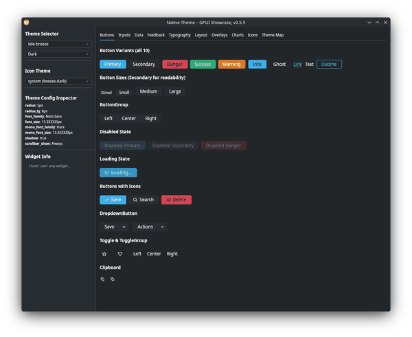
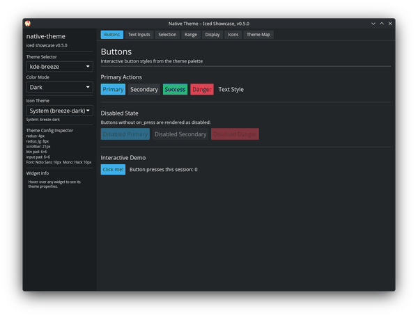

# native-theme

Cross-platform native theme detection and loading for Rust GUI applications.

[](https://crates.io/crates/native-theme)
[](https://docs.rs/native-theme)
[](https://github.com/tiborgats/native-theme/actions/workflows/ci.yml)
[](#license)
[](https://blog.rust-lang.org/2026/03/05/Rust-1.94.0.html)

A toolkit-agnostic theme data model with 22 semantic color roles, 25 per-widget
themes, 16 bundled TOML presets (light + dark), and optional OS theme readers
for Linux, macOS, and Windows.





| Crate | Description |
|-------|-------------|
| [`native-theme`](native-theme/) | Core theme model, presets, and platform readers |
| [`native-theme-gpui`](connectors/native-theme-gpui/) | [gpui](https://gpui.rs) + [gpui-component](https://crates.io/crates/gpui-component) connector |
| [`native-theme-iced`](connectors/native-theme-iced/) | [iced](https://iced.rs) connector |
| [`native-theme-build`](native-theme-build/) | Build-time code generation for custom icon roles |

## Quick Start

```toml
[dependencies]
native-theme = "0.5.3"
```

Load a bundled preset:

```rust
use native_theme::ThemeSpec;

let theme = ThemeSpec::preset("dracula").unwrap();
let dark = theme.dark.as_ref().unwrap();
let accent = dark.defaults.accent.unwrap();
let [r, g, b, a] = accent.to_f32_array();
```

Read the OS theme at runtime (returns a fully resolved `SystemTheme`):

```rust,ignore
use native_theme::SystemTheme;

let system = SystemTheme::from_system().unwrap();
let active = system.active(); // &ResolvedThemeVariant for current OS mode
let accent = active.defaults.accent;  // Rgba (not Option)
```

Layer user overrides on top of a preset:

```rust
use native_theme::ThemeSpec;

let mut theme = ThemeSpec::preset("nord").unwrap();
let overrides = ThemeSpec::from_toml(r#"
name = "My Nord"
[light.defaults]
accent = "#ff6600"
"#).unwrap();
theme.merge(&overrides);
```

## Toolkit Connectors

### gpui

```toml
[dependencies]
native-theme = "0.5.3"
native-theme-gpui = "0.5.3"
```

```rust,ignore
use native_theme::ThemeSpec;
use native_theme_gpui::to_theme;

let nt = ThemeSpec::preset("dracula").unwrap();
let is_dark = true;
if let Some(variant) = nt.pick_variant(is_dark) {
    let resolved = variant.clone().into_resolved().unwrap();
    let theme = to_theme(&resolved, "My App", is_dark);
    // Use as your gpui-component theme
}
```

Run the gpui showcase (full widget gallery with color map inspector):

```sh
cargo run -p native-theme-gpui --example showcase
```

### iced

```toml
[dependencies]
native-theme = "0.5.3"
native-theme-iced = "0.5.3"
```

```rust,ignore
use native_theme::ThemeSpec;
use native_theme_iced::to_theme;

let nt = ThemeSpec::preset("dracula").unwrap();
if let Some(variant) = nt.pick_variant(true) {
    let resolved = variant.clone().into_resolved().unwrap();
    let theme = to_theme(&resolved, "My App");
    // Use as your iced application theme
}
```

Run the iced showcase (full widget gallery with live theme switching):

```sh
cargo run -p native-theme-iced --example showcase
```

### Other toolkits

Map `ResolvedThemeVariant` fields to your toolkit's types directly. After resolving,
all color, font, geometry, and spacing fields are guaranteed populated. See the
[API docs](https://docs.rs/native-theme) for details.

## Animated Icons

<p align="center">
  
  &nbsp;&nbsp;&nbsp;&nbsp;
  
</p>

Platform-native loading spinners with accessibility support:

```rust,ignore
use native_theme::{loading_indicator, prefers_reduced_motion, AnimatedIcon, IconSet};

if let Some(anim) = loading_indicator(IconSet::Material) {
    if prefers_reduced_motion() {
        // Respect OS accessibility settings with a static fallback
        let static_icon = anim.first_frame();
    } else {
        match &anim {
            AnimatedIcon::Frames { frames, frame_duration_ms, .. } => {
                // Cycle through pre-rendered frames on a timer
            }
            AnimatedIcon::Transform { icon, animation } => {
                // Apply continuous rotation to the icon
            }
        }
    }
}
```

Bundled spinner: Lucide loader (spin transform). On Linux, freedesktop
`process-working` sprite sheets are loaded at runtime from the active
icon theme (Breeze, Adwaita, etc.).

See the [gpui](connectors/native-theme-gpui/) and
[iced](connectors/native-theme-iced/) connector READMEs for
toolkit-specific playback helpers.

## Platform Support

| Platform | Reader | Feature |
|----------|--------|---------|
| Linux (KDE) | `from_kde()` | `kde` |
| Linux (GNOME/GTK) | `from_gnome()` | `portal-tokio` or `portal-async-io` |
| macOS | `from_macos()` | `macos` |
| Windows | `from_windows()` | `windows` |

`from_system()` auto-detects the platform and desktop environment via
`XDG_CURRENT_DESKTOP`, returning a `SystemTheme` with both light and dark
`ResolvedThemeVariant` variants. Falls back to bundled presets when a reader is
unavailable. GTK-based desktops (GNOME, XFCE, Cinnamon, MATE, Budgie, LXQt)
are all handled by the portal reader.

`system_is_dark()` provides a lightweight cached check for the OS dark mode
preference on all platforms (Linux, macOS, and Windows).

## Feature Flags

No features are enabled by default. The preset API works without any features.

**Most apps just need one feature:**

```toml
[dependencies]
native-theme = { version = "0.5.3", features = ["native"] }
```

### Meta-features

| Feature | Enables |
|---------|---------|
| `native` | All platform readers (tokio async runtime) |
| `native-async-io` | All platform readers (async-io runtime) |
| `linux` | KDE + GNOME portal (tokio) |
| `linux-async-io` | KDE + GNOME portal (async-io) |

OS-specific dependencies are target-gated, so `native` on macOS only compiles
macOS deps.

### Individual features

| Feature | Description |
|---------|-------------|
| `kde` | KDE theme reader (`~/.config/kdeglobals`) |
| `portal-tokio` | GNOME portal reader (tokio) |
| `portal-async-io` | GNOME portal reader (async-io) |
| `macos` | macOS reader (NSAppearance) |
| `windows` | Windows reader (UISettings) |
| `system-icons` | Platform icon theme lookup with bundled fallback |
| `material-icons` | Bundle Material Symbols SVGs |
| `lucide-icons` | Bundle Lucide SVGs |
| `svg-rasterize` | SVG-to-RGBA rasterization via resvg |

## Presets

16 bundled presets, each with light and dark variants:

| Category | Presets |
|----------|--------|
| Platform | `kde-breeze`, `adwaita`, `windows-11`, `macos-sonoma`, `material`, `ios` |
| Community | `catppuccin-latte`, `catppuccin-frappe`, `catppuccin-macchiato`, `catppuccin-mocha`, `nord`, `dracula`, `gruvbox`, `solarized`, `tokyo-night`, `one-dark` |

Use `ThemeSpec::list_presets_for_platform()` to get only the presets
appropriate for the current OS.

## License

Licensed under either of

- [Apache License, Version 2.0](http://www.apache.org/licenses/LICENSE-2.0)
- [MIT License](http://opensource.org/licenses/MIT)
- [0BSD License](https://opensource.org/license/0bsd)

at your option.

Unless you explicitly state otherwise, any contribution intentionally submitted
for inclusion in the work by you, as defined in the Apache-2.0 license, shall
be triple licensed as above, without any additional terms or conditions.
