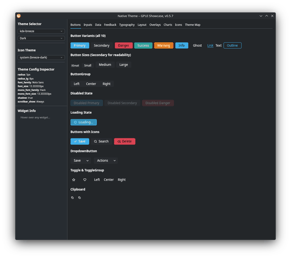
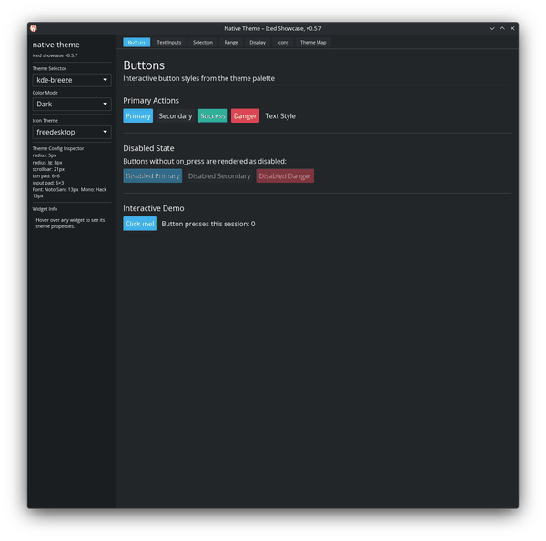
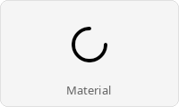

# native-theme

Cross-platform native theme loading for Rust GUI applications. Reads OS themes
on Linux (KDE, GNOME), macOS, and Windows, or loads any of 16 bundled presets
(Catppuccin, Nord, Dracula, Tokyo Night, …), and hands your UI code a fully
populated `ResolvedTheme`.

## Pick your path

| Your GUI framework | Add this crate |
|---|---|
| [GPUI](https://www.gpui.rs) | [`native-theme-gpui`](connectors/native-theme-gpui/) |
| [iced](https://iced.rs) | [`native-theme-iced`](connectors/native-theme-iced/) |
| Writing a new framework connector | [`native-theme`](native-theme/) directly |

The connectors pull `native-theme` in transitively, so you only add one
dependency for the common case.

## How the 5 crates fit together

## Core concepts in 60 seconds

- **`Theme`** — the sparse, TOML-shaped definition a preset or file loads. Fields are `Option<T>` because presets may omit almost anything.
- **`ResolvedTheme`** — the fully-populated variant `Theme::resolve(mode)` produces. Every field has a value. Your UI code reads from this.
- **Preset** — a named, bundled theme (e.g. `catppuccin-mocha`, `kde-breeze`, `macos-sonoma`). Load with `Theme::preset("name")`.
- **Connector** — a small crate that maps `ResolvedTheme` onto a GUI framework's native theming system. You depend on one of these.

## See it in action

- **GPUI** — full widget gallery with live theme switching
  - Run: `cargo run -p native-theme-gpui --example showcase-gpui`
  - Screenshots: [`native-theme-gpui/README.md`](connectors/native-theme-gpui/README.md#gallery)
- **iced** — full widget gallery with live theme switching
  - Run: `cargo run -p native-theme-iced --example showcase-iced`
  - Screenshots: [`native-theme-iced/README.md`](connectors/native-theme-iced/README.md#gallery)

## Icon sets

  
  &nbsp;&nbsp;&nbsp;&nbsp;
  

Semantic icon roles (like `StatusBusy` or `DialogSuccess`) map to platform-appropriate glyphs:

- **Material Symbols** and **Lucide** bundled for offline use
- **freedesktop** on Linux — reads the active icon theme (Breeze, Adwaita, …)
- **SF Symbols** on macOS, **Segoe Fluent Icons** on Windows (platform lookups)
- Animated indicators respect the OS `prefers-reduced-motion` preference

See [`native-theme` crate docs](native-theme/) for the icon-loading API.

## Project docs

- [CHANGELOG](CHANGELOG.md) — release notes per version
- [CONTRIBUTING](CONTRIBUTING.md) — dev setup, commit conventions, PR workflow
- [SECURITY](SECURITY.md) — vulnerability reporting policy
- [ROADMAP](ROADMAP.md) — what's planned next

## License

Licensed under any of

- [Apache License, Version 2.0](http://www.apache.org/licenses/LICENSE-2.0)
- [MIT License](http://opensource.org/licenses/MIT)
- [0BSD License](https://opensource.org/license/0bsd)

at your option.

Unless you explicitly state otherwise, any contribution intentionally submitted
for inclusion in the work by you, as defined in the Apache-2.0 license, shall
be triple licensed as above, without any additional terms or conditions.
