# native-theme-egui

`native-theme-egui` gives an egui application an excellent global theme out
of the box and opt-in per-widget geometry: egui 0.36.2's `Style` has an
interaction-state axis and provably no widget-type axis, so what one global
`Style` can hold reaches every widget automatically, and the per-widget
values reach the screen only where the application asks for them.

[egui](https://github.com/emilk/egui) connector for
[`native-theme`](https://crates.io/crates/native-theme). The versions it
requires are in [Compatibility](#compatibility).

## What it does

A `ThemeAtlas` compiles a `native_theme` theme, once per theme change, into
egui's own types, and hands them to egui through egui's own seams:

1. **The base style.** `ThemeAtlas::install` writes a base `egui::Style` into
   both `egui::Theme`s with `Context::set_style_of`. Every widget reads it with
   no application code: colours, strokes, radii, spacing, text styles, the
   scrollbar, the shadows. A later install replaces the earlier one.
2. **Role styles.** One `Arc<egui::Style>` per `Role` and `RoleVariant`, reached
   where the application asks for it: `ui.native_scope(role, variant, ..)` or
   `ui.native_set_style(role, variant)` from the `NativeThemeUiExt` trait, and
   `ThemeAtlas::role_modifier` for a popup or a menu. A button in a
   `Role::Button` scope takes the button's own padding, radius and fills.
3. **Surface frames.** One `egui::Frame` per `Surface` — window, title bar,
   dialog, popover, tooltip, card, side and central panels — from
   `ui.native_frame(surface)` or `ThemeAtlas::surface_frame`.

The install also registers a plugin that paints the platform's focus ring
around the widget with keyboard focus and, where the platform integration
reports no colour scheme (Linux), tells egui the OS one when the atlas carries
it (`from_system`, `to_egui_atlas`, `Builder::os_mode`). The values no `Style` field carries — the
info and warning colours, the text-scale roles, a `TextEdit`'s margin and
frame, the dialog button order, icon sizes — are free functions of the crate
root and of `icons`.

## How it fits

Depend on this crate; it re-exports `egui` and `native_theme`, so your
`Cargo.toml` cannot pull in a second copy of either.

It ships no `egui::Widget`, no image decoder, no font database of its own and
no fork of any egui type. System-font lookup is native-theme's
(`native_theme::fonts`, feature `system-fonts`), and icons are decoded by the
image loaders the application installs with `egui_extras`. Every native leaf
and where it goes in egui — or why it goes nowhere — is one row of
[`mapping.toml`](mapping.toml), which the crate's API documentation renders.

## Compatibility

**Required** — the floors this crate's own `Cargo.toml` states:

| Crate | Required |
|---|---|
| `egui` | 0.36.2 |
| `skrifa` | 0.44.0 |
| `eframe` (dev-dependency: the showcase) | 0.36.2 |
| `egui_extras` (dev-dependency: the showcase) | 0.36.2 |
| `egui_kittest` (dev-dependency: the showcase's tests) | 0.36.2 |
| `rust-version` | 1.95 |

`egui = "0.36.2"` is a caret requirement, `>=0.36.2, <0.37.0`: it accepts
later 0.36 patch releases and rejects 0.37. The floor is 0.36.2, not 0.36.1,
because 0.36.2 paints a `Window`'s title bar with the window's custom frame
when no title frame is given, where 0.36.1 fell back to egui's stock window
frame; the `Window` and `WindowTitleBar` surfaces look different on 0.36.1.
An exact `=0.36.2` pin would reject patch fixes, and a wider range is
impossible: your `egui::Style` must be this crate's `egui::Style`, and cargo
cannot unify two semver-incompatible egui versions in one build.

Each is a floor and nothing more, and deliberately not an open-ended range: a
*patch* release of an upstream crate has broken a connector in this repository
before, when gpui-component 0.6.2 removed a theme field the published
native-theme-gpui 0.5.8 wrote and 0.5.8 stopped compiling.

**Verified** — the versions `scripts/update_compatibility.sh run` last resolved and ran
this connector's tests, in all three feature configurations, clippy, docs in both
the default and all features, and the widget-coverage script against. The script
writes the line; a hand-edited one fails a test:

<!-- compat:begin -->
Verified against ecolor 0.36.2, eframe 0.36.2, egui 0.36.2, egui-wgpu 0.36.2, egui-winit 0.36.2, egui_extras 0.36.2, egui_kittest 0.36.2, emath 0.36.2, epaint 0.36.2, epaint_default_fonts 0.36.2 and kittest 0.4.0 on 2026-09-28.
<!-- compat:end -->

### Semver

1. The crate version equals the workspace version.
2. One egui minor per release line of this crate; an egui minor bump is a
   **breaking change** for this crate.
3. **The numeric contents of a produced `egui::Style` are not covered.** A
   mapping fix — electing a different base owner, correcting a sink, closing a
   `Note` — is never a breaking change.
4. Every public enum is `#[non_exhaustive]` except `PanelSide`, so a new `Role`,
   `Surface`, `RoleVariant`, `Note`, `TextRole`, `IconContext` or `FontBytes`
   variant is additive; each of `Note`'s struct variants carries its own
   `#[non_exhaustive]`, so enriching one stays additive too.
5. Adding a free accessor is additive.
6. `ThemeAtlas`, `Builder`, `FontPlan`, `IconKey` and — behind feature `watch` —
   `ThemeWatcher` are opaque, and `NativeThemeUiExt` and `SystemThemeExt` are
   sealed, so adding a method to any of them is additive.

`Surface::Panel` and both `FontBytes` tuple variants are deliberately
exhaustive: on a tuple variant the attribute would make the variant impossible
to construct outside this crate, and constructing them is the documented call
shape. For `NativeThemeUiExt`, clause 6 holds only for a method name that
exists on neither `egui::Ui` nor `egui::Context`, which is the rule every
method added to it follows.

### When egui bumps

The compile-time tripwires catch a `Style` field added or removed, and the
assignment site catches a field whose type changes. Nothing catches a field
whose meaning changes with no change of signature, so moving to a new egui
release means reading the doc-comment diff of every field this crate writes,
not only the field list.

## Quick start

```toml
[dependencies]
eframe = "0.36.2"
native-theme-egui = "0.6"
```

Install the OS theme once, where eframe hands you the `Context`, and let egui
follow the OS light/dark preference:

```rust,no_run
use native_theme_egui::from_system;

struct MyApp;

impl eframe::App for MyApp {
    fn ui(&mut self, ui: &mut egui::Ui, _frame: &mut eframe::Frame) {
        ui.label("Hello");
    }
}

fn main() -> eframe::Result {
    eframe::run_native(
        "my-app",
        eframe::NativeOptions::default(),
        Box::new(|cc| {
            if let Ok((atlas, _resolved, _is_dark)) = from_system() {
                atlas.install(&cc.egui_ctx);
            }
            cc.egui_ctx.set_theme(egui::ThemePreference::System);
            Ok(Box::new(MyApp))
        }),
    )
}
```

Or a bundled preset, with both its variants in one atlas. `is_dark` picks the
`ResolvedTheme` returned beside the atlas; egui's own `set_theme` picks the
scheme on screen:

```rust,no_run
use native_theme_egui::{AccessibilityPreferences, from_preset};

fn install_preset(ctx: &egui::Context) -> native_theme_egui::Result<()> {
    let prefs = AccessibilityPreferences::default();
    let (atlas, _resolved) = from_preset("catppuccin-mocha", true, &prefs)?;
    atlas.install(ctx);
    Ok(())
}
```

`ThemeAtlas::builder` takes every input one by one — the two variants, the
layout, the accessibility preferences, a font plan, the OS colour mode, the icon
set and theme, and a `style_patch` applied after the mapping.

## Core concepts

- **`Role`** names what a region of the interface is — a button, an input, a
  menu, a sidebar, a toolbar — and **`RoleVariant`** its state: `Normal`,
  `Selected` or `Disabled`. Each pair is one pre-built style.
- **`Surface`** names a container's chrome; `Surface::Panel(PanelSide)` takes
  the side the panel is anchored to.
- **Containers built on `egui::Area`** — `Window`, `Modal`, `Popup`, tooltips,
  menus and `ComboBox` popups — build their content from the `Context`'s style,
  so a scope wrapped *around* one does not reach it. Give a popup or a menu
  `ThemeAtlas::role_modifier`; give a `Window` or a `Modal` its frame from
  `native_frame`, and make `ui.native_set_style(role, variant)` the first
  statement *inside* its closure for the body.
- **Without an atlas** every call degrades to egui's own behaviour; none
  panics.

## Per-widget geometry

```rust,no_run
use native_theme_egui::{NativeThemeUiExt, ResolvedTheme, Role, RoleVariant, Surface};

fn form(ui: &mut egui::Ui, t: &ResolvedTheme, name: &mut String) {
    ui.native_frame(Surface::Card).show(ui, |ui| {
        let id = egui::Id::new("name");
        ui.native_scope(Role::Input, RoleVariant::Normal, |ui| {
            let frame = native_theme_egui::input_frame(ui, id, t);
            ui.add(egui::TextEdit::singleline(name).id(id).frame(frame));
        });
        ui.native_scope(Role::Button, RoleVariant::Normal, |ui| {
            let _ = ui.button("Save");
        });
    });
}
```

The free accessors cover what no `Style` field holds: `input_margin` and
`input_frame` for a `TextEdit`, `text_area_margin` and `text_area_frame` for
a multi-line one, `expander_icon` for a `CollapsingHeader`'s
arrow, `text_role_font` and `text_role_line_height` for the caption, heading,
dialog-title and display roles, `window_title_bar_font` and
`window_title_bar_text_color`, `dialog_button_order`, `icons::icon_size`, and
the colours egui has no slot for (`info_color`, `warning_text_color`, …). A
leaf that needs no conversion is read from the `ResolvedTheme` itself
(`ThemeAtlas::resolved_for`).

## Fonts

With the `system-fonts` feature (on by default) `from_preset`, `from_system`
and `to_egui_atlas` attach `fonts::FontPlan::from_system`, which asks
native-theme for the faces of the theme's font families and installs them as
the head of egui's `Proportional` and `Monospace` families. An
application with fonts of its own passes them as the base:
`FontPlan::from_system(&light).with_base(its_definitions)` into
`Builder::fonts`. This crate never emits a `FontFamily::Name`. A family the
platform does not have, or a face epaint could not read, leaves egui's own and
is reported in `ThemeAtlas::notes` (`Note::FontFamilyUnavailable`,
`Note::FontDataInvalid`).

## Icons

```rust,no_run
use native_theme_egui::icons::{IconContext, IconKey, icon_size, to_image};
use native_theme_egui::{IconRole, IconSet, ResolvedTheme};

fn warning_icon(ui: &mut egui::Ui, t: &ResolvedTheme) {
    let set = IconSet::Lucide;
    let key = IconKey::role(IconRole::DialogWarning, set).tint(ui.visuals().warn_fg_color);
    let Some(data) = native_theme_egui::native_theme::icons::load_icon(IconRole::DialogWarning, set)
    else {
        return;
    };
    if let Some(image) = to_image(ui.ctx(), &key, &data) {
        let side = icon_size(t, IconContext::Toolbar);
        ui.add(image.fit_to_exact_size(egui::Vec2::splat(side)));
    }
}
```

Install `egui_extras`' image loaders with its `svg` feature
(`egui_extras::install_image_loaders`). An SVG icon's URI is the hash of its
final bytes, so it changes whenever the pixels do: the tint is baked into a
bundled monochrome icon's bytes, and a freedesktop icon that leaves its colour
to `currentColor` is drawn in the theme's text colour. An icon no theme holds
is `None`; nothing is substituted. `install` releases the icons this crate
cached (`icons::forget_icons`) and leaves the application's own images alone.

## Runtime theme change

With the `watch` feature, `ThemeWatcher::start(ctx, rebuild)` rebuilds the
atlas on the watcher thread on every OS theme change and wakes egui; the UI
thread installs it:

```rust,no_run
use native_theme_egui::ThemeWatcher;

struct MyApp {
    watcher: Option<ThemeWatcher>,
}

impl MyApp {
    fn new(cc: &eframe::CreationContext<'_>) -> Self {
        let watcher = ThemeWatcher::start(&cc.egui_ctx, ThemeWatcher::system_rebuild).ok();
        Self { watcher }
    }
}

impl eframe::App for MyApp {
    fn logic(&mut self, ctx: &egui::Context, _frame: &mut eframe::Frame) {
        if let Some(atlas) = self.watcher.as_ref().and_then(ThemeWatcher::take) {
            atlas.install(ctx);
        }
    }

    fn ui(&mut self, ui: &mut egui::Ui, _frame: &mut eframe::Frame) {
        ui.label("Hello");
    }
}
```

`system_rebuild` is the rebuild for an application on the OS theme; one that
built its atlas with inputs of its own passes a closure that builds the same
again. A failed rebuild keeps the installed theme and reports its message
through `last_error`. Dropping the watcher stops it. KDE Plasma, GNOME and
Budgie, macOS and Windows are watched; another Linux desktop returns an error
from `start`.

## Accessibility

`Builder::accessibility` — and `from_preset`'s `prefs`, `from_system` and
`to_egui_atlas` with the OS's own preferences — carries the text-scaling factor
and reduced motion into the atlas. Every text size the atlas installs is
multiplied by the factor; geometry is not: paddings, radii, widths and icon
sizes keep the theme's values. Reduced motion sets egui's animation time to
zero and turns scroll animation off. The accessors that return a text size take the same preferences, and
`scaled_text_size` scales a size read from the `ResolvedTheme` directly.
`Context::set_zoom_factor` is the user's zoom, and this crate never touches it.

## Features

| Feature | Default | Effect |
|---|---|---|
| `material-icons` | on | the bundled Material icon set |
| `lucide-icons` | on | the bundled Lucide icon set |
| `system-icons` | on | freedesktop, SF Symbols and Windows system icon lookup |
| `system-fonts` | on | `FontPlan::from_system`, and the system typeface in `from_preset`, `from_system` and `to_egui_atlas` |
| `svg-rasterize` | off | native-theme's in-process SVG rasteriser, whose output `icons::to_color_image` converts |
| `watch` | off | `ThemeWatcher` |

Each forwards to the `native-theme` feature of the same name.
`default-features = false` and the list you keep gives a smaller build.

## Limits

egui 0.36.2 cannot show everything a platform theme states: some leaves have
no `Style` field, and some containers paint parts no style reaches. Each such
leaf is a `mapping.toml` row marked `unmappable`, with the reason, and the
mapping document in the API reference lists them all.

## Showcase

```sh
cargo run -p native-theme-egui --example showcase-egui
```

The gpui showcase's application built from egui's own containers, with
per-instance Widget Info for every widget on screen. It opens on the Basic
page, the controls all three showcases draw — buttons, checkboxes, radio
buttons, text, text fields, a drop-down, a slider and a progress bar — in the
same order and states, packed onto one screen, so the three showcases' captures
compare control by control. Its flags `--theme`,
`--variant`, `--icon-set`, `--tab` and `--screenshot` start it on a given
preset, variant, icon set and tab, or capture the window with its title bar to
a PNG (macOS and Windows; on Linux the capture scripts take it). The window
opens at 1280 × 720; with `--screenshot`, or `--capture` for a capture taken by
another tool, it opens at that size whatever size the desktop remembers for it.
`--pointer X,Y` holds the pointer at that point of the window (logical pixels)
and `--press` holds the primary button down there, so a capture shows the
control under it hovered or pressed where nothing can move the real pointer,
as in a nested compositor; the gpui and iced showcases take the same flags.

## Gallery

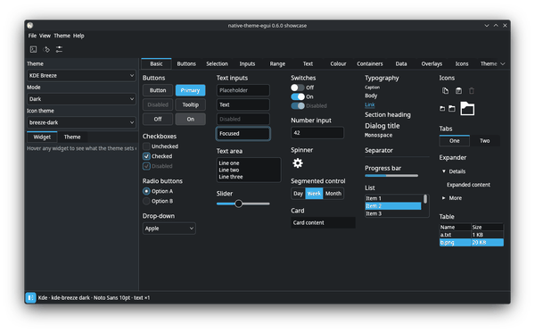

### Linux

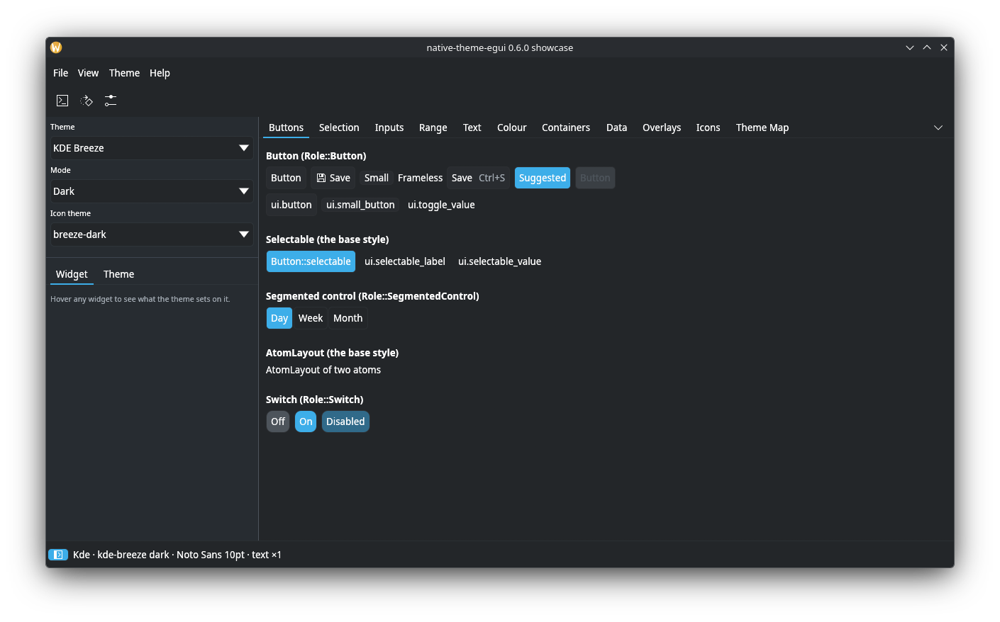
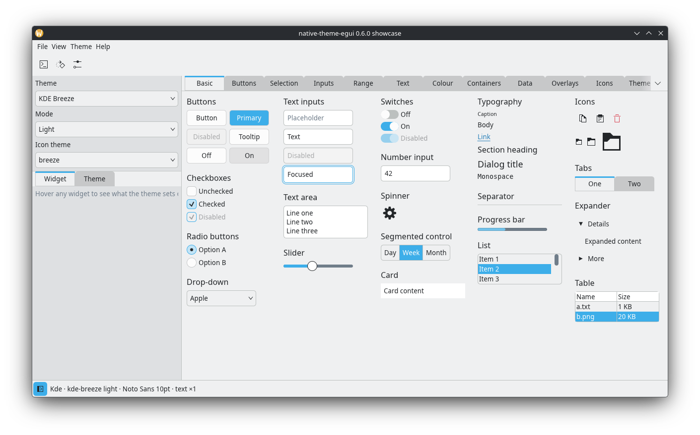
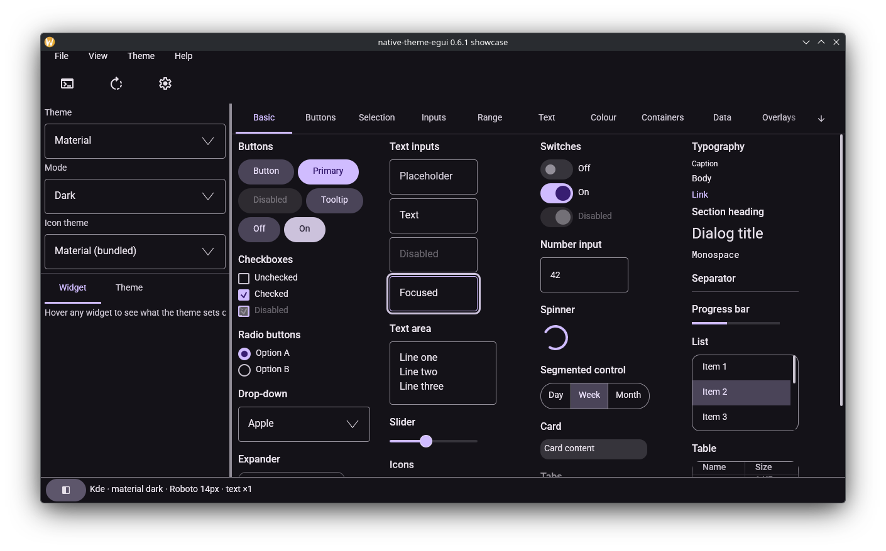
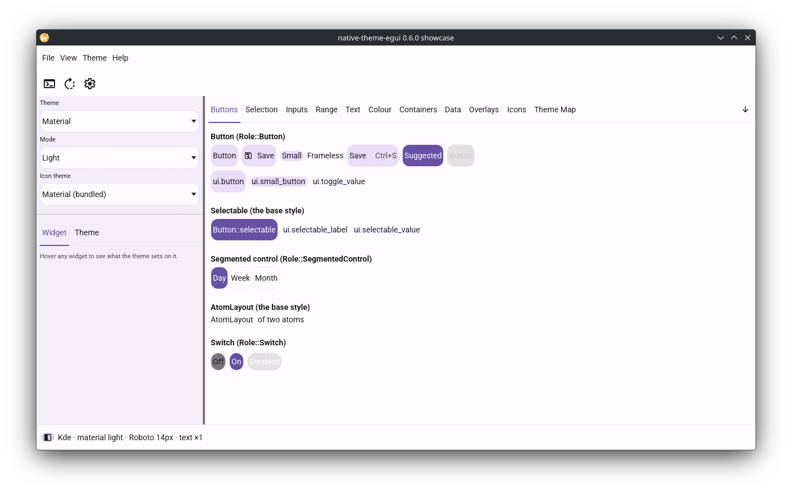
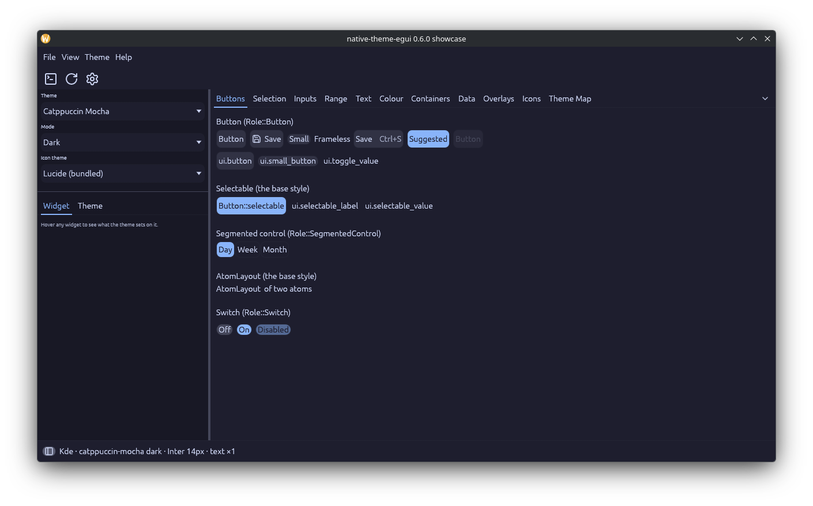
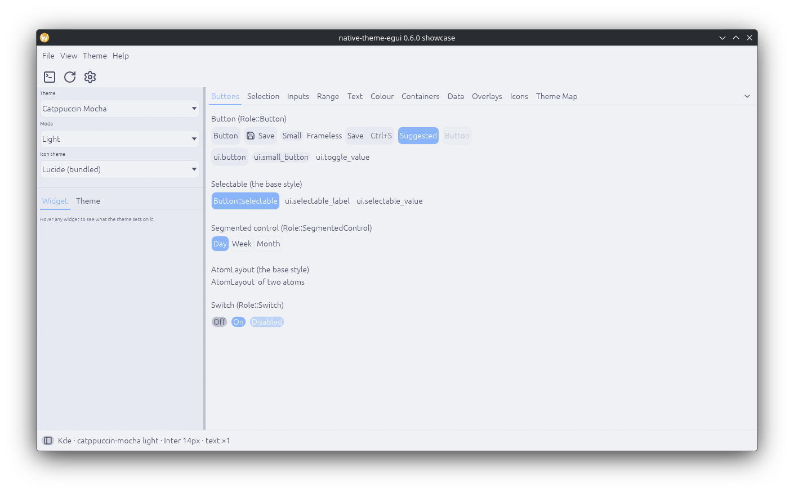

### macOS

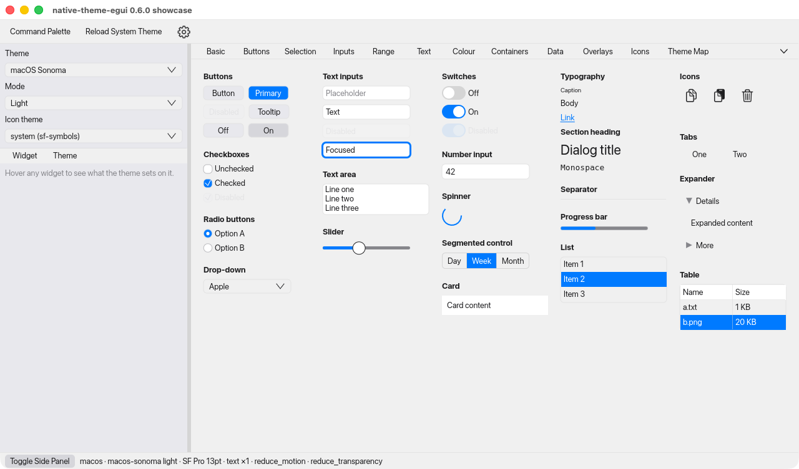
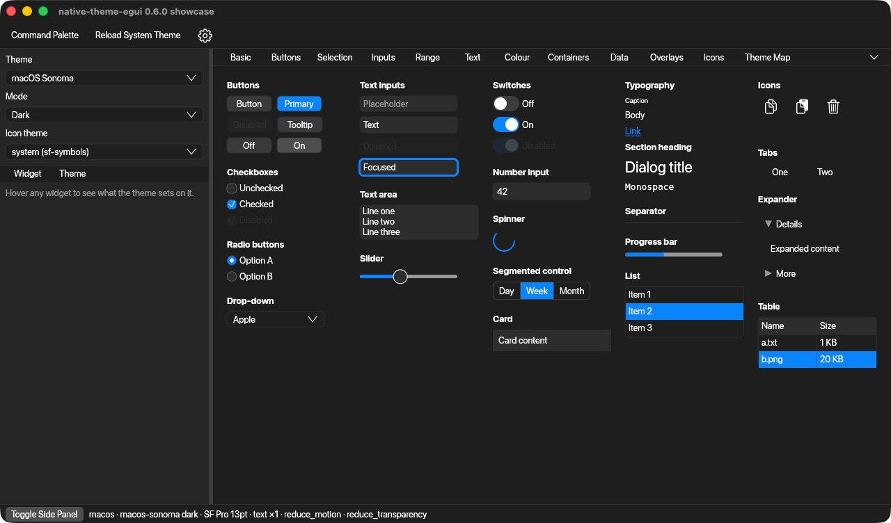

### Windows

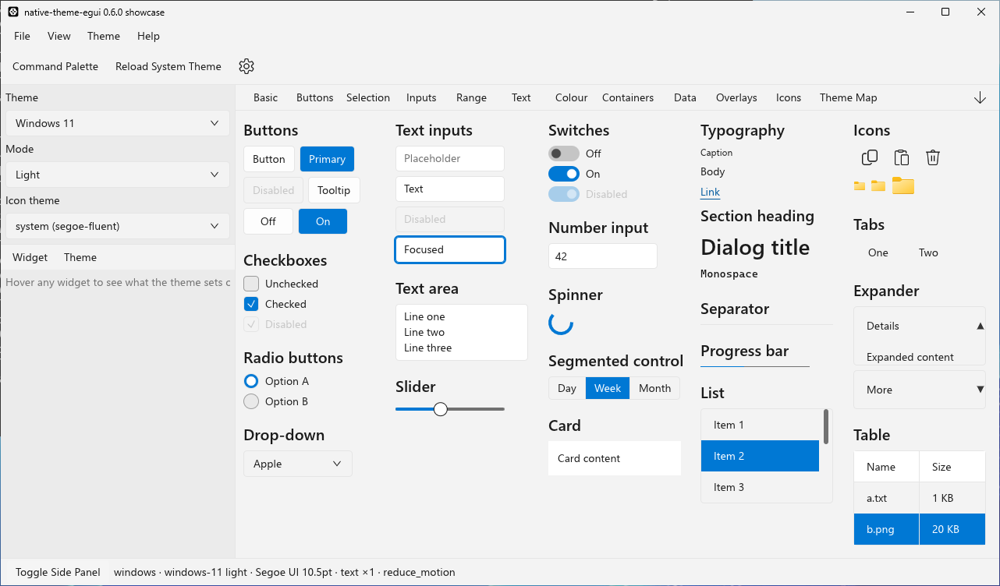
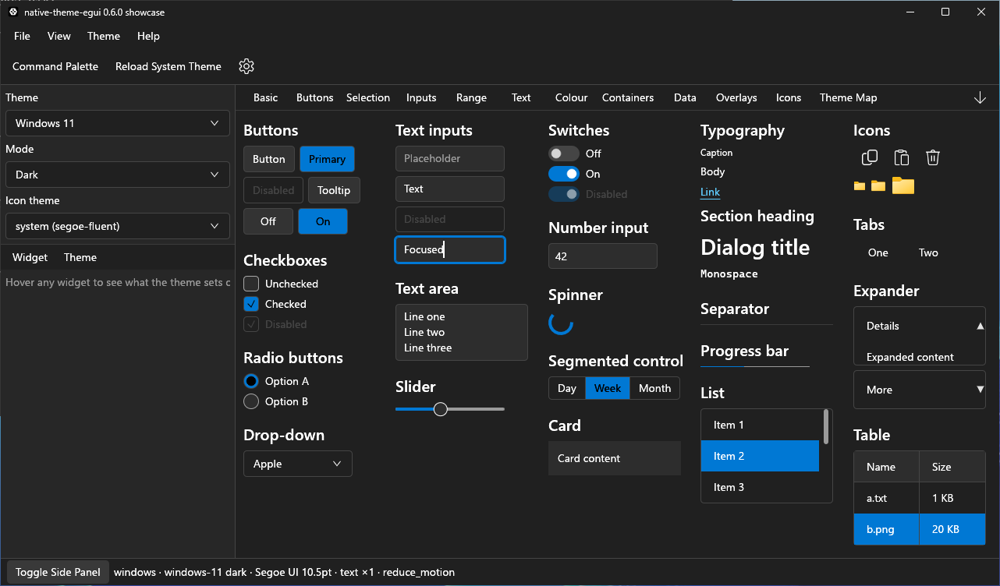

## Links

- [API reference on docs.rs](https://docs.rs/native-theme-egui)
- [The mapping manifest](mapping.toml)
- [CHANGELOG](https://github.com/tiborgats/native-theme/blob/main/CHANGELOG.md)

## License

Licensed under any of

- [Apache License, Version 2.0](http://www.apache.org/licenses/LICENSE-2.0)
- [MIT License](http://opensource.org/licenses/MIT)
- [0BSD License](https://opensource.org/license/0bsd)
