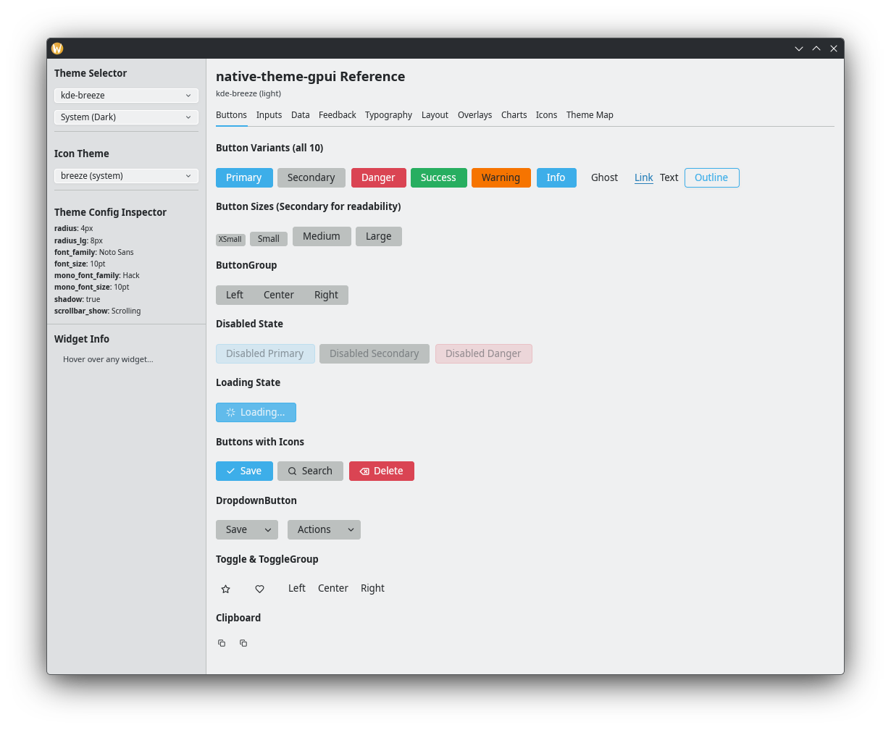
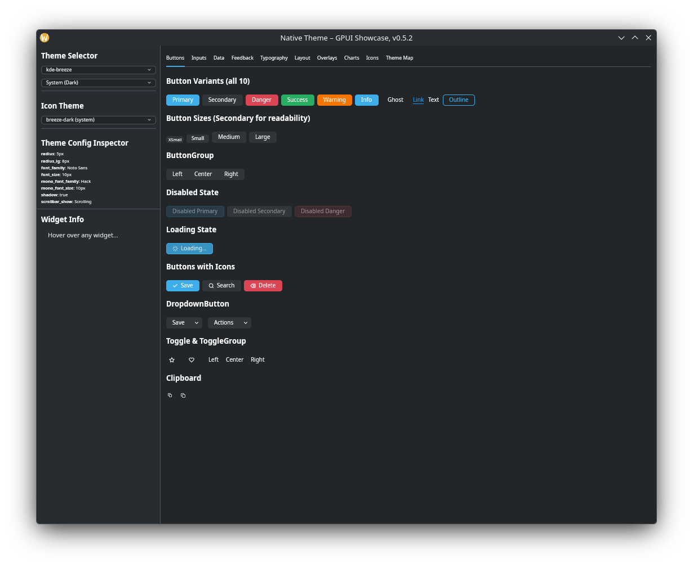
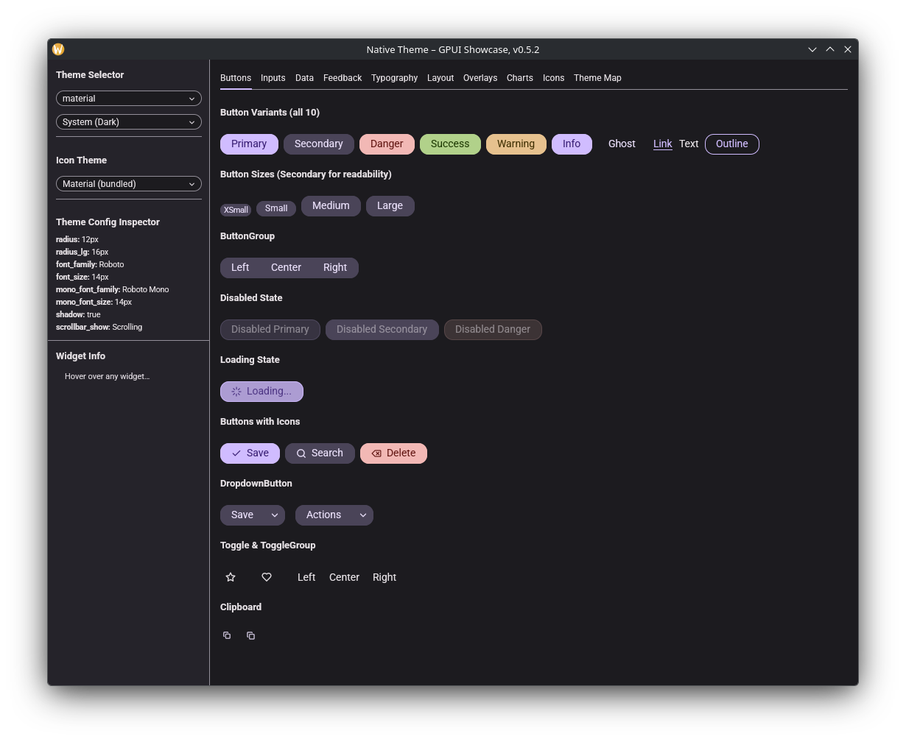
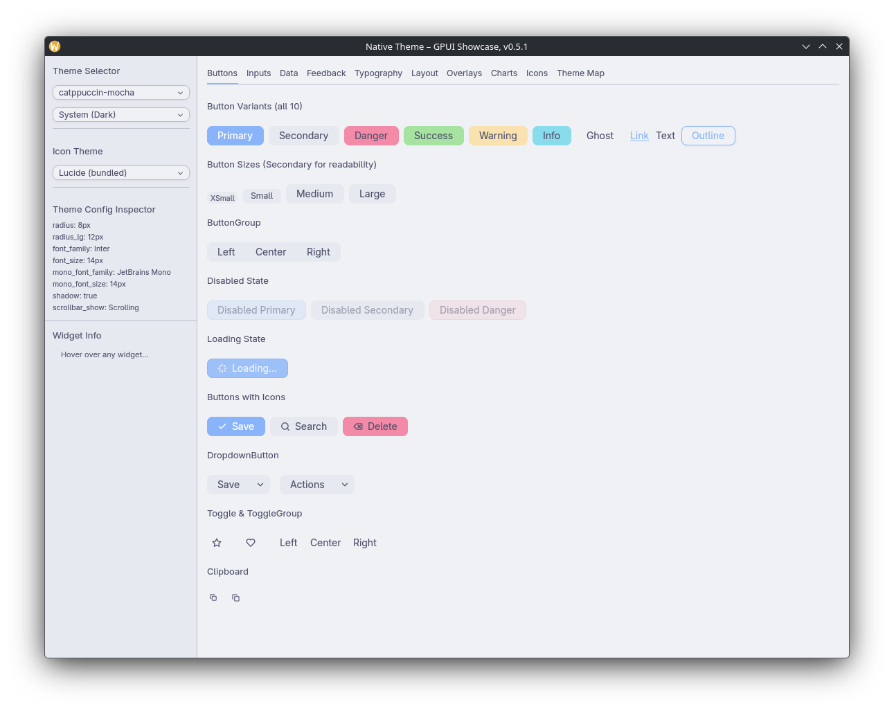
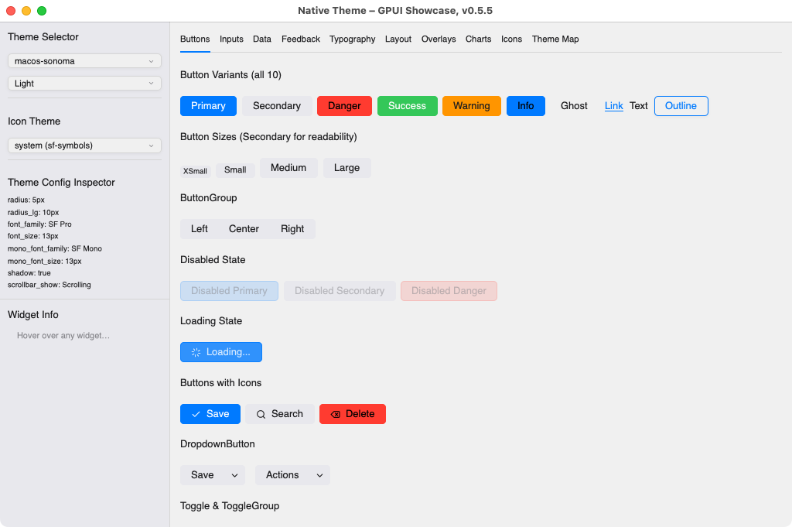
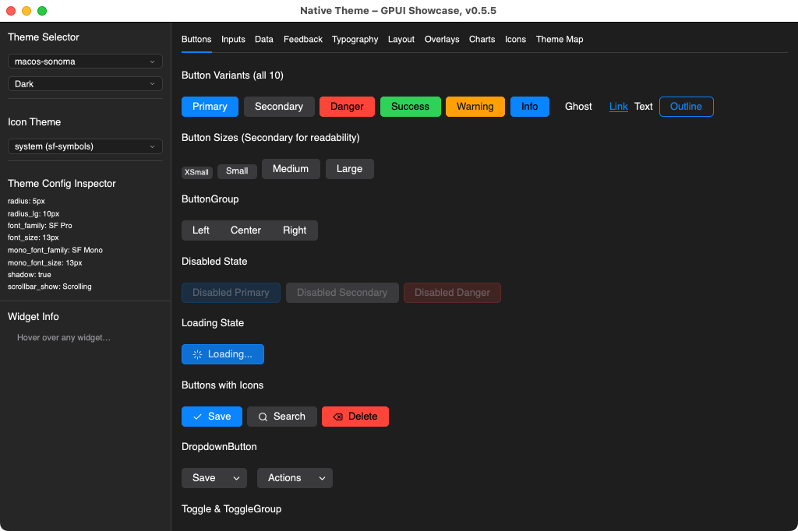

# native-theme-gpui

[gpui](https://gpui.rs/) + [gpui-component](https://crates.io/crates/gpui-component)
toolkit connector for [native-theme](https://crates.io/crates/native-theme).

Maps [`native_theme::ResolvedThemeVariant`](https://docs.rs/native-theme) data to
gpui-component's theming system, producing a fully configured `Theme` with
correct colors, fonts, geometry, and icons for all gpui-component widgets.

## Usage

Add both crates to your `Cargo.toml`:

```toml
[dependencies]
native-theme = "0.5.6"
native-theme-gpui = "0.5.6"
```

Then create a gpui-component theme from any native-theme preset:

```rust,ignore
use native_theme::ThemeSpec;
use native_theme_gpui::to_theme;

// Load a preset and resolve it
let nt = ThemeSpec::preset("dracula")?;
let is_dark = true;
let variant = nt.into_variant(is_dark).ok_or("no variant")?;
let resolved = variant.into_resolved()?;
let theme = to_theme(&resolved, "My App", is_dark);
// Use `theme` in your gpui-component application
```

Or read the OS theme at runtime:

```rust,ignore
use native_theme_gpui::from_system;

let (theme, resolved) = from_system()?;
// `theme` is the gpui-component Theme, `resolved` has per-widget metrics
```

## What Gets Mapped

The connector translates native-theme's 22 semantic color roles into
gpui-component's 108-field `ThemeColor` struct. The mapping works in layers:

- **Direct mappings** (~30 fields) -- background, foreground, accent, border,
  muted, input, ring, selection, link
- **Derived fields** (~78 fields) -- hover/active states, chart colors, tab bar,
  sidebar, scrollbar, and other widget-specific colors are generated from the
  base roles via shade derivation and alpha blending

Fonts and geometry (`family`, `size`, `radius`, `shadow`) are mapped to
gpui-component's `ThemeConfig`. Font sizes from the resolved theme are in
logical pixels and are passed through directly.

## Icons

The connector maps native-theme's `IconRole` variants to gpui-component's
`IconName` enum, covering 30 of 42 semantic roles (actions, navigation,
status indicators, etc.).

It also provides reverse-mapping functions for loading icon assets from
native-theme's icon bundles:

- `lucide_name_for_gpui_icon()` -- maps gpui-component icon names to Lucide SVG filenames
- `material_name_for_gpui_icon()` -- maps to Material Symbols icon names
- `freedesktop_name_for_gpui_icon()` -- maps to FreeDesktop icon names (Linux)
- `to_image_source()` -- converts native-theme `IconData` to gpui `ImageSource`

### Custom Icons

For app-specific icons defined via `native-theme-build`, the connector provides:

- `custom_icon_to_image_source(provider, icon_set, color, size)` -- load a custom icon as a gpui `ImageSource`, with optional color tinting and size

This works with any type implementing `IconProvider`.

## Animated Icons

The connector provides helpers for displaying animated icons from
[`loading_indicator()`](https://docs.rs/native-theme/latest/native_theme/fn.loading_indicator.html):

- `animated_frames_to_image_sources()` -- converts `AnimatedIcon::Frames` to a `Vec<ImageSource>` for frame-based playback
- `with_spin_animation()` -- wraps an `Svg` element with continuous rotation for `AnimatedIcon::Transform` playback

```rust,ignore
use native_theme::{loading_indicator, prefers_reduced_motion, AnimatedIcon, IconSet};
use native_theme_gpui::icons::{animated_frames_to_image_sources, with_spin_animation, to_image_source};

if let Some(anim) = loading_indicator(IconSet::Material) {
    if prefers_reduced_motion() {
        // Static fallback for accessibility
        let static_icon = anim.first_frame().and_then(|f| to_image_source(f, None, None));
    } else {
        match &anim {
            AnimatedIcon::Frames { .. } => {
                // Cache this -- do not call on every frame tick
                let sources = animated_frames_to_image_sources(&anim, None, None);
            }
            AnimatedIcon::Transform { icon, .. } => {
                let spinner = gpui::svg().path("spinner.svg");
                let element = with_spin_animation(spinner, "loading", 1000);
            }
        }
    }
}
```

Cache the `Vec<ImageSource>` from `animated_frames_to_image_sources()` -- do not
call it on every frame tick.

## Modules

| Module | Purpose |
|--------|---------|
| `colors` | Maps 22 semantic colors to 108 ThemeColor fields |
| `config` | Maps fonts and geometry to ThemeConfig |
| `derive` | Hover/active state color derivation helpers |
| `icons` | Icon role mapping, image source conversion, and animated icon playback |

## Example

Run the showcase widget gallery to explore all 16 presets interactively:

```sh
cargo run -p native-theme-gpui --example showcase-gpui
```

The showcase displays all gpui-component widgets (buttons, inputs, tables,
charts, overlays, etc.) themed with native-theme presets, with live theme
switching and a color map inspector.

### Linux











### macOS





### Windows


## License

Licensed under either of

- [Apache License, Version 2.0](http://www.apache.org/licenses/LICENSE-2.0)
- [MIT License](http://opensource.org/licenses/MIT)
- [0BSD License](https://opensource.org/license/0bsd)

at your option.
