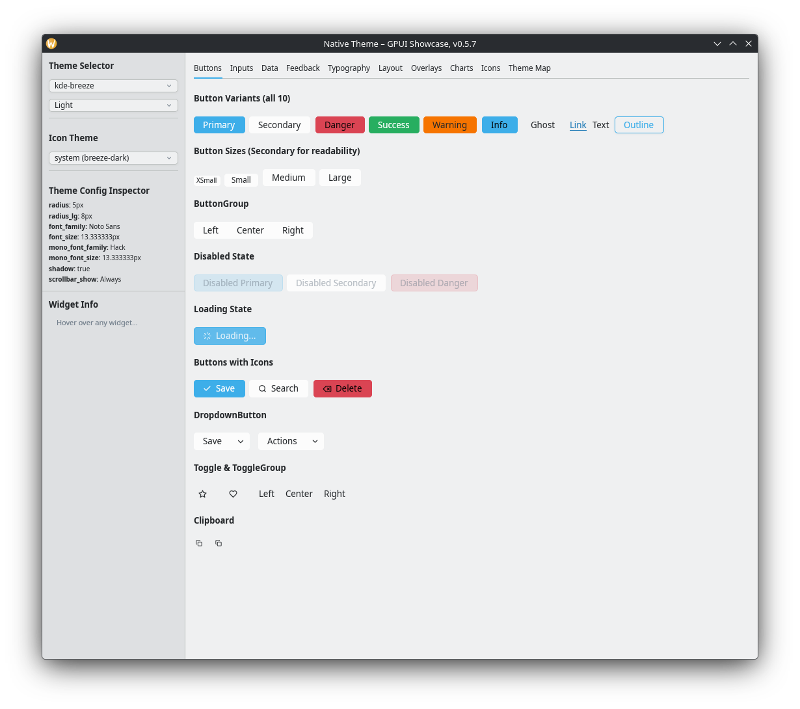
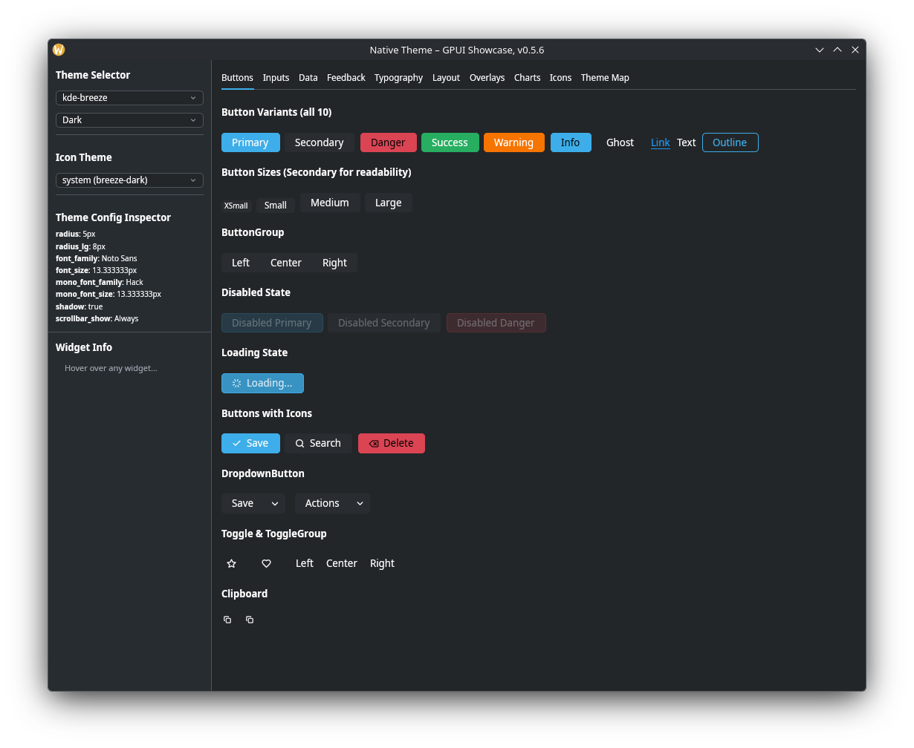
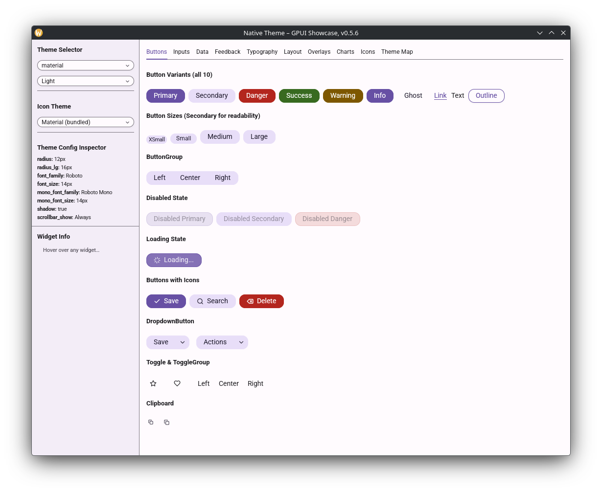
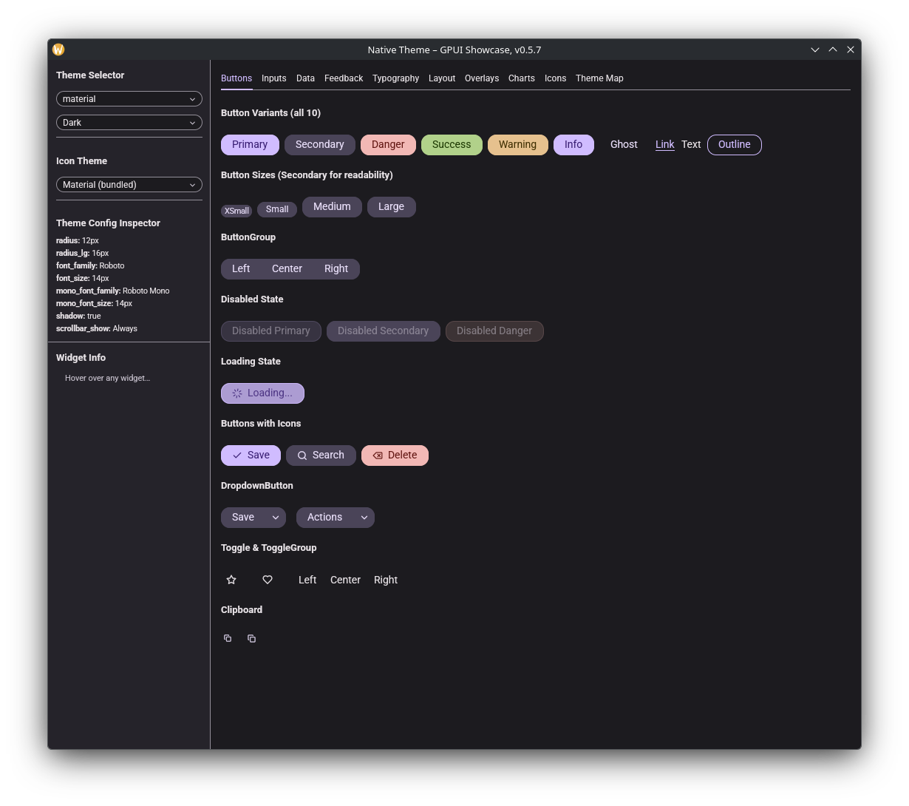
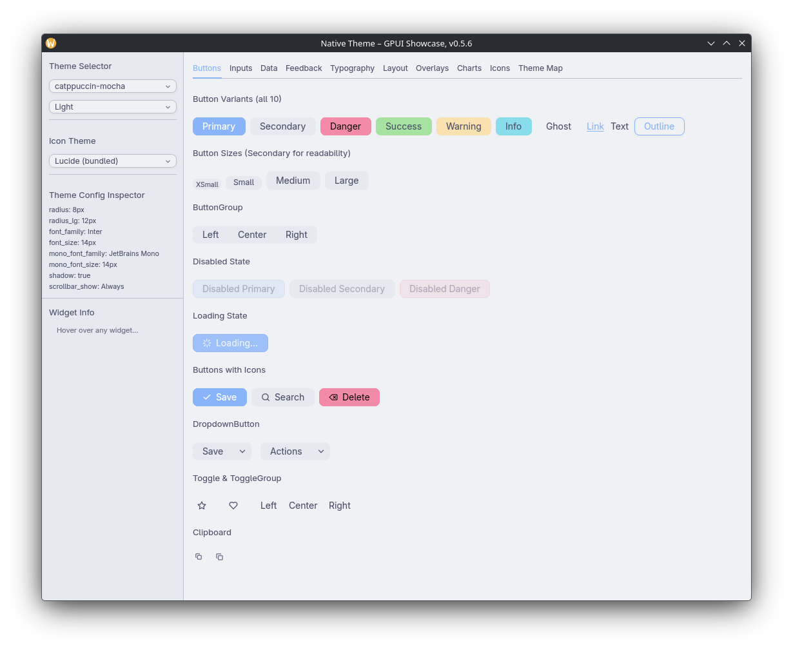
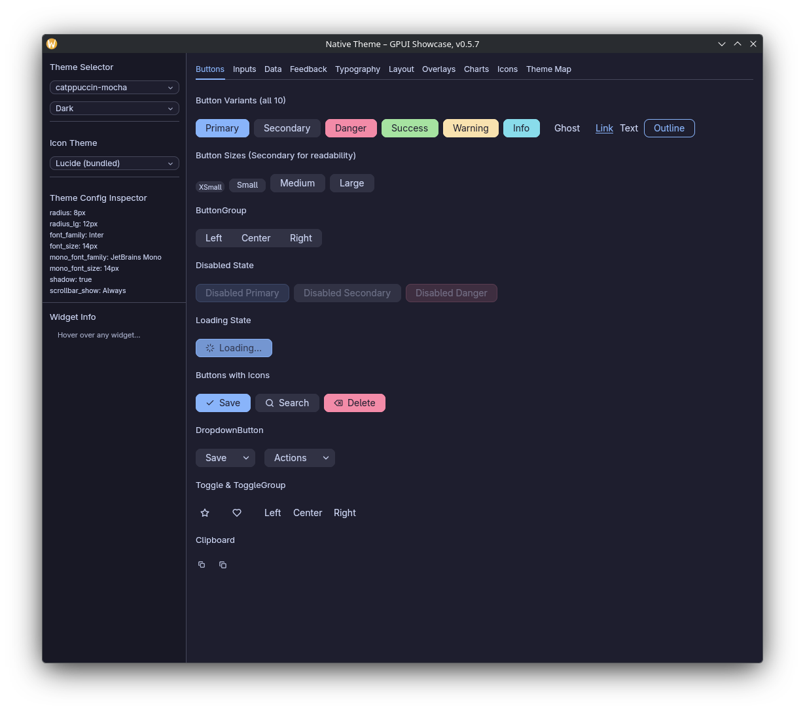
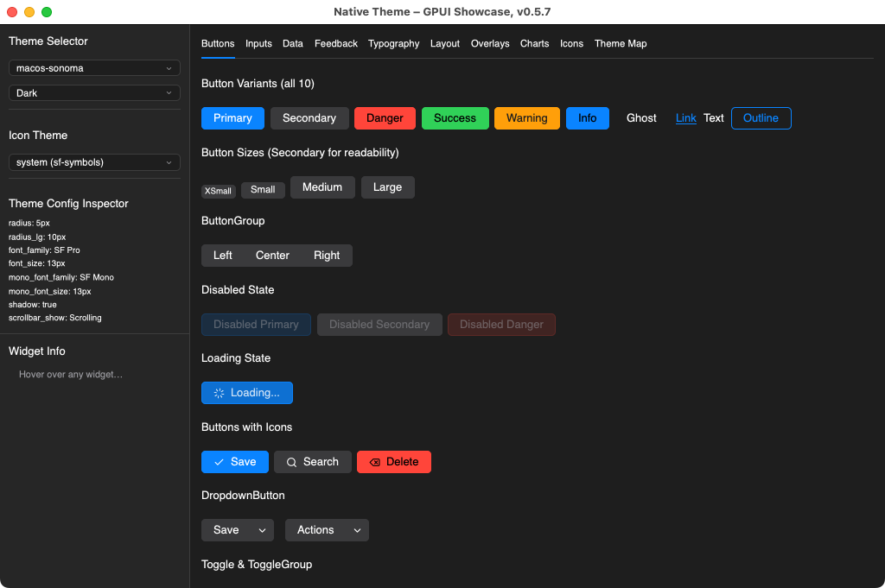
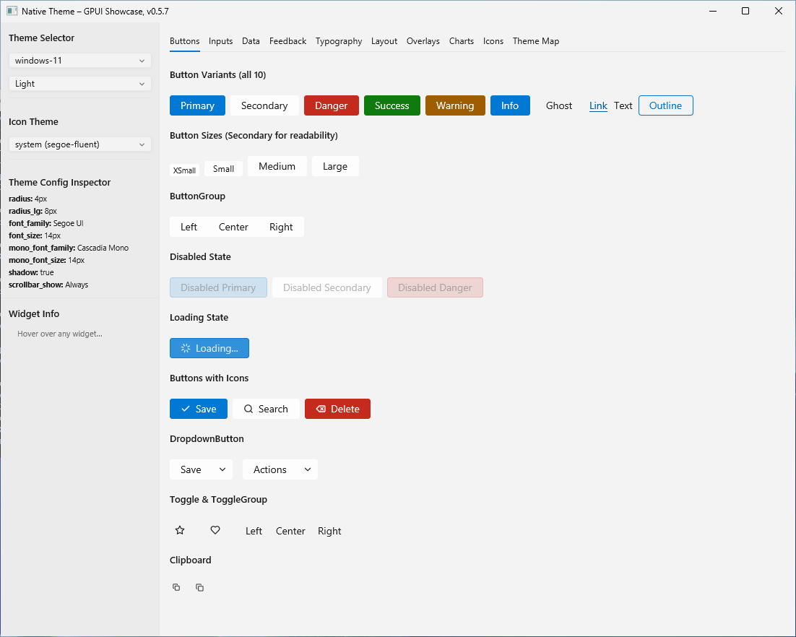
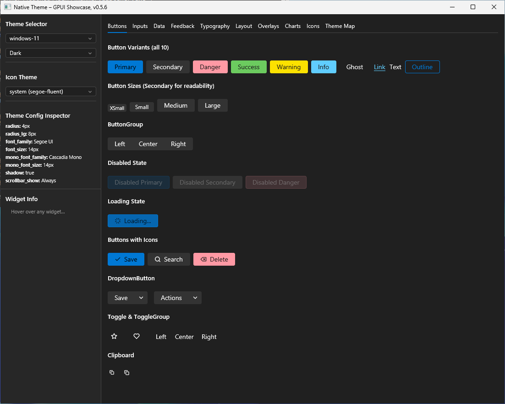

# native-theme-gpui

[gpui](https://gpui.rs/) + [gpui-component](https://crates.io/crates/gpui-component)
connector for [`native-theme`](https://crates.io/crates/native-theme).

## What it does

Turns a `native_theme::ResolvedTheme` into a fully configured
`gpui_component::theme::Theme` — colors (108 fields), fonts, geometry, shadows,
and icon mappings all wired up for every gpui-component widget.

## How it fits

Depend on this crate — it pulls `native-theme` in transitively. The
workspace-level README at the repo root has a diagram showing where each
crate sits.

## Quick start

Add both crates to your `Cargo.toml`:

```toml
[dependencies]
native-theme = "0.5"
native-theme-gpui = "0.5"
```

Load a bundled preset:

```rust,ignore
use native_theme_gpui::from_preset;

let (theme, resolved) = from_preset("dracula", true)?;
// `theme` is the gpui-component Theme; `resolved` has the raw native-theme data
//                                     ^ is_dark
```

Or read the OS theme at runtime:

```rust,ignore
use native_theme_gpui::from_system;

let (theme, resolved, is_dark) = from_system()?;
```

## Core concepts

- **`from_preset(name, is_dark)`** — load a bundled preset. `is_dark` is explicit because some presets (`solarized`, `gruvbox`) have ambiguous lightness.
- **`from_system()`** — read the OS theme. Returns `(theme, resolved, is_dark)` so the third value tells you which variant the OS is currently using.
- **`to_theme(&resolved, "App Name", is_dark, compact)`** — the underlying mapping function if you already have a `ResolvedTheme` from somewhere else.

## Common recipes

### Apply user overrides to the OS theme

```rust,ignore
use native_theme::{SystemTheme, theme::Theme};
use native_theme_gpui::to_theme;

let sys = SystemTheme::from_system()?;
let overlay = Theme::from_toml(r##"[light.defaults]
accent_color = "#ff6600"
"##)?;
let customised = sys.with_overlay(&overlay)?;
let active = customised.pick(customised.mode);
let theme = to_theme(active, "My App", customised.mode.is_dark(), false);
```

### Custom icons

For app-specific icons generated via [`native-theme-build`](https://crates.io/crates/native-theme-build):

```rust,ignore
use native_theme_gpui::icons::custom_icon_to_image_source;
use native_theme::theme::IconSet;

let handle = custom_icon_to_image_source(&AppIcon::PlayPause, IconSet::Material, None, None);
```

### Animated spinners

```rust,ignore
use native_theme::theme::AnimatedIcon;
use native_theme::icons::MaterialLoader;
use native_theme::detect::prefers_reduced_motion;
use native_theme_gpui::icons::{animated_frames_to_image_sources, with_spin_animation, to_image_source};

if let Some(anim) = MaterialLoader::load_indicator() {
    if prefers_reduced_motion() {
        let static_icon = to_image_source(anim.first_frame(), None, None);
    } else {
        match &anim {
            AnimatedIcon::Frames(_) => {
                // Cache this — do not call on every frame tick.
                let sources = animated_frames_to_image_sources(&anim, None, None);
            }
            AnimatedIcon::Transform(_) => {
                let spinner = gpui::svg().path("spinner.svg");
                let element = with_spin_animation(spinner, "loading", 1000);
            }
            _ => {}
        }
    }
}
```

## What gets mapped

- **All 108 `ThemeColor` fields.** ~30 direct mappings from the 24 semantic color roles; the other ~78 (hover/active states, chart colors, tab bar, sidebar, scrollbar, etc.) are derived via shade generation and alpha blending.
- **Fonts and geometry** — `family`, `size`, `radius`, `shadow` — into `ThemeConfig`. Font sizes pass through in logical pixels.
- **30 of 42 `IconRole` variants** mapped to gpui-component's `IconName` enum (actions, navigation, status indicators).

Reverse-mapping helpers (gpui-component → native-theme asset) live in the
`icons` module: `lucide_name_for_gpui_icon`, `material_name_for_gpui_icon`,
`freedesktop_name_for_gpui_icon`, plus `to_image_source` for converting
loaded `IconData` to `gpui::ImageSource`.

## Showcase

```sh
cargo run -p native-theme-gpui --example showcase-gpui
```

Displays every gpui-component widget (buttons, inputs, tables, charts, overlays,
etc.) themed with native-theme presets, with live theme switching and a color
map inspector.

## Gallery

### Linux













### macOS




### Windows





## Links

- [API reference on docs.rs](https://docs.rs/native-theme-gpui)
- [Showcase source](examples/showcase-gpui.rs)
- [CHANGELOG](https://github.com/tiborgats/native-theme/blob/main/CHANGELOG.md)

## License

Licensed under any of

- [Apache License, Version 2.0](http://www.apache.org/licenses/LICENSE-2.0)
- [MIT License](http://opensource.org/licenses/MIT)
- [0BSD License](https://opensource.org/license/0bsd)

at your option.
