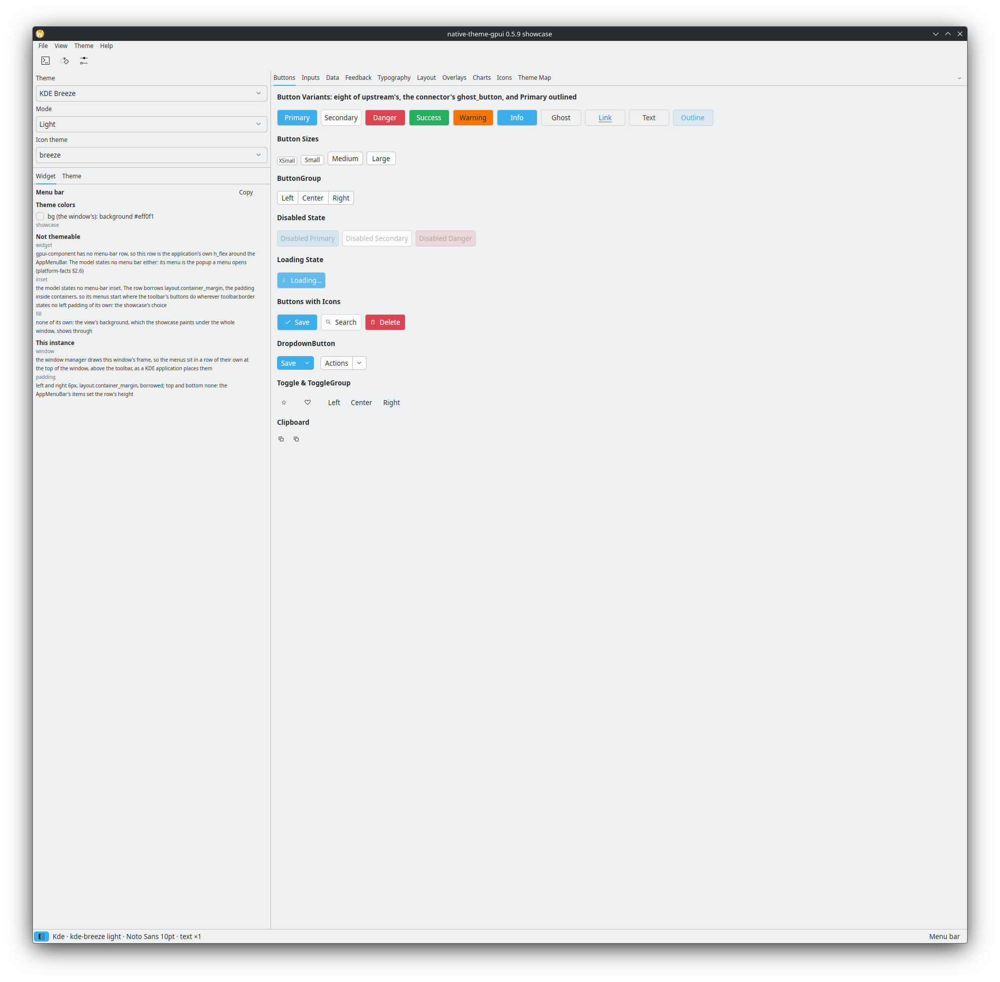
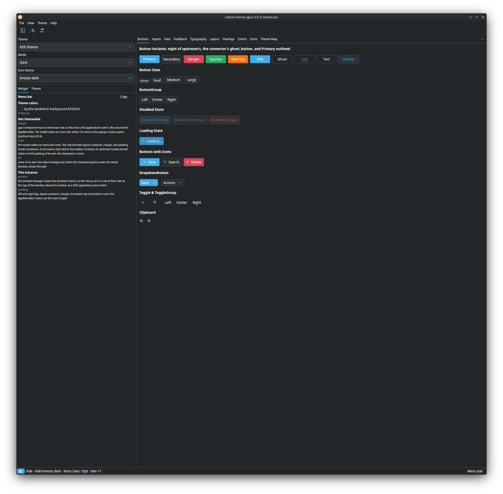
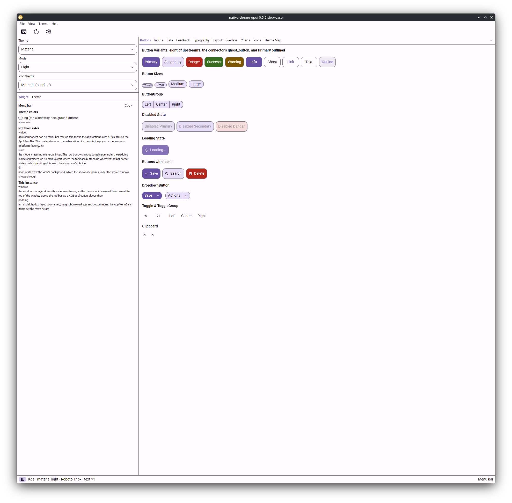
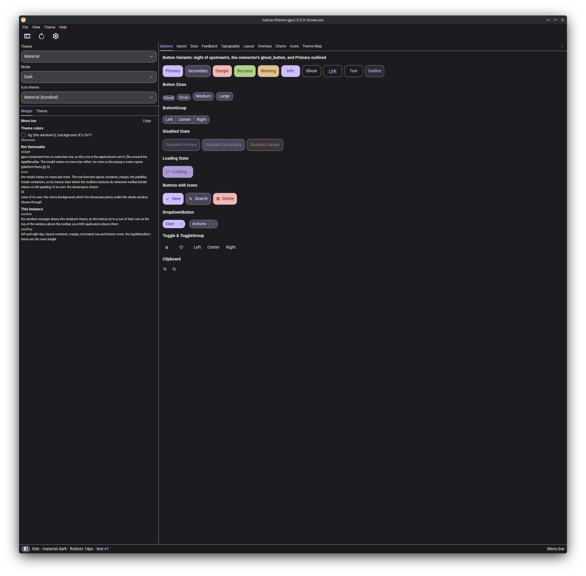
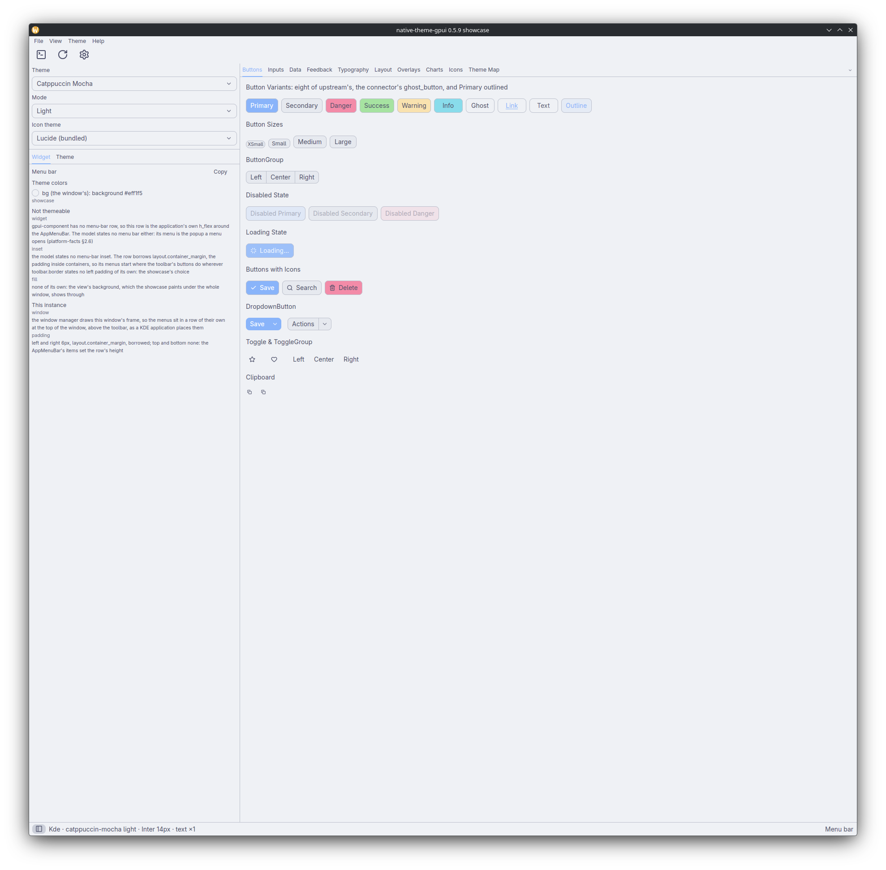
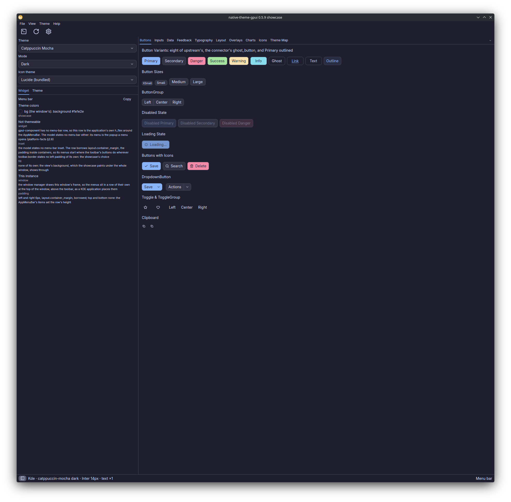
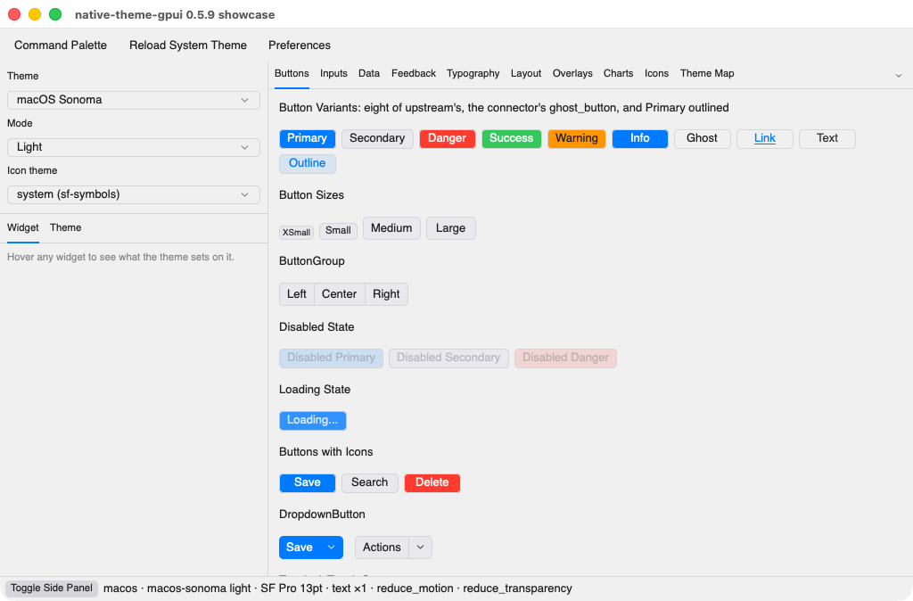
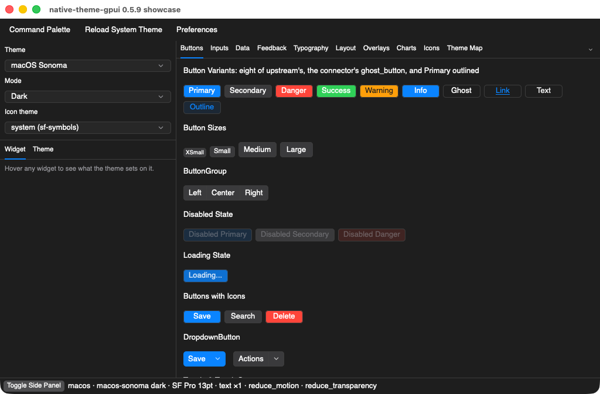
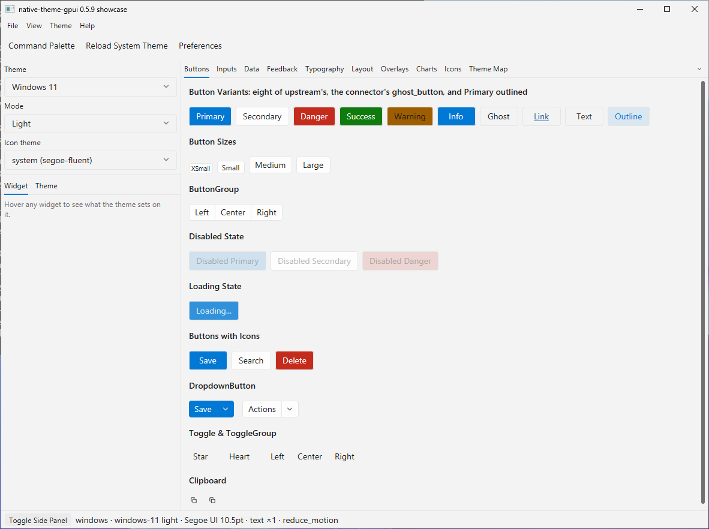
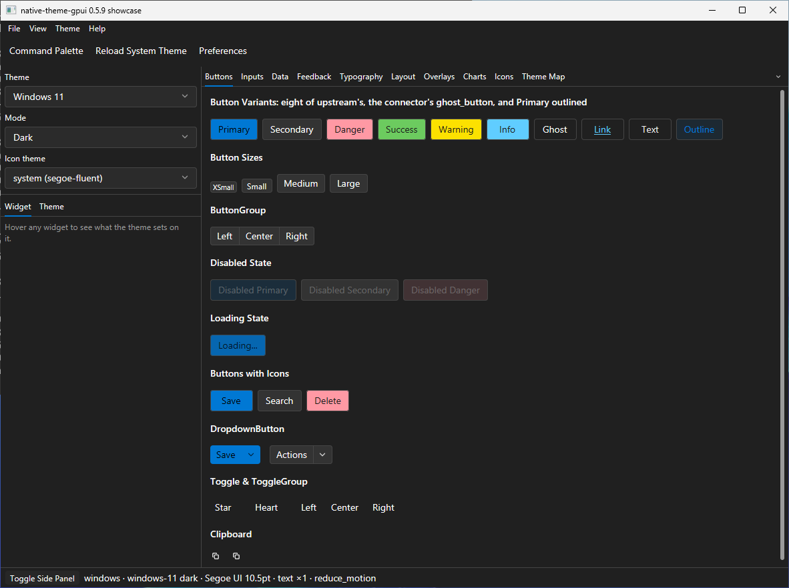

# native-theme-gpui

[GPUI](https://gpui.rs/) + [gpui-component](https://crates.io/crates/gpui-component)
connector for [`native-theme`](https://crates.io/crates/native-theme).

Compatibility: gpui-component 0.6.x · gpui-base 0.6.x · GPUI as `gpui-pre` 0.3.x · MSRV 1.95.0.

## What it does

Turns a `native_theme::ResolvedTheme` into a fully configured
`gpui_component::theme::Theme` and installs it:

- **Colours**: all 138 `ThemeColor` fields, including the 28 `button_*`
  fields gpui-component 0.6 reads for `Button`, so native themes keep their
  solid button surfaces instead of upstream's tinted house style.
- **Fonts and global geometry**: families, sizes, `radius`, `shadow`,
  `focus_ring`, `scrollbar_mode`; a `ThemeConfig` per mode so upstream's own
  `Theme::change` reproduces the native palette in light and dark (the 12
  base-palette fields `ThemeConfigColors` keeps private are restored by the
  connector's observer after each switch).
- **The base layer**: gpui-base paints scrollbars and resize handles without
  going through gpui-component; the connector writes the native scrollbar
  width, thumb width, inset and radius, minimum thumb length and colours, and
  the splitter colours, and keeps them installed across upstream rebuilds.
- **Per-widget geometry**: pure builders that return a `StyleRefinement` with
  the native heights, paddings, radii, borders and text sizes for the widgets
  where gpui-component applies the caller's style after its own — and the
  native text colour for the seven whose label would otherwise be left to a
  token of upstream's.
- **Accessibility**: the platform's text-scaling factor scales the theme's
  fonts (and, through GPUI's rem, every rem-relative size in gpui-component);
  reduce-motion is forwarded to GPUI; reduce-transparency keeps the overlay
  opaque.
- **Icons**: mappings from every gpui-component `IconName` (101 variants) to
  the bundled Lucide and Material sets and to freedesktop icon names, `None`
  for the two a set lacks. gpui-component's `IconName` cannot be enumerated
  in code, so the tables are audited by hand: against 0.6.4's variant set,
  and again against 0.6.1, which keeps the same 101 variants (its full Lucide
  catalog lives in `gpui_kit_assets::IconName`). The audit is repeated on
  every gpui-component bump.

## How it fits

Depend on this crate — it pulls `native-theme` in transitively. The
workspace-level README at the repo root has a diagram showing where each
crate sits.

The crate requires gpui-component 0.6 and GPUI published as `gpui-pre` 0.3;
later 0.6.x and 0.3.x releases resolve in place without a new connector
release, and a nightly CI job (`dependency-canary.yml`) checks the connector
against the newest set.

## Quick start

```toml
[dependencies]
native-theme = "0.5"
native-theme-gpui = "0.5"
gpui-kit = "0.6"          # or gpui-component + gpui-base + gpui-pre directly
```

```rust,ignore
gpui_kit::application().run(|cx| {
    gpui_kit::init(cx);
    match native_theme::SystemTheme::from_system() {
        Ok(sys) => native_theme_gpui::apply_system_theme(&sys, cx),
        Err(_) => {
            let prefs = native_theme_gpui::AccessibilityPreferences::from_system();
            if let Ok((theme, resolved)) = native_theme_gpui::from_preset("adwaita", false, &prefs) {
                native_theme_gpui::apply(theme, &resolved, &prefs, cx);
            }
        }
    }
    // open windows as usual
});
```

Call `gpui_kit::init` (or `gpui_component::init`) **before** `apply`, as
upstream requires before any component is used. `apply` initialises the styled
layer itself only when it is absent; an `init` after `apply` would reset the
theme to upstream's default.

### Light and dark under a preset

```rust,ignore
use native_theme_gpui::{AccessibilityPreferences, apply, from_preset};

let prefs = AccessibilityPreferences::from_system();
let (light, light_resolved) = from_preset("catppuccin-latte", false, &prefs)?;
let (dark, dark_resolved) = from_preset("catppuccin-mocha", true, &prefs)?;
apply(light, &light_resolved, &prefs, cx);
apply(dark, &dark_resolved, &prefs, cx);   // dark is now current; both variants are stored
```

Afterwards gpui-component's own `Theme::sync_system_appearance(None, cx)` or
`Theme::change(mode, None, cx)` switches between the two native palettes: each
`apply` installs a `ThemeConfig` for every stored variant, and the connector's
observer restores the base-layer geometry and the 12 base-palette colours the
config cannot carry after the switch. With only one variant stored, a switch to
the other mode shows upstream's built-in `ThemeColor::light()` / `dark()`
constants (the default config carries no colours), so call `apply` once per
variant.

## Core concepts

- **`apply(theme, &resolved, &prefs, cx)`** — installs the theme, stores the
  resolved variant and the preferences in the `NativeTheme` global, projects
  into gpui-base, writes the native scrollbar and resize-handle values, forwards
  reduce-motion, installs the re-apply observer once, and repaints every window.
- **`apply_system_theme(&sys, cx)`** — `apply` for the OS theme, storing both
  variants (and both configs) at once.
- **`apply_accessibility(&prefs, cx)`** — a runtime preference change (a portal
  signal, a settings toggle): rebuilds the styled theme from the stored variant
  with the new preferences, so text scaling and transparency take effect without
  the application keeping `resolved`; always forwards reduce-motion.
- **`from_preset(name, is_dark, &prefs)`** — load a bundled preset. `is_dark`
  is explicit because some presets (`solarized`, `gruvbox`) have ambiguous
  lightness. Pass `&AccessibilityPreferences::default()` for no scaling, or
  `AccessibilityPreferences::from_system()` to honour the OS preferences under a
  preset.
- **`from_system()`** — the OS theme as `(theme, resolved, is_dark)` without
  installing it.
- **`to_theme(&resolved, "Display Name", is_dark, &prefs)`** — the underlying
  mapping if you already have a `ResolvedTheme`.
- **`cx.native_theme()`** (`ActiveNativeTheme`) — the installed `NativeTheme`;
  `.native(cx)` gives the `Native { resolved, accessibility }` view the geometry
  builders take, for the mode gpui-component currently shows.

## Per-widget geometry

gpui-component widgets apply the caller's `StyleRefinement` after their own
geometry, so a refinement built from the native theme wins. Every builder in
the `geometry` module is a pure function of `Native<'_>`:

```rust,ignore
use gpui_component::StyledExt;
use native_theme_gpui::{ActiveNativeTheme, geometry};

let button = Button::new("save").label("Save");
let button = match cx.native_theme().and_then(|t| t.native(cx)) {
    Some(n) => button.refine_style(&geometry::button(n)),
    None => button,          // before `apply`: upstream's geometry
};
```

Text sizes carry the accessibility text-scaling factor; widths, paddings,
radii and icon sizes do not (that is what the platform toolkit does). Control
heights grow only when scaled text would no longer fit:
`max(theme height, ceil(font size × factor × line height) + 2 × vertical padding)`.

A builder sets a text colour only where the colour reaches the text *and*
upstream's disabled colour still wins: either upstream labels the caller's own
element with a token of its own before applying the refinement and re-applies
its state colours after it or on a child, or upstream sets no colour on that
element at all. Seven do. Three displace a visibly different colour:
`status_bar` and `dialog_description` displace upstream's `muted_foreground`,
`tooltip` displaces `popover_foreground`. Three displace `foreground`:
`list_item`, `radio` and `select`. `title_bar` displaces nothing — upstream
paints the bar's fill and border and sets no text colour. Those four change no
pixel under any bundled preset — a widget that states no `font.color` inherits
the window's, and `foreground` is fed from that same field — but they carry it
so that a source which *does* state, say, a list row colour, or the title bar
colour the KDE reader takes from `[WM] activeForeground`, is honoured instead
of silently overridden.

The remaining builders set size and weight only and leave the colour to the
token. `checkbox` and `combobox` are the near misses: upstream paints both from
`foreground`, but a `Checkbox` label is re-coloured by its own wrapper and both
apply their disabled colour *before* the refinement, so a carried colour would
either never arrive or take the disabled state's place — a preset that states
one of those two colours is a finding to record, not a builder to change, and a
test over every preset and mode says so.

| Builder | `ResolvedTheme` fields it reads | Applies to |
|---|---|---|
| `button` | `button.min_height`, `.min_width`, `.border.padding_*`, `.corner_radius`, `.line_width`, `.color`, `button.font`, `defaults.line_height` | `Button` (the label size is set on an inner element; the outline/ghost/link/text variants take the native border too) |
| `input`, `input_height` | `input.min_height`, `input.border.corner_radius`, `.line_width`, `.padding_vertical`, `input.font`, `defaults.line_height` | `Input` (`Input::h` for the height alone) |
| `menu_item` | `menu.row_height`, `menu.border.padding_*`, `menu.icon_text_gap`, `menu.font`, `defaults.line_height` | a menu row the application draws with its own elements — gpui-component's own `MenuItemElement` is crate-private and `PopupMenu` builds its rows itself, so no upstream widget takes this style |
| `list_item` | `list.row_height`, `list.border.padding_*`, `list.item_font`, `defaults.line_height` | `ListItem` |
| `tooltip` | `tooltip.border.padding_*`, `.corner_radius`, `tooltip.font` | an application-built `Tooltip`. No width: `tooltip.max_width` on the bubble clamps the bubble and not its text, which runs out of it |
| `tooltip_content` | `tooltip.max_width` less `tooltip.border.padding_horizontal` twice and upstream's 1 px border twice | the element the application passes to `Tooltip::element` — the one place the platform's tooltip width makes the text wrap |
| `popover` | `popover.border.padding_*`, `.corner_radius` | `Popover` |
| `status_bar` | `status_bar.border.padding_*`, `status_bar.font` | `StatusBar` |
| `dialog`, `dialog_max_width` | `dialog.border.padding_*`, `dialog.min_height`, `.border.corner_radius`, `.max_width` | `Dialog` (`Dialog::max_w` for the width). `dialog.max_height` no longer arrives: gpui-component 0.6.4 clamps the dialog to what is left of the viewport after applying the caller's style |
| `dialog_footer`, `dialog_title`, `dialog_description` | `dialog.button_gap`, `dialog.title_font`, `dialog.body_font` | `DialogFooter`, `DialogTitle`, `DialogDescription` |
| `table` | `list.item_font` | declarative `Table` |
| `progress` | `progress_bar.track_height`, `progress_bar.border.corner_radius`, `.min_width` | `Progress` |
| `group_box_content` | `card.border.padding_*`, `.corner_radius`, `.line_width`, `.color` | `GroupBox::content_style` |
| `accordion_title` | `expander.header_height` | `AccordionItem::title_style` |
| `checkbox`, `radio` | `checkbox.label_gap`, `checkbox.font` (radio metrics are the checkbox's on every platform) | `Checkbox`, `Radio` |
| `select`, `combobox` | `combo_box.min_height`, `.min_width`, `combo_box.border.corner_radius`, `.padding_vertical`, `combo_box.font`, `defaults.line_height` | `Select`, `Combobox` |
| `title_bar` | `window.title_bar_font` | `TitleBar` |
| `spinner_size`, `icon_size_*` | `spinner.diameter`, `defaults.icon_sizes.*` | `Spinner::with_size`, `Icon::with_size` |
| `scrollbar_gutter` | `scrollbar.overlay_mode`, and the groove width the base layer installed | the element a `overflow_y_scrollbar` container scrolls. gpui-component overlays its bar on the scroll area whatever the platform does, so where the platform's bars are not overlays this reserves the groove width beside the content; where they are, it reserves nothing |
| `widget_gap`, `container_margin`, `window_margin`, `section_gap` | `LayoutTheme` (`Theme::layout` or `SystemTheme.layout`) | your own layout; `None` where the platform specifies nothing |

The `button`, `input`, `select`, `combobox`, `list_item` and `progress`
builders are verified against real gpui-component widgets in `tests/seams.rs`,
which lays each one out headlessly with and without the refinement and
compares the measured height with the refinement's own field. The same file
lays a real `Tooltip` out and checks that its text keeps inside the bubble.

### Flat buttons

gpui-component paints a flat button's hover from a token that means something
else: a `.ghost()` button hovers with `accent`, the item-highlight colour of
menus and lists, and an `InputGroupButton` with `muted`, the subdued surface of
`Kbd` and code blocks. Both are mapped correctly for what they are, so under a
native theme those two buttons hover in colours no other button uses.
`variants::ghost_button(cx)` is the same flat button with the platform's own
button hover and pressed colours:

```rust,ignore
use gpui_component::button::{Button, ButtonVariants as _};
use native_theme_gpui::variants;

Button::new("close").icon(IconName::Close).custom(variants::ghost_button(cx));
InputGroupButton::new("copy").label("Copy").custom(variants::ghost_button(cx));
```

Build it in `render`: it reads the installed theme, so it follows a light/dark
switch. Buttons gpui-component creates internally (a dialog's close button,
calendar navigation, the tab bar) cannot be reached this way.

`input_group_button` gives a button nested in an `InputGroup` the platform's
button radius; gpui-component sizes such a button `XSmall` and would round it
with half the theme's radius.

What stays upstream work (inner elements the caller's style cannot reach:
checkbox and radio indicators, switch, slider, separator thickness, splitter
width, button icon gap, input padding, popup-menu rows; the hover of the
flat buttons gpui-component builds internally, which takes `accent` where the
platform has a button hover; the checkbox and radio unchecked border, which
takes the text input's border colour; and tab height, radius
and text size, which `Tab`'s render writes into the same style bag the caller's
setters fill, `tab/tab.rs:801-808`) is
listed in §14 of the [v0.5.8 specification](https://github.com/tiborgats/native-theme/blob/main/docs/archive/todo_v0.5.8_gpui-component-0.6-spec.md)
and in the roadmap's upstream-PR list.

## How re-application works

gpui-component's `Theme::change`, `sync_system_appearance` and `sync_base`
rebuild gpui-base's theme with upstream's fixed scrollbar styles. `apply`
therefore installs, once per `App`, a global observer on `gpui_base::Theme`
that writes the native scrollbar geometry and resize-handle colours back after
every such rebuild, and restores the 12 base-palette colours (`red` …
`cyan_light`) the rebuild reset, because `ThemeConfigColors` keeps those
private and the variant's config cannot carry them. It absorbs the notification of its own write with a flag
and repairs the handle colours if another effect rebuilt the base theme in the
meantime; the scrollbar styles are opaque upstream, so a rebuild that happens
to leave the handle colours unchanged is repaired at the next one.

Assumptions: the connector is the only code writing `gpui_base::Theme`
besides gpui-component itself, and the only code writing the styled theme's 12
base-palette fields after `apply` (a value set there by the application is
replaced at the next rebuild); and gpui-component's `ThemeRegistry` observer
replaces the styled theme's configs by *name* on a registry change, so an
application that loads a theme through `ThemeRegistry` under the same display
name as the native theme replaces the connector's colours (the base-layer
geometry is still restored). The default registry holds two themes,
`Default Light` and `Default Dark`.

## Accessibility

| Preference | Effect |
|---|---|
| `text_scaling_factor` | multiplies `Theme.font_size` and `mono_font_size` (and their `ThemeConfig` copies); `Root` sets the window rem to `font_size`, so every rem-relative size in gpui-component scales; the geometry builders scale text sizes and grow control heights |
| `reduce_motion` | `true` switches `App::reduce_motion` on if it is off; a later `false` undoes only that, then gpui-base (which reads the OS preference itself since 0.6.2) re-reads the OS and decides. GPUI's animations and gpui-component's spinner, shimmer, progress and marker honour the flag |
| `reduce_transparency` | the overlay colour becomes opaque |
| `high_contrast` | no receiver in GPUI or gpui-component yet |

Non-finite or non-positive scaling factors count as 1.0.

## Common recipes

### Apply user overrides to the OS theme

```rust,ignore
use native_theme::{SystemTheme, theme::Theme};
use native_theme_gpui::apply_system_theme;

let sys = SystemTheme::from_system()?;
let overlay = Theme::from_toml(r##"[light.defaults]
accent_color = "#ff6600"
"##)?;
let customised = sys.with_overlay(&overlay)?;
apply_system_theme(&customised, cx);
```

### Custom icons

For app-specific icons generated via [`native-theme-build`](https://crates.io/crates/native-theme-build):

```rust,ignore
use native_theme_gpui::icons::custom_icon_to_image_source;
use native_theme::theme::IconSet;

let handle = custom_icon_to_image_source(&AppIcon::PlayPause, IconSet::Material, None, None);
```

### Animated spinners

```rust,ignore
use native_theme::theme::AnimatedIcon;
use native_theme::icons::MaterialLoader;
use native_theme::detect::prefers_reduced_motion;
use native_theme_gpui::icons::{animated_frames_to_image_sources, with_spin_animation, to_image_source};

if let Some(anim) = MaterialLoader::load_indicator() {
    if prefers_reduced_motion() {
        let static_icon = to_image_source(anim.first_frame(), None, None);
    } else {
        match &anim {
            AnimatedIcon::Frames(_) => {
                // Cache this — do not call on every frame tick.
                let sources = animated_frames_to_image_sources(&anim, None, None);
            }
            AnimatedIcon::Transform(_) => {
                let spinner = gpui::svg().path("spinner.svg");
                let element = with_spin_animation(spinner, "loading", 1000);
            }
            _ => {}
        }
    }
}
```

## GPUI as `gpui-pre`

gpui-component 0.6 depends on GPUI published as the **`gpui-pre`** package:
snapshots of Zed's `main` branch that the gpui-kit maintainer republishes as
`0.3.N` patch bumps every other Sunday. Breaking changes from Zed therefore
arrive as patch releases. This crate names the same package
(`gpui = { package = "gpui-pre", version = "0.3.5" }`) so its `Hsla`, `Pixels`
and `StyleRefinement` are gpui-component's types; its GPUI surface is small
(`Hsla`, `hsla`, `Rgba`, `SharedString`, `px`, `Pixels`, `svg`, `img`,
`ImageSource`, `ElementId`, `IntoElement`, `StyleRefinement`, `FontWeight`,
`App`, `Global`, `Subscription`). To freeze a snapshot in an application, pin
`gpui-pre = "=0.3.N"` there; a library must not, because an exact pin would
conflict with any other dependency wanting a later snapshot.

## What gets mapped

- **All 138 `ThemeColor` fields.** The status button fields copy the semantic
  colours their variant used before (solid surfaces); `table_foot*` mirror
  `table_head*`; `status_bar*` come from the status-bar theme; the rest as
  before (direct roles plus derived hover/active states).
- **Fonts and geometry** — `family`, `size` (scaled by the text-scaling
  factor), `radius`, `shadow`, `focus_ring`, `scrollbar_mode`.
- **Base layer** — scrollbar track width, thumb width, thumb inset (centred),
  thumb radius, minimum thumb length, track and thumb colours; resize-handle
  colours from the splitter.
- **Icons** — every gpui-component `IconName` (101 variants) in three tables
  returning `Option<&'static str>`: the Lucide table returns Lucide's own file
  names (`StarFill` has no Lucide equivalent), the Material table names
  Material Symbols Outlined files (`StarOff` has none), the freedesktop table
  names Breeze/Adwaita icons. `None` means the set has no equivalent; nothing
  is substituted. `30 of 42 IconRole` variants map to `IconName`.

## Showcase

```sh
cargo run -p native-theme-gpui --example showcase-gpui
```

Displays every gpui-component widget themed with native-theme presets, with
live theme switching, the geometry builders applied where they reach, a
138-field colour map and a 101-icon gallery.

## Gallery

### Linux













### macOS





### Windows





## Links

- [API reference on docs.rs](https://docs.rs/native-theme-gpui)
- [Showcase source](examples/showcase-gpui.rs)
- [CHANGELOG](https://github.com/tiborgats/native-theme/blob/main/CHANGELOG.md)

## License

Licensed under any of

- [Apache License, Version 2.0](http://www.apache.org/licenses/LICENSE-2.0)
- [MIT License](http://opensource.org/licenses/MIT)
- [0BSD License](https://opensource.org/license/0bsd)

at your option.
