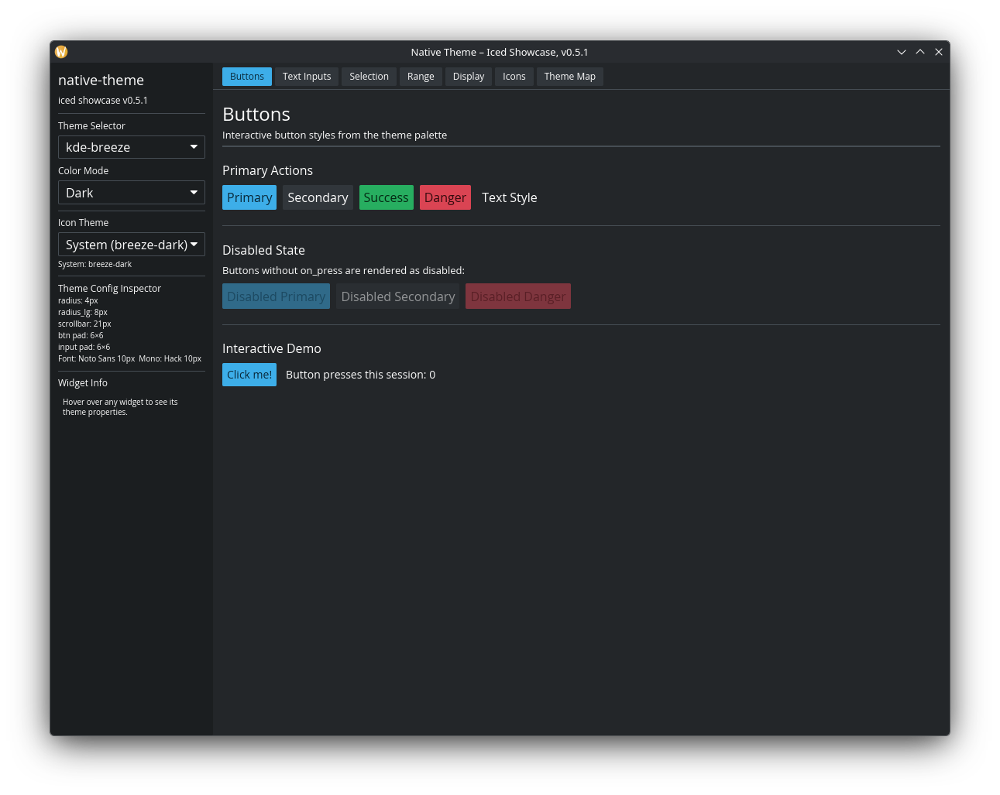
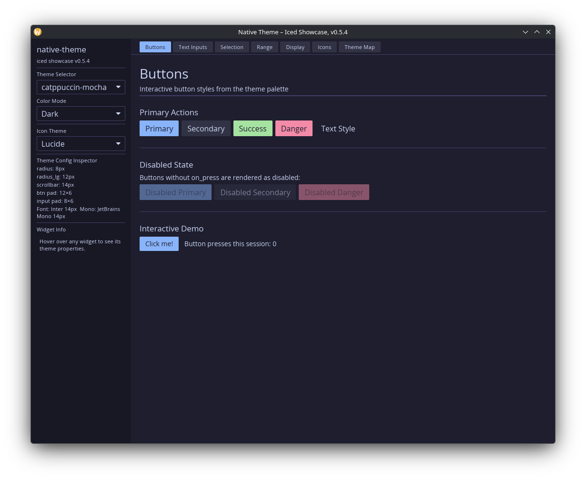
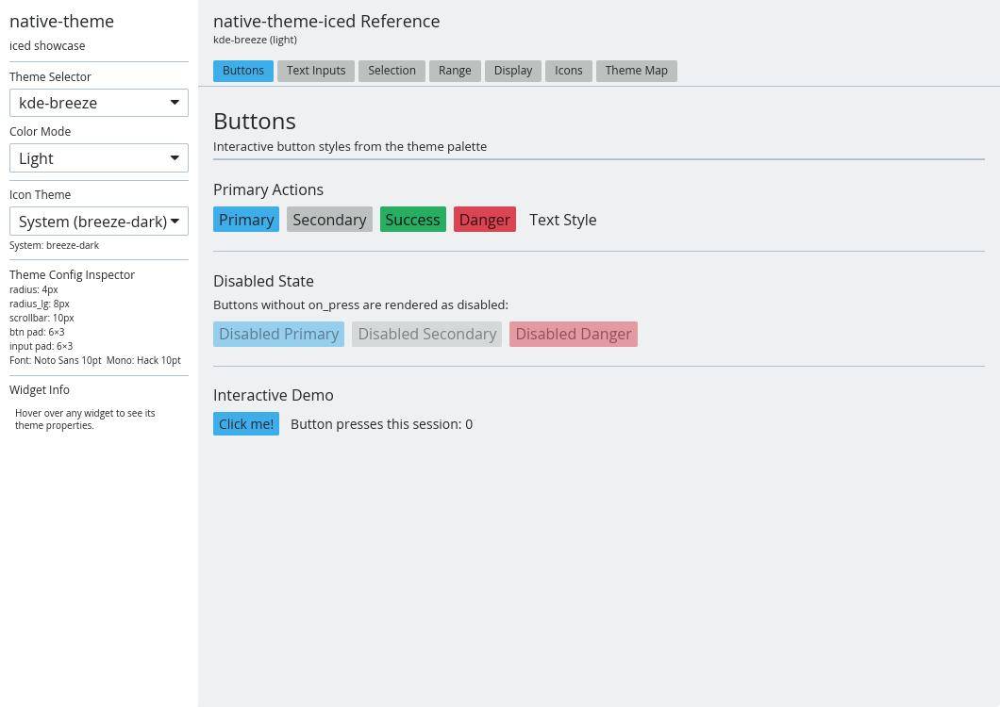
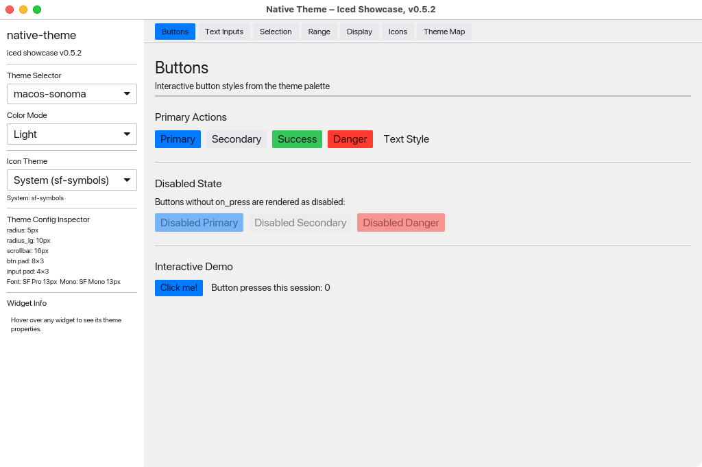
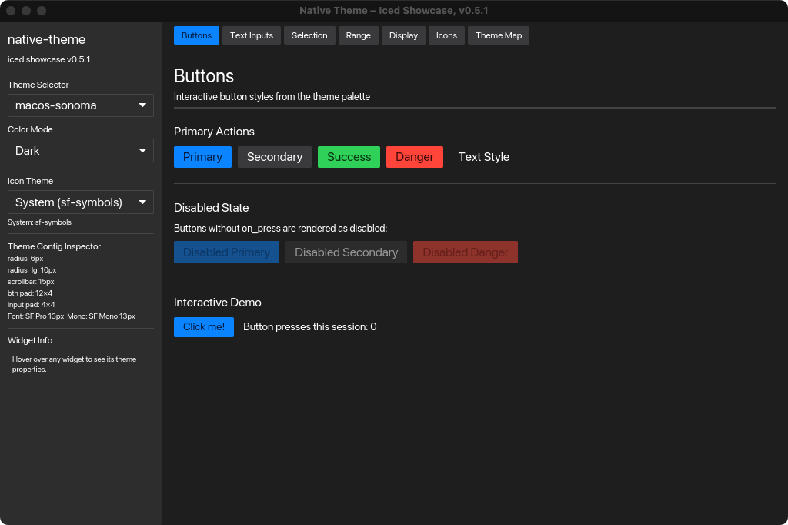
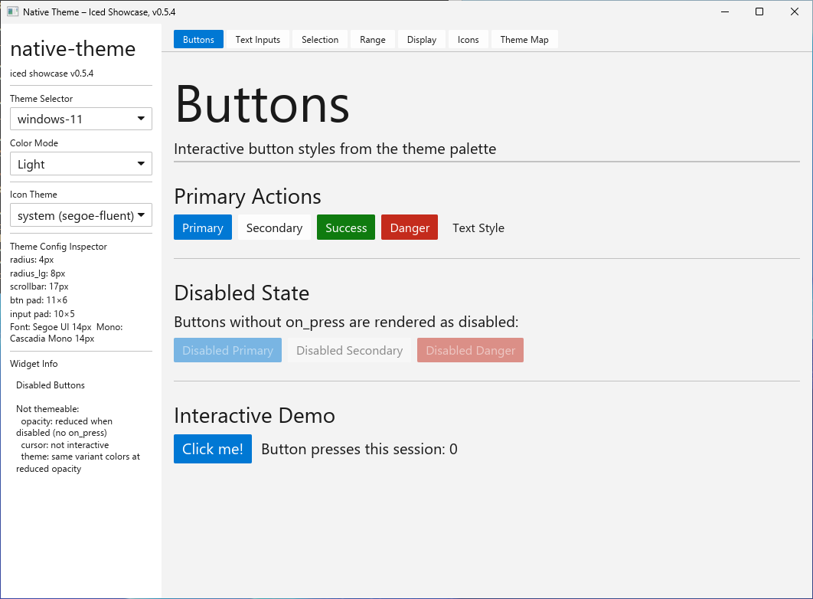
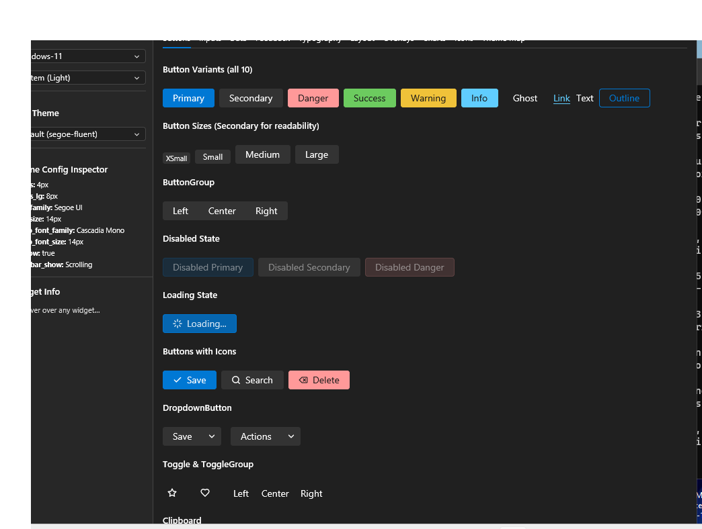

# native-theme-iced

[iced](https://iced.rs/) toolkit connector for
[native-theme](https://crates.io/crates/native-theme).

Maps `native_theme::NativeTheme` data to iced's theming system, producing a
fully configured `iced::Theme` with correct colors for all built-in widget
styles via iced's Catalog system.

## Usage

Add both crates to your `Cargo.toml`:

```toml
[dependencies]
native-theme = "0.4"
native-theme-iced = "0.4"
```

Then create an iced theme from any native-theme preset or OS theme:

```rust
use native_theme::NativeTheme;
use native_theme_iced::to_theme;

// Load a preset
let nt = NativeTheme::preset("dracula").unwrap();

// Pick light or dark variant (with cross-fallback)
let is_dark = true;
if let Some(variant) = nt.pick_variant(is_dark) {
    let theme = to_theme(variant, "My App");
    // Use `theme` as your iced application theme
}
```

Or read the OS theme at runtime:

```rust
use native_theme::{from_system, NativeTheme};
use native_theme_iced::to_theme;

let nt = from_system().unwrap_or_else(|_| NativeTheme::preset("default").unwrap());
let is_dark = true;
if let Some(variant) = nt.pick_variant(is_dark) {
    let theme = to_theme(variant, "System Theme");
}
```

## Widget Metrics

The crate exposes helper functions for widget sizing that iced applies
per-widget rather than through the Catalog:

- `button_padding(variant)` -- horizontal and vertical padding
- `input_padding(variant)` -- text input padding
- `border_radius(variant)` -- standard corner radius
- `border_radius_lg(variant)` -- large corner radius (e.g., dialogs)
- `scrollbar_width(variant)` -- scrollbar track width
- `font_family(variant)` -- primary UI font family name
- `font_size(variant)` -- primary UI font size in pixels (converted from points)
- `mono_font_family(variant)` -- monospace font family name
- `mono_font_size(variant)` -- monospace font size in pixels

## Modules

| Module | Purpose |
|--------|---------|
| `palette` | Maps native-theme colors to iced's 6-field Palette |
| `extended` | Overrides iced's Extended palette for secondary and background.weak |
| `icons` | Icon role mapping, SVG widget helpers, and animated icon playback |

## Custom Icons

For app-specific icons defined via `native-theme-build`, the connector provides:

- `custom_icon_to_image_handle(provider, icon_set)` -- load a custom icon as an iced image handle
- `custom_icon_to_svg_handle(provider, icon_set)` -- load as an SVG handle
- `custom_icon_to_svg_handle_colored(provider, icon_set, color)` -- load with color tinting

These work with any type implementing `IconProvider`.

## Animated Icons

The connector provides helpers for displaying animated icons from
[`loading_indicator()`](https://docs.rs/native-theme/latest/native_theme/fn.loading_indicator.html):

- `animated_frames_to_svg_handles()` -- converts `AnimatedIcon::Frames` to a `Vec<svg::Handle>` for frame-based playback
- `spin_rotation_radians()` -- computes the current rotation angle for `AnimatedIcon::Transform` playback

```rust,ignore
use native_theme::{loading_indicator, prefers_reduced_motion, AnimatedIcon};
use native_theme_iced::icons::{animated_frames_to_svg_handles, spin_rotation_radians};

if let Some(anim) = loading_indicator("material") {
    if prefers_reduced_motion() {
        // Static fallback for accessibility
        let static_icon = anim.first_frame();
    } else {
        match &anim {
            AnimatedIcon::Frames { frame_duration_ms, .. } => {
                // Cache this -- do not call on every frame tick
                let handles = animated_frames_to_svg_handles(&anim);
                // Use iced::time::every(Duration::from_millis(*frame_duration_ms as u64))
                // to drive frame_index = (frame_index + 1) % handles.len()
                // In view: Svg::new(handles[frame_index].clone())
            }
            AnimatedIcon::Transform { icon, animation } => {
                let angle = spin_rotation_radians(elapsed, 1000);
                // Svg::new(handle).rotation(Rotation::Floating(angle))
            }
        }
    }
}
```

Cache the `Vec<svg::Handle>` from `animated_frames_to_svg_handles()` -- do not
call it on every frame tick. Use `Rotation::Floating` (not `Rotation::Solid`)
for spin animations to avoid layout jitter during rotation.

## Example

Run the showcase widget gallery to explore all 17 presets interactively:

```sh
cargo run -p native-theme-iced --example showcase
```

### Linux






### macOS




### Windows




The showcase displays all iced widgets (buttons, inputs, sliders, checkboxes,
togglers, etc.) themed with native-theme presets, with live theme switching
and a color map inspector.

## License

Licensed under either of

- [Apache License, Version 2.0](http://www.apache.org/licenses/LICENSE-2.0)
- [MIT License](http://opensource.org/licenses/MIT)
- [0BSD License](https://opensource.org/license/0bsd)

at your option.
