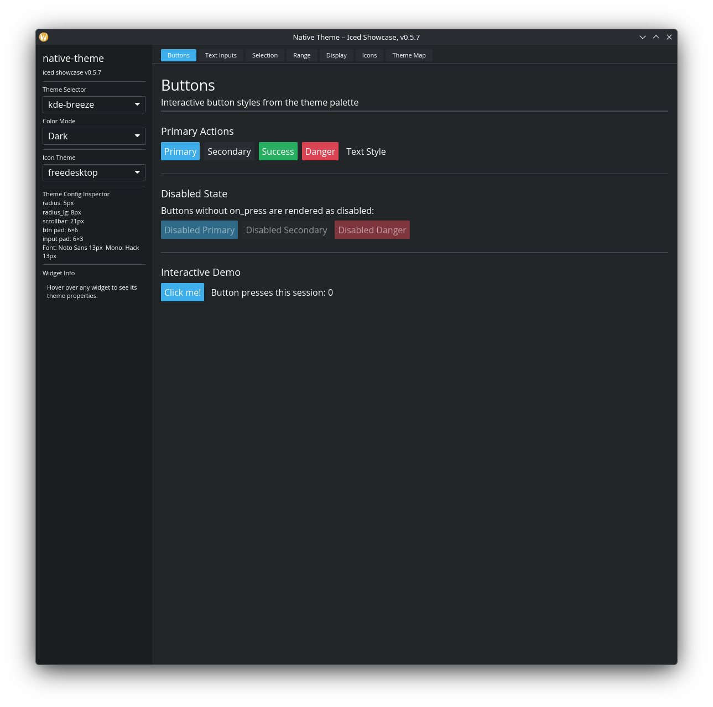
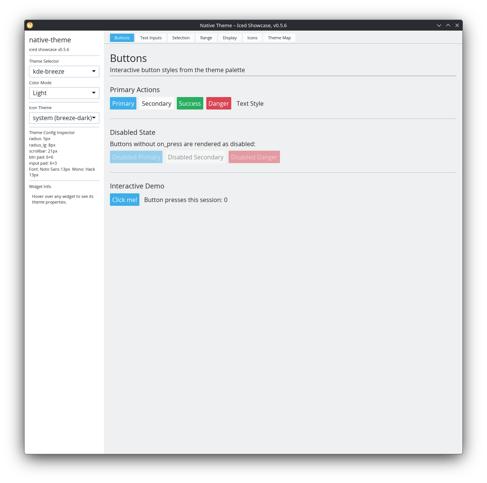
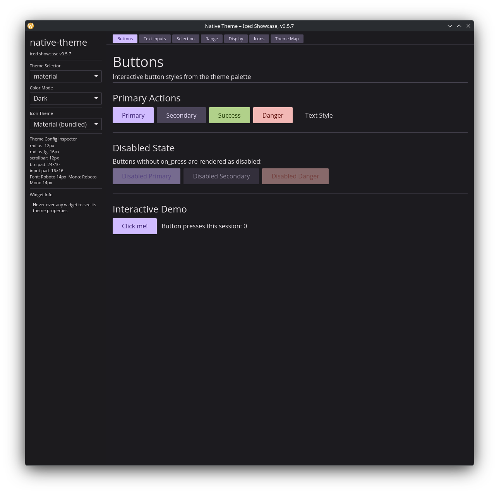
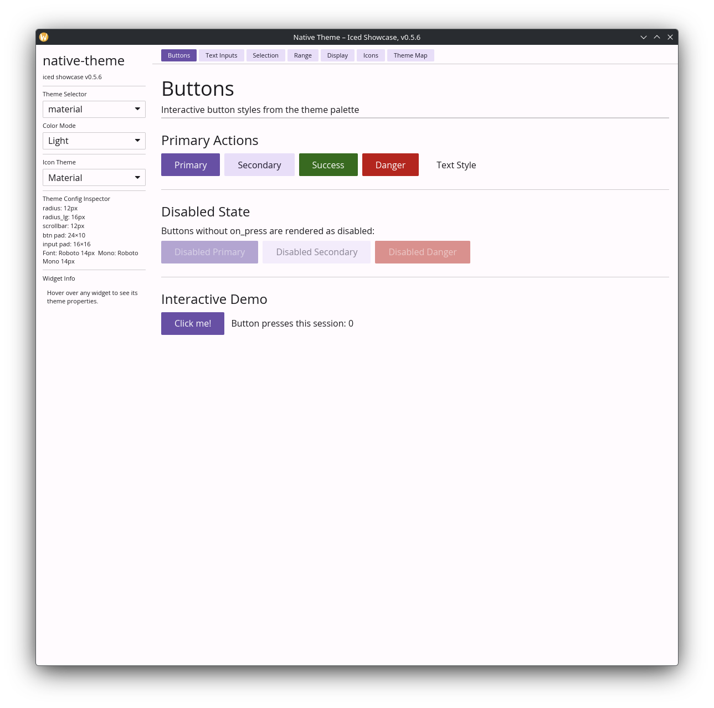
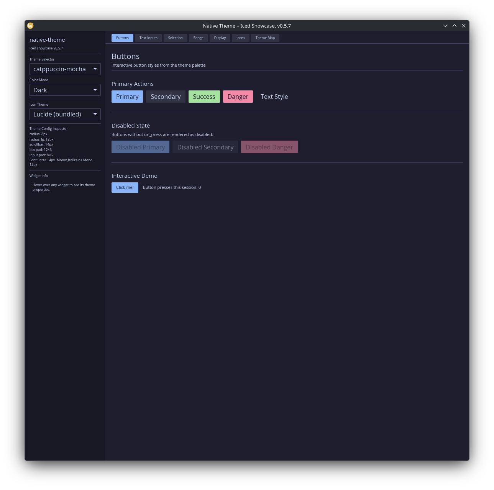
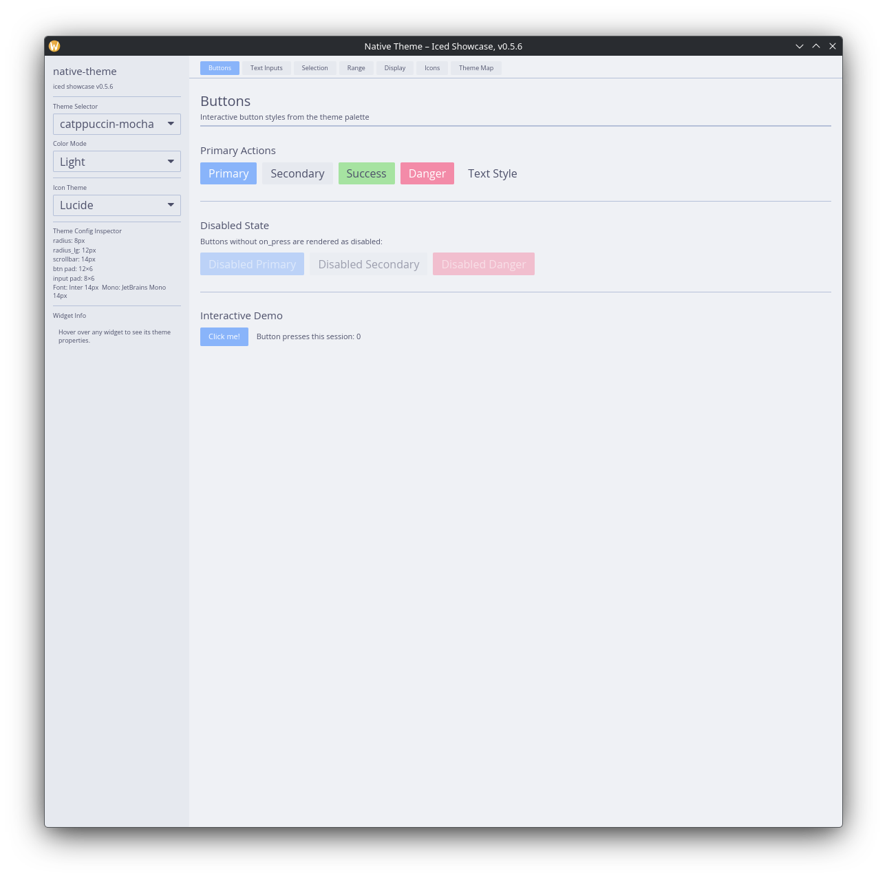
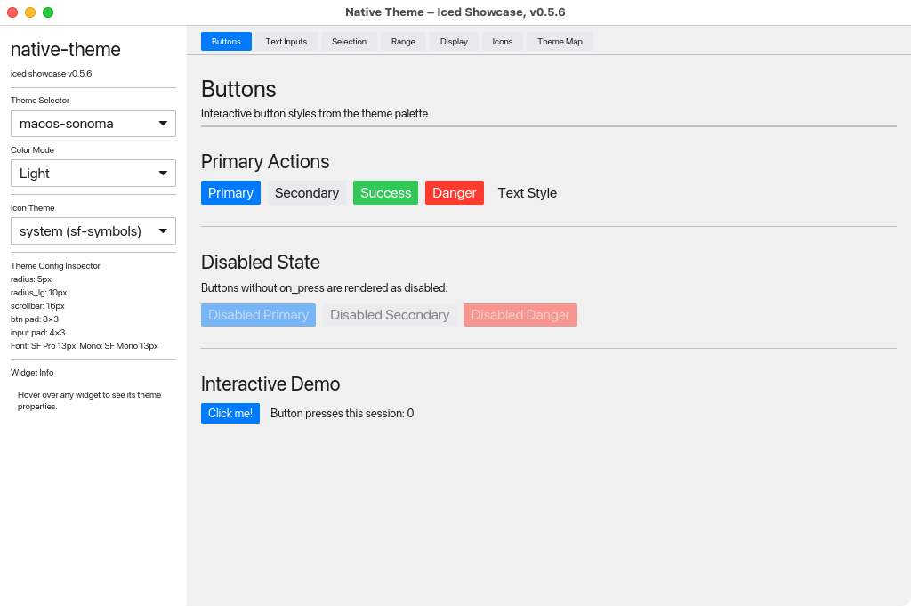
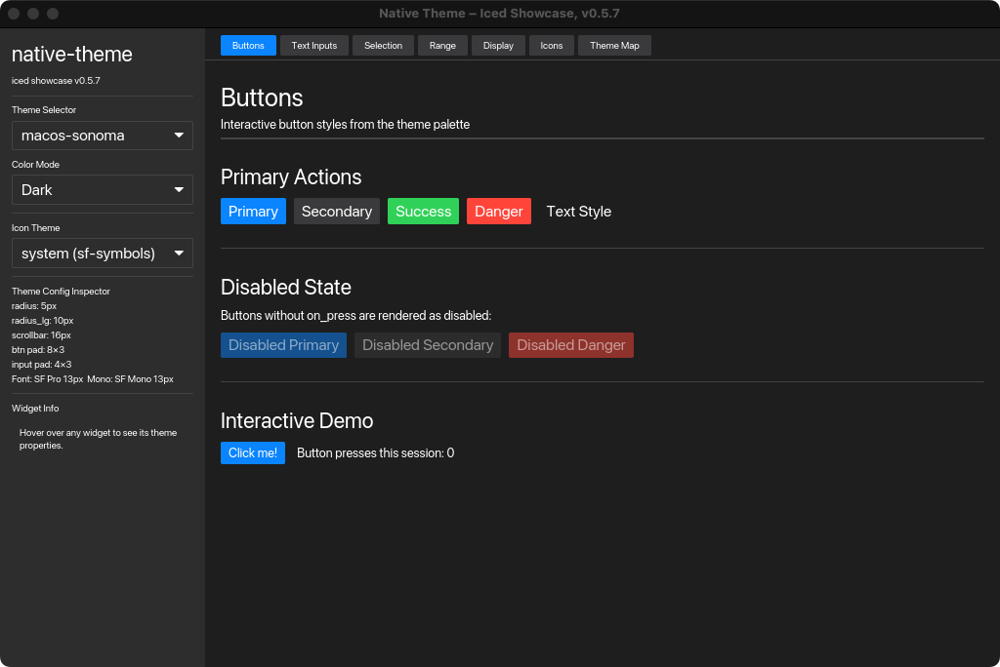
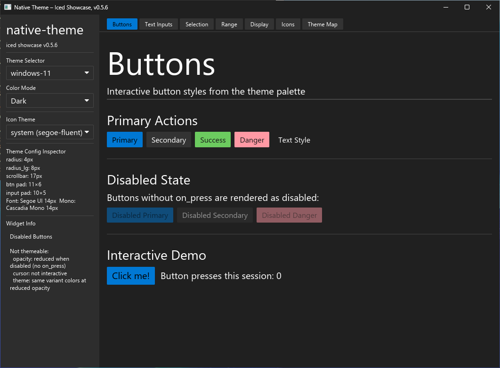

# native-theme-iced

[iced](https://iced.rs/) connector for [`native-theme`](../../native-theme/).

## What it does

Turns a `native_theme::ResolvedTheme` into a configured `iced::Theme` (Palette
+ Extended palette) so iced's built-in Catalog-driven widget styles pick up
your theme automatically. Provides widget-metric helpers (`button_padding`,
`border_radius`, `font_size`, …) for the sizing iced applies per-widget rather
than through the Catalog.

## How it fits

Depend on this crate — it pulls `native-theme` in transitively. The
workspace-level README at the repo root has a diagram showing where each
crate sits.

Unlike the GPUI connector, iced applies geometry (padding, radii, spacing)
via inline widget configuration, so this connector maps **colors only**. The
metric helpers read those values off a `&ResolvedTheme` for you to pass into
your widget builders.

## Quick start

Add both crates to your `Cargo.toml`:

```toml
[dependencies]
native-theme = "0.5"
native-theme-iced = "0.5"
```

Load a bundled preset:

```rust,ignore
use native_theme_iced::from_preset;

let (theme, resolved) = from_preset("dracula", true)?;
// `theme` is the iced Theme; `resolved` has metric fields for widget sizing.
//                          ^ is_dark
```

Or read the OS theme at runtime:

```rust,ignore
use native_theme_iced::from_system;

let (theme, resolved, is_dark) = from_system()?;
```

## Core concepts

- **`from_preset(name, is_dark)`** — load a bundled preset. `is_dark` is explicit because some presets (`solarized`, `gruvbox`) have ambiguous lightness.
- **`from_system()`** — read the OS theme. Returns `(theme, resolved, is_dark)` so the third value tells you which variant the OS is currently using.
- **`to_theme(&resolved, "App Name")`** — the underlying mapping function if you already have a `ResolvedTheme` from somewhere else.
- **Metric helpers** — free functions that read geometry off `&ResolvedTheme` for use with iced's inline widget configuration.

## Common recipes

### Use widget-metric helpers

```rust,ignore
use native_theme_iced::{button_padding, border_radius, font_family, font_size};

// in your view:
let padding = button_padding(&resolved);
let radius  = border_radius(&resolved);
// Apply with .padding(padding), .border(...) on your widget builders.
```

Full helper list: `button_padding`, `input_padding`, `border_radius`,
`border_radius_lg`, `scrollbar_width`, `font_family`, `font_size`,
`font_weight`, `mono_font_family`, `mono_font_size`, `mono_font_weight`,
`line_height_multiplier`, plus `to_iced_weight(css_weight)` for converting
CSS weight values to iced's `Weight` enum.

### Apply user overrides to the OS theme

```rust,ignore
use native_theme::{SystemTheme, theme::Theme};
use native_theme_iced::to_theme;

let sys = SystemTheme::from_system()?;
let overlay = Theme::from_toml(r##"[light.defaults]
accent_color = "#ff6600"
"##)?;
let customised = sys.with_overlay(&overlay)?;
let theme = to_theme(customised.pick(customised.mode), "My App");
```

### Custom icons

For app-specific icons generated via [`native-theme-build`](../../native-theme-build/):

```rust,ignore
use native_theme_iced::icons::{custom_icon_to_image_handle, custom_icon_to_svg_handle};
use native_theme::theme::IconSet;

let image = custom_icon_to_image_handle(&AppIcon::PlayPause, IconSet::Material);
let svg   = custom_icon_to_svg_handle(&AppIcon::PlayPause, IconSet::Material, None);
```

### Animated spinners

```rust,ignore
use native_theme::theme::AnimatedIcon;
use native_theme::icons::MaterialLoader;
use native_theme::detect::prefers_reduced_motion;
use native_theme_iced::icons::{animated_frames_to_svg_handles, spin_rotation_radians};

if let Some(anim) = MaterialLoader::load_indicator() {
    if prefers_reduced_motion() {
        let _static_fallback = anim.first_frame();
    } else {
        match &anim {
            AnimatedIcon::Frames(_) => {
                // Cache this — do not call on every frame tick.
                if let Some(h) = animated_frames_to_svg_handles(&anim, None) {
                    // Use iced::time::every(Duration::from_millis(h.frame_duration_ms as u64))
                    // to drive: frame_index = (frame_index + 1) % h.handles.len();
                    // In view: Svg::new(h.handles[frame_index].clone())
                }
            }
            AnimatedIcon::Transform(_) => {
                let _angle = spin_rotation_radians(elapsed, 1000);
                // Svg::new(handle).rotation(Rotation::Floating(angle))
            }
            _ => {}
        }
    }
}
```

Use `Rotation::Floating` (not `Rotation::Solid`) for spin animations so
the widget's layout box stays constant during rotation.

## Modules

| Module | Purpose |
|--------|---------|
| `palette` | Maps native-theme colors to iced's 6-field Palette |
| `extended` | (internal) Overrides iced's Extended palette for secondary and `background.weak` |
| `icons` | Icon role mapping, SVG widget helpers, and animated icon playback |

## Showcase

```sh
cargo run -p native-theme-iced --example showcase-iced
```

Displays every iced widget (buttons, inputs, sliders, checkboxes, togglers, …)
themed with native-theme presets, with live theme switching and a color map
inspector.

## Gallery

### Linux








### macOS




### Windows




## Links

- [API reference on docs.rs](https://docs.rs/native-theme-iced)
- [Showcase source](examples/showcase-iced.rs)
- [CHANGELOG](../../CHANGELOG.md)

## License

Licensed under any of

- [Apache License, Version 2.0](http://www.apache.org/licenses/LICENSE-2.0)
- [MIT License](http://opensource.org/licenses/MIT)
- [0BSD License](https://opensource.org/license/0bsd)

at your option.
