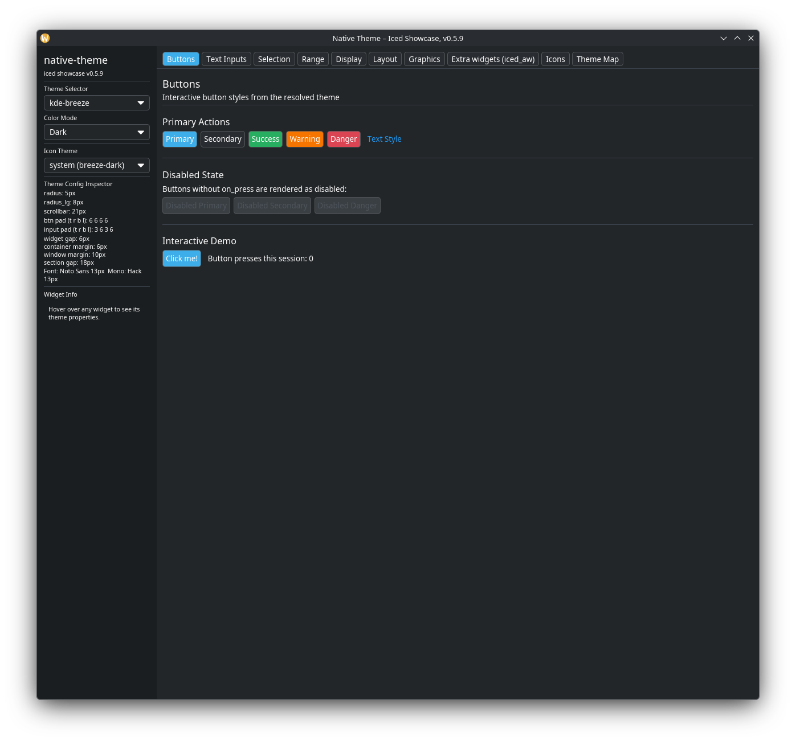
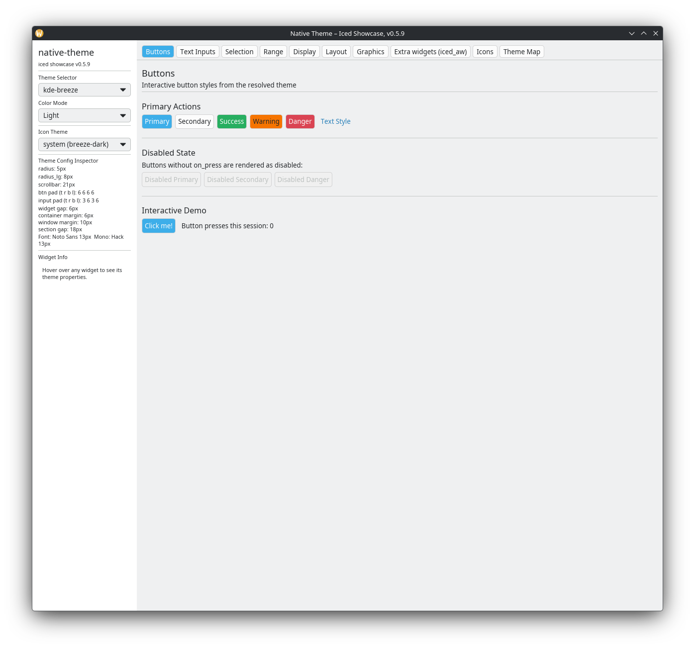
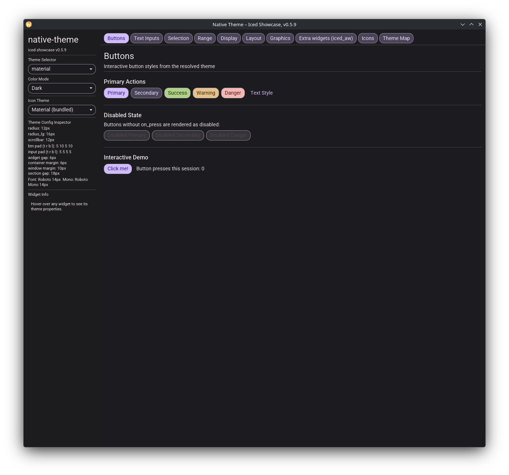
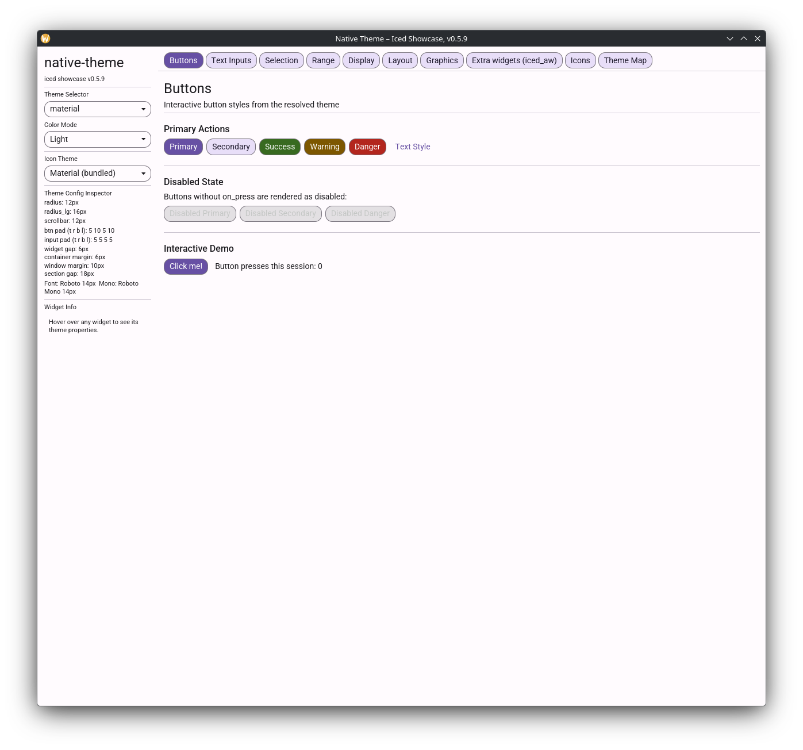
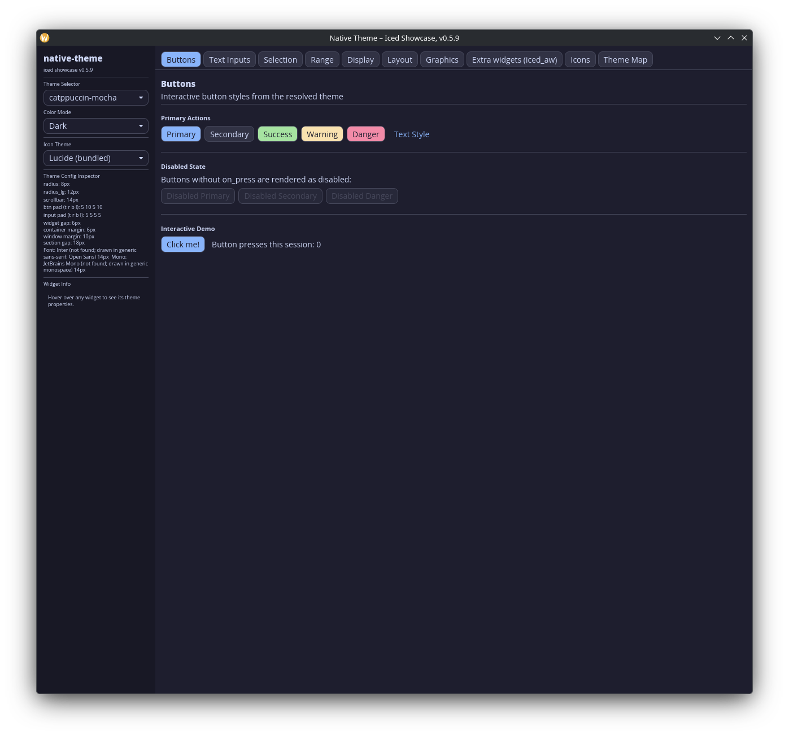
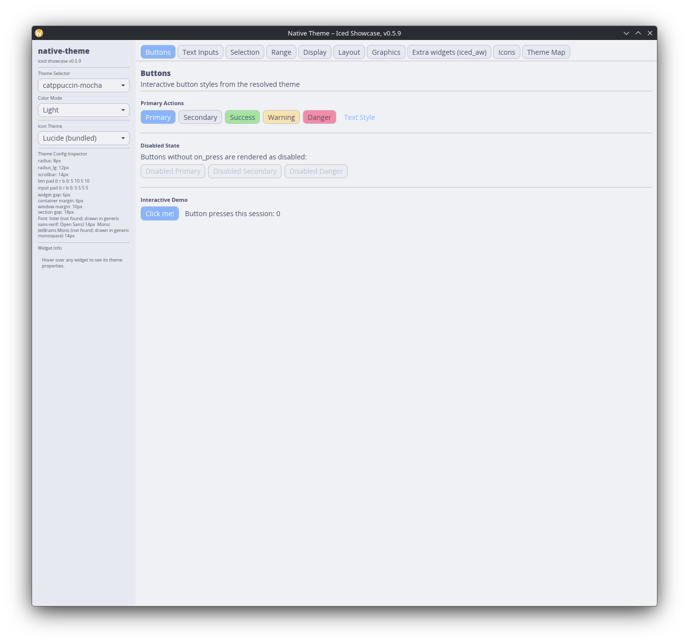
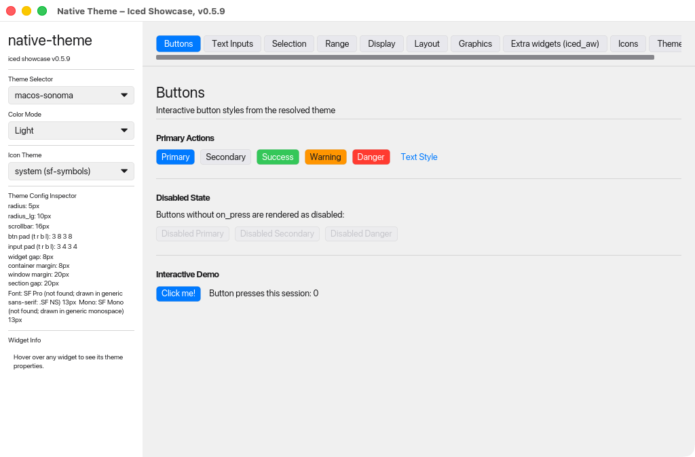
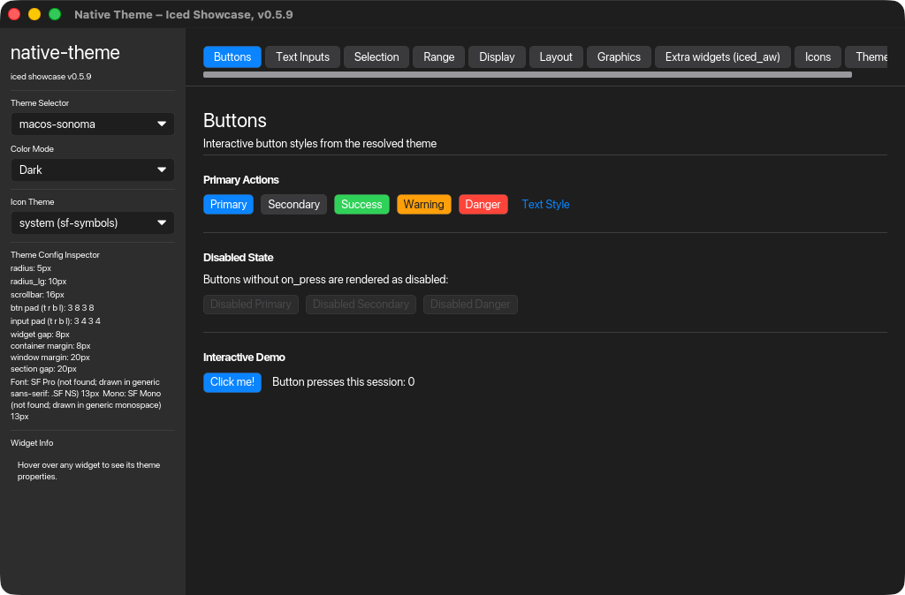
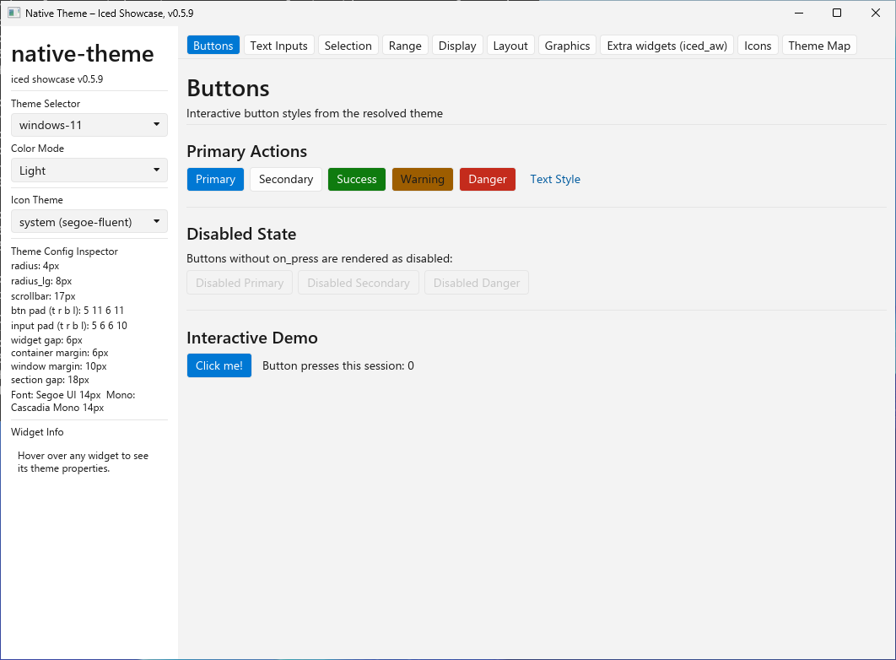
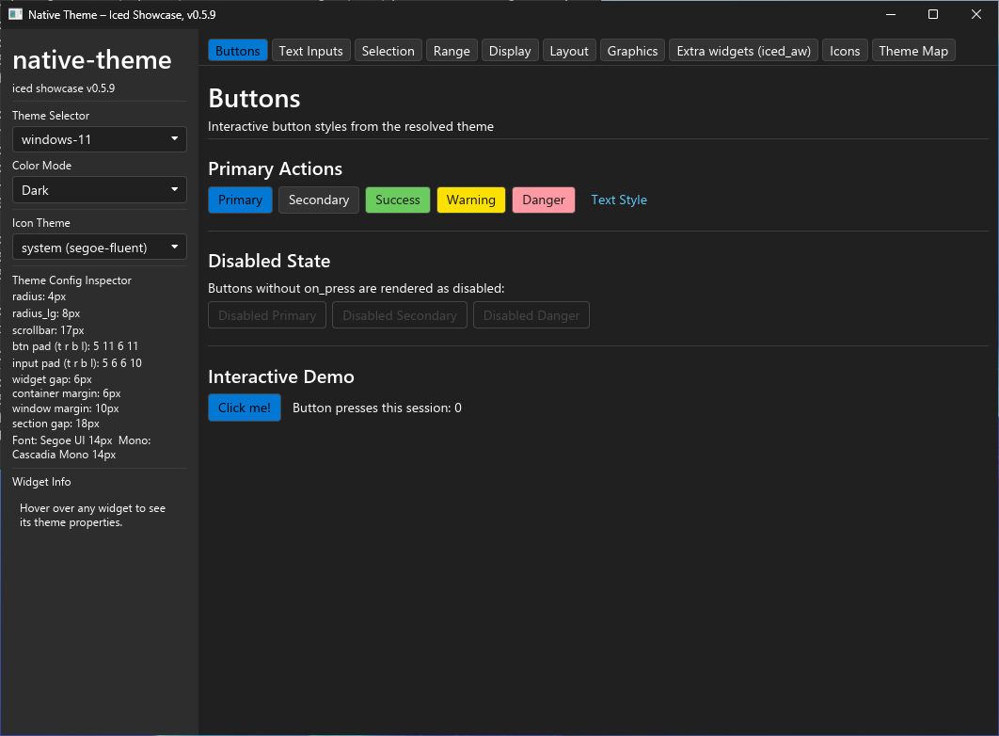

# native-theme-iced

[iced](https://iced.rs/) connector for [`native-theme`](https://crates.io/crates/native-theme).

Compatibility: the versions this connector requires, and the set it has been
verified against, are in [Compatibility](#compatibility).

## What it does

Two layers, and you can stop after the first:

1. **A palette.** A `native_theme::ResolvedTheme` becomes a configured
   `iced::Theme` (Palette + Extended palette), so iced's built-in
   Catalog-driven widget styles pick up the platform's colours with no further
   code.
2. **Per-widget style functions.** iced's palette has six colours, so a widget
   state it has no slot for — a button's pressed fill, an input's focus border,
   a switch's track — is a value iced invents. `styles::*` hands each widget
   the resolved theme's own field instead. See [Styles](#styles).

Plus widget-metric helpers (`button_padding`, `border_radius`, `font_size`, …)
for the sizing iced applies per widget rather than through the Catalog.

## How it fits

Depend on this crate — it pulls `native-theme` in transitively. The
workspace-level README at the repo root has a diagram showing where each
crate sits.

Unlike the GPUI connector, iced applies geometry (padding, sizes, spacing)
via inline widget configuration, so the theme and the style functions carry
**colours, borders and radii**, and the metric helpers read the rest off a
`&ResolvedTheme` for you to pass into your widget builders.

## Compatibility

**Required** — the floors this crate's own `Cargo.toml` states:

| Crate | Required |
|---|---|
| `iced_core` | 0.14 |
| `iced_widget` (feature `widgets`, on by default) | 0.14 |
| `iced_aw` (feature `iced_aw`, off by default) | 0.14 |
| `iced` (dev-dependency: the showcase) | 0.14 |
| `rust-version` | 1.88.0 |

Each is a floor and nothing more, and deliberately not an open-ended range: a
*patch* release of an upstream crate has broken a connector in this repository
before, when gpui-component 0.6.2 removed a theme field the published
native-theme-gpui 0.5.8 wrote and 0.5.8 stopped compiling.

**Verified** — the versions `scripts/compat-check.sh run` last resolved and ran
this connector's tests, in all three feature configurations, clippy, docs and
the widget-coverage script against. The script writes the line; a hand-edited
one fails a test:

<!-- compat:begin -->
Verified against iced 0.14.0, iced_aw 0.14.1, iced_core 0.14.0, iced_test 0.14.0 and iced_widget 0.14.2 on 2026-09-21.
<!-- compat:end -->

**After that** — newer releases are tested nightly by the dependency canary
(`.github/workflows/dependency-canary.yml`), and a break it finds is recorded in
the CHANGELOG.

## Quick start

Add both crates to your `Cargo.toml`:

```toml
[dependencies]
native-theme = "0.5"
native-theme-iced = "0.5"
```

Load a bundled preset:

```rust,ignore
use native_theme_iced::from_preset;

let (theme, resolved) = from_preset("dracula", true)?;
// `theme` is the iced Theme; `resolved` has metric fields for widget sizing.
//                          ^ is_dark
```

Or read the OS theme at runtime:

```rust,ignore
use native_theme_iced::from_system;

let (theme, resolved, is_dark, accessibility) = from_system()?;
```

## Core concepts

- **`from_preset(name, is_dark)`** — load a bundled preset. `is_dark` is explicit because some presets (`solarized`, `gruvbox`) have ambiguous lightness.
- **`from_system()`** — read the OS theme. Returns `(theme, resolved, is_dark, accessibility)`: the third value tells you which variant the OS is currently using, the fourth carries the user's accessibility preferences (see [Text scaling](#text-scaling)).
- **`to_theme(&resolved, "App Name")`** — the underlying mapping function if you already have a `ResolvedTheme` from somewhere else.
- **`styles::*`** — one function per widget, each returning a closure for that widget's style setter. See [Styles](#styles).
- **Metric helpers** — free functions that read geometry off `&ResolvedTheme` for use with iced's inline widget configuration.

## Styles

The palette alone makes an iced application *resemble* the platform. The style
functions make each widget state *equal* to it: every colour, border and
radius they emit is a field of the resolved theme, and a `Style` field the
native model does not carry is read from iced's own default at run time —
never written as a literal.

```rust,ignore
use native_theme_iced::styles;

button("Save").style(styles::button_primary(&resolved))
```

Each function takes a `&ResolvedTheme`, captures what it needs by value, and
returns a `'static + Clone` closure, so you can call it per widget in `view`
and it follows a theme change on the next frame.

iced's style setters do not all take the same closure, so the functions come
in four shapes. Each one's doc comment names the setter it is passed to and
the iced default it replaces:

| Shape | Closure | Functions | Passed to |
|---|---|---|---|
| with a status | `Fn(&Theme, Status) -> Style` | `button`, `button_primary`, `button_danger`, `button_success`, `button_warning`, `button_link`, `text_input`, `text_editor`, `checkbox`, `radio`, `toggler`, `pick_list`, `scrollable`, `slider` | `.style(..)` — `slider` also serves `vertical_slider`; `text_input` also serves `ComboBox::input_style(..)` |
| without a status | `Fn(&Theme) -> Style` | `container_card`, `progress_bar`, `rule`, `tooltip` | `.style(..)` |
| menu | `Fn(&Theme) -> menu::Style` | `menu` | `.menu_style(..)` on `PickList` and `ComboBox` |
| a value | `scrollable::Scrollbar` | `scrollbar` | `.direction(Direction::Vertical(..))` — widths, and an embedded bar where the platform does not overlay its scrollbars |

Some native geometry has a builder receiver rather than a `Style` field; pass
it where you construct the widget:

```rust,ignore
checkbox(checked)
    .size(resolved.checkbox.indicator_width)
    .spacing(resolved.checkbox.label_gap)
    .style(styles::checkbox(&resolved));
toggler(on)
    .size(resolved.switch.track_height)
    .style(styles::toggler(&resolved));
progress_bar(0.0..=1.0, value)
    .girth(resolved.progress_bar.track_height)
    .style(styles::progress_bar(&resolved));
rule::horizontal(resolved.separator.line_width).style(styles::rule(&resolved));
```

### `iced_aw`

native-theme models a card, a menu, a tab bar, a sidebar, a spinner and a
selection list; iced itself has none of them. With the `iced_aw` feature,
`styles::aw` covers the [`iced_aw`](https://crates.io/crates/iced_aw) widgets
that do: `card`, `menu` (for `MenuBar`), `tab_bar` (also `Tabs`'
`tab_bar_style`), `sidebar`, `selection_list` and `spinner`. `iced_aw`'s
`Spinner` has no style of its own and paints with the inherited text colour,
so `spinner` styles a wrapping container:

```rust,ignore
container(Spinner::new()).style(styles::aw::spinner(&resolved))
```

### Features

| You want | You write |
|---|---|
| everything iced itself offers (the default) | nothing |
| the `iced_aw` widgets too | `features = ["iced_aw"]` |
| the palette only, no `iced_widget` | `default-features = false` |
| the palette plus icons, no `iced_widget` | `default-features = false, features = ["lucide-icons"]` |

`widgets` (default) enables `styles`; `iced_aw` (opt-in, implies `widgets`)
enables `styles::aw`. It is off by default because `iced_aw` is a third-party
crate with its own release cadence and an embedded icon font. The icon
features — `material-icons`, `lucide-icons`, `system-icons`, `svg-rasterize`
— are on by default. Every feature adds coverage; `default-features = false`
is the way to narrow.

## Common recipes

### Use widget-metric helpers

```rust,ignore
use native_theme_iced::{button_padding, border_radius, font_family};

// in your view:
let padding = button_padding(&resolved);
let radius  = border_radius(&resolved);
// Apply with .padding(padding), .border(...) on your widget builders.
```

Full helper list: `button_padding`, `input_padding`, `border_radius`,
`border_radius_lg`, `scrollbar_width`, `font_family`, `font_size`,
`font_weight`, `mono_font_family`, `mono_font_size`, `mono_font_weight`,
`line_height_multiplier`, plus `to_iced_weight(css_weight)` for converting
CSS weight values to iced's `Weight` enum.

### Text scaling

`font_size` and `mono_font_size` take the user's accessibility preferences and
apply the OS text-scaling factor (a factor that is not finite and positive is
ignored):

```rust,ignore
use native_theme_iced::{font_size, from_system};

let (theme, resolved, _is_dark, accessibility) = from_system()?;
let size = font_size(&resolved, &accessibility);
```

With a preset there is no OS reading; pass
`&native_theme_iced::AccessibilityPreferences::default()`, which scales by 1.
The other two preferences, reduced transparency and reduced motion, have no
receiver in iced's theme; read them from `AccessibilityPreferences` where your
application draws translucent surfaces or animates.

### Apply user overrides to the OS theme

```rust,ignore
use native_theme::{SystemTheme, theme::Theme};
use native_theme_iced::to_theme;

let sys = SystemTheme::from_system()?;
let overlay = Theme::from_toml(r##"[light.defaults]
accent_color = "#ff6600"
"##)?;
let customised = sys.with_overlay(&overlay)?;
let theme = to_theme(customised.pick(customised.mode), "My App");
```

### Custom icons

For app-specific icons generated via [`native-theme-build`](https://crates.io/crates/native-theme-build):

```rust,ignore
use native_theme_iced::icons::{custom_icon_to_image_handle, custom_icon_to_svg_handle};
use native_theme::theme::IconSet;

let image = custom_icon_to_image_handle(&AppIcon::PlayPause, IconSet::Material);
let svg   = custom_icon_to_svg_handle(&AppIcon::PlayPause, IconSet::Material, None);
```

### Animated spinners

```rust,ignore
use native_theme::theme::AnimatedIcon;
use native_theme::icons::MaterialLoader;
use native_theme::detect::prefers_reduced_motion;
use native_theme_iced::icons::{animated_frames_to_svg_handles, spin_rotation_radians};

if let Some(anim) = MaterialLoader::load_indicator() {
    if prefers_reduced_motion() {
        let _static_fallback = anim.first_frame();
    } else {
        match &anim {
            AnimatedIcon::Frames(_) => {
                // Cache this — do not call on every frame tick.
                if let Some(h) = animated_frames_to_svg_handles(&anim, None) {
                    // Use iced::time::every(Duration::from_millis(h.frame_duration_ms as u64))
                    // to drive: frame_index = (frame_index + 1) % h.handles.len();
                    // In view: Svg::new(h.handles[frame_index].clone())
                }
            }
            AnimatedIcon::Transform(_) => {
                let _angle = spin_rotation_radians(elapsed, 1000);
                // Svg::new(handle).rotation(Rotation::Floating(angle))
            }
            _ => {}
        }
    }
}
```

Use `Rotation::Floating` (not `Rotation::Solid`) for spin animations so
the widget's layout box stays constant during rotation.

## Modules

| Module | Purpose |
|--------|---------|
| `palette` | Maps native-theme colors to iced's 6-field Palette |
| `styles` | Per-widget style functions (feature `widgets`, default); `styles::aw` for `iced_aw` (feature `iced_aw`) |
| `extended` | (internal) Overrides nine slots of iced's Extended palette: `background.base.text`, `background.weak.color`, `background.weak.text`, `secondary.base`, `secondary.strong`, and the `.base.text` of `primary`, `success`, `danger` and `warning`. `apply_overrides`' own doc comment says where each one comes from |
| `icons` | Icon role mapping, SVG widget helpers, and animated icon playback |

## Showcase

```sh
cargo run -p native-theme-iced --example showcase-iced
```

Displays every widget iced has, each styled through `styles::*`, with live
theme switching, a colour map, and an inspector that says which native field
every part of a widget comes from — and which parts iced still decides. Add
`--features iced_aw` for the tab with the `iced_aw` widgets:

```sh
cargo run -p native-theme-iced --example showcase-iced --features iced_aw
```

A script keeps "every widget" true: `scripts/check-widget-coverage.py` fails
when an iced (or `iced_aw`) widget is neither shown nor listed, with a reason,
in `docs/showcase-exceptions.toml`.

## Gallery

### Linux








### macOS




### Windows




## Links

- [API reference on docs.rs](https://docs.rs/native-theme-iced)
- [Showcase source](examples/showcase-iced.rs)
- [CHANGELOG](https://github.com/tiborgats/native-theme/blob/main/CHANGELOG.md)

## License

Licensed under any of

- [Apache License, Version 2.0](http://www.apache.org/licenses/LICENSE-2.0)
- [MIT License](http://opensource.org/licenses/MIT)
- [0BSD License](https://opensource.org/license/0bsd)

at your option.
