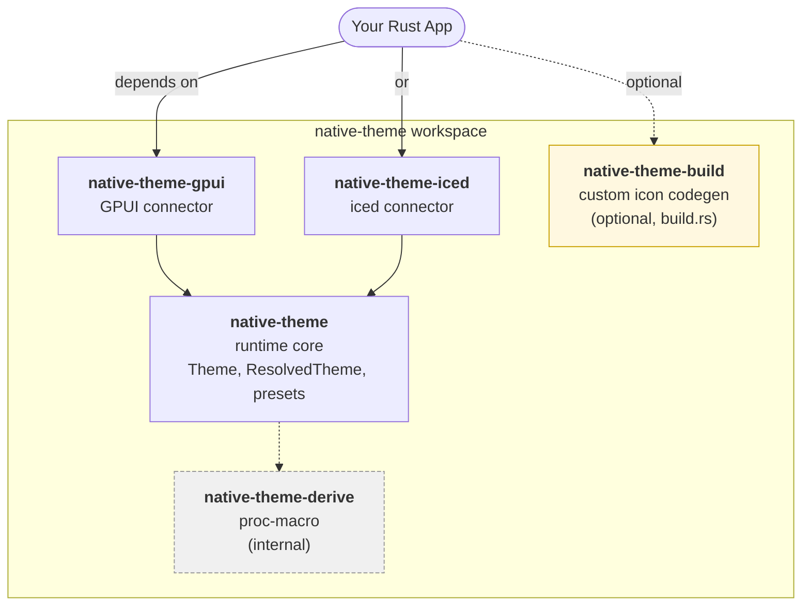

# Design — v0.5.7 Pre-Release Documentation Overhaul

**Status:** approved (2026-04-20), ready for implementation plan
**Trigger:** user wants all project documentation synchronized with v0.5.7 code and optimized for newcomer onboarding before the GitHub release
**Scope:** all 5 crates + workspace-level docs + examples + diagrams

---

## 1. Goals and success criteria

**Primary goals (in priority order):**

1. **Accuracy** — every type name, API signature, and example in the docs matches the v0.5.7 code. No stale references to renamed types (`ThemeSpec`, `ThemeVariant`, `ResolvedThemeVariant`, `ResolvedThemeDefaults`, the old generic `IconLoader` builder).
2. **Onboarding speed** — a newcomer who lands on the root README reaches a running example within 5 minutes.
3. **No ambiguity / no contradictions** — each term has one definition; crates don't disagree with each other.
4. **Compact** — "beginner-friendly" ≠ "bloated". Reference material stays in rustdoc (docs.rs); READMEs stay concise.

**Audience:** Rust-competent developers who are new to `native-theme`. Rust idioms (`Result`, `Option`, generics, `Cow`, `Arc`) are assumed. Domain concepts (theme resolution, inheritance, presets, connectors) are explained.

**Out of scope:**
- Migration guides or upgrade documents (pre-1.0 policy — no backward-compatibility promises)
- Top-level `examples/` directory (multi-crate workspace; connector-specific examples already exist)
- Rewriting already-good inline `///` docs; only a focused accuracy pass for stale names
- API additions or code changes (pure documentation work)

---

## 2. Documentation deliverables

### 2.1 Root `README.md` (hero / navigation hub)

Structure:

1. **Hero** — 1–2 sentence hook describing what the project is and who it's for.
2. **Crate-relations diagram** — embedded SVG showing the 5 crates and how an app depends on them.
3. **Pick your path** — 3-row table: "If you use GPUI → use `native-theme-gpui`"; "If you use iced → use `native-theme-iced`"; "Building your own framework connector → depend on `native-theme` directly".
4. **Core concepts in 60 seconds** — `Theme`, `ResolvedTheme`, preset, connector. One sentence each.
5. **Examples** — direct links to `connectors/native-theme-gpui/examples/showcase-gpui.rs` and `connectors/native-theme-iced/examples/showcase-iced.rs`.
6. **Project docs** — links to `CHANGELOG.md`, `CONTRIBUTING.md`, `SECURITY.md`, `ROADMAP.md`.
7. **License** — brief.

### 2.2 Per-crate READMEs (4 of them)

Applies to: `native-theme`, `native-theme-build`, `connectors/native-theme-gpui`, `connectors/native-theme-iced`.

Identical 6-section template (Option 2 from brainstorming):

1. **What it does** — 1–2 sentences.
2. **How it fits** — embed the same workspace diagram (via `` pointing to `docs/assets/crate-relations.svg` through a GitHub raw URL so it renders on GitHub, crates.io, and docs.rs identically) with a 1-line caption.
3. **Quick start** — 5–10 lines of compiling code.
4. **Core concepts** — only the 2–4 terms a reader of *this* crate must know.
5. **Common recipes** — 2–3 snippets for the 80% case.
6. **Links** — docs.rs, examples, CHANGELOG.

### 2.3 `native-theme-derive/README.md`

Stays minimal. Sharpens the line "implementation detail of `native-theme`; do not depend on this crate directly". No 6-section template here — expanding it would mislead users into importing it.

### 2.4 Inline Rust docs (`//!` crate-level and `///` per-item)

**`native-theme/src/lib.rs`** — keep `#[doc = include_str!("../README.md")]`. The SVG renders on docs.rs via `` tag, so no divergence is needed between README and crate-level docs.

**Other crate `lib.rs` files** — verify existing `//!` is accurate against current type names; trim if bloated; keep the existing quick-start example if present.

**Per-item `///` docs** — focused accuracy pass only:
- Grep for stale type references: `ThemeSpec`, `ThemeVariant`, `ResolvedThemeVariant`, `ResolvedThemeDefaults`, old `IconLoader` builder usage
- Update only what's stale; leave already-correct docs alone
- Flag any contradictions between docs and code; fix or report

### 2.5 `CHANGELOG.md`

- Leave the `[0.5.7] - Unreleased` marker in place; the user sets the release date when tagging (this doc pass does NOT touch the date)
- Verify all entries are accurate against git history since v0.5.6; add any missing entries for commits landed since the changelog was last updated
- No dedicated migration section (pre-1.0 policy)

### 2.6 `CONTRIBUTING.md` (expansion)

Expand current 73 lines to cover:

- Dev environment setup (already partially there)
- Running tests (`cargo test --workspace`)
- Running `./pre-release-check.sh` before committing (panic detection, fmt, clippy, cargo package)
- Commit message conventions (derived from existing `git log` patterns: `fix(scope):`, `feat(scope):`, `docs(scope):`)
- PR workflow (fork, branch, PR, review)
- Where decisions live (`docs/platform-facts.md`, `docs/property-registry.toml`, `docs/inheritance-rules.toml`)

### 2.7 `SECURITY.md` (expansion)

Expand current 25 lines to cover:

- **Supported versions** — only latest (pre-1.0 policy)
- **How to report** — GitHub Private Vulnerability Reporting at `https://github.com/tiborgats/native-theme/security/advisories/new` (not email)
- **Response SLA** — best-effort for pre-1.0; no hard commitments

### 2.8 `ROADMAP.md` (new file)

Brief, extracted from existing `docs/todo_v0.6.0_iced-full-theme-geometry.md` and `docs/todo_v0.6.1_gpui-full-theme.md`:

- **v0.6.0** — iced full theme geometry (summary of what's planned)
- **v0.6.1** — GPUI full theme (summary)
- **Beyond 0.6** — if anything exists in todo docs
- Link to `docs/archive/` for completed phases

### 2.9 Showcase example comments

For `connectors/native-theme-gpui/examples/showcase-gpui.rs` (254 KB) and `connectors/native-theme-iced/examples/showcase-iced.rs` (109 KB):

- Add top-of-file comment: what this demonstrates, how to run it, what the user should look for
- Add 2–3 line section headers before each major block (widget category, theme-switcher, preset selector, etc.)
- No logic changes

---

## 3. Diagram design

### 3.1 Primary diagram — workspace crate relations

**Source:** `docs/assets/crate-relations.mmd` (Mermaid)
**Generated:** `docs/assets/crate-relations.svg`
**Referenced from:** root `README.md`, and via `include_str!` also appears in `native-theme/src/lib.rs` crate-level docs.

Mermaid source (draft — final form during implementation):

**Legend rendered in README below diagram:**
- Solid arrow = runtime dependency
- Dashed arrow = optional or internal
- Yellow node = optional build-time dependency
- Grey dashed node = library-internal (never import directly)

### 3.2 Secondary diagram (held in reserve)

A "Theme → resolve(mode) → ResolvedTheme → render" data-flow diagram. Written only if the Core Concepts section of the main `native-theme` README reads unclear without it. Default position: skip to stay lean.

### 3.3 Rendering pipeline

- `.mmd` source and `.svg` output are both committed to `docs/assets/`
- `scripts/render-diagrams.sh` regenerates SVGs from Mermaid source via `mmdc` (from `@mermaid-js/mermaid-cli`; prerequisite documented in `CONTRIBUTING.md`)
- `.gitattributes` marks `*.svg` as binary so PR diffs focus on the `.mmd` source
- No CI wiring — developer runs the script manually after editing a diagram

---

## 4. Execution approach

**Option C** from brainstorming: pilot + batch.

### 4.1 Pilot (user reviews before batch proceeds)

1. Install `mmdc` setup; write `scripts/render-diagrams.sh`; add `.gitattributes` entry for `*.svg`
2. Author `docs/assets/crate-relations.mmd`; render `docs/assets/crate-relations.svg`
3. Rewrite root `README.md` using Section 2.1 hero template
4. Rewrite `native-theme/README.md` using Section 2.2 template
5. Focused `///` accuracy pass on `native-theme` crate (grep for stale names, update only what's actually stale)
6. Verify `CHANGELOG.md` [0.5.7] entries are accurate and complete against git history since v0.5.6; add any missing entries. Leave the "Unreleased" marker in place — do NOT set a release date autonomously
7. Run `./pre-release-check.sh` — must pass
8. **Stop and request user review.** Atomic commit per deliverable so user can revert any single change surgically.

### 4.2 Batch (proceeds after user approves pilot style)

9. `native-theme-build/README.md` + accuracy pass on its inline docs
10. `native-theme-derive/README.md` (minimal sharpening)
11. `native-theme-gpui/README.md` + accuracy pass
12. `native-theme-iced/README.md` + accuracy pass
13. `CONTRIBUTING.md` expansion
14. `SECURITY.md` expansion (with GitHub PVR link)
15. `ROADMAP.md` creation
16. Showcase example comments (`showcase-gpui.rs`, `showcase-iced.rs`)
17. Final verification: full `./pre-release-check.sh`, diff review, list any residual gaps

---

## 5. Safety rails

- **No invented content.** Every documented value (spacing, color, font size, OS constant) is cited to `docs/platform-facts.md` + `docs/property-registry.toml` file:line, per project convention.
- **Every code snippet is verified to compile.** Either copied from existing tests, extracted from the showcase examples, or covered by a rustdoc doctest. No free-hand examples.
- **Atomic commits per deliverable.** One doc file update = one commit, with conventional-commit prefix (`docs(scope):`).
- **No `Co-Authored-By` trailers** on any commit (user preference).
- **No tag push, no release, no publish without explicit user approval.** Pilot stop + batch stop are hard checkpoints; CHANGELOG "Unreleased" stays "Unreleased" until user explicitly tags.
- **`./pre-release-check.sh` is the gate.** Runs before pilot review and before final batch completion.

---

## 6. Open items tracked to implementation

- Exact "Pick your path" table content in root README (depends on reading each connector README)
- Whether secondary data-flow diagram earns its place (decided during main-crate README draft)
- Exact `CONTRIBUTING.md` commit-convention list (derived from `git log` during pilot)
- Showcase example section-header granularity (adjust to match existing structural breakpoints in those files)

None of these affect the design — they're scoped work for the implementation plan.

---

## 7. Non-goals

- No new Rust API work
- No test additions beyond rustdoc doctests that fall out of updated examples
- No refactoring of source code (even if a doc pass surfaces smells; those get logged, not fixed)
- No design-system or theming-content changes (e.g., no new presets, no changed inheritance rules)
- No GitHub Actions / CI changes
