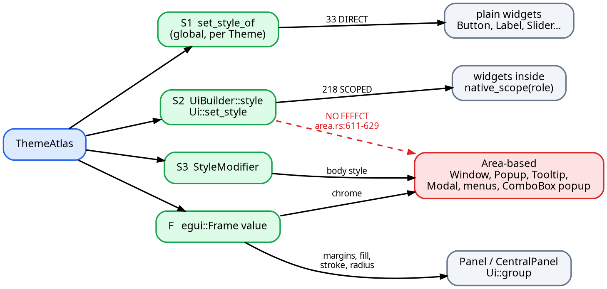

# v0.6.0 — egui Connector: Specification

Status: Pending
Crate: `connectors/native-theme-egui`
Target toolkit: **egui 0.36.1**

---

## 0 -- Scope

This document specifies `native-theme-egui`, the third toolkit connector in this
workspace, alongside `connectors/native-theme-iced` and
`connectors/native-theme-gpui`. It is the WHAT and the HOW: an implementer
should need no further design input. The companion rationale document —
[`todo_v0.6.0_egui-connector-rationale.md`](todo_v0.6.0_egui-connector-rationale.md)
— records WHY each decision was taken and which alternatives were rejected.

**Target version: egui 0.36.1** — the latest release at the time of writing
(`egui/Cargo.toml:16`). Every `egui/…`, `epaint/…`, `ecolor/…` and `emath/…`
path in this document is relative to that crate's own root and carries 0.36.1
line numbers. egui 0.35.0 is cited **only** as churn evidence — in §12.3, in
§14.2 and in §16 Q-3 — and is never a target. Every `native-theme/…`, `docs/…`
and `connectors/…` path is relative to this repository's root.

The version is pinned to one egui minor because the application's
`egui::Style` must be *our* `egui::Style`: cargo cannot unify two
semver-incompatible egui versions, and two copies in one dependency graph
produce `expected egui::Style, found egui::Style`. §12 states the policy.

### 0.1 What this crate is

> `native-theme-egui` gives an egui application an excellent global theme out
> of the box and opt-in per-widget geometry: egui 0.36.1's `Style` has an
> interaction-state axis and provably no widget-type axis, so the 33 DIRECT
> fields reach every widget automatically and the 218 SCOPED fields reach the
> screen only where the application asks for them.

That sentence is the crate's headline claim, verbatim, in the README's first
paragraph and in the crate-level rustdoc. The phrase "full theme geometry"
must **not** appear as a claim about what this crate delivers against egui
0.36.1. It appears only in §14.2, naming the upstream change that would make
it true.

### 0.2 What this crate is not

It ships no `egui::Widget`, no image decoder, no font database, no system-font
discovery and no fork of any egui type. §14 is the complete list of what is
lost and why.

---

## 1 -- Problem statement

### 1.1 The two sides, measured

`native_theme::theme::ResolvedTheme` (`native-theme/src/model/resolved.rs:155`)
has `defaults`, `text_scale` and **25 per-widget structs**
(`resolved.rs:163-211`). Expanded to leaf scalars — with the nested
`ResolvedFontSpec` (5 leaves, `native-theme/src/model/font.rs:239-251`) and
`ResolvedBorderSpec` (8 leaves, `native-theme/src/model/border.rs:94-111`)
flattened — that is **459 leaves**. Adding the four fields of `LayoutTheme`
(`native-theme/src/model/widgets/mod.rs:884-901`) gives the **463** leaves this
document accounts for, one row each, in §5.

`egui::Style` (`egui/src/style.rs:243`) has 17 fields in a debug build and 16
in a release build — `Style::debug` is `#[cfg(debug_assertions)]`
(`style.rs:322-323`). All widget appearance flows through
`Visuals::widgets: Widgets` (`style.rs:1029`, struct `:1249`), which has
exactly five entries — `noninteractive` `:1254`, `inactive` `:1257`, `hovered`
`:1262`, `active` `:1265`, `open` `:1268` — each a `WidgetVisuals`
(`style.rs:1289`) with exactly **six** fields: `bg_fill` `:1294`,
`weak_bg_fill` `:1299`, `bg_stroke` `:1304`, `corner_radius` `:1307`,
`fg_stroke` `:1310`, `expansion` `:1318`.

### 1.2 The central asymmetry

`Widgets` is indexed by **interaction state**. It has **no widget-type axis**.
A `Button` and a `TextEdit` in the same `Ui` therefore cannot have different
corner radii through theme data: both resolve to the same
`Visuals.widgets.<state>.corner_radius` — `widget_style.rs:161` for the button,
`widgets/text_edit/builder.rs:727`, `:732`, `:737` for the text edit.

The seam that might have supplied a widget-type axis does not. `egui::widget_style`
(`egui/src/widget_style.rs`, `pub mod` at `egui/src/lib.rs:426`) defines
`WidgetStyle`, `ButtonStyle`, `CheckboxStyle`, `LabelStyle`, `SeparatorStyle`,
`Classes`, `HasClasses` and `WidgetState`, and it is consumed by
`widgets/button.rs:331`, `widgets/checkbox.rs:83` and `widgets/separator.rs:109`.
But `Style::widget_style` (`widget_style.rs:120`), `button_style` (`:146`),
`checkbox_style` (`:174`), `label_style` (`:194`) and `separator_style` (`:212`)
are **inherent methods on `Style`**. There is no trait, no `dyn StyleEngine`,
no registration hook. `widget_style` and `separator_style` ignore their
`_classes` argument outright (`:120`, `:212`); only `button_style` reads one,
the single hardcoded `SELECTED_CLASS` (`:150`, declared `:225`). And
`separator_style` hardcodes `spacing: 6.0` (`:215`).

`WidgetState` has **four** variants, not five — `Noninteractive`, `Inactive`,
`Hovered`, `Active` (`widget_style.rs:84-90`). `Widgets::state` (`:94-99`) and
`Widgets::style` (`style.rs:1272-1281`) can never return `open`; its only
readers are direct field reads at `containers/window.rs:1427`,
`containers/combo_box.rs:371` and `:450`, `widgets/color_picker.rs:117`, plus
`menu_style`'s write at `containers/menu.rs:25` and `containers/menu.rs:383`.

### 1.3 The contested-field evidence

A field is **contested** when two or more native-theme leaves need different
values in it simultaneously. The full list is §5.11; these are the sharpest:

| egui field | decl | claimants |
|---|---:|---:|
| `Style.text_styles[*].family` | `epaint/src/text/fonts.rs:32` | 21 |
| `Style.visuals.widgets.<state>.bg_stroke` | `style.rs:1304` | 19 |
| `Style.spacing.interact_size.y` | `style.rs:408` | 13 |
| `Style.visuals.selection.bg_fill` | `style.rs:1195` | 11 |
| `Style.visuals.widgets.<state>.corner_radius` | `style.rs:1307` | 11 |
| `Style.visuals.widgets.inactive.fg_stroke.color` | `style.rs:1310` | 10 |
| `Style.visuals.widgets.hovered.weak_bg_fill` | `style.rs:1299` | 8 |
| `Style.visuals.disabled_alpha` | `style.rs:1125` | 8 |
| `Style.visuals.panel_fill` | `style.rs:1071` | 5 |

`interact_size.y` alone must simultaneously serve `button.min_height`,
`combo_box.min_height`, `menu.row_height`, `tab.min_height`, `list.row_height`,
`expander.header_height`, `toolbar.bar_height`,
`segmented_control.segment_height`, `switch.track_height`,
`slider.thumb_diameter` (through the inversion of §6.6),
`progress_bar.track_height`, `spinner.diameter` and `spinner.min_diameter`.

A separate egui behaviour compounds it: `Checkbox` and `RadioButton` derive
their *whole* minimum size from that one number through
`Vec2::splat(interact_size.y)` (`widgets/checkbox.rs:85-86`,
`widgets/radio_button.rs:54-55`), so writing it also sets a width floor. It is
**not** the sink for `checkbox.indicator_width`, which is `Spacing::icon_width`
(`widget_style.rs:179`, §5.8 item 7).

`Style.visuals.widgets.<state>.corner_radius` is claimed by
`defaults.border.corner_radius`, `switch.track_radius` and the
`border.corner_radius` of `button`, `checkbox`, `segmented_control`, `input`,
`combo_box`, `list`, `card`, `tab` and `expander`. The other nine widget radii
reach `visuals.window_corner_radius`, `visuals.menu_corner_radius` or an
`egui::Frame` instead, or nothing at all (§5.11).

### 1.4 What "full theme geometry" can mean for egui 0.36.1

Three distinct meanings, only two of which are reachable:

1. **Every mappable leaf reaches *some* egui object.** Reachable. This is what
   the crate delivers: 33 leaves on the global `Style`, 218 inside per-role
   `Arc<Style>` values and per-surface `egui::Frame` values, 62 through a
   documented formula, and the remaining 150 either exposed as a plain
   accessor or honestly reported as lost.
2. **Every mappable leaf renders correctly without application cooperation.**
   **Not** reachable in 0.36.1. There is no hook that could make it so — see
   §1.2 and §14 item 1. An application that calls `install()` and nothing else
   gets the 33 DIRECT leaves plus one elected winner per contested field.
3. **Every leaf renders correctly.** Not reachable in any egui version today:
   150 leaves have no expression at all, of which some are native-theme-side
   holes rather than egui limits (§5.7, §14).

The crate therefore promises (1), documents that (2) is opt-in and where, and
enumerates (3)'s losses in §14 with the upstream change that would close each.

### 1.5 A second, deeper reach problem

`Area::Prepared::content_ui` builds its `Ui` with a bare `UiBuilder::new()`
(`containers/area.rs:611-629`) — no `.style(..)`. `Ui::new` then falls back to
`ctx.global_style()` (`ui.rs:135`). Everything built on `Area` — `Window`,
`Popup`, `Tooltip`, `Modal`, menus, `ComboBox` popups — reads the **Context**
style and ignores the calling `Ui`'s style entirely. Wrapping a scope around a
`Window::show` has zero effect on that window's frame.

The advice "wrap it in a scope" is therefore false for exactly the containers
where a distinct look is most expected. §3.3 states which seam does reach them.

---

## 2 -- Verdict vocabulary

Used in every mapping row in §5, defined once here.

| Verdict | Exact meaning |
|---|---|
| **DIRECT** | One write to the global `egui::Style` renders the value correctly, and either no other native leaf claims that field or this leaf is its nominated **base owner** (§5.9). Nothing else is required. |
| **SCOPED** | The value is expressible, but its egui field is claimed by another native leaf, so it can only be carried inside a per-role `Arc<Style>` or a per-surface `egui::Frame`. Every colliding claimant is named. |
| **DERIVED** | Not 1:1. Either a formula is required (§6), or an input outside `ResolvedTheme` is required (font bytes, a live `Context`). The formula and its boundary behaviour are given. |
| **UNMAPPABLE** | egui 0.36.1 has no object that can carry the value. Sub-tagged `egui-limited` (no field or API exists; a citation shows the value hardcoded or absent), `source-void` (the *native* leaf carries no information — a structural constant, not a theme value), or `source-side gap` (the native leaf carries a real value, but `ResolvedTheme` lacks the companion data egui requires to use it — `shadow_enabled` with no offset, blur or spread, §14 item 10). Exactly three rows use the third tag: `sidebar`, `toolbar` and `status_bar` `.border.shadow_enabled` (§5.6). |

Two conventions that keep the tables honest:

* **The verdict column records what egui 0.36.1 *can* express, not what this
  crate chooses to do.** Where a locked decision declines an expressible sink
  — the focus ring is the main case — the row says so and §5.8 lists every
  such override with its leaf count.
* **A contested field's elected winner is still marked SCOPED where the
  matrix that analysed it marked it SCOPED.** Marking the winner DIRECT would
  hide the contest, and the contest is the whole architectural argument.

Two facts constrain every row and are stated once:

* **Lengths.** `ResolvedTheme` lengths are logical pixels
  (`docs/platform-facts.md:883-894`). egui `Style` lengths are logical points
  and are **not** scaled by `pixels_per_point` or `zoom_factor`: egui applies
  DPI to the input rect (`context.rs:444-446`, `:454`) and again at
  tessellation (`:2851-2860`), exactly once, and nothing in `egui/src/style.rs`
  reads it. **The connector must never pre-scale anything.** One logical pixel
  becomes one point, verbatim.
* **Light versus dark geometry.** `Theme::default_style()` is
  `Style { visuals: self.default_visuals(), ..Default::default() }`
  (`egui/src/memory/theme.rs:24-29`), so egui's light and dark styles differ
  **only** in `visuals`. Every non-`visuals` value in this document is computed
  once and installed into both.

---

## 3 -- Architecture

### 3.1 The layer model

```text
  ┌──────────────────────────────────────────────────────────────────────┐
  │ native_theme                                                         │
  │   SystemTheme / Theme  ──resolve()+validate()──▶  ResolvedTheme × 2   │
  │                                                    (light, dark)     │
  └───────────────────────────────┬──────────────────────────────────────┘
                                  │ &ResolvedTheme, &LayoutTheme,
                                  │ &AccessibilityPreferences, FontPlan
                                  ▼
  ┌──────────────────────────────────────────────────────────────────────┐
  │ native_theme_egui :: COMPILE  (pure, no Context, infallible)         │
  │                                                                      │
  │   convert::*      total f32→u8/i8/Color32/Margin/CornerRadius        │
  │   fonts::*        FontPlan ──▶ egui::FontDefinitions                 │
  │   mapping.toml    463 audited rows: verdict + declared sinks         │
  │                                                                      │
  │              ┌────────────── ThemeAtlas ──────────────┐              │
  │              │  base Style              × 2 themes    │              │
  │              │  Style per (Role, RoleVariant) × 2     │              │
  │              │  Frame per Surface       × 2 themes    │              │
  │              │  2 × ResolvedTheme, notes, prefs       │              │
  │              └────────────────────────────────────────┘              │
  └───────────────────────────────┬──────────────────────────────────────┘
                                  │ install(ctx) / install_with(ctx, opts)
                                  ▼
  ┌──────────────────────────────────────────────────────────────────────┐
  │ egui::Context                                                        │
  │   set_fonts               context.rs:2103   (once, before styles)    │
  │   set_style_of(Dark, ..)  context.rs:2247                            │
  │   set_style_of(Light, ..) context.rs:2247                            │
  │   options_mut             fallback_theme / sync_window_theme         │
  │   data_mut                the atlas itself, for the ext traits       │
  │   register plugin         keeps extra_text_line_spacing current      │
  └───────────────────────────────┬──────────────────────────────────────┘
                                  │
                 ┌────────────────┼──────────────────────┐
                 ▼                ▼                      ▼
        ┌────────────────┐ ┌──────────────┐ ┌───────────────────────────┐
        │ UNSCOPED       │ │ SCOPED       │ │ AREA-BASED CONTAINERS     │
        │ every widget   │ │ ui.native_   │ │ Window / Popup / Tooltip  │
        │ that the app   │ │ scope(role)  │ │ Modal / menus / ComboBox  │
        │ never wraps    │ │ ui.native_   │ │ popups                    │
        │                │ │ set_style    │ │                           │
        │ 33 DIRECT      │ │              │ │ role_modifier(..) +       │
        │ + one elected  │ │ 218 SCOPED   │ │ surface_frame(..) passed  │
        │   winner per   │ │ reachable    │ │ explicitly — a scope      │
        │   contested    │ │ here         │ │ around them does NOTHING  │
        │   field        │ │              │ │ (area.rs:611-629)         │
        └────────────────┘ └──────────────┘ └───────────────────────────┘
```

### 3.2 The three delivery seams, and exactly what each reaches

egui 0.36.1 offers three places a `Style` can be substituted. All three are
used; none is invented.

| # | Seam | API | Reaches |
|---|---|---|---|
| S1 | Global, per colour scheme | `Context::set_style_of(Theme, impl Into<Arc<Style>>)` (`context.rs:2247`) | everything not overridden by S2 or S3 |
| S2 | Child `Ui` | `UiBuilder::style` (`ui_builder.rs:155`, field `:28`) consumed by `Ui::scope_builder` (`ui.rs:2193`) and `Ui::new` (`ui.rs:135`) / `Ui::new_child` (`ui.rs:236`); also `Ui::set_style` (`ui.rs:386`) and `Ui::style_mut` (`ui.rs:379`) | every widget laid out inside that `Ui`, **except** `Area`-based containers |
| S3 | Container-local modifier | `egui::style::StyleModifier` (`style.rs:193`) via `Popup::style` (`containers/popup.rs:417`), `MenuConfig::style` (`containers/menu.rs:107`), `MenuBar::style` (`:241`), `ComboBox::popup_style` (`containers/combo_box.rs:199`) | the whole `Style` inside one popup or menu, including its own frame |

A fourth carrier is not a `Style` at all: an **`egui::Frame` value**, accepted
by `Panel::frame` (`containers/panel.rs:413`), `CentralPanel::frame` (`:1206`),
`Window::frame` (`containers/window.rs:265`), `Window::title_frame` (`:272`),
`Modal::frame` (`containers/modal.rs:53`), `Popup::frame`
(`containers/popup.rs:369`) and `Frame::show` (`containers/frame.rs:404`).
This is the **only** way to theme container margins, because four of egui's
eight `Frame` presets hardcode their inner margin and read no `Style::spacing`.
All eight take a `&Style` and all eight read *something* from it; the column
that matters is the last one:

| preset | decl | inner margin | what it reads from `Style` |
|---|---:|---|---|
| `Frame::group` | `frame.rs:178` | `.inner_margin(6)` `:180` | `widgets.noninteractive` corner radius `:181` and `bg_stroke` `:182` |
| `Frame::side_top_panel` | `:185` | `Margin::symmetric(8, 2)` `:187` | `panel_fill` `:188` |
| `Frame::central_panel` | `:191` | `.inner_margin(8)` `:192` | `panel_fill` `:192` |
| `Frame::window` | `:196` | `style.spacing.window_margin` `:198` | radius `:199`, shadow `:200`, fill `:201`, stroke `:202` |
| `Frame::menu` | `:205` | `style.spacing.menu_margin` `:207` | radius `:208`, shadow `:209`, fill `:210`, stroke `:211` |
| `Frame::popup` | `:214` | `style.spacing.menu_margin` `:216` | radius `:217`, shadow `:218`, fill `:219`, stroke `:220` |
| `Frame::canvas` | `:227` | `.inner_margin(2)` `:229` | `widgets.noninteractive.corner_radius` `:230`, `extreme_bg_color` `:231`, `window_stroke()` `:232` |
| `Frame::dark_canvas` | `:236` | `.inner_margin(2)`, via `canvas` | as `canvas`, then a hardcoded `Color32::from_black_alpha(250)` fill `:237` |

`Frame::menu` and `Frame::popup` read **the same five fields**
(`menu_margin`, `menu_corner_radius`, `popup_shadow`, `window_fill()`,
`window_stroke()`). There is no `menu_fill`, no `popup_fill`, no
`tooltip_fill`, no `menu_stroke`.

### 3.3 The reach graph

If a rendered figure is wanted, copy this block to
`docs/assets/egui-connector-seams.dot` and run `./scripts/render-diagrams.sh`.



### 3.4 Why the per-role styles are pre-built

Every `(Role, RoleVariant, egui::Theme)` cell is compiled once, at
`Builder::build`, into an `Arc<egui::Style>`. Handing one to `UiBuilder::style`
moves the `Arc` — `ui.rs:236` is
`let style = style.unwrap_or_else(|| Arc::clone(&self.style));` — so no `Style`
is copied into the child `Ui`. The caller still pays one refcount bump to
produce the `Arc`. Cells with no `Selected` or `Disabled` data share the
`Normal` `Arc` rather than allocating a duplicate.

`Style` is never built by exhaustive struct literal: `Style::debug` is
`#[cfg(debug_assertions)]` (`style.rs:322-323`), so a literal would fail to
compile in exactly one of the two profiles. Construction always starts from
`egui::Theme::default_style()` (`memory/theme.rs:24-29`) and assigns. **That
construction is the no-hardcoded-values enforcement**: every field the theme
does not supply keeps egui's own value by construction, and every numeric
literal in the mapping code other than the three named in §6.17 is a bug.

---

## 4 -- The complete public API

Every signature below is final and unambiguous. Bodies are elided as
`{ /* … */ }`; trait impls with required methods are written `{ /* … */ }` and
never `{}`, which would be `E0046`.

### 4.1 Crate root — attributes, modules, re-exports

```rust,ignore
//! egui toolkit connector for native-theme.
//!
//! Target: **egui 0.36.1**.

#![warn(missing_docs)]
#![forbid(unsafe_code)]
#![deny(clippy::unwrap_used)]
#![deny(clippy::expect_used)]
#![deny(clippy::indexing_slicing)]
#![deny(clippy::panic)]

pub mod convert;
pub mod fonts;
pub mod icons;

// ---- toolkit and source-crate re-exports -----------------------------------
// Both are re-exported so a downstream `Cargo.toml` cannot introduce a second
// copy of either crate. Two `egui` versions in one graph produce
// "expected `egui::Style`, found `egui::Style`", which is the single most
// common downstream failure with a toolkit connector.
pub use egui;
pub use native_theme;

// ---- convenience re-exports ------------------------------------------------
// RULE: the crate root re-exports no name that also exists at `egui`'s root.
// Three native-theme names are therefore deliberately NOT here:
//   * `native_theme::color::Rgba`     -> `convert::Rgba`   (egui/src/lib.rs:442, opposite colour space)
//   * `native_theme::theme::IconData` -> `icons::IconData` (egui/src/viewport.rs:183)
//   * `native_theme::theme::Theme`    -> reachable as `native_theme::theme::Theme`
//                                        (egui/src/lib.rs:483 already exports `Theme`)
pub use native_theme::error::Error;
pub use native_theme::theme::{
    AnimatedIcon, ColorMode, DialogButtonOrder, IconProvider, IconRole, IconSet, LayoutTheme,
    ResolvedTheme, ThemeMode, TransformAnimation,
};
pub use native_theme::{AccessibilityPreferences, Result, SystemTheme};

#[cfg(target_os = "linux")]
pub use native_theme::detect::LinuxDesktop;
```

There is **no** `EGUI_VERSION` constant. A hand-maintained version string
cannot be checked against the resolved dependency — `egui = "0.36.1"` accepts
any 0.36.x — and would eventually become a lie. The version policy lives in
`Cargo.toml` and in §12.

### 4.2 `ThemeAtlas` — the handle

```rust,ignore
/// A complete egui theme compiled from native-theme data.
///
/// `Arc`-backed: cloning is one atomic increment, exactly like [`egui::Context`].
/// `Send + Sync + 'static`, so it can be built on a watcher thread and published into
/// [`egui::Context::data_mut`] (`egui/src/context.rs:1032`).
///
/// It carries, per `egui::Theme` (Light and Dark):
/// * one base [`egui::Style`],
/// * one [`egui::Style`] per ([`Role`], [`RoleVariant`]),
/// * one [`egui::Frame`] per [`Surface`],
///
/// plus the two [`ResolvedTheme`]s it was built from.
#[derive(Clone)]
pub struct ThemeAtlas(std::sync::Arc<AtlasInner>);

impl std::fmt::Debug for ThemeAtlas {
    fn fmt(&self, f: &mut std::fmt::Formatter<'_>) -> std::fmt::Result { /* … */ }
}

impl ThemeAtlas {
    /// Start building from a light and a dark [`ResolvedTheme`].
    ///
    /// Both are required: egui keeps a separate `Style` per `egui::Theme`
    /// (`egui/src/memory/mod.rs:196`, `:200`). Pass the same value twice if only one exists.
    #[must_use]
    pub fn builder<'a>(
        name: &'a str,
        light: &'a ResolvedTheme,
        dark: &'a ResolvedTheme,
    ) -> Builder<'a>;

    /// An atlas that changes nothing: every style is `egui::Theme::default_style()`
    /// (`egui/src/memory/theme.rs:24-29`) and every frame is egui's own.
    ///
    /// This exists so no application has to branch before *installing, scoping or asking for a
    /// frame*: [`ThemeAtlas::base_style`], [`ThemeAtlas::role_style`],
    /// [`ThemeAtlas::role_style_variant`], [`ThemeAtlas::role_modifier`] and
    /// [`ThemeAtlas::surface_frame`] are total on every atlas, including this one.
    /// [`NativeThemeContextExt::native_theme`] returns this when nothing is installed.
    ///
    /// It does **not** remove every `Option`: the free accessors of §4.7 need a
    /// `&ResolvedTheme`, and [`ThemeAtlas::resolved_for`] returns `None` for a passthrough
    /// atlas. Read it once into a local at the top of the frame body.
    #[must_use]
    pub fn passthrough() -> Self;

    /// Display name. `"egui default"` for [`ThemeAtlas::passthrough`].
    #[must_use]
    pub fn name(&self) -> &str;

    /// The source [`ResolvedTheme`] for a colour mode. `None` only for
    /// [`ThemeAtlas::passthrough`].
    #[must_use]
    pub fn resolved(&self, mode: ColorMode) -> Option<&ResolvedTheme>;

    /// The source [`ResolvedTheme`] for an `egui::Theme`.
    ///
    /// The active-scheme shortcut, so no application writes
    /// `if t == egui::Theme::Dark { ColorMode::Dark } else { ColorMode::Light }`.
    #[must_use]
    pub fn resolved_for(&self, theme: egui::Theme) -> Option<&ResolvedTheme>;

    /// The accessibility preferences supplied at build time, or
    /// `AccessibilityPreferences::default()` (`native-theme/src/lib.rs:242-251`).
    /// Stored and exposed; never applied. See [`text_scaling_factor`].
    #[must_use]
    pub fn accessibility(&self) -> &AccessibilityPreferences;

    /// The colour mode the OS reported, or `None` for preset-built atlases.
    #[must_use]
    pub fn os_mode(&self) -> Option<ColorMode>;

    /// The base style — what an *unscoped* widget gets.
    /// Written by [`ThemeAtlas::install`] with `Context::set_style_of`
    /// (`egui/src/context.rs:2247`).
    #[must_use]
    pub fn base_style(&self, theme: egui::Theme) -> std::sync::Arc<egui::Style>;

    /// The scoped style for one widget role, in its resting appearance.
    /// Equivalent to `role_style_variant(theme, role, RoleVariant::Normal)`.
    #[must_use]
    pub fn role_style(&self, theme: egui::Theme, role: Role) -> std::sync::Arc<egui::Style>;

    /// The scoped style for one widget role in one appearance variant.
    ///
    /// Hand it to `UiBuilder::style` (`egui/src/ui_builder.rs:155`) or `Ui::set_style`
    /// (`egui/src/ui.rs:386`). No `Style` is copied: the `Arc` is *moved* into the child `Ui`
    /// at `egui/src/ui.rs:236`. The caller does pay one refcount bump to produce the `Arc`.
    ///
    /// **This does not reach `Area`-based containers** (`Window`, `Popup`, `Tooltip`,
    /// `Modal`, menus, `ComboBox` popups): `Area::Prepared::content_ui` builds its `Ui` with a
    /// bare `UiBuilder::new()` (`egui/src/containers/area.rs:611-629`), so `Ui::new` falls back
    /// to `ctx.global_style()` (`egui/src/ui.rs:135`). Use [`ThemeAtlas::role_modifier`] there.
    #[must_use]
    pub fn role_style_variant(
        &self,
        theme: egui::Theme,
        role: Role,
        variant: RoleVariant,
    ) -> std::sync::Arc<egui::Style>;

    /// [`ThemeAtlas::role_style_variant`] packaged as an `egui::style::StyleModifier`
    /// (declared at `egui/src/style.rs:193`; **not** re-exported at egui's root —
    /// `egui/src/lib.rs:488` re-exports only
    /// `style::{FontSelection, Spacing, Style, TextStyle, Visuals}`).
    ///
    /// Feed to `Popup::style` (`egui/src/containers/popup.rs:417`), `MenuConfig::style`
    /// (`egui/src/containers/menu.rs:107`), `MenuBar::style` (`:241`) or
    /// `ComboBox::popup_style` (`egui/src/containers/combo_box.rs:199`).
    ///
    /// For menus this is required, not convenient: `menu_style`
    /// (`egui/src/containers/menu.rs:22`) unconditionally overwrites
    /// `spacing.button_padding` (`:23`), **four** `bg_stroke`s — `active` (`:24`), `open`
    /// (`:25`), `hovered` (`:26`), `inactive` (`:28`) — and `widgets.inactive.weak_bg_fill`
    /// (`:27`).
    ///
    /// The modifier replaces the whole `Style`, like `impl From<Style> for StyleModifier`
    /// (`egui/src/style.rs:210-214`). Its closure captures one `Arc<Style>`.
    #[must_use]
    pub fn role_modifier(
        &self,
        theme: egui::Theme,
        role: Role,
        variant: RoleVariant,
    ) -> egui::style::StyleModifier;

    /// The [`egui::Frame`] recipe for one container surface.
    ///
    /// Feed to `Panel::frame` (`egui/src/containers/panel.rs:413`), `CentralPanel::frame`
    /// (`:1206`), `Window::frame` (`egui/src/containers/window.rs:265`), `Window::title_frame`
    /// (`:272`), `Modal::frame` (`egui/src/containers/modal.rs:53`), `Popup::frame`
    /// (`egui/src/containers/popup.rs:369`) or `Frame::show`
    /// (`egui/src/containers/frame.rs:404`).
    ///
    /// This is the **only** way to theme container margins: `Frame::group` hardcodes
    /// `.inner_margin(6)` (`egui/src/containers/frame.rs:180`), `Frame::side_top_panel`
    /// `Margin::symmetric(8, 2)` (`:187`), `Frame::central_panel` `.inner_margin(8)` (`:192`)
    /// and `Frame::canvas` `.inner_margin(2)` (`:229`) — none reads `Style::spacing`.
    #[must_use]
    pub fn surface_frame(&self, theme: egui::Theme, surface: Surface) -> egui::Frame;

    /// Non-fatal observations made while compiling this atlas: sanitised values, saturated
    /// margins, font requests that could not be met. Inspect or log; never match exhaustively.
    #[must_use]
    pub fn notes(&self) -> &[Note];

    /// Install into an [`egui::Context`]. Equivalent to
    /// `install_with(ctx, &InstallOptions::default())`.
    pub fn install(&self, ctx: &egui::Context);

    /// Install with explicit options. Performs, in this order:
    ///
    /// 1. `ctx.set_fonts(..)` (`egui/src/context.rs:2103`) if a [`fonts::FontPlan`] was
    ///    supplied. `set_fonts`, not `add_font`, because `add_font` de-duplicates by name only.
    /// 2. `ctx.set_style_of(egui::Theme::Dark, ..)` and `set_style_of(egui::Theme::Light, ..)`
    ///    (`egui/src/context.rs:2247`). Never `set_visuals` (`:2277`), `set_visuals_of`
    ///    (`:2264`) or `set_global_style` (`:2197`) — the first and third touch only the
    ///    *active* theme, and `set_visuals_of` would discard `spacing` and `text_styles`.
    /// 3. `ctx.options_mut(..)` for `fallback_theme` and `sync_window_theme` when `Some`.
    /// 4. publishes a clone of `self` into `ctx.data_mut()` unless
    ///    `publish_to_context_data` is false.
    /// 5. registers the line-spacing plugin (see [`extra_text_line_spacing`]) unless
    ///    `line_spacing_plugin` is false or `publish_to_context_data` is false. The plugin
    ///    writes `ctx.all_styles_mut(..)` (`egui/src/context.rs:2210`), i.e. the two **base**
    ///    styles only; the atlas's per-`Role` `Arc<egui::Style>` values are immutable and keep
    ///    egui's `0.0` (§6.15, §14 item 29).
    /// 6. `icons::forget_icons(ctx)` unless `forget_icons` is false.
    ///
    /// It deliberately does **not** touch `Options::theme_preference`; use
    /// [`follow_os_color_scheme`] or [`pin_color_scheme`].
    ///
    /// `Options::dark_style` and `light_style` are `#[serde(skip)]`
    /// (`egui/src/memory/mod.rs:195`, `:199`), so this must run on every application start
    /// even when egui memory is persisted.
    ///
    /// Safe to call at any time, including inside a pass, and it can never cause the
    /// unbound-family panic at `epaint/src/text/fonts.rs:1031`: this crate never emits a
    /// `FontFamily::Name` (see [`fonts`]).
    pub fn install_with(&self, ctx: &egui::Context, options: &InstallOptions);

    /// The atlas most recently published into this `Context` by [`ThemeAtlas::install`].
    #[must_use]
    pub fn from_ctx(ctx: &egui::Context) -> Option<Self>;
}
```

### 4.3 `Builder`, `InstallOptions`, `Note`, colour-scheme helpers

```rust,ignore
/// Additive builder for [`ThemeAtlas`]. Every optional input is a method here, so a future
/// optional input never changes an existing signature.
#[must_use = "call `build()` to produce the atlas"]
pub struct Builder<'a> { /* private */ }

impl<'a> Builder<'a> {
    /// Layout spacing: `widget_gap`, `container_margin`, `window_margin`, `section_gap`.
    ///
    /// A separate input because [`LayoutTheme`] lives on `native_theme::theme::Theme`
    /// (`native-theme/src/model/mod.rs:266`) and **not** on [`ResolvedTheme`]
    /// (`native-theme/src/model/resolved.rs:155-212`). All four fields are `Option<f32>`
    /// (`native-theme/src/model/widgets/mod.rs:884-901`); a `None` leaves the corresponding
    /// egui field at its stock default.
    pub fn layout(self, layout: &'a LayoutTheme) -> Self;

    /// Accessibility preferences, from `SystemTheme::accessibility`
    /// (`native-theme/src/lib.rs:422`). Stored and exposed; never applied.
    pub fn accessibility(self, prefs: &'a AccessibilityPreferences) -> Self;

    /// Font bytes. Without a plan the atlas maps font **sizes** only and leaves the families
    /// at egui's built-in `Proportional` / `Monospace`.
    pub fn fonts(self, plan: fonts::FontPlan) -> Self;

    /// The colour mode the OS reported, from `SystemTheme::mode`.
    pub fn os_mode(self, mode: ColorMode) -> Self;

    /// Build. Infallible: a [`ResolvedTheme`] is complete by construction and every numeric
    /// conversion in this crate is total (see [`convert`]).
    #[must_use = "this builds the styles; it does not install them"]
    pub fn build(self) -> ThemeAtlas;
}

/// Options for [`ThemeAtlas::install_with`]. Construct with `Default::default()` and assign.
#[derive(Clone, Debug, PartialEq, Eq)]
#[non_exhaustive]
pub struct InstallOptions {
    /// `Options::fallback_theme` (`egui/src/memory/mod.rs:212`; egui's default is
    /// `Theme::Dark` at `:331`) — what egui uses when the OS reports no preference.
    /// Default `None` (leave egui's value alone).
    pub fallback_theme: Option<egui::Theme>,

    /// `Options::sync_window_theme` (`egui/src/memory/mod.rs:229`, default `true` at `:333`).
    /// Default `None` (leave egui's behaviour alone).
    pub sync_window_theme: Option<bool>,

    /// Publish the atlas into `ctx.data_mut()` so [`ThemeAtlas::from_ctx`],
    /// [`NativeThemeContextExt`] and [`NativeThemeUiExt`] can find it. Default `true`.
    pub publish_to_context_data: bool,

    /// Register the one-shot begin-pass plugin that keeps
    /// `Spacing::extra_text_line_spacing` in sync with the loaded font metrics.
    /// Requires `publish_to_context_data`. Default `true`.
    pub line_spacing_plugin: bool,

    /// Call [`icons::forget_icons`] so a theme change re-renders icons. Default `true`.
    pub forget_icons: bool,
}

impl Default for InstallOptions { /* … */ }

/// A non-fatal observation made while compiling a [`ThemeAtlas`].
#[derive(Clone, Debug, PartialEq, Eq)]
#[non_exhaustive]
pub enum Note {
    /// A theme value was non-finite and was replaced by the documented fallback.
    /// `path` is the native-theme field path, e.g. `"button.border.corner_radius"`.
    ValueSanitised { path: &'static str },
    /// A length saturated at the `i8` or `u8` bound of an epaint type. Real data loss.
    ValueSaturated { path: &'static str },
    /// The theme asked for a font family for which the plan holds no bytes.
    FontFamilyUnavailable { family: std::sync::Arc<str> },
    /// The theme asked for a weight the supplied face cannot express:
    /// `FontData::variation_axes()` (`epaint/src/text/fonts.rs:159-179`) reported no
    /// `wght` axis.
    FontWeightAxisUnsupported { family: std::sync::Arc<str> },
}

/// Tell egui to follow the OS colour scheme.
///
/// `ThemePreference::System` is `ThemePreference`'s `Default`
/// (`egui/src/memory/theme.rs:75-76`), but `Options::theme_preference` **is** serde-persisted
/// (`egui/src/memory/mod.rs:206` has no `serde(skip)`), so a restored `Memory` may have pinned
/// Light or Dark. Note the trap this avoids: `Context::set_theme` takes
/// `impl Into<ThemePreference>` (`egui/src/context.rs:2167`) and `From<Theme> for
/// ThemePreference` exists (`egui/src/memory/theme.rs:79-86`), so `ctx.set_theme(Theme::Dark)`
/// *pins* dark.
pub fn follow_os_color_scheme(ctx: &egui::Context);

/// Pin egui to one colour scheme, ignoring the OS.
pub fn pin_color_scheme(ctx: &egui::Context, theme: egui::Theme);
```

### 4.4 `Role`, `RoleVariant`, `Surface`, `PanelSide`

```rust,ignore
/// A widget role: the *content* style for one kind of widget.
///
/// **Exactly one variant per widget field of [`ResolvedTheme`]**
/// (`native-theme/src/model/resolved.rs:163-211`), in declaration order. That is the whole
/// rule. When native-theme grows a widget, this enum grows one variant and `mapping.toml`
/// grows one section; nothing else in this crate's API changes.
///
/// Role names are **native-theme's vocabulary**. Container chrome is [`Surface`], whose names
/// are egui's vocabulary. The two axes are deliberately spelled differently because they track
/// two different moving sides.
#[derive(Clone, Copy, Debug, PartialEq, Eq, Hash, PartialOrd, Ord)]
#[non_exhaustive]
pub enum Role {
    Window, Button, Input, Checkbox, Menu, Tooltip, Scrollbar, Slider, ProgressBar, Tab,
    Sidebar, Toolbar, StatusBar, List, Popover, Splitter, Separator, Switch, Dialog, Spinner,
    ComboBox, SegmentedControl, Card, Expander, Link,
}

impl Role {
    /// Every variant known to this build, in declaration order. Provided because the enum is
    /// `#[non_exhaustive]` and callers cannot write their own exhaustive list.
    #[must_use] pub fn all() -> &'static [Self];
    /// The stable identifier used in `mapping.toml` and the generated coverage docs, e.g.
    /// `"combo_box"`. Equals the corresponding [`ResolvedTheme`] field name.
    #[must_use] pub fn key(self) -> &'static str;
}

/// Which appearance of a [`Role`] to use.
///
/// This is a *value*, not a taxonomy: `RoleVariant::Selected` is passed as data
/// (`ui.native_scope_variant(Role::Checkbox, RoleVariant::from_selected(self.notify), ..)`),
/// so widget state stays where the state already lives and a mis-typed variant cannot silently
/// invert a condition.
#[derive(Clone, Copy, Debug, Default, PartialEq, Eq, Hash, PartialOrd, Ord)]
#[non_exhaustive]
pub enum RoleVariant {
    /// Resting appearance.
    #[default]
    Normal,
    /// The role's checked / on / active / selected / suggested-action appearance:
    /// `checkbox.checked_background`, `switch.checked_background`, `tab.active_background`,
    /// `segmented_control.active_background`, `button.primary_background`.
    Selected,
    /// The platform's disabled appearance, written into the `inactive` entry with
    /// `Visuals::disabled_alpha` neutralised to `1.0`. See §6.3.
    Disabled,
}

impl RoleVariant {
    /// `Selected` when `selected`, `Normal` otherwise.
    #[must_use] pub const fn from_selected(selected: bool) -> Self;
    /// `Disabled` when `!enabled`, `Normal` otherwise.
    #[must_use] pub const fn from_enabled(enabled: bool) -> Self;
    #[must_use] pub fn all() -> &'static [Self];
    #[must_use] pub fn key(self) -> &'static str;
}

/// A container surface: the *chrome* (fill, stroke, corner radius, margins, shadow) of one
/// egui container.
///
/// The rule: **exactly one variant per point in egui 0.36.1 at which an application can attach
/// an [`egui::Frame`]**. egui has one `Panel` type (`egui/src/containers/panel.rs:206`) with
/// four constructors (`left` `:249`, `right` `:256`, `top` `:265`, `bottom` `:274`), so the
/// panel case is one variant carrying the side. `egui::SidePanel` and `egui::TopBottomPanel`
/// **do not exist** in 0.36.1 and must never be named in this crate or its docs.
#[derive(Clone, Copy, Debug, PartialEq, Eq, Hash, PartialOrd, Ord)]
#[non_exhaustive]
pub enum Surface {
    /// `Window::frame` (`egui/src/containers/window.rs:265`).
    Window,
    /// `Window::title_frame` (`egui/src/containers/window.rs:272`).
    WindowTitleBar,
    /// `Modal::frame` (`egui/src/containers/modal.rs:53`).
    Dialog,
    /// `Popup::frame` (`egui/src/containers/popup.rs:369`).
    Popover,
    /// The manual tooltip path: `Tooltip::popup` is a public field
    /// (`egui/src/containers/tooltip.rs:9`), so `Tooltip::for_widget(&r).popup.frame(..)`
    /// works. `Response::on_hover_text` does **not** — see §14 item 3.
    Tooltip,
    /// Menu popups, paired with [`ThemeAtlas::role_modifier`] for `Role::Menu`.
    Menu,
    /// `Ui::group` / `Frame::show` (`egui/src/containers/frame.rs:404`).
    Card,
    /// `Panel::{left,right,top,bottom}(..).frame(..)` (`egui/src/containers/panel.rs:413`).
    Panel(PanelSide),
    /// `CentralPanel::frame` (`egui/src/containers/panel.rs:1206`).
    CentralPanel,
}

/// Which side a `Panel` is anchored to. Exhaustive on purpose: four sides is a closed fact of
/// 2-D screen geometry, not an API taxonomy that can churn.
#[derive(Clone, Copy, Debug, PartialEq, Eq, Hash, PartialOrd, Ord)]
pub enum PanelSide { Left, Right, Top, Bottom }

impl Surface {
    /// Every surface known to this build, panel sides expanded — 12 entries.
    #[must_use] pub fn all() -> &'static [Self];
    /// The stable identifier used in `mapping.toml`, e.g. `"panel_left"`.
    #[must_use] pub fn key(self) -> &'static str;
}
```

**Panel-side to native-struct convention** (documented, never inferred):
`PanelSide::Left` and `PanelSide::Right` are fed from `theme.sidebar`,
`PanelSide::Top` from `theme.toolbar`, `PanelSide::Bottom` from
`theme.status_bar`, and `Surface::CentralPanel` from `theme.defaults`.

### 4.5 Extension traits

All three extension traits — the two here and [`SystemThemeExt`] in §4.6 — are
**sealed**, so only this crate can implement them and adding a method to any of
them stays additive (§12.2 clause 6):

```rust,ignore
mod sealed {
    pub trait Sealed {}
    impl Sealed for egui::Context {}
    impl Sealed for egui::Ui {}
    impl Sealed for native_theme::SystemTheme {}
}
```

```rust,ignore
/// Reach the installed atlas from an [`egui::Context`].
pub trait NativeThemeContextExt: sealed::Sealed {
    /// The installed atlas, or [`ThemeAtlas::passthrough`] when nothing was installed.
    /// Never returns `Option`, so scoping and frame lookup need no degraded-UI branch. The
    /// free accessors of §4.7 still need a `&ResolvedTheme`, which a passthrough atlas does
    /// not have — see [`ThemeAtlas::passthrough`].
    #[must_use]
    fn native_theme(&self) -> ThemeAtlas;

    /// The installed atlas, or `None`. Use this when "nothing installed" is a real error for
    /// the application.
    #[must_use]
    fn native_theme_opt(&self) -> Option<ThemeAtlas>;

    /// Remove the atlas from `Context` data. The `Style`s already written into `Options` are
    /// left alone; call `ctx.set_style_of(t, egui::Theme::default_style())`
    /// (`egui/src/memory/theme.rs:24-29`) to get stock egui back.
    fn clear_native_theme(&self);
}

impl NativeThemeContextExt for egui::Context { /* … */ }

/// Role scoping and frame recipes on an [`egui::Ui`].
///
/// `egui::Ui` derefs to `egui::Context` (`egui/src/ui.rs:91-98`), so [`NativeThemeContextExt`]
/// methods are callable on a `Ui` too when both traits are in scope.
pub trait NativeThemeUiExt: sealed::Sealed {
    /// Run `add_contents` in a child `Ui` styled for `role`.
    ///
    /// Sugar over `ui.scope_builder(egui::UiBuilder::new().style(..), ..)`
    /// (`egui/src/ui.rs:2193`). Degrades to a plain `ui.scope(..)` (`egui/src/ui.rs:2185`)
    /// when no atlas is installed; it never panics and never returns an `Option`.
    ///
    /// **Does not reach `Area`-based containers** — see [`ThemeAtlas::role_style_variant`].
    fn native_scope<R>(
        &mut self,
        role: Role,
        add_contents: impl FnOnce(&mut egui::Ui) -> R,
    ) -> egui::InnerResponse<R>;

    /// [`NativeThemeUiExt::native_scope`] with an explicit [`RoleVariant`].
    fn native_scope_variant<R>(
        &mut self,
        role: Role,
        variant: RoleVariant,
        add_contents: impl FnOnce(&mut egui::Ui) -> R,
    ) -> egui::InnerResponse<R>;

    /// Replace this `Ui`'s own style with `role`'s for the remainder of the `Ui`
    /// (`Ui::set_style`, `egui/src/ui.rs:386`).
    ///
    /// Required before `Panel::show`: a `Panel` resolves its separator stroke from the
    /// **parent** `Ui` — `widgets.active.fg_stroke` (`egui/src/containers/panel.rs:906`),
    /// `widgets.hovered.fg_stroke` (`:908`), `widgets.noninteractive.bg_stroke` (`:911`) —
    /// so `Role::Splitter` must be live before the call, not inside the body.
    fn native_set_style(&mut self, role: Role);

    /// `surface`'s [`egui::Frame`], read off the `Ui`'s own `egui::Theme` so neither the atlas
    /// nor the theme has to be threaded to the call site. Stock egui's frame when nothing is
    /// installed.
    #[must_use]
    fn native_frame(&self, surface: Surface) -> egui::Frame;
}

impl NativeThemeUiExt for egui::Ui { /* … */ }
```

### 4.6 Parity constructors and the `SystemTheme` extension

```rust,ignore
/// Compile an atlas from one resolved variant. Pure mapping; borrows; never touches the OS.
///
/// egui keeps a separate `Style` per `egui::Theme`; with a single variant this installs the
/// same values into both, so an OS light/dark flip changes nothing.
#[must_use = "this builds the styles; it does not install them"]
pub fn to_theme(resolved: &ResolvedTheme, name: &str) -> ThemeAtlas;

/// Compile an atlas from both resolved variants.
#[must_use = "this builds the styles; it does not install them"]
pub fn to_theme_pair(light: &ResolvedTheme, dark: &ResolvedTheme, name: &str) -> ThemeAtlas;

/// Compile an atlas from a bundled preset, including its [`LayoutTheme`]
/// (`native_theme::theme::Theme::layout`, `native-theme/src/model/mod.rs:266`).
///
/// `is_dark` is explicit and never inferred: some presets (`solarized`, `gruvbox`) have
/// ambiguous lightness.
///
/// # Errors
/// Propagates `Theme::preset`, `Theme::into_variant` and `ThemeMode::resolve_system` failures.
#[must_use = "this builds the styles; it does not install them"]
pub fn from_preset(name: &str, is_dark: bool) -> Result<(ThemeAtlas, ResolvedTheme)>;

/// Detect and compile the OS theme, carrying **both** variants, the OS colour mode and the OS
/// accessibility preferences. The `bool` is `sys.mode.is_dark()` — the OS preference, not a
/// luminance guess.
///
/// No [`LayoutTheme`] is available on this path: `SystemTheme`
/// (`native-theme/src/lib.rs:369-424`) has no `layout` field. See §14 item 21.
///
/// # Errors
/// Propagates `SystemTheme::from_system`.
#[must_use = "this builds the styles; it does not install them"]
pub fn from_system() -> Result<(ThemeAtlas, ResolvedTheme, bool)>;

/// Compile a detected [`SystemTheme`]. Sealed, like the two extension traits of §4.5.
pub trait SystemThemeExt: sealed::Sealed {
    /// Compile an atlas carrying both OS variants, the OS colour mode and the OS accessibility
    /// preferences.
    ///
    /// Deviation from `SystemThemeExt::to_iced_theme`
    /// (`connectors/native-theme-iced/src/lib.rs:197`) and `to_gpui_theme`
    /// (`connectors/native-theme-gpui/src/lib.rs:263`), which return one toolkit theme: egui
    /// stores one `Style` per `egui::Theme` and flips between them from OS input every pass,
    /// so returning one variant would guarantee a half-themed application.
    #[must_use = "this builds the styles; it does not install them"]
    fn to_egui_atlas(&self) -> ThemeAtlas;
}

impl SystemThemeExt for SystemTheme { /* … */ }
```

### 4.7 Free accessors — the useful half of UNMAPPABLE

House shape, matching `connectors/native-theme-iced/src/lib.rs:212-393` and
`connectors/native-theme-gpui/src/lib.rs:288-458`: free functions, `#[must_use]`,
one expression each, no arithmetic, no invented defaults. Adding a free
function is never a breaking change, which is not true of a struct field, an
enum variant or a trait method — which is why the entire non-`Style` surface is
free functions rather than a `Metrics` struct.

```rust,ignore
// --- colours egui has no slot for --------------------------------------------
// `Visuals` has `warn_fg_color` (egui/src/style.rs:1055) and `error_fg_color` (:1058) and
// nothing else in that family.
#[must_use] pub fn info_color(t: &ResolvedTheme) -> egui::Color32;
#[must_use] pub fn info_text_color(t: &ResolvedTheme) -> egui::Color32;
#[must_use] pub fn success_color(t: &ResolvedTheme) -> egui::Color32;
#[must_use] pub fn success_text_color(t: &ResolvedTheme) -> egui::Color32;
#[must_use] pub fn danger_text_color(t: &ResolvedTheme) -> egui::Color32;
#[must_use] pub fn warning_text_color(t: &ResolvedTheme) -> egui::Color32;
#[must_use] pub fn disabled_text_color(t: &ResolvedTheme) -> egui::Color32;
#[must_use] pub fn selection_inactive_background(t: &ResolvedTheme) -> egui::Color32;
#[must_use] pub fn link_visited_color(t: &ResolvedTheme) -> egui::Color32;

// --- focus ring: no egui concept at all ---------------------------------------
// egui promotes a keyboard-focused widget to `widgets.active`
// (`egui/src/widget_style.rs:107-109`; `Widgets::style`, `egui/src/style.rs:1272-1281`) and
// paints no ring. This crate deliberately does NOT write the ring into
// `widgets.active.bg_stroke` — see §5.8 item 1 and §14 item 5. Paint it with `Ui::painter`.
#[must_use] pub fn focus_ring_color(t: &ResolvedTheme) -> egui::Color32;
#[must_use] pub fn focus_ring_width(t: &ResolvedTheme) -> f32;
/// **May legitimately be negative** (an inset ring: adwaita −2.0, macOS −1.0). Never clamp it
/// to zero (`native-theme/src/resolve/validate_helpers.rs:676-677`).
#[must_use] pub fn focus_ring_offset(t: &ResolvedTheme) -> f32;
/// `input.focus_border_color` — displaced from `Visuals::selection.stroke.color` in the
/// `Role::Input` scope; see §14 item 20.
#[must_use] pub fn input_focus_border_color(t: &ResolvedTheme) -> egui::Color32;

// --- typography roles egui's five TextStyles cannot hold -----------------------
/// One of native-theme's four text-scale roles (`native-theme/src/model/resolved.rs:53-62`).
#[derive(Clone, Copy, Debug, PartialEq, Eq, Hash)]
#[non_exhaustive]
pub enum TextRole { Caption, SectionHeading, DialogTitle, Display }

/// The `egui::FontId` for a text-scale role. `Caption` and `SectionHeading` are also installed
/// into `TextStyle::Small` and `TextStyle::Heading`; `DialogTitle` and `Display` have no
/// `TextStyle` slot and are reachable only here, through `RichText::font(..)`
/// (`egui/src/widget_text.rs:186-192`).
#[must_use] pub fn text_role_font(t: &ResolvedTheme, role: TextRole) -> egui::FontId;

/// The absolute line height in logical pixels for a text-scale role
/// (`ResolvedTextScaleEntry::line_height`, `native-theme/src/model/resolved.rs:46`).
/// Feed to `RichText::line_height(Some(..))` (`egui/src/widget_text.rs:174`) — the only exact
/// per-role mechanism egui has.
#[must_use] pub fn text_role_line_height(t: &ResolvedTheme, role: TextRole) -> f32;

/// `defaults.line_height`, the dimensionless **multiplier**
/// (`native-theme/src/model/resolved.rs:75-76`). Not the same unit as
/// [`text_role_line_height`].
#[must_use] pub fn line_height_multiplier(t: &ResolvedTheme) -> f32;
#[must_use] pub fn font_weight(t: &ResolvedTheme) -> u16;
#[must_use] pub fn mono_font_weight(t: &ResolvedTheme) -> u16;
/// The CSS weight the theme asks for in a given text-scale role — what to pass to
/// `RichText::variation(egui::epaint::text::Tag::new(b"wght"), w as f32)` at a call site.
#[must_use] pub fn text_role_weight(t: &ResolvedTheme, role: TextRole) -> u16;

/// `Spacing::extra_text_line_spacing` (`egui/src/style.rs:423`) for this theme's body text.
///
/// `= max(0.0, defaults.line_height * defaults.font.size − ctx.fonts_mut(row_height(body)))`.
/// Takes `&egui::Ui` because `Context::fonts_mut` panics before the first pass
/// (`egui/src/context.rs:1113-1121`, `expect("No fonts available until first call to
/// Context::run()")`); a `&Ui` is static proof that a pass is in progress.
///
/// Exact for `TextStyle::Body` only, and read at exactly two sites:
/// `WidgetText::into_galley_impl`'s `Self::Text` arm (`egui/src/widget_text.rs:775-776`) and
/// `TextEdit` (`egui/src/widgets/text_edit/builder.rs:473-474`). `RichText`, `LayoutJob`,
/// pre-built `Galley` and `Label`-with-`RichText` all ignore it.
///
/// [`ThemeAtlas::install_with`] keeps the two **base** styles up to date automatically
/// (§6.15). It cannot reach a scoped style: the per-`Role` `Arc<egui::Style>` values are
/// compiled once and are immutable, so a `TextEdit` or `Label` inside
/// [`NativeThemeUiExt::native_scope`] uses egui's `0.0` (`egui/src/style.rs:1464`) until the
/// application applies this value itself — §14 item 29.
#[must_use] pub fn extra_text_line_spacing(ui: &egui::Ui, t: &ResolvedTheme) -> f32;

// --- geometry with no Style sink ----------------------------------------------
/// `list.row_height` (`native-theme/src/model/widgets/mod.rs:513`). Needed because
/// `egui_extras::Table` takes its row height as a **call argument**
/// (`egui_extras/src/table.rs:976`, `:1027`, `:452`), where no `Style` value reaches it.
#[must_use] pub fn list_row_height(t: &ResolvedTheme) -> f32;
/// `list.header_font` family and size (`native-theme/src/model/widgets/mod.rs:527`) as an
/// `egui::FontId`. Feed to `RichText::font(..)` (`egui/src/widget_text.rs:186-192`).
#[must_use] pub fn list_header_font(t: &ResolvedTheme) -> egui::FontId;
/// `list.header_font.color`. Feed to `RichText::color(..)`; see §5.4.
#[must_use] pub fn list_header_color(t: &ResolvedTheme) -> egui::Color32;
/// `toolbar.bar_height` (`native-theme/src/model/widgets/mod.rs:448`). Needed because
/// `Panel::exact_size` / `default_size` (`egui/src/containers/panel.rs:405`, `:369`) override
/// the R-BAR derivation of §6.10 entirely.
#[must_use] pub fn toolbar_bar_height(t: &ResolvedTheme) -> f32;
/// `menu.icon_size` (`native-theme/src/model/widgets/mod.rs:216`) — the *menu item's* icon
/// size, which is a different leaf from [`icons::icon_size`]'s `defaults.icon_sizes`.
#[must_use] pub fn menu_icon_size(t: &ResolvedTheme) -> f32;
/// `toolbar.icon_size` (`native-theme/src/model/widgets/mod.rs:456`), likewise.
#[must_use] pub fn toolbar_icon_size(t: &ResolvedTheme) -> f32;
#[must_use] pub fn slider_thumb_diameter(t: &ResolvedTheme) -> f32;
#[must_use] pub fn slider_tick_mark_length(t: &ResolvedTheme) -> f32;
#[must_use] pub fn spinner_stroke_width(t: &ResolvedTheme) -> f32;
#[must_use] pub fn spinner_min_diameter(t: &ResolvedTheme) -> f32;
#[must_use] pub fn segmented_control_separator_width(t: &ResolvedTheme) -> f32;
#[must_use] pub fn switch_track_width(t: &ResolvedTheme) -> f32;
#[must_use] pub fn switch_track_height(t: &ResolvedTheme) -> f32;
#[must_use] pub fn switch_track_radius(t: &ResolvedTheme) -> f32;
#[must_use] pub fn switch_thumb_diameter(t: &ResolvedTheme) -> f32;
#[must_use] pub fn switch_checked_background(t: &ResolvedTheme) -> egui::Color32;
#[must_use] pub fn switch_unchecked_background(t: &ResolvedTheme) -> egui::Color32;
#[must_use] pub fn switch_thumb_background(t: &ResolvedTheme) -> egui::Color32;
#[must_use] pub fn switch_disabled_opacity(t: &ResolvedTheme) -> f32;
// The five `soft_option` switch colours (`native-theme/src/model/widgets/mod.rs:621`, `:624`,
// `:627`, `:630`, `:633`).
// `None` means "the platform states this widget has no distinct appearance in that state",
// which is information — so it is returned, never replaced by an invented colour.
#[must_use] pub fn switch_hover_checked_background(t: &ResolvedTheme) -> Option<egui::Color32>;
#[must_use] pub fn switch_hover_unchecked_background(t: &ResolvedTheme) -> Option<egui::Color32>;
#[must_use] pub fn switch_disabled_checked_background(t: &ResolvedTheme) -> Option<egui::Color32>;
#[must_use] pub fn switch_disabled_unchecked_background(t: &ResolvedTheme) -> Option<egui::Color32>;
#[must_use] pub fn switch_disabled_thumb_color(t: &ResolvedTheme) -> Option<egui::Color32>;
#[must_use] pub fn dialog_min_size(t: &ResolvedTheme) -> egui::Vec2;
#[must_use] pub fn dialog_max_size(t: &ResolvedTheme) -> egui::Vec2;
#[must_use] pub fn dialog_button_order(t: &ResolvedTheme) -> DialogButtonOrder;
#[must_use] pub fn dialog_icon_size(t: &ResolvedTheme) -> f32;
#[must_use] pub fn link_underline_enabled(t: &ResolvedTheme) -> bool;
#[must_use] pub fn scrollbar_width(t: &ResolvedTheme) -> f32;
#[must_use] pub fn border_radius(t: &ResolvedTheme) -> f32;
#[must_use] pub fn border_radius_lg(t: &ResolvedTheme) -> f32;
#[must_use] pub fn border_color(t: &ResolvedTheme) -> egui::Color32;
#[must_use] pub fn disabled_opacity(t: &ResolvedTheme) -> f32;
#[must_use] pub fn font_family(t: &ResolvedTheme) -> &str;
#[must_use] pub fn font_size(t: &ResolvedTheme) -> f32;
#[must_use] pub fn mono_font_family(t: &ResolvedTheme) -> &str;
#[must_use] pub fn mono_font_size(t: &ResolvedTheme) -> f32;

// --- accessibility: `&SystemTheme`, never `&ResolvedTheme` ---------------------
// `AccessibilityPreferences` lives on `SystemTheme` (`native-theme/src/lib.rs:422`) and is
// deliberately absent from `ResolutionContext` (`native-theme/src/resolve/context.rs:20-23`).
#[must_use] pub fn is_reduced_motion(sys: &SystemTheme) -> bool;
#[must_use] pub fn is_high_contrast(sys: &SystemTheme) -> bool;
#[must_use] pub fn is_reduced_transparency(sys: &SystemTheme) -> bool;

/// `accessibility.text_scaling_factor` (1.0 = no scaling).
///
/// This crate never applies it. Scaling only `Style::text_styles` would desync text from every
/// geometry field, and egui already has a global scale (`Context::set_zoom_factor`,
/// `egui/src/context.rs:2334`) that is the application's decision. Do **not** pre-multiply any
/// `Style` value by `pixels_per_point` or `zoom_factor`: egui applies DPI to the input rect
/// (`egui/src/context.rs:444-446`) and at tessellation (`:2851-2860`), exactly once, and
/// nothing in `egui/src/style.rs` reads it.
#[must_use] pub fn text_scaling_factor(sys: &SystemTheme) -> f32;
```

### 4.8 `mod convert`

```rust,ignore
//! Total, panic-free conversions from native-theme values to epaint types.
//!
//! Every function is defined for **all** `f32` bit patterns including `NaN`, `±∞`, subnormals
//! and `-0.0`. None can panic, none allocates, none uses `unsafe`, and the single `as` cast in
//! each is provably exact because the preceding steps constrain the operand to the
//! destination range.
//!
//! This matters because native-theme does **not** range-check per-widget `border.*` numbers
//! (`native-theme-derive/src/gen_ranges.rs:117-118`) and [`crate::ResolvedTheme`] derives
//! `Deserialize` with public fields (`native-theme/src/model/resolved.rs:154-155`), so a
//! hostile or buggy input really can put a non-finite number in
//! `theme.button.border.corner_radius`.

/// Re-exported **here and not at the crate root**, because `egui::Rgba`
/// (`egui/src/lib.rs:442` -> `ecolor/src/rgba.rs:3-10`) is *linear f32, premultiplied* while
/// this one is *sRGB u8, straight* (`native-theme/src/color.rs:42-52`), and this crate
/// re-exports `egui`.
pub use native_theme::color::Rgba;

/// sRGB straight-alpha `Rgba` -> `egui::Color32` (sRGB premultiplied,
/// `ecolor/src/color32.rs:31`).
///
/// Uses `Color32::from_rgba_unmultiplied_const` (`ecolor/src/color32.rs:164`) because it is
/// `const` and premultiplies in **gamma** space, applying no sRGB transfer function.
/// `a == 255` short-circuits to an exact `from_rgb` (`:170`) and `a == 0` to `TRANSPARENT`
/// (`:167`); for `1..=254` it computes `fast_round(channel as f32 * linear_f32_from_linear_u8(a))`
/// per channel (`:172-176`, helpers at `ecolor/src/lib.rs:108` and `:133`), so the conversion
/// is lossy at low alpha in exactly the same way the non-`const`
/// `Color32::from_rgba_unmultiplied` is — that one runs the identical expression through a
/// lookup table (`:142-156`), so the two agree bit for bit.
///
/// Do **not** route through `ecolor::Rgba`: feeding it sRGB floats double-encodes gamma.
#[must_use] pub const fn to_color32(c: Rgba) -> egui::Color32;

/// [`to_color32`] with an extra opacity multiplier folded into the alpha channel.
///
/// This is how `defaults.border.opacity` (`native-theme/src/model/border.rs:104`) reaches
/// egui: `epaint::Stroke` is `{ width: f32, color: Color32 }` and nothing else
/// (`epaint/src/stroke.rs:12-15`), so there is no stroke-alpha slot.
///
/// # Never call this with a widget-level `border.opacity`
/// Every widget `ResolvedBorderSpec` is hardwired `opacity: 0.0` and `corner_radius_lg: 0.0`
/// (`native-theme/src/resolve/validate_helpers.rs:276`, `:278`, `:330`, `:332`; documented at
/// `:258-259`). Passing one yields universally invisible borders. Only
/// `defaults.border.opacity` is a real value.
///
/// Never use the result for `WidgetVisuals::bg_fill`, documented "Must never be
/// `Color32::TRANSPARENT`" (`egui/src/style.rs:1291-1293`); `opacity == 0.0` produces exactly
/// that.
#[must_use] pub fn to_color32_with_opacity(c: Rgba, opacity: f32) -> egui::Color32;

/// Map `NaN` to `0.0`; leave every other value, including `±∞`, untouched.
///
/// The crate's single `NaN` policy, in one place. Stated explicitly rather than relying on
/// `f32::clamp` (which propagates `NaN` and panics on a `NaN` bound) or on `f32::max`/`min`
/// (whose `NaN` result is argument-order dependent: `NAN.max(lo).min(hi) == lo` but
/// `NAN.min(hi).max(lo) == hi`).
#[must_use] pub const fn denan(v: f32) -> f32;

/// Saturating, rounding `f32` -> `u8`, for `epaint::CornerRadius` (four `u8`,
/// `epaint/src/corner_radius.rs:13-25`) and `epaint::Shadow::{blur, spread}`
/// (`epaint/src/shadow.rs:20`, `:23`).
///
/// `NaN` -> 0; `v <= 0.0` -> 0; `v >= 255.0` -> 255; otherwise round-half-away-from-zero.
/// Uses `f32::round`, **not** `round_ties_even`, so a value this crate converts and a value
/// epaint converts through `impl From<f32> for CornerRadius`
/// (`epaint/src/corner_radius.rs:42-44`) agree bit for bit.
#[must_use] pub fn u8_from_f32_saturating(v: f32) -> u8;

/// Saturating, rounding `f32` -> `i8`, for `epaint::Margin` (four `i8`,
/// `epaint/src/margin.rs:15-20`) and `epaint::Shadow::offset` (`epaint/src/shadow.rs:15`).
///
/// `NaN` -> 0 (**not** −128: [`denan`] runs first); `v <= -128.0` -> −128; `v >= 127.0` -> 127.
/// Saturation here is a **real** loss of theme data and emits a
/// [`crate::Note::ValueSaturated`] at the call site.
#[must_use] pub fn i8_from_f32_saturating(v: f32) -> i8;

/// Pass a finite `f32` through; substitute `fallback` for `NaN` and `±∞`.
#[must_use] pub fn finite_or(v: f32, fallback: f32) -> f32;

/// Clamp an opacity into `0.0..=1.0`, total over all `f32`.
///
/// Mandatory before anything reaches `Visuals::disabled_alpha` (`egui/src/style.rs:1125`):
/// `Visuals::disable` (`:1176-1179`) forwards it to `Color32::gamma_multiply`, which carries
/// `debug_assert!(0.0 <= factor && factor.is_finite(), ..)` (`ecolor/src/color32.rs:295-298`).
/// The **only** reader of `Visuals::disable` in all of egui is `Ui::dnd_drop_zone`
/// (`egui/src/ui.rs:2725-2726`); `Ui::disable` does *not* reach it (§7.4).
#[must_use] pub fn unit_interval(v: f32) -> f32;

/// Uniform `epaint::CornerRadius` from one logical-pixel length.
#[must_use] pub fn to_corner_radius(radius_px: f32) -> egui::CornerRadius;

/// `epaint::Margin` from per-side horizontal and vertical padding. native-theme's
/// `border.padding_horizontal` / `padding_vertical` are **per side**
/// (`docs/platform-facts.md:910-917`), which is also `Margin`'s convention — no halving.
#[must_use] pub fn to_margin(horizontal_px: f32, vertical_px: f32) -> egui::Margin;

/// `epaint::Stroke` from a native colour and line width. Width goes through [`finite_or`]
/// with a `0.0` fallback and is floored at `0.0`, because `Stroke::is_empty` is
/// `width <= 0.0 || color == TRANSPARENT` (`epaint/src/stroke.rs:34-36`) and `NaN <= 0.0` is
/// `false`, so a `NaN` width would not be filtered and would reach the tessellator.
#[must_use] pub fn to_stroke(color: Rgba, line_width_px: f32) -> egui::Stroke;

/// `epaint::Shadow` from a native shadow colour, keeping `base`'s geometry.
///
/// native-theme carries **no** shadow geometry — `DefaultsBorderSpec` and `WidgetBorderSpec`
/// have only `shadow_enabled: bool` (`native-theme/src/model/border.rs:106`) — while
/// `epaint::Shadow` needs `offset: [i8; 2]` (`epaint/src/shadow.rs:15`), `blur: u8` (`:20`)
/// and `spread: u8` (`:23`). Only the colour is replaced. `enabled == false` yields
/// `Shadow::NONE` (`epaint/src/shadow.rs:40-45`).
#[must_use] pub fn to_shadow(base: egui::Shadow, color: Rgba, enabled: bool) -> egui::Shadow;
```

The reference implementations are given in full in §7.2; they are part of the
contract, not an illustration.

### 4.9 `mod fonts`

```rust,ignore
//! Font registration.
//!
//! # egui cannot resolve a font by OS family name
//!
//! The only way a face enters epaint is a byte buffer: `FontData { font: Cow<'static, [u8]>,
//! .. }` (`epaint/src/text/fonts.rs:118-128`), and the `String` keys in `FontDefinitions`
//! (`fonts.rs:437-450`) are arbitrary caller labels that nothing looks up in a system font
//! database. Neither epaint nor egui nor eframe depends on `fontdb`, `font-kit`, `fontconfig`,
//! `core-text` or DirectWrite.
//!
//! # The never-`Name` invariant (structural, load-bearing)
//!
//! **This crate never emits a `FontFamily::Name`.** Every `FontId` it produces names
//! `FontFamily::Proportional` or `FontFamily::Monospace`, and [`font_definitions`] only ever
//! *prepends into those two existing chains*. Consequences, all of them wanted:
//!
//! * `Style` and `FontDefinitions` become independent. Installing one without the other is
//!   harmless, so the unbound-family panic (`epaint/src/text/fonts.rs:1031`) and the
//!   missing-font-data panic (`:1039`) are **unreachable by construction** — no pass counter,
//!   no gate, no documented precondition whose violation panics.
//! * The emoji fallback tail — `NotoEmoji-Regular` and `emoji-icon-font` — that
//!   `FontDefinitions::default()` installs (`epaint/src/text/fonts.rs:540-556`) survives,
//!   which a custom `Name` family would lose. (egui ships **no** CJK face at all: its own
//!   documentation says "The default `egui` fonts only support latin and cyrillic alphabets",
//!   `egui/src/context.rs:2098`. CJK coverage is the application's problem either way.)
//! * The price: **exactly two families, so exactly one weight per family.** See §8.3.
//!
//! # This crate never reads a file
//!
//! `FontsImpl::new` parses every registered face eagerly and **panics** on a parse failure
//! (`epaint/src/text/fonts.rs:996`) from inside `Context::begin_pass`, with no recovery point.
//! A pre-flight check would need the exact `skrifa` call epaint makes
//! (`epaint/src/text/font.rs:387-388`); epaint does not re-export `skrifa`, so a `skrifa`
//! dependency here could drift from epaint's at any egui minor. The application owns the bytes
//! and owns their validity.

/// A byte buffer for one font face.
#[derive(Clone)]
#[non_exhaustive]
pub enum FontBytes {
    /// `&'static [u8]`, typically `include_bytes!`. Registered with `FontData::from_static`
    /// (`epaint/src/text/fonts.rs:131`), avoiding the per-`Fonts::new` copy that `Cow::Owned`
    /// incurs (`fonts.rs:397-402`).
    Static(&'static [u8]),
    /// A shared owned buffer.
    ///
    /// epaint accepts only `&'static [u8]` or `Vec<u8>` — `FontData::from_static`
    /// (`epaint/src/text/fonts.rs:131`) and `FontData::from_owned` (`:139`) are its only
    /// constructors — so these bytes are materialised into a `Vec<u8>` once, when
    /// [`font_definitions`] builds the `FontData`, and copied again on the `Cow::Owned` arm of
    /// `blob_from_font_data` at every `FontsImpl::new` (`:397-402`). The `Arc` is here because
    /// [`FontPlan`] is `Clone` and `ThemeWatcher` (feature `watch`) re-uses one plan for every
    /// atlas it rebuilds; it does **not** avoid epaint's copies. Prefer [`FontBytes::Static`].
    Shared(std::sync::Arc<[u8]>),
}

/// Which faces the application has bytes for.
///
/// Matching, in order: exact `(family, weight, style)`; same family and style, nearest weight;
/// same family, any style; nothing. Unmatched requests are reported by
/// [`crate::Note::FontFamilyUnavailable`], read through [`crate::ThemeAtlas::notes`]. Nothing
/// is ever invented.
///
/// Because of the never-`Name` invariant, at most **two** faces are installed: the one
/// matching `defaults.font` (as `FontFamily::Proportional`) and the one matching
/// `defaults.mono_font` (as `FontFamily::Monospace`). Additional registered faces are simply
/// unused; registering them costs nothing and changes nothing.
#[derive(Clone, Default)]
#[must_use]
pub struct FontPlan { /* private */ }

impl FontPlan {
    /// An empty plan. An atlas built with an empty plan maps font **sizes** only.
    pub fn new() -> Self;

    /// Register one face. `family` is matched case-insensitively against
    /// `ResolvedFontSpec::family` (`native-theme/src/model/font.rs:241`). `weight` is a CSS
    /// weight in `100..=900` (`native-theme/src/model/font.rs:246-247`); values outside that
    /// range are clamped into it, never rejected.
    pub fn face(
        self,
        family: &str,
        weight: u16,
        style: native_theme::theme::FontStyle,
        bytes: FontBytes,
    ) -> Self;

    /// Register one **variable** face, letting this crate set the `wght` axis instead of
    /// requiring one file per weight.
    ///
    /// The axis is applied through `FontTweak::coords` (`epaint/src/text/fonts.rs:256`), and
    /// the tag is built with `Tag::new(b"wght")` (`font-types/src/tag.rs:30-32`, an infallible
    /// `const fn`) — **never** through the `&str` or `[u8; 4]` `IntoTag` impls, which `expect`
    /// (`epaint/src/text/text_layout_types.rs:396`, `:403`, `:410`).
    ///
    /// Honest limits, both silent upstream: on a static font a `wght` coordinate is ignored,
    /// and an out-of-range value is clamped to the axis range. Probe with
    /// [`supports_weight_axis`]. A `wght` coordinate does **not** change line height —
    /// `FontsView::row_height` passes `VariationCoords::default()`
    /// (`epaint/src/text/fonts.rs:876-878`) — so weight can never desync text metrics.
    pub fn variable_face(
        self,
        family: &str,
        style: native_theme::theme::FontStyle,
        bytes: FontBytes,
    ) -> Self;

    #[must_use] pub fn is_empty(&self) -> bool;
}

/// Build a `FontDefinitions` that puts the theme's faces at the head of egui's `Proportional`
/// and `Monospace` chains.
///
/// Pure: needs no `Context`, so it is fully testable and the application may install the
/// result itself. `base` is the starting point — pass `egui::FontDefinitions::default()` to
/// keep egui's emoji fallbacks. If the resulting chain would be empty (`default_fonts`
/// disabled and no face supplied) the family is left exactly as `base` had it.
#[must_use]
pub fn font_definitions(
    theme: &ResolvedTheme,
    base: egui::FontDefinitions,
    plan: &FontPlan,
) -> egui::FontDefinitions;

/// Whether these bytes describe a variable font carrying a `wght` axis — i.e. whether the
/// theme's font weight can actually be honoured.
///
/// Panic-free: `FontData::variation_axes` early-returns an empty `Vec` on a parse failure
/// (`epaint/src/text/fonts.rs:159-179`). An empty result means *either* "static font" *or*
/// "unparseable bytes"; the two are not distinguishable through any public epaint API, so this
/// returns `false` for both. This is the question every application will ask, so it is a
/// testable public function rather than a sentence in a doc comment.
#[must_use]
pub fn supports_weight_axis(data: &egui::FontData) -> bool;

/// The `wght` variation coordinates for a CSS weight (100–900), for callers registering their
/// own faces.
#[must_use]
pub fn weight_coords(css_weight: u16) -> egui::epaint::text::VariationCoords;
```

### 4.10 `mod icons`

```rust,ignore
//! native-theme icon payloads -> egui image sources.
//!
//! # Dependency policy
//!
//! This crate depends on `egui` and `native-theme` and nothing else. egui core ships **zero**
//! image decoders: `Loaders::default()` starts with an empty image-loader vector
//! (`egui/src/load.rs:613`), so `try_load_image` returns `LoadError::NoImageLoaders`
//! (`egui/src/context.rs:3863-3865`) until the application calls
//! `egui_extras::install_image_loaders(&ctx)` (`egui_extras/src/loaders.rs:58`).
//!
//! The application adds:
//! ```toml
//! egui_extras = { version = "0.36.1", default-features = false, features = ["svg"] }
//! ```
//! Deliberate, and an argued deviation from the gpui connector: `egui_extras`'s `svg` feature
//! pulls `resvg 0.45.1` while `native-theme`'s `svg-rasterize` pulls `resvg 0.47` — two
//! semver-incompatible pre-1.0 minors, so enabling both compiles two copies of resvg, usvg and
//! tiny-skia. Letting `egui_extras` own rasterisation also gets DPI-correct re-rasterisation
//! for free (`Image::load_for_size`, `egui/src/widgets/image.rs:349-354`).

/// Re-exported **here and not at the crate root**, because `egui::IconData`
/// (`egui/src/viewport.rs:183`, the window/taskbar icon) already occupies that name and this
/// crate re-exports `egui`.
pub use native_theme::theme::IconData;

/// Which of native-theme's five per-context icon sizes to use
/// (`ResolvedIconSizes`, `native-theme/src/model/resolved.rs:15-26`).
///
/// egui has no icon-size vocabulary: the three icon-shaped `Spacing` fields — `icon_width`
/// (`egui/src/style.rs:427`), `icon_width_inner` (`:431`), `icon_spacing` (`:435`) — are
/// *control* geometry (the checkbox box, the check mark, and the default gap between **all**
/// atoms in **every** `AtomLayout`, `egui/src/atomics/atom_layout.rs:302`). Writing an icon
/// size into them would resize every checkbox from an icon metric.
#[derive(Clone, Copy, Debug, PartialEq, Eq, Hash)]
#[non_exhaustive]
pub enum IconContext { Small, Toolbar, Panel, Dialog, Large }

/// The icon size for a context, in logical pixels. Feed to
/// `Image::fit_to_exact_size(Vec2::splat(..))` (`egui/src/widgets/image.rs:176`). Do **not**
/// pre-multiply by `Context::pixels_per_point`.
#[must_use]
pub fn icon_size(theme: &ResolvedTheme, context: IconContext) -> f32;

/// Everything that can change an icon's pixels, and therefore everything that must appear in
/// its URI.
///
/// Every egui loader layer caches on the URI **string**
/// (`egui/src/load/bytes_loader.rs:15-26`, `egui/src/load/texture_loader.rs:49-59`), so if two
/// renderings shared a URI the first would be served forever.
///
/// Constructed through the builder below. Private fields, no `#[non_exhaustive]` struct
/// literal trap: a `#[non_exhaustive]` struct with no constructor cannot be built outside its
/// defining crate at all (`E0639`).
#[derive(Clone, Debug, PartialEq, Eq, Hash)]
pub struct IconKey { /* private */ }

impl IconKey {
    /// Start a key for a role in a set.
    #[must_use] pub fn role(role: IconRole, set: IconSet) -> Self;
    /// Start a key for a named icon.
    #[must_use] pub fn name(name: &str, set: IconSet) -> Self;
    /// The freedesktop icon-theme name the icon was looked up in.
    #[must_use] pub fn icon_theme(self, icon_theme: &str) -> Self;
    /// The requested edge length in logical pixels; freedesktop lookup is size-dependent
    /// (`native-theme/src/icons.rs:123`).
    ///
    /// Stored as a private `u16` — the same type `native_theme::icons::FreedesktopLoader::size`
    /// takes (`native-theme/src/icons.rs:123`) — computed as
    /// `(if points > 0.0 { points.round() } else { 0.0 }) as u16`. That expression is total
    /// over every `f32` bit pattern: the comparison is `false` for `NaN`, `-0.0` and every
    /// negative, all of which fold to the single key `0`, and the float-to-int `as` cast
    /// saturates at `65535` (§7.1). Storing an integer, not an `f32`, is what lets `IconKey`
    /// derive `Eq` and `Hash` at all — `f32` implements neither — and it makes
    /// [`IconKey::uri`] injective over the key, because the URI renders exactly this integer
    /// and never `{}` on a raw `f32`.
    #[must_use] pub fn size(self, points: f32) -> Self;
    /// The recolouring the **caller baked into the payload**.
    ///
    /// This is not `egui::Image::tint`, which is a draw-time multiply that does not change the
    /// texture and therefore must not enter the URI.
    #[must_use] pub fn tint(self, tint: egui::Color32) -> Self;
    /// The URI this key produces. Always `bytes://native-theme/…`; for `IconData::Svg` it
    /// always ends in `.svg`, required by `egui_extras::SvgLoader::is_supported`
    /// (`egui_extras/src/loaders/svg_loader.rs:30-32`) and by `DefaultTextureLoader`'s
    /// per-size cache (`egui/src/load/texture_loader.rs:152-154`). Never contains `#`, which
    /// egui reserves for animated-image frame indices (`egui/src/widgets/image.rs:891-893`).
    #[must_use] pub fn uri(&self, icon: &IconData) -> String;
}

/// Convert a decoded RGBA icon into an `egui::ColorImage`.
///
/// Returns `None` — never panics — when `width == 0`, `height == 0`, when `width * height * 4`
/// overflows `usize`, or when it does not equal `data.len()`. Mandatory:
/// `ColorImage::from_rgba_unmultiplied` carries an `assert_eq!` that fires in **release** too
/// (`epaint/src/image.rs:113-120`). `from_rgba_unmultiplied` (not `..._premultiplied`) is
/// correct because native-theme raster payloads are straight alpha
/// (`native-theme/src/rasterize.rs:67-69`, `sficons.rs:109`, `winicons.rs:169-171`).
#[must_use]
pub fn to_color_image(icon: &IconData) -> Option<egui::ColorImage>;

/// Build an `egui::ImageSource` for an icon and register its URI for [`forget_icons`].
///
/// * `IconData::Svg` -> `ImageSource::Bytes` under the key's `.svg` URI.
/// * `IconData::Rgba` -> `ImageSource::Texture`, uploaded once via `Context::load_texture`
///   (`egui/src/context.rs:2387`) under the same URI and reused afterwards. `load_texture` is
///   documented as *not* immediate-mode safe (`egui/src/context.rs:2357-2358`), which is
///   exactly why the URI, not the call site, is the cache key. The requested size is clamped
///   against `ctx.input(|i| i.max_texture_side)` because `load_texture` `debug_assert!`s on it
///   (`egui/src/context.rs:2396-2403`).
///
/// # Texture ownership is part of the contract
///
/// `egui::TextureHandle` is RAII: `impl Drop` frees the texture
/// (`epaint/src/texture_handle.rs:25-29`), while `ImageSource::Texture(SizedTexture)` carries
/// only a `TextureId` and a size and owns nothing (`egui/src/widgets/image.rs:585`, doc at
/// `:583-584`). An implementation that dropped the handle would hand back a freed
/// `TextureId` — a blank icon, with no error and no panic.
///
/// Therefore: `to_image_source` **stores** the `TextureHandle` in `ctx.data_mut()`
/// (`egui/src/context.rs:1032`) keyed by the icon URI, and returns
/// `ImageSource::Texture(SizedTexture::from_handle(&handle))` (`egui/src/load.rs:461`). A
/// second call with the same key reuses the stored handle and does not re-upload.
/// `TextureHandle` is `Clone` (`epaint/src/texture_handle.rs:31-39`) and `Send + Sync`
/// (it is `Arc<RwLock<TextureManager>>` plus a `TextureId`, the same handle `egui::Context`
/// itself holds, and `Context` carries upstream's own `Send + Sync` assertion at
/// `egui/src/context.rs:4265-4269`), so it satisfies `IdTypeMap::insert_temp`'s bounds
/// (`egui/src/util/id_type_map.rs:424`).
#[must_use]
pub fn to_image_source(
    ctx: &egui::Context,
    key: &IconKey,
    icon: &IconData,
) -> Option<egui::ImageSource<'static>>;

/// [`to_image_source`] wrapped in an `egui::Image` with `alt_text` from `IconRole::name()`
/// (`native-theme/src/model/icons.rs:164`), which feeds `WidgetInfo.label`
/// (`egui/src/widgets/image.rs:405-409`) and is shown on load failure (`:677-702`). Neither
/// sibling connector does this; it costs nothing and it is an accessibility win.
#[must_use]
pub fn to_image(
    ctx: &egui::Context,
    key: &IconKey,
    icon: &IconData,
    role: Option<IconRole>,
) -> Option<egui::Image<'static>>;

/// Same, for an application-supplied [`IconProvider`].
#[must_use]
pub fn custom_icon_to_image_source(
    ctx: &egui::Context,
    provider: &(impl IconProvider + ?Sized),
    set: IconSet,
    key: &IconKey,
) -> Option<egui::ImageSource<'static>>;

/// Drop every icon this crate cached in `ctx`, leaving unrelated application images alone.
/// Called automatically by [`crate::ThemeAtlas::install_with`] unless
/// `InstallOptions::forget_icons` is false.
///
/// Two stores, two mechanisms, and both are required:
///
/// * the `bytes://` URIs of the `IconData::Svg` path are released with
///   `Context::forget_image` (`egui/src/context.rs:3761`), which reaches only the four loader
///   caches (`:3768-3777`);
/// * the `TextureHandle`s of the `IconData::Rgba` path are **removed from `ctx.data_mut()`**.
///   Dropping the last handle is what frees the texture (`epaint/src/texture_handle.rs:25-29`);
///   `Context::forget_image` never touches the `TextureManager` and therefore cannot free a
///   texture created by `Context::load_texture`.
pub fn forget_icons(ctx: &egui::Context);

/// The frame index to draw for a frame-animated icon, scheduling exactly **one** wake-up at
/// the next frame boundary with `Context::request_repaint_after`
/// (`egui/src/context.rs:1869`) — the same shape as egui's own `animated_image_frame_index`
/// (`egui/src/widgets/image.rs:909-932`). Time-derived, so it stays correct after a dropped
/// frame or a window un-minimise.
///
/// Returns `None` and schedules nothing when the icon is not `AnimatedIcon::Frames`, or under
/// reduced motion when `respect_reduced_motion` is set — draw `AnimatedIcon::first_frame()`
/// instead, which is infallible (`native-theme/src/model/animated.rs:306-311`).
///
/// All arithmetic is on `u128` with a `NonZeroU32` divisor
/// (`native-theme/src/model/animated.rs:145`) over a non-empty frame list (`:54-59`): no
/// division by zero, no overflow.
#[must_use]
pub fn animated_frame_index(
    ctx: &egui::Context,
    icon: &AnimatedIcon,
    respect_reduced_motion: bool,
) -> Option<usize>;

/// The rotation angle in radians for a spin-animated icon. Feed to
/// `Image::rotate(angle, Vec2::splat(0.5))` (`egui/src/widgets/image.rs:238-242`); note that
/// `rotate` forces `corner_radius = ZERO` (`:240`) and the two are mutually exclusive
/// (`:253-255`). A continuous rotation has no natural frame boundary, so this calls
/// `Context::request_repaint` (`egui/src/context.rs:1818`) every frame; `None` and no
/// scheduling under reduced motion.
#[must_use]
pub fn spin_angle(
    ctx: &egui::Context,
    icon: &AnimatedIcon,
    respect_reduced_motion: bool,
) -> Option<f32>;

/// Rasterise an SVG icon in-process. Only with the `svg-rasterize` feature. Prefer
/// [`to_image_source`] plus `egui_extras::install_image_loaders`, which re-rasterises at the
/// exact device-pixel size for free. This path always produces a **square**, letterboxed
/// buffer (`native-theme/src/rasterize.rs:48-56`) and makes DPI changes the caller's problem.
#[cfg(feature = "svg-rasterize")]
#[must_use]
pub fn rasterize_to_color_image(icon: &IconData, size_px: u32) -> Option<egui::ColorImage>;
```

### 4.11 `ThemeWatcher` (feature `watch`)

```rust,ignore
/// Watch for OS theme changes and wake egui when one happens.
///
/// # Why this differs from the iced and gpui showcases
///
/// Those poll a flag on a 500 ms timer because their runtimes offer no cross-thread wake-up.
/// egui does: `Context` is `Clone + Send + Sync + 'static` (`egui/src/context.rs:721-722`,
/// with upstream's own compile-time assertion at `:4266-4269`) and
/// `Context::request_repaint` (`:1818`) documents that a call from outside the UI thread wakes
/// it, provided the integration installed a repaint callback — which eframe does on all three
/// backends. There is no timer and no interval to tune.
///
/// # Threading
///
/// The watcher thread does the whole job — re-detection, re-resolution and [`ThemeAtlas`]
/// construction — and publishes the finished atlas, keeping D-Bus / registry / `CFRunLoop`
/// work off the UI thread. Sound because atlas construction is pure CPU, needs no `Context`,
/// and [`ThemeAtlas`] is `Send + Sync + 'static`.
///
/// **Installation stays on the UI thread.** `Context::set_style_of` is `&self` and would
/// compile from the watcher thread, but each `Ui` snapshots its `Arc<Style>` once
/// (`egui/src/ui.rs:135`, `:236`) and never re-reads it, so a mid-pass swap can leave two
/// halves of one frame in two different themes. [`ThemeWatcher::take`] is the hand-off.
#[cfg(feature = "watch")]
#[must_use = "dropping the watcher stops it immediately"]
pub struct ThemeWatcher { /* private */ }

#[cfg(feature = "watch")]
impl ThemeWatcher {
    /// Start watching. `fonts` is reused for every atlas the watcher rebuilds; pass
    /// `fonts::FontPlan::new()` if the application supplies no faces.
    ///
    /// Bind the result to a variable: dropping it runs native-theme's three-phase shutdown and
    /// joins the thread (`native-theme/src/watch/mod.rs:164-179`).
    ///
    /// # Errors
    /// Propagates `native_theme::watch::on_theme_change` (`native-theme/src/watch/mod.rs:209`),
    /// which reports `Error::WatchUnavailable` on desktops and feature sets it cannot watch
    /// (`:224-265`).
    pub fn start(ctx: &egui::Context, fonts: fonts::FontPlan) -> Result<Self>;

    /// Take the pending atlas, if the OS theme changed since the last call. Non-blocking, and
    /// `None` on the overwhelming majority of frames. Install the result; `install` invalidates
    /// the icon cache for you.
    #[must_use]
    pub fn take(&self) -> Option<ThemeAtlas>;

    /// The most recent watcher error. A `String`, not an [`Error`], because
    /// `native_theme::error::Error` is not `Clone` (`native-theme/src/presets.rs:239-242`).
    #[must_use]
    pub fn last_error(&self) -> Option<String>;
}
```

### 4.12 Names that must never appear

`EguiTheme`, `EguiThemeSet`, `StyleSet`, `StyleSheet`, `WidgetRole`, `Metrics`,
`InstallReport`, `FontProvider`, `FontFaces`, `FontRequest`, `FontMatch`,
`BundledFonts`, `AnimatedImageSources`, `widgets::Switch`, `EGUI_VERSION`,
`egui::SidePanel`, `egui::TopBottomPanel`, `egui::StyleModifier`,
`Panel::show_inside`, `CentralPanel::show_inside`, `refresh_line_spacing`,
`themed`, `themed_disabled`, `themed_frame`, `Role::CheckboxOn`,
`Role::CheckboxOff`, `Role::ButtonPrimary`, `metrics::IconSizes`,
`egui_kittest`.

Three of these are not merely style preferences but compile errors:
`egui::SidePanel` and `egui::TopBottomPanel` **do not exist** in egui 0.36.1 (a
recursive grep over `egui/src` returns zero hits; the types are `Panel`,
`containers/panel.rs:206`, and `CentralPanel`, `:1187`), and
`egui::StyleModifier` is not re-exported — `egui/src/lib.rs:488` re-exports only
`style::{FontSelection, Spacing, Style, TextStyle, Visuals}`, so the path is
`egui::style::StyleModifier`. `Panel::show_inside` (`containers/panel.rs:428`)
and `CentralPanel::show_inside` (`:1218`) are both
`#[deprecated = "Renamed to \`show\`"]`.

---

## 5 -- The complete mapping

All 463 leaves, one row each, grouped as the six analysis matrices grouped
them. Verdicts follow §2. Column 2 gives the egui sink path; an em dash means
no sink exists. `<state>` means the write is repeated across the `Widgets`
entries the widget can actually reach (§6.1). "«scope»" means the write lands
in that `Role`'s `Arc<Style>`, not on the base style.

`ResolvedFontSpec` (`native-theme/src/model/font.rs:239-251`) expands to
`{family, size, weight, style, color}`; `ResolvedBorderSpec`
(`native-theme/src/model/border.rs:94-111`) expands to `{color, corner_radius,
corner_radius_lg, line_width, opacity, shadow_enabled, padding_horizontal,
padding_vertical}`. Both are expanded in every table because their leaves land
in different egui fields with different verdicts.

**One source-side trap governs 36 of the 150 UNMAPPABLE rows and must be read
first.** Every *widget-level* `border.corner_radius_lg` and `border.opacity` is
hardwired to the constant `0.0` by the resolver — `validate_helpers.rs:276` and
`:278` for the `BorderKind::None` arm, `:330` and `:332` for `Full`/`Partial`,
`:50` and `:52` in the absent-border sentinel — and the function's own doc says
so: *"`corner_radius_lg` and `opacity` are defaults-only; always 0.0 at widget
level"* (`native-theme/src/resolve/validate_helpers.rs:258-259`). A connector
that reads `theme.window.border.corner_radius_lg` gets square window corners; a
connector that folds `theme.button.border.opacity` into a stroke alpha makes
**every** border in the theme invisible. The live values are
`defaults.border.corner_radius_lg` and `defaults.border.opacity`
(`native-theme/src/model/resolved.rs:130`). This is a native-theme bug, not an
egui limitation, and §14 item 24 records the fix.

### 5.1 Foundation — `defaults`, `text_scale`, `layout` (66 leaves)

`ResolvedDefaults` is `native-theme/src/model/resolved.rs:71-145`: 31 declared
fields, 50 leaves.

| leaf | egui sink | verdict | note |
|---|---|---|---|
| `defaults.font.family` | `text_styles[Body].family` + `FontDefinitions` bytes | DERIVED | egui needs bytes, not a name (`epaint/src/text/fonts.rs:118-128`). §8.2 |
| `defaults.font.size` | `text_styles[Body].size` (`style.rs:288`, `:76`) | DIRECT | base owner; egui default `13.0` (`:1418`) |
| `defaults.font.weight` | `FontTweak::coords` `wght` (`epaint/src/text/fonts.rs:256`) | DERIVED | `FontId` has no weight field (`fonts.rs:27-34`; upstream's own `// TODO(emilk)` at `:33`). §8.3 |
| `defaults.font.style` | matched face in the `FontPlan` | DERIVED | no italic anywhere in `Style`. §8.4 |
| `defaults.font.color` | `widgets.noninteractive.fg_stroke.color` (`style.rs:1310`) | DIRECT | provably equal to `text_color` (`docs/platform-facts.md:1051-1052`) |
| `defaults.line_height` | `spacing.extra_text_line_spacing` (`style.rs:423`) | DERIVED | multiplier → additive delta; needs a live pass. §6.15 |
| `defaults.mono_font.family` | `FontDefinitions.families[Monospace]` head | DERIVED | prepend into the existing chain (`fonts.rs:540-548`) |
| `defaults.mono_font.size` | `text_styles[Monospace].size` (`style.rs:79`) | DIRECT | the only uncontested text style |
| `defaults.mono_font.weight` | `FontTweak::coords` `wght` on the mono entry | DERIVED | as `font.weight` |
| `defaults.mono_font.style` | matched face | DERIVED | as `font.style` |
| `defaults.mono_font.color` | `widgets.noninteractive.fg_stroke.color` | DIRECT | equal to `font.color` by inheritance (`docs/inheritance-rules.toml:57`) |
| `defaults.background_color` | `visuals.panel_fill` (`style.rs:1071`) | DIRECT | read at `frame.rs:188`, `:192` |
| `defaults.text_color` | `widgets.noninteractive.fg_stroke.color` | DIRECT | base owner; doc `style.rs:1253` |
| `defaults.accent_color` | `visuals.selection.bg_fill` «scope» | SCOPED | egui has no accent field; inheritance source only |
| `defaults.accent_text_color` | `visuals.selection.stroke.color` «scope» | SCOPED | same shape |
| `defaults.surface_color` | `visuals.window_fill` (`style.rs:1062`) «Surface frames» | SCOPED | one field behind `Frame::window`/`menu`/`popup` (`frame.rs:201`, `:210`, `:219`) |
| `defaults.muted_color` | `visuals.weak_text_color = Some(..)` (`style.rs:1026`) | DIRECT | base owner; makes `weak_text_alpha` dead by design (`:1019`) |
| `defaults.shadow_color` | `visuals.window_shadow.color` + `popup_shadow.color` (`:1061`, `:1073`) | DIRECT | two sinks, one value, no rival |
| `defaults.link_color` | `visuals.hyperlink_color` (`style.rs:1035`) | DIRECT | sole reader `widgets/hyperlink.rs:47` |
| `defaults.selection_background` | `visuals.selection.bg_fill` (`style.rs:1195`) | DIRECT | base owner; 11 claimants |
| `defaults.selection_text_color` | `visuals.selection.stroke.color` (`:1198`) | DIRECT | base owner; keep `stroke.width` at egui's `1.0` (`:1619`) |
| `defaults.selection_inactive_background` | — | UNMAPPABLE `egui-limited` | no unfocused-window styling anywhere in `Visuals` (`:988-1125`) |
| `defaults.text_selection_background` | `visuals.selection.bg_fill` «Role::Input» | SCOPED | rival of `selection_background`; contest vacuous today |
| `defaults.text_selection_color` | `visuals.selection.stroke.color` «Role::Input» | SCOPED | same |
| `defaults.disabled_text_color` | — | UNMAPPABLE `egui-limited` | egui has a disabled *opacity*, not a disabled colour (`ui.rs:496-501`) |
| `defaults.danger_color` | `visuals.error_fg_color` (`style.rs:1058`) | DIRECT | readers `painter.rs:284`, `context.rs:1183`, `widgets/image.rs:687` |
| `defaults.danger_text_color` | — | UNMAPPABLE `egui-limited` | egui never paints an error background |
| `defaults.warning_color` | `visuals.warn_fg_color` (`style.rs:1055`) | DIRECT | sole reader `egui/src/lib.rs:507` |
| `defaults.warning_text_color` | — | UNMAPPABLE `egui-limited` | as `danger_text_color` |
| `defaults.success_color` | — | UNMAPPABLE `egui-limited` | `Visuals` models `warn_fg_color` and `error_fg_color` only |
| `defaults.success_text_color` | — | UNMAPPABLE `egui-limited` | same |
| `defaults.info_color` | — | UNMAPPABLE `egui-limited` | same; `info_color()` accessor |
| `defaults.info_text_color` | — | UNMAPPABLE `egui-limited` | same |
| `defaults.border.color` | `widgets.noninteractive.bg_stroke.color` + `visuals.window_stroke.color` | DIRECT | base owner; egui's universal hairline (doc `style.rs:1685`) |
| `defaults.border.corner_radius` | `widgets.{5}.corner_radius` (`style.rs:1307`) | DIRECT | base owner; flattens egui's `hovered = same(3)` vs `same(2)` (`:1703`) |
| `defaults.border.corner_radius_lg` | `visuals.menu_corner_radius` (`:1068`) | DIRECT | base owner; the only *live* `corner_radius_lg` in the model. `visuals.window_corner_radius` (`:1060`) belongs to `window.border.corner_radius` instead (§5.2, §5.9), which under `border_kind = "full_lg"` already *is* the large radius |
| `defaults.border.line_width` | `widgets.{5}.bg_stroke.width` + `window_stroke.width` | DIRECT | base owner; `f32`→`f32`, but `NaN <= 0.0` is false (`epaint/src/stroke.rs:34-36`) |
| `defaults.border.opacity` | folded into every stroke colour's alpha | DERIVED | `Stroke` has no alpha channel (`epaint/src/stroke.rs:12-15`). §6.13 |
| `defaults.border.shadow_enabled` | `visuals.window_shadow` / `popup_shadow` | DERIVED | boolean gate; geometry stays egui's. §6.14 |
| `defaults.border.padding_horizontal` | — | UNMAPPABLE `source-void` | hardcoded `0.0` at `validate_helpers.rs:584` |
| `defaults.border.padding_vertical` | — | UNMAPPABLE `source-void` | hardcoded `0.0` at `validate_helpers.rs:585` |
| `defaults.disabled_opacity` | `visuals.disabled_alpha` (`style.rs:1125`) | DIRECT | base owner; **must** pass `unit_interval()` (§7.4) |
| `defaults.focus_ring_color` | `widgets.active.bg_stroke.color` | DERIVED | expressible but **declined** — §5.8 item 1; `focus_ring_color()` accessor |
| `defaults.focus_ring_width` | `widgets.active.bg_stroke.width` | DERIVED | expressible but **declined** — §5.8 item 1 |
| `defaults.focus_ring_offset` | — | UNMAPPABLE `egui-limited` | egui paints no ring, so nothing has an offset. Never clamp to 0 |
| `defaults.icon_sizes.toolbar` | — | UNMAPPABLE `egui-limited` | egui has no icon-size vocabulary; `icons::icon_size` accessor |
| `defaults.icon_sizes.small` | — | UNMAPPABLE `egui-limited` | same |
| `defaults.icon_sizes.large` | — | UNMAPPABLE `egui-limited` | same |
| `defaults.icon_sizes.dialog` | — | UNMAPPABLE `egui-limited` | same |
| `defaults.icon_sizes.panel` | — | UNMAPPABLE `egui-limited` | same |

**`ResolvedDefaults`: DIRECT 18 · SCOPED 5 · DERIVED 11 · UNMAPPABLE 16 = 50.**

`ResolvedTextScale` is `native-theme/src/model/resolved.rs:53-62` — four roles,
**no `body` role**. `ResolvedTextScaleEntry` is `:37-47`.

| leaf | egui sink | verdict | note |
|---|---|---|---|
| `text_scale.caption.size` | `text_styles[Small].size` (`style.rs:73`) | DIRECT | reachable only via `RichText::small()` (`widget_text.rs:292`) |
| `text_scale.caption.weight` | `text_role_weight()` + `RichText::variation` | DERIVED | one weight per family under §8.3; §5.8 item 3 |
| `text_scale.caption.line_height` | — | UNMAPPABLE `egui-limited` | no per-`TextStyle` line height in `Style` |
| `text_scale.section_heading.size` | `text_styles[Heading].size` (`style.rs:87`) | DIRECT | base owner; readers `widget_text.rs:234`, `window.rs:1313`, `:1350` |
| `text_scale.section_heading.weight` | `text_role_weight()` + `RichText::variation` | DERIVED | §5.8 item 3 |
| `text_scale.section_heading.line_height` | — | UNMAPPABLE `egui-limited` | as above |
| `text_scale.dialog_title.size` | `text_role_font()` + `RichText::font` (`widget_text.rs:186-192`) | DERIVED | egui has one `Heading`; §5.8 item 4 |
| `text_scale.dialog_title.weight` | `text_role_weight()` + `RichText::variation` | DERIVED | §5.8 item 3 |
| `text_scale.dialog_title.line_height` | — | UNMAPPABLE `egui-limited` | as above |
| `text_scale.display.size` | `text_role_font()` + `RichText::font` | DERIVED | §5.8 item 4 |
| `text_scale.display.weight` | `text_role_weight()` + `RichText::variation` | DERIVED | §5.8 item 3 |
| `text_scale.display.line_height` | — | UNMAPPABLE `egui-limited` | as above |

**`ResolvedTextScale`: DIRECT 2 · SCOPED 0 · DERIVED 6 · UNMAPPABLE 4 = 12.**

`LayoutTheme` is `native-theme/src/model/widgets/mod.rs:884-901`. It lives on
`native_theme::theme::Theme` (`native-theme/src/model/mod.rs:266`), **not** on
`ResolvedTheme` and **not** on `SystemTheme` (`native-theme/src/lib.rs:369-424`),
so it is supplied through `Builder::layout` and is unavailable on the
`from_system()` path (§14 item 21).

| leaf | egui sink | verdict | note |
|---|---|---|---|
| `layout.widget_gap` | `spacing.item_spacing: Vec2` (`style.rs:391`) | DERIVED | one native number, an asymmetric `Vec2` sink. §6.16 |
| `layout.container_margin` | — | UNMAPPABLE `egui-limited` | `Frame::group` hardcodes `6` (`frame.rs:180`); no `Style` field |
| `layout.window_margin` | — | UNMAPPABLE `egui-limited` | the app content area is a `CentralPanel`, margin hardcoded `8` (`frame.rs:192`). `Spacing::window_margin` is a false friend: it feeds only the *floating* `Window` |
| `layout.section_gap` | — | UNMAPPABLE `egui-limited` | egui has one general gap among `Spacing`'s 21 fields; sections use `Ui::add_space` |

**`LayoutTheme`: DIRECT 0 · SCOPED 0 · DERIVED 1 · UNMAPPABLE 3 = 4.**

**Foundation total: DIRECT 20 · SCOPED 5 · DERIVED 18 · UNMAPPABLE 23 = 66.**

### 5.2 Surfaces — window, dialog, popover, card, tooltip, menu (102 leaves)

Five of these six are `Area`-based, so `native_scope` does not reach them
(§1.5). Their carriers are `surface_frame(..)` and `role_modifier(..)`.

`ResolvedWindowTheme` — `native-theme/src/model/widgets/mod.rs:15-32`,
`#[theme_inherit(border_kind = "full_lg", …)]` at `:14`, so
`border.corner_radius` already carries the **large** radius
(`native-theme/src/resolve/inheritance.rs:970`).

| leaf | egui sink | verdict | note |
|---|---|---|---|
| `window.background_color` | `visuals.window_fill` (`frame.rs:201`) + `panel_fill` (`:188`, `:192`) | SCOPED | global winner on `window_fill`; dialog/popover/tooltip/menu displaced |
| `window.title_bar_background` | `widgets.open.weak_bg_fill` (`window.rs:1427`) | SCOPED | applied only when the window is the topmost layer (`window.rs:660`, `:1426-1428`) |
| `window.inactive_title_bar_background` | `Frame::fill` on `Window::title_frame` (`window.rs:272`) | SCOPED | no global field exists; requires `Surface::WindowTitleBar` |
| `window.inactive_title_bar_text_color` | — | UNMAPPABLE `egui-limited` | `title_ui` never calls `AtomLayout::fallback_text_color`; colour is `visuals.text_color()` (`atom_layout.rs:300-301`) |
| `window.title_bar_font.family` | `text_styles[Heading].family` «Surface::WindowTitleBar» | SCOPED | contested by `dialog.title_font` and `text_scale.section_heading` |
| `window.title_bar_font.size` | `text_styles[Heading].size` | SCOPED | same claimants |
| `window.title_bar_font.weight` | — | UNMAPPABLE `egui-limited` | `FontId` has two fields (`epaint/src/text/fonts.rs:27-34`; upstream's own `// TODO(emilk)` at `:33`) |
| `window.title_bar_font.style` | — | UNMAPPABLE `egui-limited` | same |
| `window.title_bar_font.color` | — | UNMAPPABLE `egui-limited` | `FontId` carries no colour; egui has no per-role text colour |
| `window.border.color` | `visuals.window_stroke.color` (`frame.rs:202`) | SCOPED | global winner; dialog/popover/tooltip/menu displaced |
| `window.border.corner_radius` | `visuals.window_corner_radius` (`frame.rs:199`) | DIRECT | base owner of that field (§5.9); only consumers are `Frame::window` and the resize corner (`window.rs:1230`). `defaults.border.corner_radius_lg` owns `menu_corner_radius` instead, so the two do not collide |
| `window.border.corner_radius_lg` | — | UNMAPPABLE `source-void` | always `0.0` at widget level |
| `window.border.line_width` | `visuals.window_stroke.width` | SCOPED | same claimants as `border.color` |
| `window.border.opacity` | — | UNMAPPABLE `source-void` | always `0.0`; use `defaults.border.opacity` |
| `window.border.shadow_enabled` | `visuals.window_shadow` (`frame.rs:200`) | DERIVED | §6.14; offset/blur/spread un-driven |
| `window.border.padding_horizontal` | `spacing.window_margin.left`/`.right` (`frame.rs:198`) | DIRECT | per side, do not halve; `i8` narrowing (§7) |
| `window.border.padding_vertical` | `spacing.window_margin.top`/`.bottom` | DIRECT | `Window` transplants it onto `ScrollArea::content_margin` (`window.rs:634-635`, `:740`) |

**Window: DIRECT 3 · SCOPED 7 · DERIVED 1 · UNMAPPABLE 6 = 17.**

`ResolvedDialogTheme` — `native-theme/src/model/widgets/mod.rs:644-682`;
egui counterpart `Modal` (`containers/modal.rs:22`), frame
`Frame::popup(ui.style())` (`modal.rs:100`).

| leaf | egui sink | verdict | note |
|---|---|---|---|
| `dialog.background_color` | `Frame::fill` via `Modal::frame` (`modal.rs:53`) | SCOPED | `window` wins `window_fill`; the modal backdrop is the hardcoded `from_black_alpha(100)` (`modal.rs:29`), for which native-theme has no field |
| `dialog.min_width` | — | UNMAPPABLE `egui-limited` | `Area` has no `min_size`; only `default_size` `:256`, `default_width` `:263`, `default_height` `:270`. `dialog_min_size()` accessor |
| `dialog.max_width` | `spacing.default_area_size.x` (`area.rs:470-473`) | SCOPED | **declined** — §5.8 item 6; `dialog_max_size()` accessor |
| `dialog.min_height` | — | UNMAPPABLE `egui-limited` | as `min_width` |
| `dialog.max_height` | `spacing.default_area_size.y` (`area.rs:474-475`) | SCOPED | **declined** — §5.8 item 6 |
| `dialog.button_gap` | `spacing.item_spacing.x` (`style.rs:391`) | SCOPED | modal bodies are ordinary child `Ui`s (`modal.rs:104-108`), so `ui.style_mut()` works there |
| `dialog.icon_size` | — | UNMAPPABLE `egui-limited` | `Spacing::icon_width` is checkbox/radio/arrow geometry; `dialog_icon_size()` accessor |
| `dialog.button_order` | — | UNMAPPABLE `egui-limited` | egui has no dialog widget; `dialog_button_order()` accessor |
| `dialog.title_font.family` | `text_styles[Heading].family` «Surface::Dialog» | SCOPED | contested by `window.title_bar_font`, `text_scale.section_heading` |
| `dialog.title_font.size` | `text_styles[Heading].size` | SCOPED | same |
| `dialog.title_font.weight` | — | UNMAPPABLE `egui-limited` | `fonts.rs:27-34` |
| `dialog.title_font.style` | — | UNMAPPABLE `egui-limited` | same |
| `dialog.title_font.color` | — | UNMAPPABLE `egui-limited` | one text-colour slot per modal, already taken by `body_font.color` |
| `dialog.body_font.family` | `text_styles[Body].family` | SCOPED | contested by `popover.font`, `tooltip.font`, `defaults.font` |
| `dialog.body_font.size` | `text_styles[Body].size` | SCOPED | same |
| `dialog.body_font.weight` | — | UNMAPPABLE `egui-limited` | `fonts.rs:27-34` |
| `dialog.body_font.style` | — | UNMAPPABLE `egui-limited` | same |
| `dialog.body_font.color` | `widgets.noninteractive.fg_stroke.color` | SCOPED | via `Visuals::text_color()` (`style.rs:1135-1138`) |
| `dialog.border.color` | `Frame::stroke.color`; global `window_stroke.color` (`frame.rs:220`) | SCOPED | `window` wins the global |
| `dialog.border.corner_radius` | `Frame::corner_radius`; global `menu_corner_radius` (`frame.rs:217`) | SCOPED | `full_lg`, so this is already the large radius |
| `dialog.border.corner_radius_lg` | — | UNMAPPABLE `source-void` | always `0.0` |
| `dialog.border.line_width` | `Frame::stroke.width` | SCOPED | same claimants |
| `dialog.border.opacity` | — | UNMAPPABLE `source-void` | always `0.0` |
| `dialog.border.shadow_enabled` | `Frame::shadow`; global `popup_shadow` (`frame.rs:218`) | DERIVED | §6.14 |
| `dialog.border.padding_horizontal` | `Frame::inner_margin.left`/`.right`; global `menu_margin` (`frame.rs:216`) | SCOPED | per side |
| `dialog.border.padding_vertical` | `Frame::inner_margin.top`/`.bottom` | SCOPED | per side |

**Dialog: DIRECT 0 · SCOPED 14 · DERIVED 1 · UNMAPPABLE 11 = 26.**

`ResolvedPopoverTheme` — `native-theme/src/model/widgets/mod.rs:540-549`;
egui counterpart `Popup`, carriers `Popup::frame` (`popup.rs:369`) and
`Popup::style` (`:417`, applied at `:602` **before** the frame is built at
`:603`, so a modifier does change that popup's own frame).

| leaf | egui sink | verdict | note |
|---|---|---|---|
| `popover.background_color` | `Frame::fill`; global `window_fill` (`frame.rs:219`) | SCOPED | `window` wins the global |
| `popover.font.family` | `text_styles[Body].family` | SCOPED | contested by `dialog.body_font`, `tooltip.font`, `defaults.font` |
| `popover.font.size` | `text_styles[Body].size` | SCOPED | same |
| `popover.font.weight` | — | UNMAPPABLE `egui-limited` | `fonts.rs:27-34` |
| `popover.font.style` | — | UNMAPPABLE `egui-limited` | same |
| `popover.font.color` | `widgets.noninteractive.fg_stroke.color` | SCOPED | carrier `Popup::style` |
| `popover.border.color` | `Frame::stroke.color`; global `window_stroke.color` | SCOPED | `window` wins |
| `popover.border.corner_radius` | `Frame::corner_radius`; global `menu_corner_radius` | SCOPED | `full_lg` |
| `popover.border.corner_radius_lg` | — | UNMAPPABLE `source-void` | always `0.0` |
| `popover.border.line_width` | `Frame::stroke.width` | SCOPED | same claimants |
| `popover.border.opacity` | — | UNMAPPABLE `source-void` | always `0.0` |
| `popover.border.shadow_enabled` | `Frame::shadow`; global `popup_shadow` | DERIVED | §6.14 |
| `popover.border.padding_horizontal` | `Frame::inner_margin.left`/`.right` | SCOPED | per side |
| `popover.border.padding_vertical` | `Frame::inner_margin.top`/`.bottom` | SCOPED | per side |

**Popover: DIRECT 0 · SCOPED 9 · DERIVED 1 · UNMAPPABLE 4 = 14.**

`ResolvedCardTheme` — `native-theme/src/model/widgets/mod.rs:800-807`,
`#[theme_layer(border_kind = "none")]` at `:799` and **no `#[theme_inherit]`**.
It is the one member of this group that is not `Area`-based (`Ui::group` →
`Frame::group`, `ui.rs:2146-2148`). It is also the one widget missing from the
`check_ranges` dispatch list (`native-theme/src/resolve/validate.rs:168-191`),
so **every numeric card leaf must be treated as possibly zero, negative or
non-finite**.

| leaf | egui sink | verdict | note |
|---|---|---|---|
| `card.background_color` | `Frame::fill` on a connector `Frame` passed to `Frame::show` (`frame.rs:404`) | SCOPED | `Frame::group` never calls `.fill(..)` (`frame.rs:178-183`); `Frame::NONE.fill` is `TRANSPARENT` (`:164`) |
| `card.border.color` | `Frame::stroke.color`; global `widgets.noninteractive.bg_stroke.color` (`frame.rs:182`) | SCOPED | heavily contested hairline |
| `card.border.corner_radius` | `Frame::corner_radius`; global `widgets.noninteractive.corner_radius` (`frame.rs:181`) | SCOPED | also `Frame::canvas` (`:230`) |
| `card.border.corner_radius_lg` | — | UNMAPPABLE `source-void` | always `0.0` (`validate_helpers.rs:276`) |
| `card.border.line_width` | `Frame::stroke.width`; global `noninteractive.bg_stroke.width` | SCOPED | same claimants |
| `card.border.opacity` | — | UNMAPPABLE `source-void` | always `0.0` (`:278`) |
| `card.border.shadow_enabled` | `Frame::shadow` on the connector `Frame` | DERIVED | no `Visuals::group_shadow` exists; §6.14 |
| `card.border.padding_horizontal` | `Frame::inner_margin.left`/`.right` | SCOPED | `Frame::group` hardcodes `6` (`frame.rs:180`) |
| `card.border.padding_vertical` | `Frame::inner_margin.top`/`.bottom` | SCOPED | same |

**Card: DIRECT 0 · SCOPED 6 · DERIVED 1 · UNMAPPABLE 2 = 9.**

`ResolvedTooltipTheme` — `native-theme/src/model/widgets/mod.rs:241-255`,
`border_kind = "full"` at `:240` (the ordinary radius, not the large one).
**Every SCOPED row below is reachable only on the manual `Tooltip` path**:
`Response::on_hover_text` is `Tooltip::for_enabled(&self).show(..)`
(`response.rs:664-666`, `:726-734`) and `Tooltip::for_widget`
(`containers/tooltip.rs:39-50`) never calls `.frame(..)` or `.style(..)`, so it
falls through to the global style. `Tooltip::popup` is a public field
(`tooltip.rs:9`), which is the escape hatch.

| leaf | egui sink | verdict | note |
|---|---|---|---|
| `tooltip.background_color` | `Frame::fill` via `Tooltip::popup.frame(..)`; global `window_fill` | SCOPED | `window` wins the global |
| `tooltip.max_width` | `spacing.tooltip_width` (`style.rs:447`) | DIRECT | **the only uncontested field in the whole surfaces group**; readers `tooltip.rs:26`, `:43`, `response.rs:713`, `:730`, `:753` |
| `tooltip.font.family` | `text_styles[Body].family` | SCOPED | tooltip content is a plain `Label` (`response.rs:715`) |
| `tooltip.font.size` | `text_styles[Body].size` | SCOPED | same |
| `tooltip.font.weight` | — | UNMAPPABLE `egui-limited` | `fonts.rs:27-34` |
| `tooltip.font.style` | — | UNMAPPABLE `egui-limited` | same |
| `tooltip.font.color` | `widgets.noninteractive.fg_stroke.color` | SCOPED | contested by `dialog.body_font.color`, `popover.font.color`, `defaults.text_color` |
| `tooltip.border.color` | `Frame::stroke.color`; global `window_stroke.color` | SCOPED | `window` wins |
| `tooltip.border.corner_radius` | `Frame::corner_radius`; global `menu_corner_radius` | SCOPED | ordinary radius |
| `tooltip.border.corner_radius_lg` | — | UNMAPPABLE `source-void` | always `0.0` |
| `tooltip.border.line_width` | `Frame::stroke.width` | SCOPED | same claimants |
| `tooltip.border.opacity` | — | UNMAPPABLE `source-void` | always `0.0` |
| `tooltip.border.shadow_enabled` | `Frame::shadow`; global `popup_shadow` | DERIVED | §6.14 |
| `tooltip.border.padding_horizontal` | `Frame::inner_margin.left`/`.right` | SCOPED | the 4.0 pt anchor gap is hardcoded (`tooltip.rs:30`, `:42`); native-theme has no anchor gap, so nothing is lost there |
| `tooltip.border.padding_vertical` | `Frame::inner_margin.top`/`.bottom` | SCOPED | per side |

**Tooltip: DIRECT 1 · SCOPED 9 · DERIVED 1 · UNMAPPABLE 4 = 15.**

`ResolvedMenuTheme` — `native-theme/src/model/widgets/mod.rs:198-232`,
`border_kind = "none"` at `:196` so an omitted `[menu.border]` legitimately
resolves to zeros (`validate_helpers.rs:46-57`, `:268`). **Menu items are
`Button`s** (`MenuButton::ui` is `self.button.ui(ui)`, `menu.rs:322`).
`MenuConfig::default()` hardcodes `style: menu_style.into()` (`menu.rs:83`) and
`MenuBar::default()` the same (`:226`), so without an application-supplied
`MenuConfig::style` / `MenuBar::style`, `menu_style` (`menu.rs:22-29`) discards
six of the connector's writes inside every menu.

| leaf | egui sink | verdict | note |
|---|---|---|---|
| `menu.background_color` | `Frame::fill`; global `window_fill` (`frame.rs:210`, `:219`) | SCOPED | `window` wins the global |
| `menu.separator_color` | `widgets.noninteractive.bg_stroke.color` (`widget_style.rs:213-217` → `separator.rs:109`) | SCOPED | `separator_style` ignores `_classes` (`:212`) and hardcodes `spacing: 6.0` (`:215`) |
| `menu.row_height` | `spacing.interact_size.y` (`style.rs:408`) | SCOPED | 13 claimants; floor via `button.rs:308`, exact bar row via `menu.rs:274-275` |
| `menu.icon_text_gap` | `spacing.icon_spacing` (`style.rs:435`) | SCOPED | this is the default gap between **all** atoms (`atom_layout.rs:302`) |
| `menu.icon_size` | — | UNMAPPABLE `egui-limited` | no menu-item icon size in `Style`; `menu_icon_size()` accessor (§4.7). **Not** `icons::icon_size`, which reads `defaults.icon_sizes` |
| `menu.hover_background` | `widgets.hovered.weak_bg_fill` (`style.rs:1299`) | SCOPED | via `button_style` (`widget_style.rs:159`) |
| `menu.hover_text_color` | `widgets.hovered.fg_stroke.color` (`style.rs:1310`) | SCOPED | shared with check-mark and arrow strokes; no text-only slot |
| `menu.disabled_text_color` | — | UNMAPPABLE `egui-limited` | no disabled state; a gamma multiply cannot reach an arbitrary hue |
| `menu.font.family` | `text_styles[Button].family` | SCOPED | menu items are `Button`s (`button.rs:48-49`) |
| `menu.font.size` | `text_styles[Button].size` | SCOPED | same |
| `menu.font.weight` | — | UNMAPPABLE `egui-limited` | `fonts.rs:27-34` |
| `menu.font.style` | — | UNMAPPABLE `egui-limited` | same |
| `menu.font.color` | `widgets.inactive.fg_stroke.color` | SCOPED | survives `menu_style`, which touches only `weak_bg_fill` and `bg_stroke` (`menu.rs:27-28`) |
| `menu.border.color` | `Frame::stroke.color`; global `window_stroke.color` | SCOPED | `window` wins |
| `menu.border.corner_radius` | `Frame::corner_radius`; global `menu_corner_radius` (`frame.rs:208`) | SCOPED | `border_kind = "none"` → `0.0` when the preset omits it (`validate_helpers.rs:275`) |
| `menu.border.corner_radius_lg` | — | UNMAPPABLE `source-void` | always `0.0` (`:276`) |
| `menu.border.line_width` | `Frame::stroke.width` | SCOPED | `0.0` when omitted (`:277`) |
| `menu.border.opacity` | — | UNMAPPABLE `source-void` | always `0.0` (`:278`) |
| `menu.border.shadow_enabled` | `Frame::shadow`; global `popup_shadow` (`frame.rs:209`) | DERIVED | §6.14 |
| `menu.border.padding_horizontal` | `Frame::inner_margin`; global `menu_margin` (`frame.rs:207`) | SCOPED | distinct from *item* padding, which `menu_style` forces to `vec2(2.0, 0.0)` (`menu.rs:23`) and which native-theme does not model |
| `menu.border.padding_vertical` | `Frame::inner_margin.top`/`.bottom` | SCOPED | also feeds submenu alignment (`menu.rs:499`) |

**Menu: DIRECT 0 · SCOPED 14 · DERIVED 1 · UNMAPPABLE 6 = 21.**

**Surfaces total: DIRECT 4 · SCOPED 59 · DERIVED 6 · UNMAPPABLE 33 = 102.**
Four DIRECT leaves out of 102. That ratio is the quantitative case for the
`Surface`-frame architecture.

### 5.3 Buttons and selection controls (95 leaves)

button, link, switch, checkbox, segmented control.

Four structural facts drive every verdict here:

* **B1** — Button fill is `weak_bg_fill` (`widget_style.rs:159`) while checkbox
  fill is `bg_fill` (`:182` → `widgets/checkbox.rs:137`). They are different
  fields, which is a rare piece of good news.
* **B2** — egui has **no disabled visual state**. Every `disabled_*` colour is
  unreachable through `Widgets`; §6.3 recovers part of it through
  `RoleVariant::Disabled`, but only inside a scope.
* **B3** — `Style::override_font_id` (`style.rs:254`, checked first at
  `:158-161`) is the universal, scope-local font sink. `egui::Button` does
  **not** honour `TextStyle::Button`: `Button::new` sets
  `.fallback_font(TextStyle::Button)` (`button.rs:49`) and `atom_ui` then
  overwrites it at `:358-360` from `Style::button_style` →
  `Style::widget_style`, which is
  `override_font_id.unwrap_or_else(|| TextStyle::Body.resolve(self))`
  (`widget_style.rs:122`, `:137`).
* **B4** — `Visuals::override_text_color` (`style.rs:1015`) cleanly separates
  the checkbox *label* from the checkbox *check mark*:
  `Style::checkbox_style` takes the label colour from `ws.text`
  (`widget_style.rs:133-136` → `:187`) and the check-mark stroke from
  `ws.stroke` = `fg_stroke` (`:188`). It is written in the `Role::Checkbox`
  scope **only**, never on the base style.
* **B5** — egui 0.36.1 has **no switch widget and no segmented control**. The
  documented substitutes are `Ui::toggle_value` (`ui.rs:1874-1881`) and a row
  of `Button::new(..).selected(..)`.

`ResolvedButtonTheme` — `native-theme/src/model/widgets/mod.rs:41-88`.

| leaf | egui sink | verdict | note |
|---|---|---|---|
| `button.background_color` | `widgets.inactive.weak_bg_fill` «Button» | SCOPED | `widget_style.rs:159` → `button.rs:331`, `:365` |
| `button.primary_background` | `widgets.{inactive,hovered,active}.weak_bg_fill` «Button + Selected» | SCOPED | two values for one field in one state — the single-struct proof that scoping is necessary |
| `button.primary_text_color` | `widgets.{inactive,hovered,active}.fg_stroke.color` «Button + Selected» | SCOPED | `WidgetVisuals::text_color()` *is* `fg_stroke.color` (`style.rs:1323-1325`) |
| `button.min_width` | — | UNMAPPABLE `egui-limited` | `atom_ui` clamps only `min_size.y` (`button.rs:307-309`); `interact_size.x` drives `Grid`, `DragValue` and the colour swatch instead |
| `button.min_height` | `spacing.interact_size.y` «Button» | SCOPED | base owner; 12 other claimants |
| `button.icon_text_gap` | `spacing.icon_spacing` «Button» | SCOPED | `atom_layout.rs:302`, applied `(n−1)` times at `:346-348` |
| `button.disabled_opacity` | `visuals.disabled_alpha` «Button» | SCOPED | 8 claimants; must pass `unit_interval()` |
| `button.hover_background` | `widgets.hovered.weak_bg_fill` «Button» | SCOPED | 8 claimants |
| `button.hover_text_color` | `widgets.hovered.fg_stroke.color` «Button» | SCOPED | see §5.11 |
| `button.active_text_color` | `widgets.active.fg_stroke.color` «Button» | SCOPED | also recolours every `RichText::strong()` if written on the base style (`style.rs:1146-1148`) |
| `button.disabled_text_color` | — | UNMAPPABLE `egui-limited` | B2 |
| `button.active_background` | `widgets.active.weak_bg_fill` «Button» | SCOPED | `soft_option`; `None` → `hover_background` (§6.4) |
| `button.disabled_background` | — | UNMAPPABLE `egui-limited` | B2 |
| `button.font.family` | `override_font_id.family` «Button» | DERIVED | family requires bytes; §8.2 |
| `button.font.size` | `override_font_id.size` «Button» | SCOPED | B3 |
| `button.font.weight` | — | UNMAPPABLE `egui-limited` | `epaint/src/text/fonts.rs:27-34`; upstream's own `// TODO(emilk)` at `:33` |
| `button.font.style` | — | UNMAPPABLE `egui-limited` | same |
| `button.font.color` | `widgets.inactive.fg_stroke.color` «Button» | SCOPED | `widget_style.rs:133-136` → `:168` → `button.rs:361` |
| `button.border.color` | `widgets.{inactive,hovered,active}.bg_stroke.color` «Button» | SCOPED | stock egui has `inactive.bg_stroke = Stroke::NONE` (`style.rs:1693`) |
| `button.border.corner_radius` | `widgets.{5}.corner_radius` «Button» | SCOPED | `widget_style.rs:161`; `u8` narrowing (§7) |
| `button.border.corner_radius_lg` | — | UNMAPPABLE `source-void` | always `0.0`, and only one radius slot exists |
| `button.border.line_width` | `widgets.{inactive,hovered,active}.bg_stroke.width` «Button» | SCOPED | feeds back into layout: inner margin is `button_padding + expansion − bg_stroke.width` (`widget_style.rs:163-165`) |
| `button.border.opacity` | — | UNMAPPABLE `source-void` | always `0.0` |
| `button.border.shadow_enabled` | — | UNMAPPABLE `egui-limited` | `ButtonStyle.frame` is `..Default::default()` (`widget_style.rs:166`); buttons cannot cast shadows |
| `button.border.padding_horizontal` | `spacing.button_padding.x` «Button» | SCOPED | per side, do not halve; `i8` narrowing |
| `button.border.padding_vertical` | `spacing.button_padding.y` «Button» | SCOPED | `Button::small(true)` zeroes top/bottom (`button.rs:339-342`) |

**Button: DIRECT 0 · SCOPED 17 · DERIVED 1 · UNMAPPABLE 8 = 26.**

`ResolvedLinkTheme` — `native-theme/src/model/widgets/mod.rs:846-866`. egui's
`Link` (`widgets/hyperlink.rs:27-74`) reads exactly three style values:
`visuals.hyperlink_color` (`:47`), `visuals.fg_stroke.width` (`:51`) and
`interaction.selectable_labels` (`:56`).

| leaf | egui sink | verdict | note |
|---|---|---|---|
| `link.visited_text_color` | — | UNMAPPABLE `egui-limited` | egui has no visited state and records no visit history |
| `link.underline_enabled` | — | UNMAPPABLE `egui-limited` | hardcoded to hover-or-focus (`hyperlink.rs:50-54`); `true` is unreachable at rest. `link_underline_enabled()` accessor |
| `link.background_color` | — | UNMAPPABLE `egui-limited` | `Link::ui` paints only a `TextShape` (`:62-64`); no fill, no `Frame` |
| `link.hover_background` | — | UNMAPPABLE `egui-limited` | same |
| `link.hover_text_color` | — | UNMAPPABLE `egui-limited` | the colour read at `:47` is unconditional |
| `link.active_text_color` | — | UNMAPPABLE `egui-limited` | same |
| `link.disabled_text_color` | — | UNMAPPABLE `egui-limited` | same, plus B2 |
| `link.font.family` | `override_font_id.family` «Link» | DERIVED | §8.2 |
| `link.font.size` | `override_font_id.size` «Link» | SCOPED | B3 |
| `link.font.weight` | — | UNMAPPABLE `egui-limited` | `fonts.rs:27-34` |
| `link.font.style` | — | UNMAPPABLE `egui-limited` | same |
| `link.font.color` | `visuals.hyperlink_color` (`style.rs:1035`) | DIRECT | sole reader `hyperlink.rs:47`; sole claimant |

**Link: DIRECT 1 · SCOPED 1 · DERIVED 1 · UNMAPPABLE 9 = 12.**

`ResolvedSwitchTheme` — `native-theme/src/model/widgets/mod.rs:591-634`.
No font, no border, and the highest `soft_option` count in `ResolvedTheme`.
Per B5 every row is scoped to the `Ui::toggle_value` substitute.

| leaf | egui sink | verdict | note |
|---|---|---|---|
| `switch.checked_background` | `visuals.selection.bg_fill` «Switch» | SCOPED | `widget_style.rs:151-152` overwrites a selected button's fill |
| `switch.unchecked_background` | — | UNMAPPABLE `egui-limited` | `Button::selectable(false, ..)` sets `frame_when_inactive(false)` (`button.rs:81`) and paints an empty frame at `Inactive` (`:364-368`) |
| `switch.thumb_background` | — | UNMAPPABLE `egui-limited` | no egui widget draws a knob inside a track |
| `switch.track_width` | — | UNMAPPABLE `egui-limited` | `Button` clamps only `min_size.y` |
| `switch.track_height` | `spacing.interact_size.y` «Switch» | SCOPED | the substitute button's whole height |
| `switch.thumb_diameter` | — | UNMAPPABLE `egui-limited` | no knob; `switch_thumb_diameter()` accessor |
| `switch.track_radius` | `widgets.{5}.corner_radius` «Switch» | SCOPED | `widget_style.rs:161` |
| `switch.disabled_opacity` | `visuals.disabled_alpha` «Switch» | SCOPED | `unit_interval()` |
| `switch.hover_checked_background` | — | UNMAPPABLE `egui-limited` | `button_style` substitutes `selection.bg_fill` **regardless of state** (`widget_style.rs:147`, `:150-152`); `Selection` has no hovered variant |
| `switch.hover_unchecked_background` | `widgets.hovered.weak_bg_fill` «Switch» | SCOPED | `soft_option`; `None` → `unchecked_background` |
| `switch.disabled_checked_background` | — | UNMAPPABLE `egui-limited` | B2 and the selected-fill override; doubly unreachable |
| `switch.disabled_unchecked_background` | — | UNMAPPABLE `egui-limited` | B2 plus the empty-frame branch |
| `switch.disabled_thumb_color` | — | UNMAPPABLE `egui-limited` | no knob; B2 |

**Switch: DIRECT 0 · SCOPED 5 · DERIVED 0 · UNMAPPABLE 8 = 13.**
The complete struct is nonetheless reachable through the thirteen `switch_*`
accessors of §4.7 — **exactly one per leaf** — which is what lets an application
draw a correct switch in roughly forty lines with nothing hardcoded. The five
`soft_option` colours are returned as `Option`, because a `None` there is the
platform stating that the switch has no distinct appearance in that state
(§6.4); substituting a colour would be an invented value.

`ResolvedCheckboxTheme` — `native-theme/src/model/widgets/mod.rs:146-188`.
Radio buttons share this struct (`:141`); `RadioButton` reads the same fields
(`radio_button.rs:52`, `:94`, `:102`). egui paints `checkbox_frame.fill`
unconditionally (`widgets/checkbox.rs:134-140`) with no checked/unchecked
branch, so the checked-ness axis is carried by `RoleVariant::Selected`.

| leaf | egui sink | verdict | note |
|---|---|---|---|
| `checkbox.background_color` | `widgets.inactive.bg_fill` «Checkbox, Normal» | SCOPED | used when `unchecked_background` is `None` |
| `checkbox.checked_background` | `widgets.{5}.bg_fill` «Checkbox, Selected» | SCOPED | same egui field, different variant cell |
| `checkbox.indicator_color` | `widgets.{5}.fg_stroke.color` «Checkbox» | SCOPED | `widget_style.rs:131` → `:188` → `checkbox.rs:151-158` |
| `checkbox.indicator_width` | `spacing.icon_width` (`style.rs:427`) «Checkbox» | SCOPED | base owner of `icon_width`; **not** `icon_width_inner` — egui reads the box at `widget_style.rs:179` and the check mark at `:180`, and `docs/platform-facts.md:969` defines the field as the box |
| `checkbox.label_gap` | `spacing.icon_spacing` «Checkbox» | SCOPED | inter-atom gap (`atom_layout.rs:302`, `:346-348`) |
| `checkbox.disabled_opacity` | `visuals.disabled_alpha` «Checkbox» | SCOPED | `unit_interval()` |
| `checkbox.disabled_text_color` | — | UNMAPPABLE `egui-limited` | B2 |
| `checkbox.hover_background` | `widgets.hovered.bg_fill` «Checkbox» | SCOPED | `soft_option`; per-variant fallback in §6.4 |
| `checkbox.disabled_background` | — | UNMAPPABLE `egui-limited` | B2 |
| `checkbox.unchecked_background` | `widgets.inactive.bg_fill` «Checkbox, Normal» | SCOPED | precedence `unchecked_background.unwrap_or(background_color)` |
| `checkbox.unchecked_border_color` | `widgets.{5}.bg_stroke.color` «Checkbox, Normal» | SCOPED | `widget_style.rs:184` → `checkbox.rs:138`, painted `StrokeKind::Inside` (`:139`); `None` → `border.color` |
| `checkbox.font.family` | `override_font_id.family` «Checkbox» | DERIVED | §8.2 |
| `checkbox.font.size` | `override_font_id.size` «Checkbox» | SCOPED | B3; checkbox sets no `fallback_font` (`checkbox.rs:96-100`) |
| `checkbox.font.weight` | — | UNMAPPABLE `egui-limited` | `fonts.rs:27-34` |
| `checkbox.font.style` | — | UNMAPPABLE `egui-limited` | same |
| `checkbox.font.color` | `visuals.override_text_color` «Checkbox» | SCOPED | B4 — the only exact way to differ from `indicator_color` |
| `checkbox.border.color` | `widgets.{5}.bg_stroke.color` «Checkbox, Selected» | SCOPED | `widget_style.rs:184` |
| `checkbox.border.corner_radius` | `widgets.{5}.corner_radius` «Checkbox» | SCOPED | `widget_style.rs:183` → `checkbox.rs:136` |
| `checkbox.border.corner_radius_lg` | — | UNMAPPABLE `source-void` | always `0.0`; one radius slot |
| `checkbox.border.line_width` | `widgets.{5}.bg_stroke.width` «Checkbox» | SCOPED | same read site |
| `checkbox.border.opacity` | — | UNMAPPABLE `source-void` | always `0.0` |
| `checkbox.border.shadow_enabled` | — | UNMAPPABLE `egui-limited` | `checkbox_frame` is `..Default::default()` (`widget_style.rs:185`) |
| `checkbox.border.padding_horizontal` | — | UNMAPPABLE `egui-limited` | both checkbox frames are inert: `Frame::new()` at `widget_style.rs:178`, `Margin::ZERO` at `:185` |
| `checkbox.border.padding_vertical` | — | UNMAPPABLE `egui-limited` | same |

**Checkbox: DIRECT 0 · SCOPED 14 · DERIVED 1 · UNMAPPABLE 9 = 24.**

`ResolvedSegmentedControlTheme` — `native-theme/src/model/widgets/mod.rs:761-791`.
Per B5 the documented recipe is a row of `Button::new(label).selected(i == cur)`,
deliberately **not** `Ui::selectable_value`, because `Button::selectable` sets
`frame_when_inactive(false)` (`button.rs:81`) and would make unselected segments
frameless at rest, whereas `Button::new` leaves it `true` (`button.rs:54`).

| leaf | egui sink | verdict | note |
|---|---|---|---|
| `segmented_control.background_color` | `widgets.inactive.weak_bg_fill` «SegmentedControl» | SCOPED | requires the `frame_when_inactive == true` idiom |
| `segmented_control.active_background` | `visuals.selection.bg_fill` «SegmentedControl» | SCOPED | `widget_style.rs:150-152` |
| `segmented_control.active_text_color` | `visuals.selection.stroke.color` «SegmentedControl» | SCOPED | `widget_style.rs:153-154` |
| `segmented_control.segment_height` | `spacing.interact_size.y` «SegmentedControl» | SCOPED | 13 claimants |
| `segmented_control.separator_width` | `widgets.noninteractive.bg_stroke.width` «SegmentedControl» | SCOPED | via `Separator`; the *gap* around the divider is the hardcoded `6.0` (`widget_style.rs:215`) and is not themable |
| `segmented_control.disabled_opacity` | `visuals.disabled_alpha` «SegmentedControl» | SCOPED | `unit_interval()` |
| `segmented_control.hover_background` | `widgets.hovered.weak_bg_fill` «SegmentedControl» | SCOPED | unselected segments only; `soft_option`, `None` → `background_color` |
| `segmented_control.font.family` | `override_font_id.family` «SegmentedControl» | DERIVED | §8.2 |
| `segmented_control.font.size` | `override_font_id.size` «SegmentedControl» | SCOPED | B3 |
| `segmented_control.font.weight` | — | UNMAPPABLE `egui-limited` | `fonts.rs:27-34` |
| `segmented_control.font.style` | — | UNMAPPABLE `egui-limited` | same |
| `segmented_control.font.color` | `widgets.{inactive,hovered,active}.fg_stroke.color` «SegmentedControl» | SCOPED | unselected segments only |
| `segmented_control.border.color` | `widgets.{5}.bg_stroke.color` «SegmentedControl» | SCOPED | survives selection: the `SELECTED_CLASS` branch does not touch `bg_stroke` (`widget_style.rs:150-155`) |
| `segmented_control.border.corner_radius` | `widgets.{5}.corner_radius` «SegmentedControl» | SCOPED | uniform only; per-position radii need `Button::corner_radius` per call site (`button.rs:200-203`) |
| `segmented_control.border.corner_radius_lg` | — | UNMAPPABLE `source-void` | always `0.0` |
| `segmented_control.border.line_width` | `widgets.{5}.bg_stroke.width` «SegmentedControl» | SCOPED | `widget_style.rs:160` |
| `segmented_control.border.opacity` | — | UNMAPPABLE `source-void` | always `0.0` |
| `segmented_control.border.shadow_enabled` | — | UNMAPPABLE `egui-limited` | `ButtonStyle.frame` is `..Default::default()` |
| `segmented_control.border.padding_horizontal` | `spacing.button_padding.x` «SegmentedControl» | SCOPED | per side |
| `segmented_control.border.padding_vertical` | `spacing.button_padding.y` «SegmentedControl» | SCOPED | per side |

**Segmented control: DIRECT 0 · SCOPED 14 · DERIVED 1 · UNMAPPABLE 5 = 20.**

**Buttons group total: DIRECT 1 · SCOPED 51 · DERIVED 4 · UNMAPPABLE 39 = 95.**

### 5.4 Text input, combo box, list (74 leaves)

`ResolvedInputTheme` — `native-theme/src/model/widgets/mod.rs:97-137`;
egui counterpart `TextEdit` (`widgets/text_edit/builder.rs`).

| leaf | egui sink | verdict | note |
|---|---|---|---|
| `input.background_color` | `visuals.text_edit_bg_color = Some(..)` (`style.rs:1049`) | DIRECT | writing it explicitly removes the input from the four-way `extreme_bg_color` contest; sole consumer `builder.rs:722` |
| `input.placeholder_color` | `visuals.weak_text_color` «Input» | SCOPED | hint text `builder.rs:615`; rival `defaults.muted_color` via `RichText::weak()` (`widget_text.rs:487`) |
| `input.caret_color` | `visuals.text_cursor.stroke.color` (`style.rs:952`, `:1078`) | DIRECT | sole consumer `text_selection/visuals.rs:268`. Caret width stays egui's `2.0` (`:970`) — no native caret width exists |
| `input.selection_background` | `visuals.selection.bg_fill` «Input» | SCOPED | `text_selection/visuals.rs:39` |
| `input.selection_text_color` | `visuals.selection.stroke.color` «Input» | SCOPED | `text_selection/visuals.rs:40`; wins the intra-widget contest against `focus_border_color` (§14 item 20) |
| `input.min_height` | — | UNMAPPABLE `egui-limited` | `TextEdit` never reads `interact_size`; height is `min_inner_height + frame.total_margin().sum().y` (`builder.rs:698`, `:504`) and the margin is a per-instance builder field defaulting to `Margin::symmetric(4, 2)` (`:82`, `:136`) |
| `input.disabled_opacity` | `visuals.disabled_alpha` «Input» | SCOPED | 8 claimants; `unit_interval()` |
| `input.disabled_text_color` | — | UNMAPPABLE `egui-limited` | no disabled `WidgetVisuals`; `Ui::disable` only fades (`ui.rs:496-500`) |
| `input.hover_border_color` | `widgets.hovered.bg_stroke.color` «Input» | SCOPED | `builder.rs:720` → `:732`; `soft_option`, `None` → `border.color` (no change on hover) |
| `input.focus_border_color` | — | UNMAPPABLE `egui-limited` | a focused `TextEdit` strokes from `visuals.selection.stroke` (`builder.rs:725-730`), which is already the selected-text colour — an **intra-widget** collision no scope can resolve. `input_focus_border_color()` accessor |
| `input.disabled_background` | — | UNMAPPABLE `egui-limited` | as `disabled_text_color` |
| `input.font.family` | `text_styles[Body].family` «Input» | SCOPED | `builder.rs:472` → `FontSelection::Default` → `Body` (`style.rs:150-152`) |
| `input.font.size` | `text_styles[Body].size` «Input» | SCOPED | same key |
| `input.font.weight` | a `FontFamily::Name` per `(family, weight, style)` triple | DERIVED | matrix verdict. **This crate declines the mechanism** — §5.8 item 2 — so the leaf is not carried; `FontId` has two fields (`epaint/src/text/fonts.rs:27-34`) |
| `input.font.style` | a `FontFamily::Name` per `(family, weight, style)` triple | DERIVED | matrix verdict. **This crate declines the mechanism** — §5.8 item 2 — so the leaf is not carried; `FontId` has two fields (`epaint/src/text/fonts.rs:27-34`) |
| `input.font.color` | `widgets.inactive.fg_stroke.color` «Input» | SCOPED | `builder.rs:464-467`; egui deliberately does not use `Style::interact` here (in-source comment at `:466`), so the input's text colour is `inactive` in **every** state |
| `input.border.color` | `widgets.inactive.bg_stroke.color` «Input» | SCOPED | `builder.rs:732`, `:739` |
| `input.border.corner_radius` | `widgets.{inactive,hovered,active}.corner_radius` «Input» | SCOPED | `builder.rs:727`, `:732`, `:737`. Write all three or the radius jumps on hover (stock `hovered` is `same(3)`, `style.rs:1703`) |
| `input.border.corner_radius_lg` | — | UNMAPPABLE `source-void` | always `0.0` |
| `input.border.line_width` | `widgets.{inactive,hovered}.bg_stroke.width` «Input» | SCOPED | same read sites |
| `input.border.opacity` | — | UNMAPPABLE `source-void` | always `0.0` (`validate_helpers.rs:278`, `:332`); the §6.13 fold uses `defaults.border.opacity` only |
| `input.border.shadow_enabled` | — | UNMAPPABLE `egui-limited` | `TextEdit` never sets `Frame::shadow` (`builder.rs:696`, `:742-752`) |
| `input.border.padding_horizontal` | — | UNMAPPABLE `egui-limited` | inner margin is the per-instance `TextEdit::margin` (`builder.rs:82`, `:313`); no `Style` field. `visuals.expansion` is rejected as a substitute: symmetric, applied after allocation, and read by nine other widgets |
| `input.border.padding_vertical` | — | UNMAPPABLE `egui-limited` | same |

**Input: DIRECT 2 · SCOPED 11 · DERIVED 2 · UNMAPPABLE 9 = 24.**

`ResolvedComboBoxTheme` — `native-theme/src/model/widgets/mod.rs:714-752`.

| leaf | egui sink | verdict | note |
|---|---|---|---|
| `combo_box.background_color` | `widgets.inactive.weak_bg_fill` «ComboBox» | SCOPED | `combo_box.rs:452` → `:460` |
| `combo_box.min_height` | `spacing.interact_size.y` «ComboBox» | SCOPED | `combo_box.rs:437`, `:444` |
| `combo_box.min_width` | `spacing.combo_width` (`style.rs:417`) | DIRECT | sole reader `combo_box.rs:347`; outer-width semantics match native-theme exactly |
| `combo_box.arrow_icon_size` | `spacing.icon_width` «ComboBox» | SCOPED | `combo_box.rs:342`. The painted chevron is `0.7 × w` by `0.45 × h` inside that box (`:472-476`) — egui's own art, not compensated for |
| `combo_box.arrow_area_width` | `spacing.icon_spacing` «ComboBox» | DERIVED | §6.12. egui has no distinct clickable arrow zone: the whole `outer_rect` senses the click (`:446`) |
| `combo_box.disabled_opacity` | `visuals.disabled_alpha` «ComboBox» | SCOPED | `unit_interval()` |
| `combo_box.disabled_text_color` | — | UNMAPPABLE `egui-limited` | no disabled state |
| `combo_box.hover_background` | `widgets.hovered.weak_bg_fill` «ComboBox» | SCOPED | `soft_option`; `None` → `background_color` |
| `combo_box.disabled_background` | — | UNMAPPABLE `egui-limited` | no disabled state |
| `combo_box.font.family` | `text_styles[Button].family` «ComboBox» | SCOPED | `combo_box.rs:358` selects `TextStyle::Button` explicitly |
| `combo_box.font.size` | `text_styles[Button].size` «ComboBox» | SCOPED | same |
| `combo_box.font.weight` | a `FontFamily::Name` per `(family, weight, style)` triple | DERIVED | matrix verdict. **This crate declines the mechanism** — §5.8 item 2 — so the leaf is not carried; `FontId` has two fields (`epaint/src/text/fonts.rs:27-34`) |
| `combo_box.font.style` | a `FontFamily::Name` per `(family, weight, style)` triple | DERIVED | matrix verdict. **This crate declines the mechanism** — §5.8 item 2 — so the leaf is not carried; `FontId` has two fields (`epaint/src/text/fonts.rs:27-34`) |
| `combo_box.font.color` | `widgets.{inactive,hovered,active,open}.fg_stroke.color` «ComboBox» | SCOPED | `combo_box.rs:389`; this **also** paints the chevron (`:484`), so the arrow cannot differ from the label |
| `combo_box.border.color` | `widgets.{inactive,hovered,active,open}.bg_stroke.color` «ComboBox» | SCOPED | `combo_box.rs:461` |
| `combo_box.border.corner_radius` | `widgets.{inactive,hovered,active,open}.corner_radius` «ComboBox» | SCOPED | `combo_box.rs:459`. Write `open` too (`:450-451`) — no dispatcher can return it, so it is easy to forget |
| `combo_box.border.corner_radius_lg` | — | UNMAPPABLE `source-void` | always `0.0`. The popup's radius is `popover.border.corner_radius`, not this |
| `combo_box.border.line_width` | `widgets.{4}.bg_stroke.width` «ComboBox» | SCOPED | same read site |
| `combo_box.border.opacity` | — | UNMAPPABLE `source-void` | always `0.0` (`validate_helpers.rs:278`, `:332`); the §6.13 fold uses `defaults.border.opacity` only |
| `combo_box.border.shadow_enabled` | — | UNMAPPABLE `egui-limited` | `button_frame` emits a bare `RectShape` (`combo_box.rs:424-470`) |
| `combo_box.border.padding_horizontal` | `spacing.button_padding.x` «ComboBox» | SCOPED | `combo_box.rs:339`, `:433`, `:439`, `:443`. Note: here the value stays `f32`, while `Button` narrows the same field to `i8` (`widget_style.rs:163-165` → `epaint/src/margin.rs:117-119`), so a fractional padding renders differently on the two widgets from one `Style` |
| `combo_box.border.padding_vertical` | `spacing.button_padding.y` «ComboBox» | SCOPED | same asymmetry |

**ComboBox: DIRECT 1 · SCOPED 13 · DERIVED 3 · UNMAPPABLE 5 = 22.**

`ResolvedListTheme` — `native-theme/src/model/widgets/mod.rs:493-531`.
Two egui realisations: `Grid` (`egui/src/grid.rs`) and `egui_extras::Table`.
Neither paints a container background.

| leaf | egui sink | verdict | note |
|---|---|---|---|
| `list.background_color` | — | UNMAPPABLE `egui-limited` | no container fill in `Grid` (`grid.rs:255-273` is the only painter call) or `egui_extras` (`layout.rs:129-151`). `extreme_bg_color` is rejected: it is the scroll trough, progress trough and canvas fill |
| `list.alternate_row_background` | `visuals.faint_bg_color` (`style.rs:1039`) | DIRECT | both readers are list-shaped (`grid.rs:505-510`, `egui_extras/src/layout.rs:129-134`). egui's own value is *additive* (`from_additive_luminance(5)`, `style.rs:1511`); a native opaque colour will look different from stock, correctly |
| `list.selection_background` | `visuals.selection.bg_fill` «List» | SCOPED | `egui_extras/src/layout.rs:137-142`; `Grid` has no selection concept |
| `list.selection_text_color` | `visuals.selection.stroke.color` «List» | SCOPED | `egui_extras/src/layout.rs:228-230` |
| `list.header_background` | — | UNMAPPABLE `egui-limited` | header cells go through the same `StripLayout::add` with `header`-less flags (`table.rs:499-503`, `layout.rs:30-38`) |
| `list.grid_color` | `widgets.noninteractive.bg_stroke.color` «List» | SCOPED | `egui_extras/src/table.rs:897-900`, `layout.rs:233-238` |
| `list.row_height` | `spacing.interact_size.y` «List» | SCOPED | `Grid` only (`grid.rs:447`). `egui_extras::Table` takes row height as a **call argument** (`table.rs:976`, `:1027`, `:452`), which is why §4.7 declares `list_row_height()` |
| `list.hover_background` | `widgets.hovered.bg_fill` «List» | SCOPED | `egui_extras/src/layout.rs:145-151`. Note this is `bg_fill`, not `weak_bg_fill` |
| `list.hover_text_color` | — | UNMAPPABLE `egui-limited` | `egui_extras` sets `override_text_color` only in the `selected` branch (`layout.rs:227-231`); the hovered branch paints a background and nothing else |
| `list.disabled_text_color` | — | UNMAPPABLE `egui-limited` | no disabled state |
| `list.item_font.family` | `text_styles[Body].family` «List» | SCOPED | cells are `Label`s |
| `list.item_font.size` | `text_styles[Body].size` «List» | SCOPED | same |
| `list.item_font.weight` | a `FontFamily::Name` per `(family, weight, style)` triple | DERIVED | matrix verdict. **This crate declines the mechanism** — §5.8 item 2 — so the leaf is not carried; `FontId` has two fields (`epaint/src/text/fonts.rs:27-34`) |
| `list.item_font.style` | a `FontFamily::Name` per `(family, weight, style)` triple | DERIVED | matrix verdict. **This crate declines the mechanism** — §5.8 item 2 — so the leaf is not carried; `FontId` has two fields (`epaint/src/text/fonts.rs:27-34`) |
| `list.item_font.color` | `widgets.noninteractive.fg_stroke.color` «List» | SCOPED | `widgets/label.rs:297-300` → `style.rs:1135-1138` |
| `list.header_font.family` | `text_styles[Name("native-theme::list-header")].family` (`style.rs:93`) | DIRECT | matrix verdict: a `Name` key collides with nothing. **This crate adds no `Name` key** — §5.8 item 5 — so the leaf is effectively SCOPED, displaced onto `text_styles[Heading]` or reached through `list_header_font()` (§4.7) |
| `list.header_font.size` | `text_styles[Name("native-theme::list-header")].size` | DIRECT | same; §5.8 item 5 |
| `list.header_font.weight` | a `FontFamily::Name` per `(family, weight, style)` triple | DERIVED | matrix verdict. **This crate declines the mechanism** — §5.8 item 2 — so the leaf is not carried; `FontId` has two fields (`epaint/src/text/fonts.rs:27-34`) |
| `list.header_font.style` | a `FontFamily::Name` per `(family, weight, style)` triple | DERIVED | matrix verdict. **This crate declines the mechanism** — §5.8 item 2 — so the leaf is not carried; `FontId` has two fields (`epaint/src/text/fonts.rs:27-34`) |
| `list.header_font.color` | `widgets.active.fg_stroke.color` «List», via `Visuals::strong_text_color()` (`style.rs:1146-1148`) | SCOPED | trade-off: any interactive widget in a cell then renders its pressed text in the header colour. The recommended default is `list_header_color()` (§4.7) plus `RichText::color(..)` |
| `list.border.color` | `widgets.noninteractive.bg_stroke.color` «List» | SCOPED | only through `Frame::group` (`frame.rs:182`); shares its sink with `grid_color` — they coincide by construction, and `grid_color` takes precedence if a preset diverges |
| `list.border.corner_radius` | `widgets.noninteractive.corner_radius` «List» | SCOPED | `frame.rs:181`, `:229` |
| `list.border.corner_radius_lg` | — | UNMAPPABLE `source-void` | always `0.0` |
| `list.border.line_width` | `widgets.noninteractive.bg_stroke.width` «List» | SCOPED | same sink as the grid-line width |
| `list.border.opacity` | — | UNMAPPABLE `source-void` | always `0.0` (`validate_helpers.rs:278`, `:332`); the §6.13 fold uses `defaults.border.opacity` only |
| `list.border.shadow_enabled` | — | UNMAPPABLE `egui-limited` | `Frame::group` sets no shadow |
| `list.border.padding_horizontal` | — | UNMAPPABLE `egui-limited` | `Frame::group` hardcodes `6` (`frame.rs:180`). `item_spacing` is rejected: it is the inter-cell gap **and** the gap after every widget in every layout |
| `list.border.padding_vertical` | — | UNMAPPABLE `egui-limited` | same |

**List: DIRECT 3 · SCOPED 12 · DERIVED 4 · UNMAPPABLE 9 = 28.**

**Input group total: DIRECT 6 · SCOPED 36 · DERIVED 9 · UNMAPPABLE 23 = 74.**

### 5.5 Indicators (40 leaves)

scrollbar, slider, progress bar, splitter, separator, spinner.

Three structural facts:

* **I1** — the slider **rail is hard-wired to `inactive`**: `slider_ui` paints
  it with `widget_visuals.inactive.bg_fill` and `.inactive.corner_radius`
  (`slider.rs:772`, `:775`) regardless of interaction, while the *handle* uses
  `ui.style().interact(response)` (`:766`), which at rest is also `inactive`.
  Rail and resting handle therefore read the identical `Color32`.
* **I2** — `ProgressBar` and `Spinner` sense `hover()` only
  (`progress_bar.rs:117`, `spinner.rs:68`), so they never consult the five-state
  table — except that `Spinner` reads `widgets.active` directly through
  `Visuals::strong_text_color()` (`spinner.rs:44` → `style.rs:1146-1148`).
* **I3** — `Style::separator_style` ignores both `_classes` and `_state`
  (`widget_style.rs:212`) and hardcodes `spacing: 6.0` (`:215`). A `Separator`
  has exactly one appearance, forever — which matches native-theme supplying
  exactly one.

| leaf | egui sink | verdict | note |
|---|---|---|---|
| `scrollbar.track_color` | `visuals.extreme_bg_color` «Scrollbar» | SCOPED | `scroll_area.rs:1509-1511`; base owner of `extreme_bg_color` after the input is removed by `text_edit_bg_color` |
| `scrollbar.thumb_color` | `widgets.inactive.bg_fill` «Scrollbar» | SCOPED | `scroll_area.rs:1499-1503`. The connector **must** set `spacing.scroll.foreground_color = false` (`style.rs:537`), or the handle colour comes from `fg_stroke.color`, which is also the scope's text colour |
| `scrollbar.thumb_hover_color` | `widgets.hovered.bg_fill` «Scrollbar» | SCOPED | `scroll_area.rs:1451-1461` — pointer inside the handle rect, i.e. exactly "thumb hover" |
| `scrollbar.groove_width` | `spacing.scroll.{bar_width,bar_inner_margin,bar_outer_margin}` | DERIVED | §6.5 (D1) |
| `scrollbar.min_thumb_length` | `spacing.scroll.handle_min_length` (`style.rs:514`) | DIRECT | sole reader `scroll_area.rs:1380`; sole claimant |
| `scrollbar.thumb_width` | `spacing.scroll.bar_width` / `floating_width` | DERIVED | §6.5 (D1); trough and handle share one cross-range (`scroll_area.rs:1360-1364` vs `:1388-1398`) |
| `scrollbar.overlay_mode` | `spacing.scroll.floating` + `floating_allocated_width` | DERIVED | §6.5 (D1); one bool drives two fields |
| `scrollbar.thumb_active_color` | `widgets.active.bg_fill` «Scrollbar» | SCOPED | `soft_option`; `None` → `thumb_hover_color` (§6.9, D5) |
| `slider.fill_color` | `visuals.selection.bg_fill` «Slider» + `visuals.slider_trailing_fill = true` | SCOPED | `slider.rs:802`, gated at `:781-783`; egui's default for the bool is `false` (`style.rs:1551`), so **without writing it the theme's fill never appears** |
| `slider.track_color` | `widgets.inactive.bg_fill` «Slider» | SCOPED | I1 |
| `slider.thumb_color` | — | UNMAPPABLE `egui-limited` | I1: rail and resting handle are one field. `track_color` wins because the rail has no alternative sink; the handle keeps correct hovered and pressed colours |
| `slider.track_height` | `spacing.slider_rail_height` (`style.rs:414`) | DIRECT | `slider.rs:770-771`; sole reader, sole claimant |
| `slider.thumb_diameter` | `spacing.interact_size.y` + `widgets.{5}.expansion` | DERIVED | §6.6 (D2); `slider_thumb_diameter()` accessor as well |
| `slider.tick_mark_length` | — | UNMAPPABLE `egui-limited` | `slider_ui` emits three shape groups and no ticks (`slider.rs:659-837`) |
| `slider.disabled_opacity` | `visuals.disabled_alpha` «Slider» (`style.rs:1125`) | SCOPED | 8 claimants, base owner `defaults.disabled_opacity` (§5.9); `ui.rs:496-502`; `unit_interval()` mandatory |
| `slider.thumb_hover_color` | `widgets.hovered.bg_fill` «Slider» | SCOPED | clean sink inside the slider scope, because the rail is pinned to `inactive`. `None` → `thumb_color` (§6.9, D6) |
| `slider.disabled_fill_color` | — | UNMAPPABLE `egui-limited` | no disabled colour slot anywhere |
| `slider.disabled_track_color` | — | UNMAPPABLE `egui-limited` | same |
| `slider.disabled_thumb_color` | — | UNMAPPABLE `egui-limited` | same |
| `progress_bar.fill_color` | `visuals.selection.bg_fill` «ProgressBar» | SCOPED | `progress_bar.rs:155-161`; the animation `color_factor` is hardcoded (`:147-153`) |
| `progress_bar.track_color` | `visuals.extreme_bg_color` «ProgressBar» | SCOPED | `progress_bar.rs:139-140`; displaced by `scrollbar.track_color` globally |
| `progress_bar.track_height` | `spacing.interact_size.y` «ProgressBar» | SCOPED | `progress_bar.rs:115-117` — **exact**, not a floor. Semantic loss on Windows, where the groove is 1 inside a 3-high control (`docs/platform-facts.md:1292`) and egui's bar *is* the groove |
| `progress_bar.min_width` | — | UNMAPPABLE `egui-limited` | the `96.0` floor is a literal (`progress_bar.rs:113-114`) |
| `progress_bar.border.color` | — | UNMAPPABLE `egui-limited` | `ProgressBar::ui` never paints a stroke (`progress_bar.rs:130-204`) |
| `progress_bar.border.corner_radius` | — | UNMAPPABLE `egui-limited` | always a pill: the radius falls back to `half_height` (`progress_bar.rs:136-138`, where `half_height = outer_rect.height() / 2.0` at `:137`); the only override is the per-instance `ProgressBar::corner_radius` (`:92-96`) |
| `progress_bar.border.corner_radius_lg` | — | UNMAPPABLE `source-void` | always `0.0` |
| `progress_bar.border.line_width` | — | UNMAPPABLE `egui-limited` | no stroke |
| `progress_bar.border.opacity` | — | UNMAPPABLE `source-void` | always `0.0` |
| `progress_bar.border.shadow_enabled` | — | UNMAPPABLE `egui-limited` | no per-widget shadow; and `docs/platform-facts.md:1295` records "no shadow" on all four platforms |
| `progress_bar.border.padding_horizontal` | `spacing.item_spacing.x` «ProgressBar» | SCOPED | the label's only inset (`progress_bar.rs:195-196`); effective only when the app calls `ProgressBar::text`. **Not** range-checked by native-theme — must go through `finite_or(v, 0.0).max(0.0)` |
| `progress_bar.border.padding_vertical` | — | UNMAPPABLE `egui-limited` | the bar has no vertical inset; the label is centred by construction (`:195`) |
| `splitter.divider_width` | `widgets.noninteractive.bg_stroke.width` + `widgets.{hovered,active}.fg_stroke.width` «Splitter» | SCOPED | `panel.rs:911`, `:908`, `:906`. All three must be written to keep constant thickness. egui reserves room with `bg_stroke.width.round() as i8` (`panel.rs:962`) + `saturating_add` (`:964-965`), so a width above 127 is clamped to 127 points of reserved space rather than growing further — the `as i8` saturates (§7.1) and `saturating_add` then stops at `i8::MAX` |
| `splitter.divider_color` | `widgets.noninteractive.bg_stroke.color` «Splitter» | SCOPED | `panel.rs:911`; genuinely diverges from `separator.line_color` in shipped presets |
| `splitter.hover_color` | `widgets.hovered.fg_stroke.color` «Splitter» | SCOPED | `panel.rs:908`, `:1034` |
| `separator.line_color` | `widgets.noninteractive.bg_stroke.color` «Separator» | SCOPED | `widget_style.rs:212-218` → `separator.rs:106-109`, painted `:134-144` |
| `separator.line_width` | `widgets.noninteractive.bg_stroke.width` «Separator» | SCOPED | same `Stroke`; on macOS `splitter.divider_width` is 6.0 against `separator.line_width` 0.5 — a 12× divergence on one field |
| `spinner.fill_color` | `widgets.active.fg_stroke.color` «Spinner» | SCOPED | `spinner.rs:42-44` → `strong_text_color()` (`style.rs:1146-1148`) |
| `spinner.diameter` | `spacing.interact_size.y` «Spinner» | DERIVED | §6.7 (D3); `allocate_exact_size` (`spinner.rs:65-68`) |
| `spinner.min_diameter` | `spacing.interact_size.y` «Spinner» | DERIVED | §6.7 (D3) |
| `spinner.stroke_width` | — | UNMAPPABLE `egui-limited` | `Stroke::new(3.0, color)` is a literal (`spinner.rs:57-58`); no width builder, no `Style` field |

**Indicators total: DIRECT 2 · SCOPED 18 · DERIVED 6 · UNMAPPABLE 14 = 40.**

The painted spinner ring is inset from its allocated box —
`radius = (min(w, h) / 2.0) − 2.0` (`spinner.rs:45`) with a 3.0-wide stroke
centred on that path (`:58`) — so the visible outer diameter is
`interact_size.y − 1.0`. **Do not compensate.** Adding `1.0` would bake egui's
`2.0` and `3.0` literals into the connector, and they are exactly the kind of
value that changes without a compile error. Map the allocated size and document
the one-point shortfall.

### 5.6 Chrome — tab, sidebar, toolbar, status bar, expander (86 leaves)

`ResolvedTabTheme` — `native-theme/src/model/widgets/mod.rs:371-403`.
egui realisation: a row of `Button::selectable`. **Native "active tab" means
*selected*, which in egui is the `SELECTED_CLASS` branch
(`widget_style.rs:150-155`) and `Visuals::selection`, not `widgets.active`** —
`widgets.active` is pointer-down-or-keyboard-focus (`style.rs:1275-1277`).
Conflating them is the easiest way to produce a plausible but wrong connector.

| leaf | egui sink | verdict | note |
|---|---|---|---|
| `tab.background_color` | `widgets.inactive.weak_bg_fill` «Tab» | SCOPED | `widget_style.rs:159` → `button.rs:365` |
| `tab.active_background` | `visuals.selection.bg_fill` «Tab» | SCOPED | SELECTED_CLASS branch, not `widgets.active` |
| `tab.active_text_color` | `visuals.selection.stroke.color` «Tab» | SCOPED | `widget_style.rs:153-154`. `Selection::stroke.width` has no native source; stays at egui's `1.0` (`style.rs:1619`) |
| `tab.bar_background` | `visuals.panel_fill` and/or `Frame::fill` «Surface::Panel» | SCOPED | 5 claimants on `panel_fill` |
| `tab.min_width` | — | UNMAPPABLE `egui-limited` | `Button` clamps only the cross axis (`button.rs:306-309`); `interact_size.x` is a `Grid`/`DragValue`/colour-swatch field |
| `tab.min_height` | `spacing.interact_size.y` «Tab» | SCOPED | 13 claimants; writing only `.y` leaves `.x` inherited (§7.5) |
| `tab.hover_text_color` | `widgets.hovered.fg_stroke.color` «Tab» | SCOPED | correctly applies to unselected tabs only |
| `tab.hover_background` | `widgets.hovered.weak_bg_fill` «Tab» | DERIVED | `soft_option`; `None` → mirror `tab.background_color` (§6.4) |
| `tab.font.family` | `text_styles[Button].family` «Tab» | DERIVED | §8.2 |
| `tab.font.size` | `text_styles[Button].size` «Tab» | SCOPED | `button.rs:48-49` |
| `tab.font.weight` | a `FontFamily::Name` per `(family, weight, style)` triple | DERIVED | matrix verdict. **This crate declines the mechanism** — §5.8 item 2 — so the leaf is not carried; `FontId` has two fields (`epaint/src/text/fonts.rs:27-34`) |
| `tab.font.style` | a `FontFamily::Name` per `(family, weight, style)` triple | DERIVED | matrix verdict. **This crate declines the mechanism** — §5.8 item 2 — so the leaf is not carried; `FontId` has two fields (`epaint/src/text/fonts.rs:27-34`) |
| `tab.font.color` | `widgets.inactive.fg_stroke.color` «Tab» | SCOPED | 10 claimants |
| `tab.border.color` | `widgets.{5}.bg_stroke.color` «Tab» | SCOPED | `widget_style.rs:160` |
| `tab.border.corner_radius` | `widgets.{5}.corner_radius` «Tab» | SCOPED | `widget_style.rs:161`; `u8` narrowing |
| `tab.border.corner_radius_lg` | — | UNMAPPABLE `source-void` | always `0.0` |
| `tab.border.line_width` | `widgets.{5}.bg_stroke.width` «Tab» | SCOPED | coupled to padding: the two cancel only in exact arithmetic, because the inner margin rounds to `i8` first |
| `tab.border.opacity` | — | UNMAPPABLE `source-void` | always `0.0` |
| `tab.border.shadow_enabled` | — | UNMAPPABLE `egui-limited` | `WidgetVisuals` has no shadow field; `ButtonStyle.frame` sets none |
| `tab.border.padding_horizontal` | `spacing.button_padding.x` «Tab» | SCOPED | per side |
| `tab.border.padding_vertical` | `spacing.button_padding.y` «Tab» | SCOPED | realised height is `max(interact_size.y, galley + 2·round(padding.y))` |

**Tab: DIRECT 0 · SCOPED 13 · DERIVED 4 · UNMAPPABLE 4 = 21.**

`ResolvedSidebarTheme` — `native-theme/src/model/widgets/mod.rs:413-432`,
`border_kind = "partial"` (`:411-412`), so only `border.color` and
`border.line_width` inherit; radius, shadow and both paddings default to
`0.0`/`false` (`validate_helpers.rs:321-336`). No shipped preset supplies a
`[*.sidebar.border]` table, so today a sidebar's radius and padding are `0.0`.

| leaf | egui sink | verdict | note |
|---|---|---|---|
| `sidebar.background_color` | `visuals.panel_fill` and/or `Frame::fill` «Surface::Panel(Left\|Right)» | SCOPED | resolved from the **parent** `Ui` (`panel.rs:708`, `:947-950`), so the scope must wrap `Panel::show` |
| `sidebar.selection_background` | `visuals.selection.bg_fill` «Sidebar» | SCOPED | items are `selectable_label`s |
| `sidebar.selection_text_color` | `visuals.selection.stroke.color` «Sidebar» | SCOPED | `widget_style.rs:154` |
| `sidebar.hover_background` | `widgets.hovered.weak_bg_fill` «Sidebar» | SCOPED | **required**, not a `soft_option` (`widgets/mod.rs:424-425`), so it needs no fallback |
| `sidebar.font.family` | `text_styles[{Body,Button}].family` «Sidebar» | DERIVED | §8.2 |
| `sidebar.font.size` | `text_styles[Body].size` **and** `[Button].size` «Sidebar» | SCOPED | a sidebar mixes `Label`s and `selectable_label`s; both keys must be written or they disagree |
| `sidebar.font.weight` | a `FontFamily::Name` per `(family, weight, style)` triple | DERIVED | matrix verdict. **This crate declines the mechanism** — §5.8 item 2 — so the leaf is not carried; `FontId` has two fields (`epaint/src/text/fonts.rs:27-34`) |
| `sidebar.font.style` | a `FontFamily::Name` per `(family, weight, style)` triple | DERIVED | matrix verdict. **This crate declines the mechanism** — §5.8 item 2 — so the leaf is not carried; `FontId` has two fields (`epaint/src/text/fonts.rs:27-34`) |
| `sidebar.font.color` | `widgets.noninteractive.fg_stroke.color` **and** `.inactive.fg_stroke.color` «Sidebar» | SCOPED | plain labels take the first, unselected `selectable_label`s the second |
| `sidebar.border.color` | `widgets.noninteractive.bg_stroke.color` «Sidebar» | SCOPED | the sidebar's visible edge is the panel separator (`panel.rs:911`) |
| `sidebar.border.corner_radius` | `Frame::corner_radius` «Surface::Panel» | SCOPED | no `Style` field: `Frame::side_top_panel` never calls `.corner_radius(..)` (`frame.rs:185-189`) |
| `sidebar.border.corner_radius_lg` | — | UNMAPPABLE `source-void` | always `0.0`; `Frame` has one radius |
| `sidebar.border.line_width` | `widgets.noninteractive.bg_stroke.width` «Sidebar» | SCOPED | separator room is `width.round() as i8` (`panel.rs:962`) + `saturating_add` (`:964-965`) — egui's own saturating precedent; a width above 127 is clamped to 127 points of reserved space |
| `sidebar.border.opacity` | — | UNMAPPABLE `source-void` | always `0.0` |
| `sidebar.border.shadow_enabled` | — | UNMAPPABLE `source-side gap` | `Frame.shadow` exists (`frame.rs:140`, `:303`) but `ResolvedBorderSpec` supplies no offset/blur/spread; borrowing egui's `blur: 15, offset: [10,20]` would bake an egui constant into a "native" theme |
| `sidebar.border.padding_horizontal` | `Frame::inner_margin.left`/`.right` «Surface::Panel» | SCOPED | overrides the hardcoded `Margin::symmetric(8, 2)` (`frame.rs:187`) |
| `sidebar.border.padding_vertical` | `Frame::inner_margin.top`/`.bottom` | SCOPED | same |

**Sidebar: DIRECT 0 · SCOPED 11 · DERIVED 3 · UNMAPPABLE 3 = 17.**

`ResolvedToolbarTheme` — `native-theme/src/model/widgets/mod.rs:441-463`.

| leaf | egui sink | verdict | note |
|---|---|---|---|
| `toolbar.background_color` | `visuals.panel_fill` and/or `Frame::fill` «Surface::Panel(Top)» | SCOPED | 5 claimants |
| `toolbar.bar_height` | `spacing.interact_size.y` minus the frame margin «Toolbar» | DERIVED | §6.10 (R-BAR) |
| `toolbar.item_gap` | `spacing.item_spacing.x` «Toolbar» | SCOPED | documented as *horizontal* (`widgets/mod.rs:449`), so only `.x` is written; `.y` has no toolbar source and stays inherited |
| `toolbar.icon_size` | — | UNMAPPABLE `egui-limited` | no general icon size in `Spacing`'s 21 fields; image atoms carry their own size (`atom_layout.rs:517`, `:569`). `toolbar_icon_size()` accessor (§4.7). **Not** `icons::icon_size`, which reads `defaults.icon_sizes` |
| `toolbar.font.family` | `text_styles[{Button,Body}].family` «Toolbar» | DERIVED | §8.2 |
| `toolbar.font.size` | `text_styles[Button].size` **and** `[Body].size` «Toolbar» | SCOPED | toolbars mix buttons and labels |
| `toolbar.font.weight` | a `FontFamily::Name` per `(family, weight, style)` triple | DERIVED | matrix verdict. **This crate declines the mechanism** — §5.8 item 2 — so the leaf is not carried; `FontId` has two fields (`epaint/src/text/fonts.rs:27-34`) |
| `toolbar.font.style` | a `FontFamily::Name` per `(family, weight, style)` triple | DERIVED | matrix verdict. **This crate declines the mechanism** — §5.8 item 2 — so the leaf is not carried; `FontId` has two fields (`epaint/src/text/fonts.rs:27-34`) |
| `toolbar.font.color` | `widgets.inactive.fg_stroke.color` **and** `.noninteractive.fg_stroke.color` «Toolbar» | SCOPED | both must be written |
| `toolbar.border.color` | `widgets.noninteractive.bg_stroke.color` «Toolbar» | SCOPED | panel separator (`panel.rs:911`) |
| `toolbar.border.corner_radius` | `Frame::corner_radius` «Surface::Panel(Top)» | SCOPED | not reachable from `Style` |
| `toolbar.border.corner_radius_lg` | — | UNMAPPABLE `source-void` | always `0.0` |
| `toolbar.border.line_width` | `widgets.noninteractive.bg_stroke.width` «Toolbar» | SCOPED | `panel.rs:911`, `:962-965` |
| `toolbar.border.opacity` | — | UNMAPPABLE `source-void` | always `0.0` |
| `toolbar.border.shadow_enabled` | — | UNMAPPABLE `source-side gap` | as sidebar. A toolbar shadow is the most commonly themed chrome on Windows 11 and macOS, so this gap is named loudly |
| `toolbar.border.padding_horizontal` | `Frame::inner_margin.left`/`.right` | SCOPED | overrides `Margin::symmetric(8, 2)`; feeds back into R-BAR |
| `toolbar.border.padding_vertical` | `Frame::inner_margin.top`/`.bottom` | SCOPED | the term subtracted in R-BAR |

**Toolbar: DIRECT 0 · SCOPED 9 · DERIVED 4 · UNMAPPABLE 4 = 17.**

`ResolvedStatusBarTheme` — `native-theme/src/model/widgets/mod.rs:473-483`.
No shipped preset declares a `[*.status_bar]` table, so every leaf currently
arrives by inheritance from `defaults`.

| leaf | egui sink | verdict | note |
|---|---|---|---|
| `status_bar.background_color` | `visuals.panel_fill` and/or `Frame::fill` «Surface::Panel(Bottom)» | SCOPED | `Panel::bottom` is `.resizable(false)` by construction (`panel.rs:274-276`) |
| `status_bar.font.family` | `text_styles[Body].family` «StatusBar» | DERIVED | §8.2 |
| `status_bar.font.size` | `text_styles[Body].size` «StatusBar» | SCOPED | content is `Label`s |
| `status_bar.font.weight` | a `FontFamily::Name` per `(family, weight, style)` triple | DERIVED | matrix verdict. **This crate declines the mechanism** — §5.8 item 2 — so the leaf is not carried; `FontId` has two fields (`epaint/src/text/fonts.rs:27-34`) |
| `status_bar.font.style` | a `FontFamily::Name` per `(family, weight, style)` triple | DERIVED | matrix verdict. **This crate declines the mechanism** — §5.8 item 2 — so the leaf is not carried; `FontId` has two fields (`epaint/src/text/fonts.rs:27-34`) |
| `status_bar.font.color` | `widgets.noninteractive.fg_stroke.color` «StatusBar» | SCOPED | a status bar's "secondary" text has no native source and inherits egui's `weak_text_alpha` of `0.6` (`style.rs:1505`) unless `defaults.muted_color` supplies `weak_text_color` |
| `status_bar.border.color` | `widgets.noninteractive.bg_stroke.color` «StatusBar» | SCOPED | bottom-panel separator |
| `status_bar.border.corner_radius` | `Frame::corner_radius` «Surface::Panel(Bottom)» | SCOPED | not reachable from `Style` |
| `status_bar.border.corner_radius_lg` | — | UNMAPPABLE `source-void` | always `0.0` |
| `status_bar.border.line_width` | `widgets.noninteractive.bg_stroke.width` «StatusBar» | SCOPED | `panel.rs:911`, `:962-965` |
| `status_bar.border.opacity` | — | UNMAPPABLE `source-void` | always `0.0` |
| `status_bar.border.shadow_enabled` | — | UNMAPPABLE `source-side gap` | as sidebar |
| `status_bar.border.padding_horizontal` | `Frame::inner_margin.left`/`.right` | SCOPED | overrides `Margin::symmetric(8, 2)` |
| `status_bar.border.padding_vertical` | `Frame::inner_margin.top`/`.bottom` | SCOPED | `ResolvedStatusBarTheme` has no height field, so the bar's height stays `interact_size.y + total_margin` (`panel.rs:1072`) |

**Status bar: DIRECT 0 · SCOPED 8 · DERIVED 3 · UNMAPPABLE 3 = 14.**

`ResolvedExpanderTheme` — `native-theme/src/model/widgets/mod.rs:816-837`;
egui counterpart `CollapsingHeader` (`containers/collapsing_header.rs:361`).
Two prerequisites the `Role::Expander` scope must set, neither of which is a
native-theme field:

* `visuals.collapsing_header_frame = true` (`style.rs:1092`, default **`false`**
  at `:1546`) — it gates the header background *and* border entirely
  (`collapsing_header.rs:561`). Without it, `expander.border.*` and the resting
  fill are painted nowhere.
* `spacing.indent` (`style.rs:403`) is the arrow **column width**
  (`collapsing_header.rs:516`, `:587`). native-theme has no expander indent
  property, so it is left inherited. The connector must **not** bake in egui's
  `18.0` (`style.rs:1458`).

| leaf | egui sink | verdict | note |
|---|---|---|---|
| `expander.header_height` | `spacing.interact_size.y` «Expander» | SCOPED | `collapsing_header.rs:531-533`; a floor, and `.at_least(interact_size)` clamps **both** axes (§7.5) |
| `expander.arrow_icon_size` | `spacing.icon_width_inner` «Expander» | DERIVED | §6.11 (R-ARROW). `Spacing::icon_width` is irrelevant to `CollapsingHeader` — only the standalone `show_button_indented` path reads it (`:93`) |
| `expander.hover_background` | `widgets.hovered.bg_fill` **and** `.weak_bg_fill` «Expander» | DERIVED | the overlay paints `bg_fill` (`:571-581`, fill at `:578`) while the frame layer paints `weak_bg_fill` (`:565`); both must be written. `soft_option`, `None` → mirror `noninteractive` (§6.4) |
| `expander.arrow_color` | — | UNMAPPABLE `egui-limited` | **the sharpest loss in the chrome group.** `paint_default_icon` fills the arrow with `visuals.fg_stroke.color` (`:353`) and the label uses `visuals.text_color()` (`:598`), which *is* `fg_stroke.color`. Arrow and label share one field **inside one widget**, so no scope can separate them. Real: `macos-sonoma.toml:308` gives the arrow `#86868b` against `#1d1d1f` text; `windows-11.toml:329` a semi-transparent `#1a1a1ae0` |
| `expander.font.family` | `text_styles[Button].family` «Expander» | DERIVED | §8.2 |
| `expander.font.size` | `text_styles[Button].size` «Expander» | SCOPED | `collapsing_header.rs:518-523` selects `TextStyle::Button` explicitly |
| `expander.font.weight` | a `FontFamily::Name` per `(family, weight, style)` triple | DERIVED | matrix verdict. **This crate declines the mechanism** — §5.8 item 2 — so the leaf is not carried; `FontId` has two fields (`epaint/src/text/fonts.rs:27-34`) |
| `expander.font.style` | a `FontFamily::Name` per `(family, weight, style)` triple | DERIVED | matrix verdict. **This crate declines the mechanism** — §5.8 item 2 — so the leaf is not carried; `FontId` has two fields (`epaint/src/text/fonts.rs:27-34`) |
| `expander.font.color` | `widgets.{5}.fg_stroke.color` «Expander» | SCOPED | wins the intra-widget contest against `arrow_color`: the label is the larger, more legible surface, and losing the arrow tint degrades gracefully |
| `expander.border.color` | `widgets.{5}.bg_stroke.color` «Expander» | SCOPED | `:566`, `:579`, only when `collapsing_header_frame` is set |
| `expander.border.corner_radius` | `widgets.{5}.corner_radius` «Expander» | SCOPED | `:564`, `:577` |
| `expander.border.corner_radius_lg` | — | UNMAPPABLE `source-void` | always `0.0` |
| `expander.border.line_width` | `widgets.{5}.bg_stroke.width` «Expander» | SCOPED | `:566`, `:579`, painted `StrokeKind::Inside` (`:567`, `:580`) |
| `expander.border.opacity` | — | UNMAPPABLE `source-void` | always `0.0` |
| `expander.border.shadow_enabled` | — | UNMAPPABLE `egui-limited` | a bare `RectShape`, no `Frame` in the path (`:562-568`) |
| `expander.border.padding_horizontal` | `spacing.button_padding.x` «Expander» | SCOPED | **applied asymmetrically by egui**: the trailing pad is `button_padding.x` (`:526`), the leading pad is `Spacing::indent` (`:516`). Do not compensate by halving; document the asymmetry |
| `expander.border.padding_vertical` | `spacing.button_padding.y` «Expander» | SCOPED | symmetric and exact (`:531`) |

**Expander: DIRECT 0 · SCOPED 8 · DERIVED 5 · UNMAPPABLE 4 = 17.**

**Chrome total: DIRECT 0 · SCOPED 49 · DERIVED 19 · UNMAPPABLE 18 = 86.**

`DIRECT = 0` for the entire chrome group. The three plausible candidates were
tested individually and none survives as DIRECT — two are contested and one
needs a formula: `toolbar.item_gap` → `item_spacing.x` is contested by
`dialog.button_gap` and `layout.widget_gap`; `expander.arrow_icon_size` →
`icon_width_inner` is **uncontested** (§5.9 leaves that field with no base
owner) but is nonetheless DERIVED, because the sink needs the 4/3 inversion of
egui's own `0.75` triangle scaling (§6.11); and
`status_bar.background_color` → `panel_fill` is contested by four other widgets. For chrome,
a scoped architecture is not a preference — it is the only architecture that
can carry the data.

### 5.7 Totals

| group | leaves | DIRECT | SCOPED | DERIVED | UNMAPPABLE |
|---|---:|---:|---:|---:|---:|
| Foundation (`defaults`, `text_scale`, `layout`) | 66 | 20 | 5 | 18 | 23 |
| Surfaces (window, dialog, popover, card, tooltip, menu) | 102 | 4 | 59 | 6 | 33 |
| Buttons (button, link, switch, checkbox, segmented control) | 95 | 1 | 51 | 4 | 39 |
| Inputs (input, combo box, list) | 74 | 6 | 36 | 9 | 23 |
| Indicators (scrollbar, slider, progress bar, splitter, separator, spinner) | 40 | 2 | 18 | 6 | 14 |
| Chrome (tab, sidebar, toolbar, status bar, expander) | 86 | 0 | 49 | 19 | 18 |
| **TOTAL** | **463** | **33** | **218** | **62** | **150** |

Row check: `20+5+18+23 = 66`; `4+59+6+33 = 102`; `1+51+4+39 = 95`;
`6+36+9+23 = 74`; `2+18+6+14 = 40`; `0+49+19+18 = 86`.
Column check: `33+218+62+150 = 463` and `66+102+95+74+40+86 = 463`.

The 150 UNMAPPABLE leaves carry the three sub-tags of §2 in the proportions
`38 + 3 + 109 = 150`.

**38 are `source-void`**: 36 are the widget-level `border.corner_radius_lg` and
`border.opacity` pairs on the 18 widgets carrying a `ResolvedBorderSpec`
(window, dialog, popover, card, tooltip, menu, button, checkbox, segmented
control, input, combo box, list, progress bar, tab, sidebar, toolbar, expander,
status bar — 18 × 2), and 2 are `defaults.border.padding_horizontal` and
`padding_vertical`, hardcoded to `0.0` at
`native-theme/src/resolve/validate_helpers.rs:584-585`. All 38 are a
native-theme defect, not an egui limit; fixing `validate_border` and
`ResolvedDefaults` construction would move them out of the table entirely
(§14 items 23 and 24).

**3 are `source-side gap`**: `sidebar`, `toolbar` and `status_bar`
`.border.shadow_enabled`. egui has the field (`Frame.shadow`,
`containers/frame.rs:140`, `:303`) and native-theme has a real boolean, but
`ResolvedBorderSpec` supplies no offset, blur or spread to go with it (§14
item 10) — neither side alone is at fault.

The remaining **109 are `egui-limited`**.

### 5.8 Where a locked decision overrides a matrix verdict

The verdict column above records what egui 0.36.1 *can* express. In eight
places this specification deliberately declines an expressible sink, or reaches
a leaf by a different route than the analysis matrix proposed. Every one is
listed here with its leaf count, so nothing is silently reclassified.

| # | Leaves | Matrix verdict | What this specification does, and why |
|---|---:|---|---|
| 1 | `defaults.focus_ring_color`, `defaults.focus_ring_width` (2) | DERIVED → `widgets.active.bg_stroke` | **Declined.** egui makes focus and press the same state — `is_pointer_button_down_on() \|\| has_focus() \|\| clicked()` (`widget_style.rs:107-109`) — so writing the ring there paints a focus ring on **every mouse press** *and* displaces the role's real pressed border. A wrong ring on every press is worse than no ring. Exposed as `focus_ring_color()` / `focus_ring_width()`; paint it with `Ui::painter`. `focus_ring_offset` was UNMAPPABLE either way |
| 2 | per-widget `*.font.weight` and `*.font.style` on `input`, `combo_box`, `list.item_font`, `list.header_font`, `tab`, `sidebar`, `toolbar`, `status_bar`, `expander` (18) | DERIVED in the inputs and chrome matrices, via a registered `FontFamily::Name` per `(family, weight, style)` triple; **UNMAPPABLE** in the buttons and surfaces matrices | **The two matrices disagree, and this is the one place they do.** Both readings are defensible against egui alone; they differ on whether the connector may emit `FontFamily::Name`. §8.1 forbids it, for reasons that are structural rather than aesthetic, so under this specification those 18 leaves are **not carried** and their effective verdict is UNMAPPABLE — matching the buttons and surfaces matrices. Applications reach per-call weight through `RichText::variation(..)` (`widget_text.rs:200-205`) |
| 3 | `text_scale.{caption,section_heading,dialog_title,display}.weight` (4) | DERIVED, via a registered `wght` family per role | Same cause as item 2. Effective route: `text_role_weight()` tells the application which CSS weight to pass to `RichText::variation`. Not installed into any `Style` |
| 4 | `text_scale.dialog_title.size`, `text_scale.display.size` (2) | DERIVED, via `TextStyle::Name("nt-dialog-title")` / `Name("nt-display")` keys | Effective route: `text_role_font()` + `RichText::font(..)` (`widget_text.rs:186-192`). No `TextStyle::Name` key is added, which removes an entire class of panic: `TextStyle::resolve` calls `panic!` on a missing key (`style.rs:111-119`) and sits on the hot path of essentially every widget. A `FontId` handed out by an accessor performs no map lookup and therefore has no panic path. Verdict unchanged (DERIVED); the mechanism is safer |
| 5 | `list.header_font.family`, `list.header_font.size` (2) | **DIRECT**, via a `TextStyle::Name("native-theme::list-header")` key | Same reason as item 4: no `Name` key is added. These two are therefore **SCOPED**, not DIRECT — displaced onto `text_styles[Heading]`, whose base owner is `text_scale.section_heading`, or read directly through `list_header_font()` (§4.7). Together with item 2 this is the whole of the aggregate movement; see the paragraph below the table |
| 6 | `dialog.max_width`, `dialog.max_height` (2) | SCOPED → `spacing.default_area_size` | **Declined.** `default_area_size` is the first-frame size of **every** free `Area` (`area.rs:470-476`; `Area::default_size` defaults to `Vec2::NAN` at `:145`) — window, popup, menu, tooltip — not a dialog constraint. Writing it would resize all of them from a dialog metric. Exposed as `dialog_max_size()`. Verdict stays SCOPED because a sink genuinely exists |
| 7 | `checkbox.indicator_width` (1) | SCOPED → `Spacing::icon_width_inner` in earlier drafts | **Sink corrected**, verdict unchanged. `docs/platform-facts.md:969` defines `indicator_width` as "side length of the checkbox indicator (square) or diameter of the radio indicator (circle)" — the **box** — with values 14/20/20/14 at `docs/platform-facts.md:1201`, and egui reads the box as `checkbox_size: self.spacing.icon_width` (`widget_style.rs:179`) and the check **mark** as `check_size: self.spacing.icon_width_inner` (`:180`). The old rule pinned the checkbox box to egui's literal `14.0` on platforms that report 20 — precisely the hardcoded theme value the project's standing rules forbid |
| 8 | `Spacing::icon_width_inner` on the **base** style (0 leaves) | — | Left at egui's `8.0` (`style.rs:1466`). No platform reports a check-mark size, so fabricating one from a ratio is forbidden. Inside the `Role::Expander` scope the same field *is* written, from `expander.arrow_icon_size` per §6.11 — the base style and that one scope are different objects, so there is no contradiction |

**The two aggregates, stated together so neither is a surprise.** §5.7 prints
the matrices' own **DIRECT 33 · SCOPED 218 · DERIVED 62 · UNMAPPABLE 150**,
because that is what the audited `mapping.toml` rows carry and what the
verdict column of every table in §5.1–§5.6 means. Applying items 2 and 5 —
the only two that move a leaf between buckets — gives the **effective**
aggregate for what this crate actually carries:

| | DIRECT | SCOPED | DERIVED | UNMAPPABLE | total |
|---|---:|---:|---:|---:|---:|
| matrix verdicts (§5.7) | 33 | 218 | 62 | 150 | 463 |
| item 5: 2 leaves DIRECT → SCOPED | −2 | +2 | | | |
| item 2: 18 leaves DERIVED → UNMAPPABLE | | | −18 | +18 | |
| **effective under the locked decisions** | **31** | **220** | **44** | **168** | **463** |

Items 1, 3, 4, 6, 7 and 8 change the *mechanism* but not the bucket: the value
still reaches the application, through a documented accessor plus a per-call
egui mechanism, which is exactly what DERIVED means in §2. Item 2 is different
because no accessor carries a per-widget font weight, so those 18 leaves are
genuinely not carried at all.

Two citation corrections carried forward from the analysis, both verified
against the 0.36.1 source during the writing of this document:

* `epaint::FontId` is declared at `epaint/src/text/fonts.rs:27-34`, with
  upstream's own `// TODO(emilk): weight (bold), italics, …` at `:33`. One
  matrix cited `:21-24` and `:24`; those line numbers are wrong.
* `containers/menu.rs`'s `menu_style` overwrites **four** `bg_stroke`s, not
  three: `active` `:24`, `open` `:25`, `hovered` `:26`, `inactive` `:28`, plus
  `spacing.button_padding` `:23` and `widgets.inactive.weak_bg_fill` `:27`.

### 5.9 The base-owner table

A contested field always means somebody loses, and **the loser must be nameable
by a reader who never opens `mapping.toml`**. This table is what lets a user
predict what an *unscoped* widget looks like. It is published in the crate's
rustdoc, not only in the manifest.

| egui field | base owner (wins globally) | displaced to a `Role` scope, a `Surface` frame or an accessor |
|---|---|---|
| `visuals.panel_fill` (`style.rs:1071`) | `defaults.background_color` | `sidebar`/`toolbar`/`status_bar`/`window` `.background_color`, `tab.bar_background` |
| `visuals.window_fill` (`:1062`) | `defaults.surface_color` | `window`/`menu`/`popover`/`tooltip`/`dialog` `.background_color` |
| `visuals.extreme_bg_color` (`:1044`) | `scrollbar.track_color` | `progress_bar.track_color` (`input.background_color` is removed from the contest by §5.4) |
| `visuals.text_edit_bg_color` (`:1049`) | `input.background_color` | — |
| `visuals.faint_bg_color` (`:1039`) | `list.alternate_row_background` | — |
| `visuals.widgets.noninteractive.fg_stroke.color` (`:1310`) | `defaults.text_color` | seven per-widget `font.color`s |
| `visuals.widgets.inactive.*` (`:1294-1318`) | `theme.button` (§6.1) | the other widgets' resting colours; per-field claimant counts in §5.11 |
| `visuals.widgets.hovered.*` | `button.hover_background` / `button.hover_text_color` | the other widgets' hover colours; per-field claimant counts in §5.11 |
| `visuals.widgets.active.*` | `button.active_background` / `button.active_text_color` | slider, scrollbar and spinner pressed colours, and `list.header_font.color` via `strong_text_color()` |
| `visuals.widgets.open.weak_bg_fill` (`:1299`) | `window.title_bar_background` | combo-box open-trigger fill, colour-picker open-button fill |
| `visuals.selection.bg_fill` (`:1195`) | `defaults.selection_background` | ten others, including `progress_bar.fill_color`, `slider.fill_color`, `tab.active_background`, `switch.checked_background` |
| `visuals.selection.stroke.color` (`:1198`) | `defaults.selection_text_color` | eight others; `input.focus_border_color` → `input_focus_border_color()` |
| `visuals.weak_text_color` (`:1026`) | `defaults.muted_color` | `input.placeholder_color` |
| `visuals.hyperlink_color` (`:1035`) | `defaults.link_color` (and `link.font.color`, which pins to it) | — |
| `visuals.error_fg_color` (`:1058`) | `defaults.danger_color` | — |
| `visuals.warn_fg_color` (`:1055`) | `defaults.warning_color` | — |
| `visuals.disabled_alpha` (`:1125`) | `defaults.disabled_opacity` | seven per-widget `disabled_opacity`s, reachable via `RoleVariant::Disabled` |
| `visuals.widgets.*.corner_radius` (`:1307`) | `defaults.border.corner_radius` | ten others: `switch.track_radius` and the `border.corner_radius` of `button`, `checkbox`, `segmented_control`, `input`, `combo_box`, `list`, `card`, `tab`, `expander` (§5.11) |
| `visuals.window_corner_radius` (`:1060`) | `window.border.corner_radius` — already the *large* radius, because `ResolvedWindowTheme` is `border_kind = "full_lg"` (`native-theme/src/model/widgets/mod.rs:14`) | — (`Frame::window` `frame.rs:199` and the resize corner `window.rs:1230` are its only consumers) |
| `visuals.menu_corner_radius` (`:1068`) | `defaults.border.corner_radius_lg` | `menu`/`popover`/`dialog`/`tooltip` `border.corner_radius`; normally vacuous, since three of them inherit `corner_radius_lg` by construction |
| `visuals.widgets.*.bg_stroke` (`:1304`) | `defaults.border.{color,line_width}` | eighteen others (§5.11) |
| `visuals.window_stroke` (`:1063`) | `defaults.border.{color,line_width}` | five surface borders |
| `visuals.{window,popup}_shadow.color` (`:1061`, `:1073`) | `defaults.shadow_color` | — (geometry stays egui's, §14 item 10) |
| `visuals.text_cursor.stroke.color` (`:952`) | `input.caret_color` | — (width stays egui's `2.0`; no native caret width exists) |
| `visuals.slider_trailing_fill` (`:1104`) | `slider.fill_color` forces it `true` | — (`Slider` is its only reader, `slider.rs:783`) |
| `visuals.handle_shape` (`:1109`, enum `HandleShape` at `:1234-1243`) | `HandleShape::Circle`, implied by `slider.thumb_diameter` being a *diameter* | — (`Slider` is its only reader, `slider.rs:663`, `:810`, `:996`) |
| `spacing.interact_size.y` (`:408`) | `button.min_height` | twelve others (§5.11) — the most contested `Spacing` field in egui |
| `spacing.button_padding` (`:397`) | `button.border.padding_horizontal` / `padding_vertical` | four others — `tab`, `expander`, `combo_box`, `segmented_control`; overwritten inside every menu by `menu_style` (`menu.rs:23`) |
| `spacing.icon_width` (`:427`) | `checkbox.indicator_width` (§5.8 item 7) | `combo_box.arrow_icon_size` |
| `spacing.icon_width_inner` (`:431`) | **nobody — left at egui's `8.0`** | `expander.arrow_icon_size`, in the expander scope only (§6.11) |
| `spacing.icon_spacing` (`:435`) | `button.icon_text_gap` | `checkbox.label_gap`, `menu.icon_text_gap`, `combo_box.arrow_area_width` |
| `spacing.slider_rail_height` (`:414`) | `slider.track_height` | — (exact match, `slider.rs:770`) |
| `spacing.combo_width` (`:417`) | `combo_box.min_width` | — |
| `spacing.combo_height` (`:461`) | **nobody — left at egui's `200.0`** (`style.rs:1472`) | — (no native leaf states a combo-box maximum height) |
| `spacing.tooltip_width` (`:447`) | `tooltip.max_width` | — |
| `spacing.text_edit_width` (`:420`) | **nobody — left at egui's `280.0`** (`style.rs:1463`) | — (no native leaf states a text-edit default width) |
| `spacing.menu_margin` (`:400`) | `menu.border.padding_horizontal` / `padding_vertical` | `dialog`/`popover`/`tooltip` paddings, via `Surface` frames |
| `spacing.window_margin` (`:394`) | `window.border.padding_horizontal` / `padding_vertical` | — |
| `spacing.item_spacing` (`:391`) | `layout.widget_gap`, when `Builder::layout` was given | `toolbar.item_gap`, `dialog.button_gap`, `progress_bar.border.padding_horizontal` |
| `spacing.scroll.{bar_width,handle_min_length,floating}` (`:511`, `:514`, `:502`) | `scrollbar.{groove_width,min_thumb_length,overlay_mode}` | — |
| `spacing.scroll.foreground_color` (`:537`) | forced `false` so the handle reads `bg_fill` | — |
| `spacing.default_area_size` (`:444`) | **nobody — left at egui's `vec2(600.0, 400.0)`** (§5.8 item 6) | `dialog.max_width` / `max_height` → `dialog_max_size()` |
| `text_styles[Small]` (`:73`) | `text_scale.caption` | — |
| `text_styles[Body]` (`:76`) | `defaults.font` | eight others |
| `text_styles[Monospace]` (`:79`) | `defaults.mono_font` | — (the only uncontested text style) |
| `text_styles[Button]` (`:84`) | `button.font` — read by `ComboBox`, `ProgressBar`, `CollapsingHeader` and `Style::drag_value_text_style` (`:1433`), but **not** by `Button` itself | eight others |
| `text_styles[Heading]` (`:87`) | `text_scale.section_heading` | `text_scale.dialog_title`, `window.title_bar_font`, `dialog.title_font`, `list.header_font` |
| `override_font_id` (`:254`) | **unset on the base style**; written in every role scope with its own font | — |
| `override_text_color` (`:1015`) | **unset on the base style**; written in the `Role::Checkbox` scope only | — |

### 5.10 Fields this crate deliberately never writes

| field | decl | why |
|---|---|---|
| `Spacing::menu_width` | `style.rs:452` | **no reader anywhere in egui 0.36.1** — only the destructure at `:1961` and the settings UI at `:2031` |
| `Spacing::menu_spacing` | `:455` | same — `:1962`, `:2036` |
| `Style::compact_menu_style` | `:340` | same — `:1804`, `:1910` |
| `Visuals::clip_rect_margin` | `:1085-1086` | `#[deprecated]`, doc says "Setting it now has no effect" (`:1080-1084`) |
| `Visuals::window_highlight_topmost` | `:1066` | no consumer |
| `Visuals::striped` | `:1099` | gates striping entirely; native-theme has no "are lists striped" boolean, and turning it on because an alternate colour exists would be inventing platform policy |
| `Style::interaction` (all 8 fields) | `:910-944` | input-behaviour policy — hit-test slop, tooltip timing, text-selection policy. `ResolvedTheme` exposes none of it |
| `Style::animation_time` | `:317` | native-theme carries no animation timing |
| `Style::scroll_animation` | `:337` | same |
| `Visuals::override_text_color` on the **base** style | `:1015` | it forces one colour on *all* text; set globally it destroys every per-state and per-widget text colour, and it would turn a `ProgressBar` label into ordinary body text on an accent fill (`progress_bar.rs:197-199`) |

Writing any of the first five is harmless but produces a silent no-op — which
is exactly the "plausible fabrication" failure mode this project forbids.

### 5.11 The complete contested-field list

Every egui field claimed by two or more native-theme leaves, with a claimant
count. This is the evidence that the scoped architecture is **necessary, not
tasteful**.

This table is **generated from the sink column of §5.1–§5.6**: a leaf appears
here only where a per-widget row names that field as its sink, or where the row
records that the leaf lost an intra-widget contest for exactly that field —
`expander.arrow_color` is the one such entry, and it is what makes the
`inactive.fg_stroke.color` row the only one with two claimants inside a single
widget. A leaf whose per-widget row is UNMAPPABLE because egui offers no route
to that field at all is *not* a claimant. Where a per-widget row and this list
appear to disagree, **the per-widget row governs.**

| egui field | decl | claimants |
|---|---|---|
| `spacing.interact_size.y` | `style.rs:408` | 13: `button.min_height`, `combo_box.min_height`, `menu.row_height`, `tab.min_height`, `list.row_height`, `expander.header_height`, `toolbar.bar_height`, `segmented_control.segment_height`, `switch.track_height`, `slider.thumb_diameter` (via §6.6), `progress_bar.track_height`, `spinner.diameter`, `spinner.min_diameter`. `input.min_height` is **not** among them: `TextEdit` never reads `interact_size` (§5.4) |
| `visuals.widgets.<state>.corner_radius` | `style.rs:1307` | 11: `defaults.border.corner_radius`, `switch.track_radius`, and the `border.corner_radius` of `button`, `checkbox`, `segmented_control`, `input`, `combo_box`, `list`, `card`, `tab`, `expander`. The other nine widget radii reach `visuals.window_corner_radius` (`window`), `visuals.menu_corner_radius` (`dialog`, `popover`, `tooltip`, `menu`), an `egui::Frame` (`sidebar`, `toolbar`, `status_bar`) or nothing at all (`progress_bar`, §5.5) |
| `visuals.widgets.<state>.bg_stroke` (colour and width) | `style.rs:1304` | 19: `defaults.border.{color,line_width}`, `separator.{line_color,line_width}`, `splitter.{divider_color,divider_width}`, `menu.separator_color`, `list.grid_color`, `list.border.*`, `card.border.*`, `sidebar.border.*`, `status_bar.border.*`, `toolbar.border.*`, `tab.border.*`, `expander.border.*`, `button.border.*`, `checkbox.border.*`, `checkbox.unchecked_border_color`, `segmented_control.border.*`, `segmented_control.separator_width`, `input.border.*` + `input.hover_border_color`, `combo_box.border.*`. `window.border.*` is **not** among them — it reaches `visuals.window_stroke` (§5.2) |
| `visuals.widgets.inactive.fg_stroke.color` | `style.rs:1310` | 10: `tab.font.color`, `expander.font.color`, `expander.arrow_color`, `sidebar.font.color`, `toolbar.font.color`, `button.font.color`, `combo_box.font.color`, `menu.font.color`, `segmented_control.font.color`, `input.font.color`. **Unique**: two claimants inside the *same* widget (expander), so scoping cannot resolve it. `list.item_font.color` reaches `noninteractive.fg_stroke.color` and `link.font.color` reaches `visuals.hyperlink_color`, so neither is a claimant here |
| `visuals.widgets.hovered.weak_bg_fill` | `style.rs:1299` | 8: `tab`, `sidebar`, `expander`, `button`, `menu`, `combo_box`, `segmented_control` hover backgrounds, plus `switch.hover_unchecked_background`. `list.hover_background` and `checkbox.hover_background` claim `hovered.bg_fill` instead (§5.3, §5.4); `link.hover_background` is UNMAPPABLE (§5.3) |
| `visuals.selection.bg_fill` | `style.rs:1195` | 11: `defaults.selection_background`, `defaults.text_selection_background`, `defaults.accent_color`, `input.selection_background`, `list.selection_background`, `sidebar.selection_background`, `tab.active_background`, `segmented_control.active_background`, `switch.checked_background`, `progress_bar.fill_color`, `slider.fill_color` |
| `visuals.selection.stroke.color` | `style.rs:1198` | 9: `defaults.selection_text_color`, `defaults.text_selection_color`, `defaults.accent_text_color`, `input.selection_text_color`, `list.selection_text_color`, `sidebar.selection_text_color`, `tab.active_text_color`, `segmented_control.active_text_color`, `button.primary_text_color` |
| `visuals.widgets.noninteractive.bg_stroke` | `style.rs:1304` | 11: `sidebar`, `status_bar`, `toolbar`, `card`, `list` `border.{color,line_width}`, `separator.{line_color,line_width}`, `splitter.{divider_color,divider_width}`, `list.grid_color`, `menu.separator_color`, `segmented_control.separator_width`, `defaults.border.*`. `window.border.*` reaches `visuals.window_stroke` instead (§5.2) |
| `visuals.widgets.noninteractive.fg_stroke.color` | `style.rs:1310` | 10: `defaults.text_color`, `defaults.font.color`, `defaults.mono_font.color`, `status_bar.font.color`, `sidebar.font.color`, `toolbar.font.color`, `list.item_font.color`, `dialog.body_font.color`, `popover.font.color`, `tooltip.font.color` |
| `visuals.disabled_alpha` | `style.rs:1125` | 8: `defaults.disabled_opacity` plus the seven per-widget values at `widgets/mod.rs:65`, `:118`, `:166`, `:321`, `:618`, `:736`, `:781` |
| `visuals.widgets.hovered.fg_stroke.color` | `style.rs:1310` | 4: `tab`, `button` and `menu` hover text colours, plus `splitter.hover_color`, which uses the same field for a line. `list.hover_text_color` and `link.hover_text_color` are UNMAPPABLE (§5.3, §5.4) |
| `spacing.button_padding` | `style.rs:397` | 5: `button`, `tab`, `expander`, `combo_box`, `segmented_control` `border.padding_*`. `checkbox.border.padding_*` is UNMAPPABLE — both checkbox frames are inert (§5.3) |
| `visuals.widgets.inactive.weak_bg_fill` | `style.rs:1299` | 4: `tab`, `button`, `combo_box`, `segmented_control` background colours. `link.background_color` is UNMAPPABLE (§5.3) |
| `visuals.panel_fill` | `style.rs:1071` | 5: `window`, `sidebar`, `toolbar`, `status_bar` `.background_color`, `tab.bar_background` |
| `visuals.window_fill` | `style.rs:1062` | 6: `defaults.surface_color`, `window`, `dialog`, `popover`, `tooltip`, `menu` `.background_color` |
| `visuals.window_stroke` | `style.rs:1063` | 6: `defaults.border.*` plus `window`, `dialog`, `popover`, `tooltip`, `menu` `border.{color,line_width}` |
| `visuals.menu_corner_radius` | `style.rs:1068` | 5: `defaults.border.corner_radius_lg`, `dialog`, `popover`, `tooltip`, `menu` `border.corner_radius` |
| `visuals.popup_shadow` | `style.rs:1073` | 5: `defaults.border.shadow_enabled` plus `dialog`, `popover`, `tooltip`, `menu` `border.shadow_enabled` |
| `spacing.menu_margin` | `style.rs:400` | 4 widgets, 8 leaves: `dialog`, `popover`, `tooltip`, `menu` `border.padding_{horizontal,vertical}` |
| `visuals.widgets.<state>.bg_fill` | `style.rs:1294` | 11 across all states: `checkbox.background_color`, `checkbox.checked_background`, `checkbox.unchecked_background`, `checkbox.hover_background`, `slider.track_color`, `slider.thumb_hover_color`, `scrollbar.thumb_color`, `scrollbar.thumb_hover_color`, `scrollbar.thumb_active_color`, `list.hover_background`, `expander.hover_background`. The `hovered` subset is the row below |
| `visuals.widgets.hovered.bg_fill` | `style.rs:1294` | 5: `list.hover_background`, `checkbox.hover_background`, `expander.hover_background`, `scrollbar.thumb_hover_color`, `slider.thumb_hover_color` |
| `visuals.widgets.active.fg_stroke.color` | `style.rs:1310` | 8: `spinner.fill_color`, `list.header_font.color` (via `strong_text_color()`), `button.active_text_color`, `button.primary_text_color`, `checkbox.indicator_color`, `expander.font.color`, `combo_box.font.color`, `segmented_control.font.color` — the last five reach it because their per-widget row writes a `{…}` state set that includes `active`. `splitter`'s pressed line is not a ninth: §6.9 D7 copies it from `hovered.fg_stroke`, which already counts `splitter.hover_color` |
| `spacing.icon_width` | `style.rs:427` | 2: `checkbox.indicator_width`, `combo_box.arrow_icon_size` |
| `spacing.icon_spacing` | `style.rs:435` | 4: `button.icon_text_gap`, `checkbox.label_gap`, `menu.icon_text_gap`, `combo_box.arrow_area_width` |
| `spacing.item_spacing` | `style.rs:391` | 4: `layout.widget_gap`, `toolbar.item_gap`, `dialog.button_gap`, `progress_bar.border.padding_horizontal` |
| `spacing.default_area_size` | `style.rs:444` | 2 native leaves (`dialog.max_width`, `max_height`) against the sizing of every free `Area` |
| `text_styles[Body]` | `style.rs:76` | 9: `defaults.font`, `input.font`, `tooltip.font`, `popover.font`, `sidebar.font`, `status_bar.font`, `list.item_font`, `dialog.body_font`, `toolbar.font` |
| `text_styles[Button]` | `style.rs:84` | 9: `button.font`, `checkbox.font`, `combo_box.font`, `tab.font`, `segmented_control.font`, `expander.font`, `menu.font`, `sidebar.font`, `toolbar.font` |
| `text_styles[Heading]` | `style.rs:87` | 5: `text_scale.section_heading`, `text_scale.dialog_title`, `window.title_bar_font`, `dialog.title_font`, `list.header_font` |
| `text_styles[*].family` collectively | `epaint/src/text/fonts.rs:32` | 21: `defaults.font`, `defaults.mono_font` and the 19 per-widget `ResolvedFontSpec` slots. The four `text_scale` roles are **not** claimants: `ResolvedTextScaleEntry` is `{size, weight, line_height}` with no family (`native-theme/src/model/resolved.rs:37-47`). `family` is `FontId`'s only selector, so it would have to carry weight and slant too |

**Three contests are *intra-widget* and therefore unresolvable by any scoping
mechanism in 0.36.1**, because both claimants live in the same widget:

1. `input.selection_text_color` versus `input.focus_border_color` — both land
   on `visuals.selection.stroke.color` (`text_selection/visuals.rs:40` versus
   `widgets/text_edit/builder.rs:725-730`). **Resolution:
   `selection_text_color` wins** — it is what `selection.stroke` *means*, and
   the alternative repaints selected text in the focus-ring colour, which is
   normally illegible over `selection.bg_fill`. `focus_border_color` →
   `input_focus_border_color()`.
2. `slider.track_color` versus `slider.thumb_color` — the rail is hard-wired to
   `inactive` (`widgets/slider.rs:773-776`). **Resolution: `track_color` wins
   the rail**; the handle keeps correct hovered and pressed colours.
3. `expander.font.color` versus `expander.arrow_color` — both are
   `widgets.inactive.fg_stroke.color`. **Resolution: `font.color` wins**;
   `arrow_color` is dropped and named in §14 item 25.

---

## 6 -- Derivation formulas

Every formula below is total over `f32`: defined for `NaN`, `±∞`, subnormals and
`-0.0`, with no `unwrap`, no panicking index, no division by a runtime value and
no `as` cast on an unconstrained operand. `denan`, `finite_or`, `unit_interval`,
`u8_from_f32_saturating` and `i8_from_f32_saturating` are §7.2's helpers.

### 6.1 The five interaction states

egui selects a `WidgetVisuals` with an identical predicate in both dispatchers
(`Widgets::style`, `style.rs:1272-1283`; `Response::widget_state`,
`widget_style.rs:105-115`):

```text
!response.sense.interactive()                                       -> noninteractive  style.rs:1273
response.is_pointer_button_down_on() || has_focus() || clicked()    -> active          style.rs:1275
response.hovered() || response.highlighted()                        -> hovered         style.rs:1278
otherwise                                                           -> inactive        style.rs:1280
```

Three consequences the derivation must respect:

* **`open` is unreachable from both dispatchers.** `WidgetState` has four
  variants (`widget_style.rs:84-90`). Every use of `widgets.open` is a direct
  field read.
* **Keyboard focus is not a state.** `has_focus()` promotes to `active`, the
  same bucket as "pointer held down".
* **Disabled is not a state.** `Ui::disable` multiplies painter opacity
  (`ui.rs:496-501`); there is no `disabled` `WidgetVisuals`.

The policy, applied identically to the base style and to every role scope:

| egui slot | source |
|---|---|
| `noninteractive` | the role's non-interactive colours: `fg_stroke.color` ← the role's `font.color` (or `defaults.text_color` on the base style); `bg_stroke` ← the role's border colour × `defaults.border.opacity` and its `line_width`; `corner_radius` ← the role's `border.corner_radius`; `bg_fill` and `weak_bg_fill` ← `defaults.background_color`; `expansion` unchanged (egui's `0.0` in all ten stock entries, `style.rs:1688`, `:1696`, `:1704`, `:1712`, `:1720`) |
| `inactive` | the role's resting interactive colours: `weak_bg_fill` ← the role's `background_color`, `fg_stroke.color` ← the role's `font.color`, border and radius as above. On the base style this comes from `theme.button` |
| `hovered` | the role's `hover_*` values; `soft_option` fallbacks per §6.4. On the base style, `button.hover_background` → `hovered.weak_bg_fill` and `button.hover_text_color` → `hovered.fg_stroke.color` |
| `active` | the role's `active_*` values where they exist; otherwise a field-wise copy of `hovered` |
| `open` | a field-wise copy of `inactive`, **except** where egui actually reads it: `window.title_bar_background` → `open.weak_bg_fill` (`window.rs:1427`), and the combo-box trigger fill in the `Role::ComboBox` scope (`combo_box.rs:450-451`, painted `:460`) |

**Why the base style's interactive three come from `theme.button`, and why that
is a stated borrowing rather than a derivation.** `ResolvedDefaults` has 31
fields and **not one of them is a hover or pressed value**
(`native-theme/src/model/resolved.rs:71-145`). Every hover colour in the model
lives on a widget. `Button` is by a wide margin egui's most common interactive
widget: `ui.button`, `ui.selectable_label`, `ui.selectable_value`,
`ui.toggle_value` and every menu entry are `Button`s (`ui.rs:1928-1950`,
`widget_style.rs:159`). Borrowing from it is the only non-inventing choice.

**Rejected by name, so they are not re-proposed.** Every "obvious" derivation of
a hover colour requires a constant that exists nowhere in `ResolvedTheme` and is
therefore forbidden: lightening or darkening by a factor; `Color32::gamma_multiply(k)`
(`ecolor/src/color32.rs:294`, whose `k` outside `0.0..` additionally trips a
`debug_assert` at `:295-298`); `ecolor::tint_color_towards(bg, accent)` at some
ratio; and blending `background_color` toward `accent_color` by some weight. A
specification that writes "derive hover by lightening 8 %" has invented a
platform value and is wrong.

`active` when the role's `active_*` is a `None` `soft_option` — as
`button.active_background` legitimately is (`widgets/mod.rs:77-78`) — falls back
to `hovered`, i.e. no fill change on press, with the platform's own border still
applied. That is honest; a synthesised pressed shade would not be.

### 6.2 `RoleVariant::Selected`

For the five roles that carry a checked/on/active/suggested appearance —
`Checkbox`, `Switch`, `Tab`, `SegmentedControl`, `Button` — the `Selected` cell
differs from `Normal` in exactly the fields egui's `SELECTED_CLASS` branch
reads. `Style::button_style` overwrites `weak_bg_fill`, `bg_fill` and
`fg_stroke` from `visuals.selection.*` **regardless of the interaction state**
(`widget_style.rs:147`, `:150-155`), so the `Selected` cell writes:

```text
visuals.selection.bg_fill      := to_color32(<role>.<selected background>)
visuals.selection.stroke.color := to_color32(<role>.<selected text colour>)
visuals.selection.stroke.width := unchanged   // egui's 1.0, style.rs:1619; no native source
```

with the per-role sources
`checkbox.checked_background`, `switch.checked_background`,
`tab.active_background`, `segmented_control.active_background` and
`button.primary_background` (and their `*_text_color` partners). For
`Role::Checkbox` the `Selected` cell additionally moves
`checkbox.checked_background` into `widgets.{5}.bg_fill`, because egui paints
`checkbox_frame.fill` with no checked branch (`widgets/checkbox.rs:134-140`).

Roles with no selected data share the `Normal` `Arc` — no allocation, no
duplicate.

**`Selected` and `Disabled` together are not offered.** `RoleVariant` is a
three-value enum. The only native data for the combination is
`switch.disabled_checked_background` / `disabled_unchecked_background`, and egui
has no switch widget at all; for a selected `Button`, `button_style` overwrites
the fill and stroke from `selection.*` regardless of the `inactive` entry, so
the combination is not expressible. `RoleVariant` is `#[non_exhaustive]`, so
adding it later is additive.

### 6.3 `RoleVariant::Disabled`

A disabled widget lands in `WidgetState::Inactive`, because every one of the
three predicates that `Response::widget_state` tests before falling through
(`widget_style.rs:105-115`) is false for it:

* `hovered()` — `Flags::HOVERED` is set only inside `if res.enabled()`
  (`egui/src/context.rs:1493-1497`);
* `clicked()` — `Flags::CLICKED` only under
  `if enabled && sense.senses_click() && …` (`:1522-1523`);
* `is_pointer_button_down_on()` — hit testing strips `Sense::CLICK` and
  `Sense::DRAG` from a disabled widget before any interaction is computed
  (`egui/src/hit_test.rs:128-136`), so it can never become `potential_click_id`
  or `potential_drag_id` (`egui/src/interaction.rs:165`);
* and `has_focus()` — `interested_in_focus = w.enabled && …`
  (`egui/src/context.rs:1253`), with `mem.surrender_focus(w.id)` at `:1271-1273`.

The `Disabled` cell therefore writes the platform's disabled colours into the
**`inactive`** entry and neutralises the opacity multiply:

```text
widgets.inactive.weak_bg_fill    := to_color32(<role>.disabled_background)   // where it exists
widgets.inactive.bg_fill         := to_color32(<role>.disabled_background)   // checkbox-family only
widgets.inactive.fg_stroke.color := to_color32(<role>.disabled_text_color)
visuals.disabled_alpha           := 1.0
```

`1.0` is a **multiplicative identity, not a theme value**, and is one of the
three structural constants listed in §6.17. `Ui::disable` (`ui.rs:496-501`)
multiplies painter opacity by `disabled_alpha`; `1.0` makes the multiply the
identity while interaction stays blocked, so the platform's own disabled colour
survives instead of being faded a second time.

This moves roughly eighteen leaves out of UNMAPPABLE — but **only for widgets
the application scopes**. An unscoped disabled widget still gets egui's
opacity fade from `defaults.disabled_opacity`. §14 item 6 records the loss.

Where a role has no `disabled_*` data at all, the `Disabled` cell is the
`Normal` `Arc` and `disabled_alpha` is left at the theme's value.

### 6.4 Soft-option fallbacks

A `None` `soft_option` is **not missing data** — it is the platform asserting
that the widget has no distinct appearance in that state. The correct
derivation is therefore always a **copy**, never a computed tint: no arithmetic,
no division, no narrowing, no `NaN` path.

| leaf | `None` fallback | terminates on |
|---|---|---|
| `button.active_background` | `button.hover_background` | required field (`widgets/mod.rs:67-68`) |
| `tab.hover_background` | `tab.background_color` | required field |
| `expander.hover_background` | `widgets.noninteractive.{bg_fill,weak_bg_fill}`, already set from `defaults.background_color` | required field |
| `checkbox.hover_background` (Normal cell) | `checkbox.unchecked_background.unwrap_or(checkbox.background_color)` | required field |
| `checkbox.hover_background` (Selected cell) | `checkbox.checked_background` | required field |
| `checkbox.unchecked_background` | `checkbox.background_color` | required field |
| `checkbox.unchecked_border_color` | `checkbox.border.color` | required field |
| `combo_box.hover_background` | `combo_box.background_color` | required field |
| `segmented_control.hover_background` | `segmented_control.background_color` | required field |
| `switch.hover_unchecked_background` | `switch.unchecked_background` | required field (`widgets/mod.rs:596`) |
| `input.hover_border_color` | `input.border.color` | required field |
| `scrollbar.thumb_active_color` | `scrollbar.thumb_hover_color` | required field |
| `slider.thumb_hover_color` | `slider.thumb_color` | required field |

Every chain terminates on a required field in one step, so no chain can loop
and none can end in `None`.

One constraint that removes an apparently obvious option:
`WidgetVisuals::bg_fill` is documented **"Must never be
`Color32::TRANSPARENT`"** (`style.rs:1291-1293`), while `weak_bg_fill`
explicitly **"May be `Color32::TRANSPARENT`"** (`:1296-1299`). "Paint nothing"
is therefore not expressible for the expander's hover overlay; mirroring is the
only truthful option. Where a native colour with `a == 0` would reach a
`bg_fill`, the connector emits a `Note` rather than substituting a colour — a
substitution would be an invented value.

### 6.5 D1 — scrollbar groove and thumb widths

```text
let g = denan(scrollbar.groove_width).max(0.0);
let t = denan(scrollbar.thumb_width).max(0.0).min(g);   // thumb never wider than groove
let pad = (g - t) * 0.5;                                // >= 0.0 by construction
```

Non-overlay (`scrollbar.overlay_mode == false`):

```text
spacing.scroll.floating         = false;   // style.rs:502
spacing.scroll.bar_width        = t;       // :511
spacing.scroll.bar_inner_margin = pad;     // :517
spacing.scroll.bar_outer_margin = pad;     // :521
```

`ScrollStyle::allocated_width()` is
`bar_inner_margin + bar_width + bar_outer_margin` (`style.rs:655-661`) =
`pad + t + pad` = **`g`**, so the layout reserves exactly the platform groove
width while the painted bar is `t` wide and centred inside it. This is
necessary because the trough rect and the handle rect share an identical
cross-axis range in egui (`scroll_area.rs:1360-1364` versus `:1388-1398`), so a
narrow thumb inside a wide groove is not otherwise expressible.

Overlay (`overlay_mode == true`):

```text
spacing.scroll.floating                 = true;   // :502
spacing.scroll.floating_allocated_width = 0.0;    // :534  -> allocated_width() == 0.0
spacing.scroll.floating_width           = t;      // :526  idle thickness
spacing.scroll.bar_width                = g;      // :511  hover thickness and hit target
```

The asymmetry between the two branches is forced by egui, not chosen: in the
floating branch `bar_inner_margin` is computed but never used
(`scroll_area.rs:1296` feeds only the `else` arm at `:1356`), the bar's
thickness is `lerp(floating_width ..= bar_width, hover_t)` (`:1347-1351`), and
`allocated_width()` short-circuits to `floating_allocated_width`
(`style.rs:656-657`). No hovered-thumb-width constant is invented:
`groove_width` is the only other value in `ResolvedScrollbarTheme` that
describes the gutter.

**Boundaries.** `g == 0` ⇒ `t == 0`, `pad == 0`: no bar is drawn, and egui never
divides by a bar width. `t > g` ⇒ `t` clamps to `g`, `pad == 0`. Negative ⇒
clamped to `0`. `NaN` ⇒ `0` via `denan` **before** every comparison. `1e30` ⇒ all
three stay finite `f32`; egui only adds and subtracts them, so layout degenerates
visually without panicking. All four targets are `f32` — no integer narrowing.

Every shipped preset satisfies `g > t`: KDE 21/8, GNOME 12/8, macOS 16/7,
Windows 17/6 (`native-theme/src/presets/kde-breeze.toml:143`, `:145`;
`adwaita.toml:142-143`; `macos-sonoma.toml:131-132`; `windows-11.toml:146`, `:148`).

### 6.6 D2 — slider thumb diameter

egui's chain, all in `widgets/slider.rs`:

```text
thickness  = ui.text_style_height(&TextStyle::Body).at_least(spacing.interact_size.y)  // :957-959
limit      = rect.height() (horizontal) == thickness                                  // :650-654, :881-884
handle_r   = limit / 2.5                                                              // :885
painted_r  = handle_r + visuals.expansion            [HandleShape::Circle]            // :815
```

so `painted_diameter = 0.8 · thickness + 2 · expansion`. Inverting:

```text
let d = denan(slider.thumb_diameter).max(0.0);
spacing.interact_size.y = 1.25 * d;                     // 0.8 * (1.25 d) == d

// with a live pass (the &Ui entry point):
let h = ui.ctx().fonts_mut(|f| f.row_height(&body_font_id));
let thickness = h.max(1.25 * d);
let expansion = (d - 0.8 * thickness) * 0.5;            // <= 0.0; exactly 0.0 when the floor does not bite
for state in [noninteractive, inactive, hovered, active, open] {
    widgets[state].expansion = finite_or(expansion, 0.0);
}
visuals.handle_shape = HandleShape::Circle;             // style.rs:1236
```

The **same** `expansion` goes to all five states, or the knob changes size on
hover; egui's stock value is `0.0` in all ten default entries. `expansion` is
the right correction term because within a slider scope its only readers are the
two handle-paint sites (`slider.rs:815`, `:825`) — the rail does not read it
(`:774-775`) — and it is an `f32` (`style.rs:1318`), so a negative value is
representable with no narrowing.

`HandleShape::Circle` is written because native-theme states a *diameter*
(`widgets/mod.rs:311-314`), which presumes a round knob on every platform it
supports; egui's default is `HandleShape::Rect { aspect_ratio: 0.75 }`
(`style.rs:1552`) and that `0.75` has no theme value behind it, so leaving it
would silently narrow the knob by a factor nothing in `ResolvedTheme` justifies.

**Boundaries.** `d == 0` ⇒ `interact_size.y == 0`, `expansion == −0.4·h`,
painted radius `0` — an invisible handle, the correct reading of a zero
diameter. `d` huge ⇒ finite up to roughly `2.7e38`, beyond which `f32`
saturates to `+∞` and layout degenerates without panicking. Negative ⇒ clamped
to `0`. `NaN` ⇒ `0`.

**Pure-function caveat, stated rather than hidden.** `h` needs a live pass, so
the pure `fn(&ResolvedTheme)` path sets `expansion = 0.0`, which is exact only
when `1.25·d >= h`. That holds for all four platform presets (KDE 20→25, GNOME
20→25, Windows 18→22.5, macOS 21→26.25, against body row heights of roughly
17–20 px) — but it is an assumption, not a guarantee.

**Collateral inside a slider scope, documented rather than compensated for.**
`Slider::show_value` adds a `DragValue`, which reads `interact_size`
(`widgets/drag_value.rs:564`, `:567`, `:608`) and `expansion` (via
`Style::button_style`, `widget_style.rs:162-165`). A slider scope with
`interact_size.y = 25` therefore also makes the value box 25 points tall.

### 6.7 D3 — spinner size

```text
let d = denan(spinner.diameter).max(0.0);
let m = denan(spinner.min_diameter).max(0.0);
spacing.interact_size.y = d.max(m);
```

`Spinner` allocates `vec2(size, size)` **exactly** (`spinner.rs:65-68`), so it
never shrinks and "minimum rendered size" collapses to a `max`. The `denan` on
each operand **before** the `max` is load-bearing: `NAN.max(x) == x` and
`x.max(NAN) == x`, so a `NaN` would silently pick the other operand instead of
being reported.

**Boundaries.** Both zero ⇒ `radius = -2.0` (`spinner.rs:45`) and
`n_points = (-2.0_f32.round() as u32).clamp(8, 128)` — the `as u32` of a
negative float is `0` by Rust's saturating float-to-int rule, then
`.clamp(8, 128)` yields `8`. Those eight points are **not** coincident: each is
`rect.center() + radius * vec2(cos, sin)` at a distinct angle
(`spinner.rs:50-54`, `end_angle != start_angle` by `:49`), so they land on a
circle of radius `2.0` about the centre and `Shape::line` paints a small arc
with the hardcoded `Stroke::new(3.0, ..)` (`:58`). A zero diameter therefore
still shows roughly four points of ring that no theme value can defeat —
consistent with the `interact_size.y − 1.0` shortfall recorded at the end of
§5.5. **No panic.**

### 6.8 D4 — corner radii with no native source

`ResolvedScrollbarTheme` and `ResolvedSliderTheme` have no radius field, but
egui requires one at `scroll_area.rs:1508`, `:1517` and `slider.rs:772`.

```text
// Role::Scrollbar
let r = denan(defaults.border.corner_radius).max(0.0).min(t * 0.5);   // t from D1
widgets.{inactive,hovered,active}.corner_radius = to_corner_radius(r);

// Role::Slider (rail)
let r = denan(defaults.border.corner_radius).max(0.0).min(track_height * 0.5);
widgets.inactive.corner_radius = to_corner_radius(r);
```

Both operands are `ResolvedTheme` values. The `* 0.5` is the geometric
definition of a fully rounded end, not a theme constant — a radius larger than
half the thickness cannot be honoured anyway, since epaint re-clamps in the
tessellator (`epaint/src/tessellator.rs:638-642`).

### 6.9 D5, D6, D7 — the remaining indicator fallbacks

```text
// D5  scrollbar pressed thumb
widgets.active.bg_fill = to_color32(
    scrollbar.thumb_active_color.unwrap_or(scrollbar.thumb_hover_color));

// D6  slider hovered and pressed handle
let hover = slider.thumb_hover_color.unwrap_or(slider.thumb_color);
widgets.hovered.bg_fill = to_color32(hover);
widgets.active.bg_fill  = to_color32(hover);      // "active := hovered", §6.1

// D7  splitter, all three lines
let w = finite_or(splitter.divider_width, 0.0).max(0.0);
widgets.noninteractive.bg_stroke = to_stroke(splitter.divider_color, w);
widgets.hovered.fg_stroke        = to_stroke(splitter.hover_color, w);
widgets.active.fg_stroke         = widgets.hovered.fg_stroke;   // no native drag colour
```

`ResolvedSplitterTheme` has no pressed/dragging colour, and egui uses a third
stroke while dragging (`panel.rs:906`, `:1032`), so `active := hovered` is the
only non-inventing choice. The `0.0 < stroke.width` gate at `panel.rs:915` and
`:1038` means a `divider_width` of `0.0` correctly makes the divider invisible
in all three states.

### 6.10 R-BAR — toolbar bar height

```text
total_v := f32::from(frame.inner_margin.top)  + f32::from(frame.inner_margin.bottom)
         + 2.0 * frame.stroke.width
         + f32::from(frame.outer_margin.top)  + f32::from(frame.outer_margin.bottom)

spacing.interact_size.y := (toolbar.bar_height - total_v).max(0.0)
```

`total_v` is exactly `Frame::total_margin().sum().y` (`frame.rs:327-331`), which
is the term egui adds back at `panel.rs:1072`
(`interact_size[axis] + frame.total_margin().sum()[axis]`, with `axis == 1` for
Top and Bottom, `panel.rs:85-86`). `frame` is the connector's own toolbar
`Frame`, whose `inner_margin` came from `toolbar.border.padding_vertical` and
whose `outer_margin` gains `noninteractive.bg_stroke.width.round() as i8` on the
resize side (`panel.rs:961-965`).

| input | behaviour |
|---|---|
| non-finite | impossible — `#[theme(check = "non_negative")]` (`widgets/mod.rs:447`) and `check_non_negative` rejects non-finite (`validate_helpers.rs:351-365`) |
| negative | impossible, same check |
| `0.0` | `interact_size.y == 0.0`; widgets fall back to their content height |
| `bar_height < total_v` | `.max(0.0)` clamps; never a negative `interact_size.y` |
| huge | passes through as `f32`; no narrowing, no cast, no overflow — `i8 → f32` is exact |

**Three residuals, stated because they are real.** A persisted `PanelState`
wins: `outer_size` reads the stored rect first (`panel.rs:1066-1067`) and only
falls back to the formula at `:1068-1073`, so a user who has resized the toolbar
keeps their size. `clamp_to_range(raw, self.outer_size_range)` (`panel.rs:1074`)
with `Rangef::new(20.0, f32::INFINITY)` for Top and Bottom (`:289`) imposes a
hardcoded 20.0-point floor that no `Style` value can defeat. And
`Panel::exact_size` / `default_size` (`:405`, `:369`) override the formula
entirely — which is why §4.7 declares `toolbar_bar_height()`, so an application
that sets either can pass the platform's own height.

### 6.11 R-ARROW — expander arrow size

```text
spacing.icon_width_inner := (expander.arrow_icon_size * (4.0 / 3.0)).min(f32::MAX)
```

The painted triangle's bounding box is the icon rect scaled by `0.75` —
`Rect::from_center_size(rect.center(), vec2(rect.width(), rect.height()) * 0.75)`
(`collapsing_header.rs:342`) — and that icon rect is the **small** rect from
`Spacing::icon_rectangles`, sized `Vec2::splat(icon_width_inner)`
(`style.rs:476-477`), selected at `collapsing_header.rs:585`. Inverting gives
`arrow_icon_size / 0.75 = arrow_icon_size · 4/3`. The `0.75` is read from egui's
source, not invented.

| input | behaviour |
|---|---|
| non-finite | impossible — `#[theme(check = "non_negative")]` (`widgets/mod.rs:823`) |
| negative | impossible, same check |
| `0.0` | `icon_width_inner == 0.0`; three coincident points tessellate to nothing (`collapsing_header.rs:351`) — no panic |
| near `f32::MAX` | `x · 4/3` can reach `+∞`; `.min(f32::MAX)` maps `+∞ → f32::MAX`, and Rust's `f32::min` returns the non-`NaN` operand, so a hypothetical `NaN` yields `f32::MAX` rather than propagating |

No `as` cast, no `unwrap`, no index, no division by a runtime value.

**Secondary constraint, documented not compensated.** The arrow is re-centred at
`rect.left() + ui.spacing().indent / 2.0` (`collapsing_header.rs:586-588`), so
an arrow wider than `indent` overlaps the label. native-theme has no expander
indent property, so `Spacing::indent` is left inherited; baking in egui's `18.0`
(`style.rs:1458`) is forbidden.

### 6.12 Combo-box arrow area

egui reserves `icon_spacing + icon_width` for the arrow (`combo_box.rs:355`,
`:360`), so:

```text
spacing.icon_spacing := finite_or(denan(combo_box.arrow_area_width
                                      - combo_box.arrow_icon_size).max(0.0), 0.0)
```

**Boundaries.** `arrow_area_width < arrow_icon_size` ⇒ `0.0` (arrow flush
against the label, never a negative gap). Either input `NaN` ⇒ the subtraction
is `NaN` ⇒ `denan` ⇒ `0.0`. Both inputs `+∞` ⇒ `∞ − ∞ = NaN` ⇒ `0.0`; one input
`+∞` ⇒ `∞`, which the trailing `finite_or` catches — hence `finite_or` **after**
the clamp, not before.

**Truth in advertising.** egui has no separate clickable arrow *zone*: the whole
`outer_rect` senses the click (`combo_box.rs:446`), so `arrow_area_width` only
ever controls the reserved *layout* width.

### 6.13 Border opacity fold

egui has no stroke-alpha multiplier — `Stroke` is `{ width: f32, color: Color32 }`
and nothing else (`epaint/src/stroke.rs:12-15`). Applied once, at conversion
time, on the **straight** colour before the premultiplied conversion:

```text
let a = u8_from_f32_saturating(f32::from(c.a) * unit_interval(defaults.border.opacity));
Color32::from_rgba_unmultiplied_const(c.r, c.g, c.b, a)
```

`unit_interval` maps `NaN` to `0.0` and clamps to `0.0..=1.0`; `f32::from(u8)`
is lossless; the product lies in `0.0..=255.0`, so `u8_from_f32_saturating`
never actually saturates.

**The multiplier is always `defaults.border.opacity`, never a widget's own.**
Every widget-level `border.opacity` is the constant `0.0` (§5), and folding one
in would make every border in the theme invisible. `opacity == 0.0` yields
`Color32::TRANSPARENT` — legal for `bg_stroke` and `weak_bg_fill`
(`style.rs:1296-1299`) but **illegal for `bg_fill`** (`:1291-1293`), so the fold
is never applied to a `bg_fill`.

### 6.14 Shadow gate

```text
if border.shadow_enabled {
    Shadow { color: to_color32(defaults.shadow_color), ..base }   // base = egui's own
} else {
    Shadow::NONE                                                   // epaint/src/shadow.rs:40-45
}
```

`base` is whatever the starting `Style` already carries — `window_shadow`
`Shadow { offset: [10, 20], blur: 15, spread: 0 }` (`style.rs:1519-1524` dark,
`:1581-1586` light) and `popup_shadow` `{ offset: [6, 10], blur: 8, spread: 0 }`
(`:1533-1538`, `:1592-1597`). **Only the colour is replaced.** native-theme
supplies no offset, blur or spread anywhere in the model — `DefaultsBorderSpec`
and `WidgetBorderSpec` carry only `shadow_enabled: bool`
(`native-theme/src/model/border.rs:106`) — so populating them would be
invention. `shadow_enabled == false` yields exactly `Shadow::NONE`, never a
transparent-but-blurred shadow.

### 6.15 Line height

native-theme's `defaults.line_height` is a dimensionless **multiplier**
(`native-theme/src/model/resolved.rs:75-76`). egui's
`Spacing::extra_text_line_spacing` (`style.rs:423`, new in 0.36) is an
**absolute additive delta in points**. The conversion needs the loaded font's
row height, which is a runtime property:

```text
let body  = TextStyle::Body.resolve(style);                       // style.rs:111
let row   = ui.ctx().fonts_mut(|f| f.row_height(&body));          // epaint/src/text/fonts.rs:871
let want  = defaults.line_height * defaults.font.size;
spacing.extra_text_line_spacing =
    if want.is_finite() && row.is_finite() && row > 0.0 { (want - row).max(0.0) } else { 0.0 };
```

**Boundaries.** `row == 0.0` means the family is bound to an empty list
(`fonts.rs:646-654`); using it would produce a huge positive delta, hence the
`row > 0.0` guard. `want` can overflow to `+∞` for adversarial input, hence
`is_finite()`. The `.max(0.0)` is required and is **UNVERIFIED** territory
upstream: negative values are undocumented and unasserted in 0.36.1 — egui
clamps only its own settings slider to `0.0..=20.0` (`style.rs:2023`), and no
use site enforces the range. *What would verify it*: a documented range or a
`debug_assert` on the field; neither exists in 0.36.1. The connector clamps to
`>= 0.0` itself.

**Why it cannot be computed at install time.** `Context::fonts_mut` **panics**
before the first pass (`context.rs:1113-1121`,
`expect("No fonts available until first call to Context::run()")`). The public
formula therefore takes `&egui::Ui`, which is static proof that a pass is
running, and `install_with` registers a begin-pass `egui::Plugin`
(`egui/src/plugin.rs:13-27`) that recomputes it every pass. Plugin registration
is idempotent — "a plugin of the same type can only be added once"
(`context.rs:2041-2042`) — so installing twice registers one plugin. The cost is
at most one pass of egui's `0.0` at start-up, and there is no protocol the
caller can forget.

**Which object the plugin writes, stated exactly.** It writes
`ctx.all_styles_mut(|s| s.spacing.extra_text_line_spacing = v)`
(`egui/src/context.rs:2210`, which mutates `Options::dark_style` and
`light_style` through `Arc::make_mut` at `:2212-2213`) — that is, the two
**base** styles and nothing else. The atlas's per-`(Role, RoleVariant)`
`Arc<egui::Style>` cells are compiled at `Builder::build`, where no pass exists
and `Context::fonts_mut` would panic, and a published `Arc<Style>` cannot be
patched afterwards; `role_style_variant` hands that frozen `Arc` straight to
`UiBuilder::style`. **So a widget inside `native_scope` keeps egui's `0.0`**
(`style.rs:1464`) while an unscoped one gets the computed delta. §14 item 29
records the loss and the connector-side change that would close it.

**Three losses that must be stated, not buried.** (a) One global `f32` cannot be
simultaneously correct for `Small` (9), `Body` (13), `Button` (13), `Heading`
(18) and `Monospace` (13); the delta is exact for `Body` only. (b) It is read at
exactly two functional sites — `WidgetText::into_galley_impl`'s `Self::Text` arm
(`widget_text.rs:775-776`) and `TextEdit` (`text_edit/builder.rs:473-474`). (c)
Consequently `ui.label("x")` and `ui.button("x")` honour it, but
`ui.label(RichText::new("x"))` does **not**: the `RichText` arm
(`widget_text.rs:791`) delegates to `RichText::into_layout_job` (`:384-392`),
which propagates only `RichText`'s own `line_height` field (`:30`, builder
`:174`) and never reads `style.spacing`. `LayoutJob` and pre-built `Galley`
ignore it too.

The four per-role line heights are exact and lossless through
`text_role_line_height()` + `RichText::line_height(Some(..))`
(`widget_text.rs:174`), which is the only exact per-role mechanism egui has.

### 6.16 `layout.widget_gap`

```text
spacing.item_spacing = match layout.widget_gap {
    Some(g) if g.is_finite() && g >= 0.0 => Vec2::splat(g),
    _                                    => base.spacing.item_spacing,   // egui's vec2(8.0, 3.0)
};
```

`None`, `NaN`, `±∞` or negative keep egui's default — **not** `0.0`, because a
zero gap is a real visual regression and is not what "unspecified" means.

**Information the source does not have.** native-theme gives one number; egui
wants an asymmetric `Vec2` whose own default is asymmetric (`8.0` horizontal,
`3.0` vertical, `style.rs:1454`). `Vec2::splat(g)` is the only non-inventing
choice, and it *will* change vertical rhythm relative to stock egui.

### 6.17 The three structural constants

Exactly three *kinds* of numeric literal are legitimate in the mapping itself.
**Every other numeric literal in mapping code is a bug**, with the explicitly
enumerated exemptions below.

| constant | where | why it is not a theme value |
|---|---|---|
| `1.0` | `Visuals::disabled_alpha` in `RoleVariant::Disabled` (§6.3) | the multiplicative identity that neutralises `Painter::multiply_opacity` |
| `0.0`, `1.0`, `±128`, `255` | the clamp bounds inside `convert` (§7) | the representable range of the destination type |
| `0.0` | the floor on `extra_text_line_spacing` (§6.15) | the boundary of egui's own documented range |

The exemptions, in full, because a rule that its own formulas violate is worse
than no rule. None of these is a constant *of this crate*: each is either read
out of egui's own source, or the reciprocal of one that is, or a bare geometric
identity, and each is cited at its use site.

| exempt | where | why |
|---|---|---|
| `0.75` and its reciprocal `4.0 / 3.0` | §6.11 | egui's own triangle scaling, `collapsing_header.rs:342` |
| `2.5`, `0.8` and its reciprocal `1.25` | §6.6 | egui's own handle-radius chain, `slider.rs:885` |
| `0.5` | §6.5, §6.6, §6.8 | the geometric definition of a midpoint or of a fully rounded end |
| `2.0` | §6.10 | a stroke has two sides; the term egui itself adds back at `panel.rs:1072` via `Frame::total_margin` |
| `f32::MAX`, `f32::INFINITY` | §6.11 and any saturation guard | type bounds, not values |

---

## 7 -- Numeric conversion into epaint's integer-backed types

### 7.1 What is actually at risk

Rust's **float-to-integer `as` cast saturates**: values above the target maximum
clamp to it, values below the minimum clamp to it, and `NaN` becomes `0`. It
never wraps and never panics. That is a language guarantee, so it has no
`file:line` inside these crates, and epaint's own `impl From<f32> for CornerRadius`
relies on it (`Self::same(radius.round() as u8)`,
`epaint/src/corner_radius.rs:42-44`). **Integer-to-integer** `as` casts *do*
wrap, so no intermediate integer step may be introduced.

The real hazards are therefore **silent rounding to whole points**, **silent
saturation at ±127 or 255**, and **`NaN` silently becoming a zero margin** — a
wrong layout rather than a crash, which is worse because it is invisible.

This is not defensive programming. `ResolvedTheme` derives `Deserialize` with
public fields (`native-theme/src/model/resolved.rs:154-155`) and native-theme
does **not** range-check per-widget `border.*` numbers
(`native-theme-derive/src/gen_ranges.rs:117-118`; `check_defaults_ranges` covers
`defaults.*` only, `validate_helpers.rs:652-710`), and `card` is missing from the
`check_ranges` dispatch list altogether (`native-theme/src/resolve/validate.rs:168-191`).
A negative, `NaN` or `1e30` radius can reach the connector in production.

epaint additionally ships **two disagreeing rounding policies for the same
target type**, which the connector must not inherit:

```text
impl From<f32>       for CornerRadius   Self::same(radius.round() as u8)   corner_radius.rs:42-44
impl From<f32>       for Margin         Self::same(v.round() as _)         margin.rs:108-113
impl From<Vec2>      for Margin         Self::symmetric(v.x.round() as _, v.y.round() as _)  margin.rs:115-120
impl From<MarginF32> for Margin         bare `as _`, NO .round() -> truncates  margin_f32.rs:32-42
```

Two routes from the same float can differ by one point. **The connector uses its
own helpers everywhere and never the `From` impls, and never routes through
`MarginF32`.**

### 7.2 The helpers, in full

Locked. Panic-free, `unsafe`-free, total over `f32`, and every `as` cast is
applied to a value already proven in range.

```rust,ignore
/// Map `NaN` to `0.0`; leave every other value, including `±∞`, untouched.
///
/// The crate's single `NaN` policy, in one place. `f32::clamp` is banned: it
/// *propagates* `NaN` and panics when `min > max`. Bare `.max()`/`.min()` are
/// order-dependent under `NaN` — `NAN.max(lo).min(hi) == lo` but
/// `NAN.min(hi).max(lo) == hi` — so `denan` must run first, every time.
#[inline]
#[must_use]
pub const fn denan(v: f32) -> f32 {
    if v.is_nan() { 0.0 } else { v }
}

/// Saturating, rounding `f32` -> `u8`, for `epaint::CornerRadius` (four `u8`,
/// `epaint/src/corner_radius.rs:13-25`) and `epaint::Shadow::{blur, spread}`
/// (`epaint/src/shadow.rs:20`, `:23`).
///
/// `NaN` -> 0; `v <= 0.0` -> 0; `v >= 255.0` -> 255; otherwise round-half-away-from-zero.
/// `f32::round`, not `round_ties_even`, so this and epaint's own `From` impl agree bit
/// for bit. After `denan` + `max` + `min` the operand is finite and in `0.0..=255.0`,
/// and `.round()` keeps it there, so the cast is exact.
#[inline]
#[must_use]
pub fn u8_from_f32_saturating(v: f32) -> u8 {
    denan(v).max(0.0).min(255.0).round() as u8
}

/// Saturating, rounding `f32` -> `i8`, for `epaint::Margin` (four `i8`,
/// `epaint/src/margin.rs:15-20`) and `epaint::Shadow::offset` (`epaint/src/shadow.rs:15`).
///
/// `NaN` -> 0, **not** −128, because `denan` runs first: `f32::NAN.max(-128.0)` is
/// `-128.0`, so a `NaN` margin would otherwise become the most-negative margin.
/// Negative values are preserved rather than clamped to zero — egui uses negative
/// outer margins routinely (`egui/src/widget_style.rs:162`).
///
/// Saturation here is a **real** loss of theme data and emits a
/// [`crate::Note::ValueSaturated`] at the call site.
#[inline]
#[must_use]
pub fn i8_from_f32_saturating(v: f32) -> i8 {
    denan(v).max(-128.0).min(127.0).round() as i8
}

/// Pass a finite `f32` through; substitute `fallback` for `NaN` and `±∞`.
#[inline]
#[must_use]
pub fn finite_or(v: f32, fallback: f32) -> f32 {
    if v.is_finite() { v } else { fallback }
}

/// Clamp an opacity into `0.0..=1.0`, total over all `f32`.
#[inline]
#[must_use]
pub fn unit_interval(v: f32) -> f32 {
    denan(v).max(0.0).min(1.0)
}

/// sRGB straight-alpha -> `egui::Color32` (sRGB premultiplied).
///
/// `const`, allocation-free, total over all 2^32 inputs. It premultiplies in gamma space and
/// is exact at `a == 0` and `a == 255`; at intermediate alphas it rounds, exactly as epaint's
/// own non-`const` `from_rgba_unmultiplied` does (§7.3).
#[inline]
#[must_use]
pub const fn to_color32(c: Rgba) -> egui::Color32 {
    egui::Color32::from_rgba_unmultiplied_const(c.r, c.g, c.b, c.a)
}

/// [`to_color32`] with an opacity multiplier folded into alpha. See §6.13.
#[inline]
#[must_use]
pub fn to_color32_with_opacity(c: Rgba, opacity: f32) -> egui::Color32 {
    let a = u8_from_f32_saturating(f32::from(c.a) * unit_interval(opacity));
    egui::Color32::from_rgba_unmultiplied_const(c.r, c.g, c.b, a)
}

/// Uniform `epaint::CornerRadius` from one logical-pixel length.
///
/// Saturation at 255 is provably benign: the tessellator re-clamps a corner radius to
/// half the smaller side (`epaint/src/tessellator.rs:638-642`), so 255 simply reads as
/// "pill". No `Note` is emitted for this one.
#[inline]
#[must_use]
pub fn to_corner_radius(radius_px: f32) -> egui::CornerRadius {
    egui::CornerRadius::same(u8_from_f32_saturating(radius_px))
}

/// `epaint::Margin` from per-side horizontal and vertical padding.
///
/// native-theme's `padding_horizontal` / `padding_vertical` are **per side**
/// (`docs/platform-facts.md:910-917`), which is also `Margin::symmetric`'s convention
/// (`epaint/src/margin.rs:44`) — do **not** halve.
#[inline]
#[must_use]
pub fn to_margin(horizontal_px: f32, vertical_px: f32) -> egui::Margin {
    egui::Margin::symmetric(
        i8_from_f32_saturating(horizontal_px),
        i8_from_f32_saturating(vertical_px),
    )
}

/// `epaint::Stroke` from a native colour and a line width.
#[inline]
#[must_use]
pub fn to_stroke(color: Rgba, line_width_px: f32) -> egui::Stroke {
    egui::Stroke::new(finite_or(line_width_px, 0.0).max(0.0), to_color32(color))
}

/// `epaint::Shadow` from a native shadow colour, keeping `base`'s geometry. See §6.14.
#[inline]
#[must_use]
pub fn to_shadow(base: egui::Shadow, color: Rgba, enabled: bool) -> egui::Shadow {
    if enabled {
        egui::Shadow { color: to_color32(color), ..base }
    } else {
        egui::Shadow::NONE
    }
}
```

### 7.3 The colour-space trap

`native_theme::color::Rgba` is **straight (non-premultiplied) sRGB `u8`**
(`native-theme/src/color.rs:42-52`). `egui::Color32` is **premultiplied sRGB
`u8`** (`ecolor/src/color32.rs:31`). `egui::Rgba` is a third thing entirely:
**linear `f32`, premultiplied** (`ecolor/src/rgba.rs:3-10`).

Two mistakes are possible and both survive casual testing:

* `Color32::from_rgba_premultiplied(r, g, b, a)` (`ecolor/src/color32.rs:122`)
  stores straight components as if premultiplied, turning `(255, 255, 255, 0)`
  into *additive white*. It is **identical** for opaque colours, so the bug only
  appears on the first semi-transparent value — which, in this model, is
  `defaults.shadow_color`.
* Routing through `egui::Rgba` double-encodes gamma, because
  `native_theme::Rgba::to_f32_array()` divides by 255 with no transfer-function
  change (`native-theme/src/color.rs:126-134`) while `ecolor::Rgba` expects
  linear. The error is worst exactly in the dark tones a dark theme is made of.

`Color32::from_rgba_unmultiplied_const` (`ecolor/src/color32.rs:164`) is the
only correct route. It is `const`, and it premultiplies in **gamma** space,
applying no sRGB transfer function: `a == 255` short-circuits to an exact
`from_rgb` (`:170`) and `a == 0` to `TRANSPARENT` (`:167`), while `1..=254`
computes `fast_round(channel as f32 * linear_f32_from_linear_u8(a))` per channel
(`:172-176`, helpers at `ecolor/src/lib.rs:108` and `:133`). That last arm is
the identical expression epaint's non-`const` `from_rgba_unmultiplied` tabulates
(`:142-156`), so the two agree bit for bit — but it *does* round, so the
**forward** conversion is already lossy at low alpha. The documented inverse,
`Color32::to_srgba_unmultiplied` (`:270`), is lossy there too. Round-tripping is
therefore **not** exact in either direction, and that must be documented rather
than assumed.

**Never `use egui::Rgba` in the same module as `native_theme::color::Rgba`.**
This is why `Rgba` is re-exported from `convert`, not from the crate root
(§4.1).

### 7.4 The one genuine panic path

`Visuals::disabled_alpha` (`style.rs:1125`) is forwarded by `Visuals::disable`
(`:1176-1179`) to `Color32::gamma_multiply`, which carries
`debug_assert!(0.0 <= factor && factor.is_finite(), ..)`
(`ecolor/src/color32.rs:295-298`). A negative, `NaN` or infinite value would
therefore **abort every downstream user's `cargo test` and `cargo run`** — far
worse than a wrong pixel. Everything reaching `disabled_alpha` **must** pass
through `unit_interval()`.

Two precisions that matter for the test that proves this:

* `Ui::disable` (`ui.rs:496-501`) calls `Painter::multiply_opacity`, which is
  `if opacity.is_finite() { self.opacity_factor *= opacity.clamp(0.0, 1.0); }`
  (`painter.rs:100-104`) — non-finite is dropped and the value is clamped, so
  **no assert can fire on that path**.
* The **only** caller of `Visuals::disable` in all of egui is
  `Ui::dnd_drop_zone` (`ui.rs:2725-2726`). A test that only calls `ui.disable()`
  proves nothing; §13 T6 exercises `dnd_drop_zone` specifically.

### 7.5 Two more silent-failure guards

**`Vec2` fields must be written whole.** `spacing.interact_size` is a `Vec2`
(`style.rs:408`); writing only `.y` leaves `.x` at egui's `40.0` (`:1459`),
which is a `Grid` column floor (`grid.rs:126`, `:446`), the `DragValue` width
(`widgets/drag_value.rs:564`, `:567`, `:608`) and the **exact** colour-swatch
width (`widgets/color_picker.rs:111`). native-theme has no analogue for any of
those, so `.x` is deliberately left inherited — but that decision must be
written down, because `CollapsingHeader` clamps **both** axes
(`collapsing_header.rs:532`) and `Checkbox`/`RadioButton` derive their width
from `.y` through `Vec2::splat` (`checkbox.rs:85-86`, `radio_button.rs:54-55`).

**`text_styles` keys may be overwritten and added, never removed.**
`TextStyle::resolve` calls `panic!` when a key is missing
(`style.rs:111-119`), and it sits on the hot path of essentially every widget
via `FontSelection::resolve` (`:150-152`) and `resolve_with_fallback`
(`:157-171`). The connector overwrites the five built-in keys and adds nothing
(§5.8 items 4 and 5), so that panic is unreachable by construction.

---

## 8 -- Fonts, text scale and line height

### 8.1 The never-`Name` invariant

**This crate never emits a `FontFamily::Name`.** Every `FontId` it produces
names `FontFamily::Proportional` or `FontFamily::Monospace`, and
`fonts::font_definitions` only ever *prepends into those two existing chains*.

This is structural, not stylistic. Two epaint panics fire from inside
`Context::begin_pass` with no recovery point:

| panic | site | trigger |
|---|---|---|
| `FontFamily::{family:?} is not bound to any fonts` | `epaint/src/text/fonts.rs:1031` | a `Name` in `Style` that `FontDefinitions` does not bind |
| `No font data found for {font_name:?}` | `:1039` | a family listing a key absent from `font_data` |

Those two panics exist because `Style` and `FontDefinitions` land through
**different channels**: `set_style_of` takes effect immediately
(`context.rs:2247`) while `set_fonts` is deferred to the next pass
(`context.rs:2100`). Any design that emits a `Name` must therefore guarantee an
ordering across two channels, and a violated guarantee is a panic in the user's
application. The never-`Name` invariant makes both **unreachable by
construction**: `Style` and `FontDefinitions` become independent, and installing
one without the other is harmless.

Two further consequences:

* The emoji fallback tail — `NotoEmoji-Regular` and `emoji-icon-font` — that
  `FontDefinitions::default()` installs (`epaint/src/text/fonts.rs:540-556`)
  survives. A custom `Name` family would lose it, and emoji would render as the
  replacement glyph. egui ships **no** CJK face at all — its own documentation
  says "The default `egui` fonts only support latin and cyrillic alphabets"
  (`egui/src/context.rs:2098`) — so CJK coverage is the application's problem
  under either design.
* **The price is exactly two families, therefore exactly one weight per
  family.** §8.3.

### 8.2 Families need bytes, not names

The only way a face enters epaint is a byte buffer:
`FontData { font: Cow<'static, [u8]>, .. }` (`epaint/src/text/fonts.rs:118-128`).
The `String` keys in `FontDefinitions` (`:437-450`) are arbitrary caller labels
that nothing looks up in a system font database, and neither epaint nor egui nor
eframe depends on `fontdb`, `font-kit`, `fontconfig`, `core-text` or DirectWrite.
The only `load_system_fonts()` in the tree is
`egui_extras/src/loaders/svg_loader.rs:41`, which feeds **resvg's** fontdb for
text inside SVG images and has zero connection to egui's text layout.

`ResolvedFontSpec::family` is a *name* (`native-theme/src/model/font.rs:241`).
The gap between a name and bytes is not this crate's to close: choosing a font
discovery crate would add a dependency whose failure modes and licence terms
belong to the application. Therefore:

* Without a `FontPlan`, the atlas maps font **sizes** and **colours** only, and
  leaves the families at egui's built-in `Proportional` and `Monospace`. The
  honest description is **"right metrics, wrong typeface"** out of the box.
* With a `FontPlan`, at most two faces are installed: the one matching
  `defaults.font` as `Proportional` and the one matching `defaults.mono_font` as
  `Monospace`. Matching order is exact `(family, weight, style)`; then same
  family and style with the nearest weight; then same family, any style; then
  nothing, which emits `Note::FontFamilyUnavailable`.
* `Context::add_font` is **never** used: it de-duplicates by name only
  (`context.rs:2131-2141`, with upstream's own `TODO` at `:2108`), so
  re-applying a theme with the same font name but different bytes would be
  silently ignored. `install_with` always uses `set_fonts` (`context.rs:2103`).

The connector never reads a file and never parses a face. `FontsImpl::new`
parses every registered face eagerly and **panics** on a parse failure
(`epaint/src/text/fonts.rs:996`) from inside `begin_pass`. A pre-flight check
would need the exact `skrifa` call epaint makes
(`epaint/src/text/font.rs:387-388`); epaint does not re-export `skrifa`, so a
`skrifa` dependency here could drift from epaint's at any egui minor. The
application owns the bytes and owns their validity.

### 8.3 Weight: one per family

`FontId` is `{ size: f32, family: FontFamily }` — two fields, with upstream's
own `// TODO(emilk): weight (bold), italics, …` at
`epaint/src/text/fonts.rs:33` (struct `:27-34`). There is no weight anywhere in
`Style`, `Visuals`, `Spacing`, `TextStyle` or `FontId`. Family is `FontId`'s
only selector, so more than one weight per family requires
`FontFamily::Name`, which §8.1 forbids.

The connector therefore applies **one** weight per family, as a `wght`
variation coordinate through `FontTweak::coords`
(`epaint/src/text/fonts.rs:256`), with the tag built by `Tag::new(b"wght")`
(`font-types/src/tag.rs:30-32`, an infallible `const fn`) — **never** through
the `&str` or `[u8; 4]` `IntoTag` impls, which `expect`
(`epaint/src/text/text_layout_types.rs:396`, `:403`, `:410`) and are banned by
the no-panic rule.

Three honest limits, all silent upstream:

* On a **static** font a `wght` coordinate is ignored. `fonts::supports_weight_axis`
  is public precisely so an application can find out; it returns `false` for
  both "static font" and "unparseable bytes", because
  `FontData::variation_axes` early-returns an empty `Vec` for both
  (`epaint/src/text/fonts.rs:159-179`) and the two are not distinguishable
  through any public epaint API. A failed request emits
  `Note::FontWeightAxisUnsupported`.
* An out-of-range coordinate is silently clamped to the axis range.
* **Bold headings against a regular body are not carried by the theme.**
  `defaults.font.weight`, `defaults.mono_font.weight`, the four
  `text_scale.*.weight` and the 19 per-widget `font.weight` values cannot all
  reach one family. Applications reach per-call weight with
  `RichText::variation(..)` (`widget_text.rs:200-205`), and `text_role_weight()`
  tells them what to ask for.

One convenient property: a `wght` coordinate does **not** change line height.
`FontsView::row_height` passes `VariationCoords::default()`
(`epaint/src/text/fonts.rs:876-878`), so weight can never desync text metrics
from §6.15's line-spacing calculation.

### 8.4 Slant

`grep italic egui/src/style.rs` returns zero hits: there is no italic switch
anywhere in `Style`. Three mechanisms exist and none is a global theme sink:

1. Register an italic **face** — true italic, correct metrics. This is what
   `FontPlan::face(.., FontStyle::Italic, ..)` participates in, and it is the
   only mechanism that can distinguish `Italic` from `Oblique`, and then only if
   the application supplies two faces.
2. A `slnt` or `ital` variation coordinate, only on variable fonts carrying the
   axis.
3. `RichText::italics()` (`widget_text.rs:282-287`) → `TextFormat::italics`
   (`epaint/src/text/text_layout_types.rs:507`) → a **hardcoded 0.25 shear of
   the glyph quad** (`epaint/src/text/text_layout.rs:1173-1200`), which ignores
   the font's `italic_angle` and cannot distinguish the two styles. Per call
   site only.

In practice every bundled preset and every live reader resolves `style` to
`Normal`, so the `Normal` path is what the crate implements; `Italic` and
`Oblique` require an italic face the connector does not fetch, and the crate
says so rather than silently equating them.

### 8.5 The five `TextStyle` slots

| `TextStyle` | decl | egui default | driven from |
|---|---|---|---|
| `Small` | `style.rs:73` | `9.0` Proportional (`:1417`) | `text_scale.caption.size`. Reachable only via `RichText::small()` (`widget_text.rs:292`) and `small_raised()` (`:298`) — **no built-in widget selects it** |
| `Body` | `:76` | `13.0` Proportional (`:1418`) | `defaults.font.size`. `FontSelection::Default`'s fallback (`:151`), so it is what a `Label` and a `TextEdit` both get |
| `Monospace` | `:79` | `13.0` Monospace (`:1421`) | `defaults.mono_font.size`. The only uncontested slot |
| `Button` | `:84` | `13.0` Proportional (`:1419`) | `button.font.size` |
| `Heading` | `:87` | `18.0` Proportional (`:1420`) | `text_scale.section_heading.size` |

**`egui::Button` does not honour `TextStyle::Button`.** `Button::new` sets
`.fallback_font(TextStyle::Button)` (`widgets/button.rs:49`) and `atom_ui` then
overwrites it at `:358-360` with `text_style.font_id` from
`Style::button_style` → `Style::widget_style`, which is
`override_font_id.unwrap_or_else(|| TextStyle::Body.resolve(self))`
(`widget_style.rs:122`, `:137`); `AtomLayout::fallback_font` is a plain setter
(`atomics/atom_layout.rs:147-150`), so the second call wins. `text_styles[Button]`
is still written, because `ComboBox` (`containers/combo_box.rs:358`),
`ProgressBar` (`widgets/progress_bar.rs:193`), `CollapsingHeader`
(`containers/collapsing_header.rs:522`) and `Style::drag_value_text_style`
(`style.rs:1433`) do read it. **Per-widget typography therefore travels on
`Style::override_font_id`** (`style.rs:254`, checked first at `:158-161`),
written in every role scope that has its own font.

`TextStyle::Name(Arc<str>)` (`:93`) is never emitted (§5.8 items 4 and 5).
`DialogTitle` and `Display` are reachable through `text_role_font()` +
`RichText::font(..)`.

---

## 9 -- Icons

### 9.1 Scope

The connector does key and URI construction, `IconData` → `ImageSource` /
`Image`, alt text, animation scheduling and cache invalidation. It does **no**
decoding, **no** rasterising and **no** loader installation. It does keep
exactly one thing: the `egui::TextureHandle` of each uploaded raster icon, in
`ctx.data_mut()` keyed by the icon URI, because dropping that handle frees the
texture (`epaint/src/texture_handle.rs:25-29`). `icons::forget_icons` releases
them.

egui core ships **zero image decoders**: `Loaders::default()` starts with an
empty image-loader vector (`egui/src/load.rs:613`), so `try_load_image` returns
`LoadError::NoImageLoaders` (`egui/src/context.rs:3863-3865`) until the
application calls `egui_extras::install_image_loaders(&ctx)`
(`egui_extras/src/loaders.rs:58`). The application therefore adds:

```toml
egui_extras = { version = "0.36.1", default-features = false, features = ["svg"] }
```

This is a deliberate, argued deviation from the gpui connector, which enables
`native-theme/svg-rasterize` by default. `egui_extras`'s `svg` feature pulls
`resvg 0.45.1` while `native-theme`'s `svg-rasterize` pulls `resvg 0.47` — two
semver-incompatible pre-1.0 minors — so enabling both compiles two copies of
resvg, usvg and tiny-skia into one binary. Letting `egui_extras` own
rasterisation also gets DPI-correct re-rasterisation for free
(`Image::load_for_size`, `egui/src/widgets/image.rs:349-354`). In-connector
rasterisation stays as an **additive** opt-in under the `svg-rasterize` feature,
never a silent switch.

### 9.2 Why the URI carries everything

Every egui loader layer caches on the URI **string**
(`egui/src/load/bytes_loader.rs:15-26`,
`egui/src/load/texture_loader.rs:49-59`), so two renderings that shared a URI
would see the first served forever. `IconKey` therefore folds in the role or
name, the icon set, the freedesktop icon-theme name, the requested size in
points (freedesktop lookup is size-dependent,
`native-theme/src/icons.rs:123`) and any recolouring **baked into the payload**.

`egui::Image::tint` is *not* baked in: it is a draw-time multiply that does not
change the texture, so it must never enter the URI.

The URI is always `bytes://native-theme/…`. For `IconData::Svg` it always ends
in `.svg`, required by `egui_extras::SvgLoader::is_supported`
(`egui_extras/src/loaders/svg_loader.rs:30-32`) and by `DefaultTextureLoader`'s
per-size cache (`egui/src/load/texture_loader.rs:152-154`). It never contains
`#`, which egui reserves for animated-image frame indices
(`egui/src/widgets/image.rs:891-893`).

### 9.3 The release-mode assert

`ColorImage::from_rgba_unmultiplied` carries an `assert_eq!` that fires in
**release** too (`epaint/src/image.rs:113-120`). `icons::to_color_image`
therefore returns `None` — never panics — when `width == 0`, `height == 0`, when
`width * height * 4` overflows `usize` (checked with `usize::checked_mul`), or
when the product does not equal `data.len()`. `from_rgba_unmultiplied` rather
than `..._premultiplied` is correct because native-theme raster payloads are
straight alpha (`native-theme/src/rasterize.rs:67-69`, `sficons.rs:109`,
`winicons.rs:169-171`).

`Context::load_texture` (`context.rs:2387`) `debug_assert!`s against
`max_texture_side` (`:2396-2403`), so the requested size is clamped against
`ctx.input(|i| i.max_texture_side)` first. `load_texture` is documented as *not*
immediate-mode safe (`:2357-2358`), which is exactly why the URI, not the call
site, is the cache key.

### 9.4 Sizes and animation

egui has **no icon-size vocabulary**. The three icon-shaped `Spacing` fields —
`icon_width` (`style.rs:427`), `icon_width_inner` (`:431`), `icon_spacing`
(`:435`) — are *control* geometry: the checkbox box, the check mark, and the
default gap between **all** atoms in **every** `AtomLayout`
(`atomics/atom_layout.rs:302`). Writing an icon size into any of them would
resize every checkbox and radio button from an icon metric. The five
`ResolvedIconSizes` values are therefore exposed through
`icons::icon_size(theme, IconContext)` and fed to
`Image::fit_to_exact_size(Vec2::splat(..))` (`widgets/image.rs:176`) at the call
site. **Do not pre-multiply by `pixels_per_point`.**

Which `IconContext` belongs on which widget is a design opinion, not a source
fact — egui has no convention to appeal to — so the crate exposes the five sizes
and takes no position.

One egui behaviour worth naming: `Button::opt_image_and_text`
(`widgets/button.rs:105`) — and therefore `Button::image` (`:89`) and
`Button::image_and_text` (`:97`) — sets `limit_image_size = true` (`:113`), so an
image atom added through those constructors is clamped to the font height at
`:311-313` whatever the theme asks for. `Button::new` leaves `limit_image_size`
at `false` (`:59`) and does **not** clamp, which upstream's own doc comment at
`:103-104` states explicitly.

`animated_frame_index` schedules exactly **one** wake-up at the next frame
boundary with `Context::request_repaint_after` (`context.rs:1869`) — the same
shape as egui's own `animated_image_frame_index`
(`widgets/image.rs:909-932`) — and is time-derived, so it stays correct after a
dropped frame or a window un-minimise. `spin_angle` has no natural frame
boundary and therefore calls `Context::request_repaint` (`context.rs:1818`)
every frame. Both return `None` and schedule nothing under reduced motion, where
the caller draws `AnimatedIcon::first_frame()`, which is infallible
(`native-theme/src/model/animated.rs:306-311`).

All animation arithmetic is on `u128` with a `NonZeroU32` divisor
(`native-theme/src/model/animated.rs:145`) over a non-empty frame list (`:54-59`):
no division by zero, no overflow.

---

## 10 -- Runtime theme change and repaint

### 10.1 Why egui is different from the two sibling connectors

The iced and gpui showcases poll a flag on a 500 ms timer because their runtimes
offer no cross-thread wake-up. egui does. `egui::Context` is
`Clone + Send + Sync + 'static` (`context.rs:721-722`, with upstream's own
compile-time assertion at `:4266-4269`), and `Context::request_repaint`
(`:1818`) documents that a call from outside the UI thread wakes it, provided
the integration installed a repaint callback — which eframe does on all three
backends. **There is no timer and no interval to tune.**

### 10.2 The threading contract

The watcher thread does the **whole** job: re-detection, re-resolution and
`ThemeAtlas` construction, then `Context::request_repaint`. This keeps D-Bus,
registry and `CFRunLoop` work off the UI thread. It is sound because atlas
construction is pure CPU, needs no `Context`, and `ThemeAtlas` is
`Send + Sync + 'static`.

**Installation stays on the UI thread.** `Context::set_style_of` takes `&self`
and would compile from the watcher thread, but each `Ui` snapshots its
`Arc<Style>` exactly once (`ui.rs:135`, `:236`) and never re-reads it, so a
mid-pass swap can leave two halves of one frame in two different themes.
`ThemeWatcher::take()` is the hand-off: non-blocking, `None` on the
overwhelming majority of frames.

### 10.3 The install sequence, and what it must not touch

`install_with` performs the six steps listed in §4.2, in that order. Three
constraints are load-bearing:

* **Both themes, always.** `set_style_of(Theme::Dark, ..)` **and**
  `set_style_of(Theme::Light, ..)` (`context.rs:2247`). Never `set_visuals`
  (`:2277`) or `set_global_style` (`:2197`) — they touch only the *active*
  theme, leaving the other stock. Never `set_visuals_of` (`:2264`) — it would
  discard `spacing` and `text_styles`.
* **On every application start.** `Options::dark_style` and `light_style` are
  `#[serde(skip)]` (`memory/mod.rs:195`, `:199`), so a persisted `Memory` never
  restores them.
* **Never `Options::theme_preference`.** That field **is** serde-persisted
  (`memory/mod.rs:206`, no `serde(skip)`), so silently defaulting it would
  discard the user's in-app Light/Dark choice on every launch. Two explicit free
  functions exist instead: `follow_os_color_scheme(ctx)` and
  `pin_color_scheme(ctx, theme)`. Note the trap the first one avoids:
  `Context::set_theme` takes `impl Into<ThemePreference>` (`context.rs:2167`)
  and `From<Theme> for ThemePreference` exists (`memory/theme.rs:79-86`), so
  `ctx.set_theme(Theme::Dark)` *pins* dark rather than following the OS.

`install_with` also calls `icons::forget_icons(ctx)` by default, so a theme
change re-renders recoloured icons instead of serving the previous theme's
cached textures. It uses `Context::forget_image` (`context.rs:3761`) per URI,
leaving unrelated application images alone.

### 10.4 The worked example's spelling

The showcase example must obey these rules, each of which was derived from a
defect found in a rejected draft:

* `eframe::App` in 0.36.1 has an optional `logic(&mut self, ctx, frame)`
  (`eframe/src/epi.rs:167`) and a **required**
  `ui(&mut self, ui: &mut egui::Ui, frame: &mut Frame)` (`:182`). There is no
  `update`.
* Panels are `egui::Panel::{left,right,top,bottom}(id).frame(f).show(ui, ..)`
  (`containers/panel.rs:249`, `:256`, `:265`, `:274`, `:413`, `:422`) and
  `egui::CentralPanel::default().frame(f).show(ui, ..)` (`:1187`, `:1206`,
  `:1212`). `show_inside` is deprecated on both (`:427-428`, `:1217-1218`) and
  must never appear.
* The application struct holds **one** field for theme state: `atlas: ThemeAtlas`.
  It never holds a `ResolvedTheme` beside it — `atlas.resolved_for(ui.ctx().theme())`
  is the reader.
* No `&self` accessor may be live across a closure that captures
  `&mut self.<field>` (`E0502`). Read what is needed into locals **before** the
  closure, or read it through `ui.native_theme()` **inside** the closure.
* No indexing expression anywhere. `ComboBox::show_index` closures use
  `.get(i).copied().unwrap_or(<first>)` — `clippy::indexing_slicing` is
  deny-level in this crate.
* `.into()` is never written on an argument whose parameter is `impl Into<T>`
  when the argument's own type already satisfies the bound (`E0283`) — notably
  `native_theme::icons::load_icon(IconRole::ActionSave, ..)`, which takes
  `impl Into<IconId<'a>>` (`native-theme/src/icons.rs:432`) and for which both
  `IconId<'_>` and `IconRole` satisfy the bound.

---

## 11 -- The full `Cargo.toml`

```toml
[package]
name = "native-theme-egui"
version.workspace = true
edition.workspace = true
license.workspace = true
rust-version.workspace = true   # 1.97.1 — see §12.4
repository.workspace = true
homepage.workspace = true
keywords = ["theme", "egui", "gui", "native", "colors"]
categories = ["gui", "config"]
readme = "README.md"
description = "egui toolkit connector for native-theme"

[package.metadata.docs.rs]
all-features = true
targets = [
    "x86_64-unknown-linux-gnu",
    "x86_64-apple-darwin",
    "x86_64-pc-windows-msvc",
]

[features]
default = []
material-icons = ["native-theme/material-icons"]
lucide-icons  = ["native-theme/lucide-icons"]
system-icons  = ["native-theme/system-icons"]
svg-rasterize = ["native-theme/svg-rasterize"]
watch         = ["native-theme/watch"]

[dependencies]
egui = "0.36.1"
native-theme = { workspace = true }

[target.'cfg(target_os = "linux")'.dependencies]
native-theme = { workspace = true, features = ["linux"] }
[target.'cfg(target_os = "macos")'.dependencies]
native-theme = { workspace = true, features = ["macos"] }
[target.'cfg(target_os = "windows")'.dependencies]
native-theme = { workspace = true, features = ["windows"] }

[dev-dependencies]
eframe = "0.36.1"
egui_extras = { version = "0.36.1", default-features = false, features = ["svg"] }
native-theme = { workspace = true, features = ["watch"] }

[[example]]
name = "showcase-egui"
```

The workspace `Cargo.toml` gains `"connectors/native-theme-egui"` to `members`
(currently five entries, `Cargo.toml:2-8`). `pre-release-check.sh` picks the
crate up automatically.

**Direct dependencies are `egui` and `native-theme`, and nothing else.** egui
re-exports `epaint`, `ecolor` and `emath` (`egui/src/lib.rs:436-438`), so a
direct dependency on any of them would only create a way to end up with two
`ecolor`s in one graph. `egui_kittest` must **not** appear anywhere: a
version-aligned `0.36.1` of that crate does exist, but its API was never read,
so nothing in §13 is written against it and adding it would buy nothing that the
nine headless groups do not already cover — see §16 Q-3.

---

## 12 -- Feature flags, semver, egui version policy, MSRV

### 12.1 Features

Five features, `default = []`, every one a 1:1 pure passthrough to a
`native-theme` feature name. No feature name is invented at this layer.

| feature | forwards to | effect |
|---|---|---|
| `material-icons` | `native-theme/material-icons` | bundled Material icon set |
| `lucide-icons` | `native-theme/lucide-icons` | bundled Lucide icon set |
| `system-icons` | `native-theme/system-icons` | freedesktop / SF Symbols / Windows system icon lookup |
| `svg-rasterize` | `native-theme/svg-rasterize` | enables `icons::rasterize_to_color_image` |
| `watch` | `native-theme/watch` | enables `ThemeWatcher` |

The empty default is deliberate and is a stated deviation from the gpui
connector, whose default is
`["material-icons", "lucide-icons", "system-icons", "svg-rasterize"]`. A theme
connector must not force bundled icon blobs or an SVG rasteriser on every
downstream binary. The iced connector has no features at all, so an empty
default is the closer precedent. §9.1 additionally explains why
`svg-rasterize` must never be on by default here specifically.

### 12.2 The semver contract

Seven clauses, all of which belong in the README as well as the rustdoc:

1. The crate version equals the workspace version (`Cargo.toml:12`).
2. One egui minor per release line of this crate; an egui minor bump is a
   **breaking change** for this crate.
3. **The numeric contents of a produced `egui::Style` are not covered.** A
   mapping fix — electing a different base owner, correcting a sink, closing a
   `Note` — is never a breaking change. This clause is what keeps every future
   mapping correction possible.
4. Every public enum is `#[non_exhaustive]` except `PanelSide`, so a new `Role`,
   `Surface`, `RoleVariant`, `Note`, `TextRole`, `IconContext` or `FontBytes`
   variant is additive.
5. Adding a free accessor is additive.
6. `ThemeAtlas`, `Builder`, `FontPlan` and `IconKey` are opaque, and
   `NativeThemeContextExt`, `NativeThemeUiExt` and `SystemThemeExt` are sealed
   (§4.5), so adding a method to any of them is additive.
7. The only public struct with public fields is `InstallOptions`, which is
   `#[non_exhaustive]` and has a `Default`.

Clause 4 exists because **native-theme churn is an axis independent of egui
churn**. Two new native-theme widget structs force two new `Role` variants with
no egui bump at all, breaking every downstream exhaustive `match` and every
struct literal. The version pin buys nothing on that axis. `PanelSide` is
exhaustive on the opposite argument: four sides is a closed fact of 2-D screen
geometry, not an API taxonomy that can churn, and applications benefit
permanently from being able to `match` it. §16 Q-4 records that this one is a
judgement call.

### 12.3 egui version policy

`egui = "0.36.1"` — a caret requirement, i.e. `>=0.36.1, <0.37.0`. It accepts
0.36.2 patch fixes and rejects 0.37.

An exact `=0.36.1` pin is wrong because it would reject patch fixes. A wider
range is impossible because the application's `egui::Style` must be *our*
`egui::Style` and cargo cannot unify two semver-incompatible egui versions. The
same shape as the sibling connectors, which pin `iced_core = "0.14"`
(`connectors/native-theme-iced/Cargo.toml`) and `gpui = "0.2.2"`.

The policy is published as a table in the README and there is **no**
`EGUI_VERSION` constant: a hand-maintained string cannot be checked against the
resolved dependency and would eventually lie.

**Churn evidence, the one place 0.35.0 is cited.** Between egui 0.35.0 and
0.36.1, `egui/src/style.rs` changed by **25 lines** under
`diff -u | grep -c '^[+-]'` (39 under default `diff`). The semantic delta is
three items: `Spacing::extra_text_line_spacing` added (`style.rs:423`, default
`0.0` at `:1464`), `Visuals::clip_rect_margin` deprecated (`:1085-1086`), and
`warn_if_rect_changes_id`'s default flipped to `false`. More tellingly,
`egui/src/widget_style.rs` — the module that would have been the widget-type
axis — is **byte-identical** between the two releases, verified by `diff`. It is
frozen, not evolving. That is the strongest available evidence both *against*
depending on it today and *for* a well-argued upstream PR (§14.2).

### 12.4 MSRV — one workspace number, 1.97.1

egui 0.36.1 declares `edition = "2024"` (`egui/Cargo.toml:13`) and
`rust-version = "1.95"` (`:14`), which is above the `1.94.0` the workspace
declared when this document was first drafted. **That conflict is now resolved
by raising the workspace to `rust-version = "1.97.1"`** — the current Rust
stable, released 2026-07-16 — so the connector simply writes
`rust-version.workspace = true` like every other member. There is no per-crate
override and no split to remember.

| fact | evidence |
|---|---|
| egui 0.36.1 requires `1.95` | `egui/Cargo.toml:14` |
| the workspace declares `1.97.1` | `Cargo.toml:15` |
| the workspace uses `resolver = "3"` | `Cargo.toml:9` |
| no dependency in the graph requires more than `1.88.0` | highest `rust-version` across the 463 dependencies that declare one |

**Why the single high number rather than a per-crate split.** A split was the
earlier resolution, and it is the more compatibility-preserving one: nothing but
this connector needs anything above `1.88.0`, so inheriting a high floor makes
`native-theme` — the crate with the broadest audience — demand a toolchain it
does not use. That cost was accepted deliberately. The decisive argument is that
the declared number was never verified: all six toolchain installs in
`.github/workflows/ci.yml` are `@stable` (lines 18, 39, 67, 77, 96, 108), there
is no `rust-toolchain.toml`, and `pre-release-check.sh` has no MSRV check, so
`1.94.0` was an untested claim that may already have been false. Declaring the
stable version CI actually runs makes the number true by construction, and one
number is simpler to keep true than two.

**Consequence to accept.** The floor now moves whenever it is deliberately
raised, and users on an older toolchain cannot build any crate in the workspace,
including `native-theme` itself. For a pre-1.0 crate this is an acceptable
trade; if a downstream user reports it as a problem, the per-crate split
described above is the ready-made remedy and costs one line per manifest.

**Still outstanding.** Raising the number does not make it enforced. Until an
MSRV job lands, `1.97.1` is true only because it happens to equal current
stable — the moment stable moves to `1.98`, nothing re-checks it. §15 task 22
therefore still stands:

```yaml
  msrv:
    runs-on: ubuntu-latest
    steps:
      - uses: actions/checkout@v4
      - uses: dtolnay/rust-toolchain@1.97.1
      - run: cargo check --workspace --all-features
```

---

## 13 -- Headless testing strategy

Nine groups, all headless: a bare `egui::Context` or no `Context` at all. No
snapshot testing, no screenshots, no `egui_kittest` (§16 Q-3).

| T | Name | What it does | Why it is sufficient |
|---|---|---|---|
| T1 | **Determinism and total `NaN` detector** | For every bundled preset × both colour modes × both `egui::Theme`s × every `Role` × every `RoleVariant`: build the atlas twice and assert that T3's exhaustive-destructuring `style_diff` between the two produced `egui::Style`s is empty; then, per produced `Style`, `assert_eq!(*a, *a)` | `Style` derives `PartialEq` (`style.rs:240`) and one `NaN` anywhere makes the value unequal to *itself*, so the self-comparison is the finiteness sweep. It must be a *self*-comparison: `assert_eq!(*a, *b)` across two builds can never pass, because `Style::number_formatter` (`style.rs:297`) compares by `Arc::ptr_eq` (`:56-61`) and `Style::default` allocates a fresh `Arc` on every call (`:1434`). `style_diff` therefore skips `number_formatter`, and skipping it is why the two halves are separate assertions |
| T2 | **Compile-time drift tripwires** | Exhaustive destructuring with **no `..` rest pattern** of `Spacing` (21 fields, `style.rs:391-464`), `Visuals` (36 fields, with `#[expect(deprecated)]` for `clip_rect_margin` at `:1085`), `WidgetVisuals` (6, `:1294-1318`), `Selection` (2, `:1195-1198`), `Widgets` (5, `:1254-1268`), `Interaction` (8, `:915-943`), `ScrollStyle` (16, `:502-581`), `TextCursorStyle` (5, `:952-964`), and `epaint::{Shadow, Margin, CornerRadius, Stroke}` | A new upstream field becomes a compile error **naming the field**. Strictly better than a `size_of` assertion. `Style` itself is **excluded**: its `debug` field is `#[cfg(debug_assertions)]` (`style.rs:322-323`), so the field count differs between profiles and the tripwire would fail in one of them |
| T3 | **`mapping.toml` differential coverage** | For each row with `verdict != unmappable`: splice that one native leaf from preset B into preset A, rebuild, diff via an exhaustive-destructuring `style_diff`, and assert the changed sink set equals the row's declared `sinks` | **No discretionary skip allowance.** The test iterates a fixed list of preset pairs and requires every row to be exercised by at least one pair. A row that no pair differentiates fails with an actionable message and must be given an explicit `probe` value in the manifest. There is no knob a maintainer can raise instead of fixing a mapping |
| T4 | **Converse coverage** | Walk every leaf of `serde_json::to_value(&resolved)` (`ResolvedTheme` derives `Serialize`, `native-theme/src/model/resolved.rs:154`) plus the four `LayoutTheme` leaves, and assert each has exactly one `mapping.toml` row | Without this, "463 fields accounted for" is a claim about a document rather than about the code |
| T5 | **Hostile input** | `ResolvedTheme`'s fields are public, so write `NaN`, `+∞`, `−∞`, `-0.0`, `1e30` and `-1e30` into every `f32` leaf; assert the atlas still builds, every produced `Style` equals itself, and the expected `Note`s were emitted | Reachable in production, not hypothetical: per-widget `border.*` is not range-checked (`native-theme-derive/src/gen_ranges.rs:117-118`) and `card` is absent from the `check_ranges` dispatch (`native-theme/src/resolve/validate.rs:168-191`) |
| T6 | **egui's own asserts as the oracle** | Run T1 and T5 with `debug-assertions = true` (`cargo test`'s default) and **explicitly call `Ui::dnd_drop_zone`** with every produced `Visuals` | `Ui::dnd_drop_zone` (`ui.rs:2725-2726`) is the only path to `Visuals::disable` → `Color32::gamma_multiply`'s `debug_assert!(0.0 <= factor && factor.is_finite())` (`ecolor/src/color32.rs:295-298`). `Ui::disable` does **not** reach it (§7.4), so a test that only calls `ui.disable()` proves nothing |
| T7 | **Headless `Context` integration** | Two contexts. **(a)** a bare `egui::Context` with `ctx.set_fonts(egui::FontDefinitions::empty())`: install, run three passes, assert the styles survive and that installing twice registers one plugin. **(b)** a second `egui::Context` with `egui::FontDefinitions::default()`: install, run two passes, then assert `ctx.global_style().spacing.extra_text_line_spacing == extra_text_line_spacing(&ui, &resolved)` (`Context::global_style`, `egui/src/context.rs:2172`; there is no `Context::style` in 0.36.1) and that for a preset whose `defaults.line_height * defaults.font.size` exceeds the loaded body row height the value is **not** `0.0` | `FontDefinitions::empty()` binds both built-in families to empty vectors (`epaint/src/text/fonts.rs:567-576`) and `CachedFamily::new` early-returns on an empty list (`:646-654`), so neither the `:1031` nor the `:1039` panic can fire — and it saves a face parse per test. **Valid only because of the never-`Name` invariant** (§8.1). It is also why the line-spacing assertion cannot live there: with no bound face, `Font::styled_metrics` falls through to `StyledMetrics::default()` (`epaint/src/text/font.rs:697-703`, `Default` derived at `:779-780`), so `FontsView::row_height` (`fonts.rs:871-881`) returns `0.0`, §6.15's `row > 0.0` guard yields `0.0`, and `0.0` is indistinguishable from egui's own default (`style.rs:1464`) — the test would pass with the plugin unregistered. Context (b) binds real faces (`fonts.rs:540-556`) and does distinguish them |
| T8 | **Font plumbing** | `fonts::font_definitions` is pure, so assert directly: no `FontFamily::Name` key is ever produced; the emoji fallback tail survives; an empty plan is a no-op; `supports_weight_axis` returns `false` for garbage bytes without panicking | Proves the never-`Name` invariant **mechanically** rather than by review — which matters, because it is the invariant that makes two upstream panics unreachable |
| T9 | **Lints, MSRV, package** | `clippy -- -D warnings` with `unwrap_used`, `expect_used`, `indexing_slicing` and `panic` at deny; `#![forbid(unsafe_code)]`; `cargo check` on 1.95; `cargo package` dry run via `pre-release-check.sh` | House workflow; the MSRV job is what makes `rust-version = "1.95"` non-decorative (§12.4) |

`mapping.toml` lives at `connectors/native-theme-egui/mapping.toml`, one row per
native leaf, carrying `verdict ∈ {direct, scoped, derived, unmappable}`, the
declared egui `sinks`, and — for `unmappable` — the upstream change that would
close it. It is **also rendered into the published rustdoc**, not merely kept
repo-local, so a reader who never opens the manifest can still name the loser of
every contest (§5.9).

### 13.1 The `mapping.toml` schema

T3 and T4 both compare strings, so the two path spellings are part of the
contract rather than an implementation detail.

* **Leaf path (the table key).** Exactly the dotted path `serde_json` produces
  when walking `serde_json::to_value(&resolved)` — e.g.
  `"button.border.corner_radius"`, `"defaults.icon_sizes.toolbar"`. The four
  `LayoutTheme` leaves are not in that value (§4.3), so they are injected by T4
  under the reserved prefix `layout.`, giving `"layout.widget_gap"` and its three
  siblings. Every key in the file must be one of those 463 strings, and every one
  of those strings must appear exactly once.
* **Sink path (`sinks`).** Exactly the path that `style_diff` emits for a changed
  field, which is the field chain rooted at `Style` with the `Style.` prefix
  dropped: `visuals.widgets.hovered.weak_bg_fill`, `spacing.button_padding`,
  `text_styles[Body].size`. **`style_diff`'s spelling is normative**: the
  manifest never invents a path the helper cannot emit, and the `{5}` and
  `{inactive,hovered,active}` shorthands used in §5's prose are expanded to one
  concrete entry per state in the manifest.
* **Non-base sinks.** A sink that is written into a role style rather than the
  base style carries `scope = "<Role::key()>"`; a sink that is an `egui::Frame`
  field rather than a `Style` field carries `surface = "<Surface::key()>"` and
  spells the path against `egui::Frame` (`fill`, `stroke.color`,
  `inner_margin.left`, `corner_radius`, `shadow`).
* **`probe`.** Optional. A literal value T3 splices in when no bundled preset
  pair differentiates the leaf. Its presence is what makes the no-skip rule of
  T3 enforceable.
* **`sub_tag` and `upstream`.** Required exactly when `verdict = "unmappable"`
  and forbidden otherwise. `sub_tag ∈ {egui-limited, source-void,
  source-side gap}` per §2; `upstream` is the one-line change that would close
  the row, which is what §14's ledger is generated from.

```toml
["button.border.corner_radius"]
verdict = "scoped"
scope   = "button"
sinks   = [
  "visuals.widgets.noninteractive.corner_radius",
  "visuals.widgets.inactive.corner_radius",
  "visuals.widgets.hovered.corner_radius",
  "visuals.widgets.active.corner_radius",
  "visuals.widgets.open.corner_radius",
]

["sidebar.border.padding_horizontal"]
verdict = "scoped"
surface = "panel_left"
sinks   = ["inner_margin.left", "inner_margin.right"]

["input.border.opacity"]
verdict  = "unmappable"
sub_tag  = "source-void"
upstream = "native-theme: propagate defaults.border.opacity, or drop the field"

["layout.widget_gap"]
verdict = "derived"
sinks   = ["spacing.item_spacing.x", "spacing.item_spacing.y"]
probe   = 11.0
```

---

## 14 -- Limits: what this connector does NOT do

This is the honesty ledger, in full. Every row states what is lost, cites the
evidence, and names the upstream change that would close it. Nothing here is
softened, and nothing here is a promise.

### 14.1 The ledger

| # | What is lost | Evidence | Upstream change that would fix it |
|---|---|---|---|
| 1 | **No widget-type axis in `Style`.** 25 native widget structs share one `Visuals.widgets` with five entries of six fields each | `style.rs:1249-1268`; `WidgetVisuals` `:1294-1318`; `WidgetState` has 4 variants (`widget_style.rs:84-90`); `Style::widget_style`, `button_style`, `checkbox_style`, `label_style` and `separator_style` are inherent methods (`widget_style.rs:120`, `:146`, `:174`, `:194`, `:212`) and `_classes` is ignored at `:120` and `:212` | `Style::class_overrides` — §14.2 |
| 2 | **`Area`-based containers ignore the calling `Ui`'s style.** "Wrap it in a scope" is false for exactly the containers where a distinct look is most expected | `containers/area.rs:611-629` builds with a bare `UiBuilder::new()`; `ui.rs:135` falls back to `ctx.global_style()` | a `style` on the `UiBuilder` inside `Area::Prepared::content_ui`, or an `Area::style` |
| 3 | **`Response::on_hover_text` tooltips are unthemable.** `Role::Tooltip` and `Surface::Tooltip` are inert on the idiomatic path | `Tooltip::for_widget` (`containers/tooltip.rs:39-50`) reads `response.ctx.global_style()` at `:43` and accepts neither a `Frame` nor a `StyleModifier` | a `Tooltip::style` / `Tooltip::frame`, or `Response::on_hover_text_styled`. **Escape hatch that exists today**: `Tooltip::popup` is a public field (`tooltip.rs:9`), so `Tooltip::for_widget(&r).popup.frame(f).style(m)` works on the manual path |
| 4 | **`Separator` spacing is hardcoded `6.0`** — the space a separator occupies is not themable at all | `widget_style.rs:212-217`, `spacing: 6.0` at `:215`; overridable only per instance via `Separator::spacing` (`widgets/separator.rs:45`) | `separator_style` reading spacing from the resolved `WidgetStyle` |
| 5 | **No focus ring** — `defaults.focus_ring_color`, `focus_ring_width`, `focus_ring_offset` (3 leaves) | keyboard focus promotes the widget to `active` (`widget_style.rs:107-109`, `style.rs:1272-1281`); nothing in `Visuals` means "focus outline" | a `Visuals::focus_stroke` + `focus_offset`, painted by `AtomLayout`. Exposed here as three accessors; §5.8 item 1 explains why writing it into `widgets.active.bg_stroke` is worse than not writing it |
| 6 | **No disabled colour, only a disabled alpha** | `Visuals::disabled_alpha` (`style.rs:1125`), applied by `Ui::disable` → `Painter::multiply_opacity` (`ui.rs:496-501`, `painter.rs:100-104`) | a sixth `Widgets` entry, or a `WidgetState::Disabled`. Partially worked around by `RoleVariant::Disabled` (§6.3) — but **only for widgets the application scopes** |
| 7 | **Font weight: one per family.** `defaults.font.weight`, `defaults.mono_font.weight`, 4 `text_scale.*.weight` and 19 per-widget `font.weight` — bold headings against a regular body are not carried by the theme | `FontId` is `{size, family}` (`epaint/src/text/fonts.rs:27-34`) with upstream's own `TODO(emilk): weight (bold), italics` at `:33`; family is `FontId`'s only selector | a `weight` (and `slant`) field on `FontId` |
| 8 | **No font-by-name.** All 21 `ResolvedFontSpec::family` slots are *names*; egui needs *bytes* | `FontData { font: Cow<'static, [u8]>, .. }` (`epaint/src/text/fonts.rs:118-128`); the `String` keys in `FontDefinitions` (`:437-450`) are arbitrary labels; no font database anywhere in egui, epaint or eframe | a font-discovery layer in eframe, or an epaint hook. Until then: platform *sizes* and *colours*, egui's bundled *glyphs* — "right metrics, wrong typeface" unless the application supplies faces |
| 9 | **Line height is additive and only partially wired.** `RichText`, `LayoutJob` and pre-built `Galley` ignore it | `Spacing::extra_text_line_spacing` (`style.rs:423`) read at exactly two sites: `widget_text.rs:775-776` (the `Text` arm only) and `widgets/text_edit/builder.rs:473-474` | applying it in `RichText::into_layout_job`, or a multiplicative `line_height_factor` |
| 10 | **Shadow geometry is egui's, not the platform's** | native-theme carries only `shadow_enabled: bool` (`native-theme/src/model/border.rs:106`); `epaint::Shadow` needs `offset: [i8;2]` (`shadow.rs:15`), `blur: u8` (`:20`), `spread: u8` (`:23`) | **native-theme-side**: add shadow offset, blur and spread to `BorderSpec` |
| 11 | **`slider.thumb_diameter` has no `Style` sink** | the handle radius is derived locally from the rail rect (`widgets/slider.rs:853-857`, `:880-886`); `HandleShape` (`style.rs:1234-1242`) only scales it | a `Spacing::slider_handle_radius`. Worked around by §6.6, at the cost of also resizing a `Slider::show_value` `DragValue` |
| 12 | **`spinner.stroke_width`, `spinner.min_diameter`** | `egui::Spinner` exposes `.size` (`spinner.rs:25`) and `.color` (`:32`) only; its radius inset, point count and `Stroke::new(3.0, ..)` are hardcoded (`:45`, `:58`) | a `Spinner::stroke_width` builder plus a `Style` fallback |
| 13 | **The whole `ResolvedSwitchTheme` (13 leaves)** | no switch or toggle module exists under `egui/src/widgets/`; `Ui::toggle_value` (`ui.rs:1874-1881`) is documented as looking like a `Button::selectable` | an `egui::Switch` widget. Exposed here as the thirteen `switch_*` accessors, one per leaf |
| 14 | **`link.visited_text_color`; the hyperlink underline stroke; every per-state link colour** | one `Visuals::hyperlink_color` (`style.rs:1035`) and no visited state; the underline is `Stroke::new(visuals.fg_stroke.width, color)` gated on hover-or-focus (`widgets/hyperlink.rs:50-54`); the text colour read at `:47` is unconditional | a `Visuals::hyperlink_visited_color`, a visited-URL set in `Memory`, and a state-dependent link colour |
| 15 | **No success or info colour, and no "text on a status background" anywhere** — `defaults.{success,info}_color` and the four `*_text_color`s | `Visuals` models exactly two: `warn_fg_color` (`style.rs:1055`) and `error_fg_color` (`:1058`) | a `Visuals::status` block. On macOS, KDE and GNOME the four `*_text_color`s are provably the body foreground (`docs/platform-facts.md:1078-1087`, `native-theme/src/macos.rs:93-99`), so only Windows loses a genuinely distinct value |
| 16 | **No unfocused-window styling** — `defaults.selection_inactive_background` | none of `Visuals`' 36 fields (`style.rs:988-1125`) and none of the five `Widgets` entries (`:1254-1268`) means "the window lost focus"; `widgets.open` means the *active* window title bar (`containers/window.rs:1427`) — the opposite. A real loss on macOS, where the live reader supplies a distinct value (`native-theme/src/macos.rs:76`, `:102`) | a `Visuals::selection_inactive` consulted when `ctx.input(\|i\| !i.focused)` |
| 17 | **Four `Style` knobs are inert**, so the crate must not claim to theme them | `Spacing::menu_width` (`style.rs:452`), `Spacing::menu_spacing` (`:455`) and `Style::compact_menu_style` (`:340`) have **no** reader; `Visuals::clip_rect_margin` (`:1085-1086`) is `#[deprecated]` and documented "Setting it now has no effect" | wire them, or delete them |
| 18 | **Container frames are values, not lookups** — panel, group and canvas inner margins cannot be themed globally | `Frame::group` `.inner_margin(6)` (`frame.rs:180`), `Frame::side_top_panel` `Margin::symmetric(8, 2)` (`:187`), `Frame::central_panel` `.inner_margin(8)` (`:192`), `Frame::canvas` `.inner_margin(2)` (`:229`) read no `Style::spacing` | those four presets reading `Spacing`. Worked around by `Surface`-supplied `Frame`s, which only help callers who pass them |
| 19 | **Sub-point precision and large magnitudes are lost at the epaint boundary** | `Margin` is four `i8` (`epaint/src/margin.rs:15-20`); `CornerRadius` four `u8` (`corner_radius.rs:13-25`); `Shadow::offset` `[i8;2]`, `blur`/`spread` `u8` | `MarginF32` / `CornerRadiusF32` in `Style`. Corner-radius saturation is benign (the tessellator re-clamps to half the smaller side, `epaint/src/tessellator.rs:638-642`); **margin saturation is a real loss** and emits `Note::ValueSaturated` |
| 20 | **Three intra-widget contests that no scoping mechanism can resolve** | (a) `input.selection_text_color` vs `input.focus_border_color` — both on `visuals.selection.stroke.color` (`text_selection/visuals.rs:40` vs `widgets/text_edit/builder.rs:725-730`); (b) `slider.track_color` vs `slider.thumb_color` — the rail is hard-wired to `inactive` (`widgets/slider.rs:773-776`); (c) `expander.font.color` vs `expander.arrow_color` — both `widgets.inactive.fg_stroke.color` (`collapsing_header.rs:353` vs `:598`) | per-widget style structs upstream. Locked resolutions in §5.11 |
| 21 | **`LayoutTheme` is unreachable from `SystemTheme`** — `widget_gap`, `container_margin`, `window_margin`, `section_gap` are lost on the OS path | `LayoutTheme` lives on `native_theme::theme::Theme` (`native-theme/src/model/mod.rs:266`), not on `ResolvedTheme` (`resolved.rs:155-212`), and `SystemTheme` (`native-theme/src/lib.rs:369-424`) has no `layout` field either. `from_preset` **can** supply it; `from_system` cannot | **native-theme-side**: add `layout: LayoutTheme` to `SystemTheme` (cheapest) or to `ResolvedTheme` (cleanest). Until then `Spacing::item_spacing` and `window_margin` stay at egui's defaults on the OS path. **APPROVED 2026-08-10** (§16 Q-2) and tracked in `docs/todo.md`; this row retires once the field lands |
| 22 | **Fidelity is opt-in, and the failure is silent and non-uniform.** An application that calls `install()` and nothing else gets the 33 DIRECT leaves plus one elected winner per contested field | there is no hook in 0.36.1 that could change this — items 1 and 2 | §14.2. Until then the README's first paragraph is §0.1's sentence, never "full theme geometry" |
| 23 | **`defaults.border.padding_horizontal` / `padding_vertical` are source-void, not egui-limited** | `DefaultsBorderSpec` has no padding fields by design (`native-theme/src/model/border.rs:12-18`) and the resolver hardcodes both to `0.0` (`validate_helpers.rs:584-585`) | nothing to fix in egui. Reading them into `Spacing::button_padding` would inject a fabricated zero and flatten every `Button`, `ComboBox`, `CollapsingHeader` and `DragValue` at once |
| 24 | **Widget-level `border.opacity` and `corner_radius_lg` are always `0.0`** — 36 leaves — and must never be used | `validate_helpers.rs:276`, `:278`, `:330`, `:332`; sentinel `:50`, `:52`; documented at `:258-259` | nothing to fix in egui. **native-theme-side**: propagate `defaults.border.{corner_radius_lg,opacity}`, or remove the two fields from the widget-level `ResolvedBorderSpec`. The prohibition is documented on `convert::to_color32_with_opacity` itself, not only in prose |
| 25 | **`expander.arrow_color` is dropped** | `paint_default_icon` fills the arrow with `visuals.fg_stroke.color` (`collapsing_header.rs:353`) and the label uses `visuals.text_color()` (`:598`), which *is* the same field. Not hypothetical: `macos-sonoma.toml:308` gives the arrow `#86868b` against `#1d1d1f` text; `windows-11.toml:329` uses a semi-transparent `#1a1a1ae0` | give `paint_default_icon` its own colour slot. The only escape today is `CollapsingHeader::icon(..)` (`:480`), which is `FnOnce` and therefore a fresh closure per widget instance — not installable by a theme |
| 26 | **`egui::Button` does not honour `TextStyle::Button`** | `Button::new` sets `.fallback_font(TextStyle::Button)` (`widgets/button.rs:49`) and `atom_ui` overwrites it at `:358-360` | nothing to fix — this is `override_font_id` working as designed. Recorded because the assumption is natural and wrong, and because `text_styles[Button]` is still written for `ComboBox`, `ProgressBar`, `CollapsingHeader` and `drag_value_text_style` |
| 27 | **`accessibility.text_scaling_factor` is never applied** | scaling only `Style::text_styles` would desync text from every geometry field, and egui already has a global scale (`Context::set_zoom_factor`, `context.rs:2334`) that is the application's decision | nothing to fix. Exposed as `text_scaling_factor(&SystemTheme)` |
| 28 | **No widget is shipped** | — | a deliberate charter, §14.3 |
| 29 | **Line height does not reach a scoped widget.** A `TextEdit` or `Label` inside `native_scope` renders with egui's `0.0` extra leading while unscoped text renders with the theme's, so leading is non-uniform and nothing reports it | `extra_text_line_spacing` needs a live pass (`Context::fonts_mut` panics before pass 1, `context.rs:1113-1121`), so the begin-pass plugin can only write the two base styles through `ctx.all_styles_mut` (`context.rs:2210`); the atlas's per-`Role` `Arc<Style>` cells are compiled at `Builder::build` and a published `Arc<Style>` cannot be patched | nothing to fix in egui. **Connector-side**: have the plugin republish a patched `ThemeAtlas` into `ctx.data_mut()` whenever the computed value changes — that rebuilds the cells once per font or zoom change, not once per frame. Until then, `extra_text_line_spacing()` (§4.7) is public precisely so an application can apply it inside a scope itself |

### 14.2 The upstream contribution — recorded, and explicitly not depended on

`egui/src/widget_style.rs` is **byte-identical** between 0.35.0 and 0.36.1,
verified by `diff`. A frozen module is the best possible target for a
well-argued PR, because nothing in flight competes with it.

* **Commit 1 — widgets declare their kind.** Add `BUTTON_CLASS`,
  `CHECKBOX_CLASS`, `SEPARATOR_CLASS`, `LABEL_CLASS` and `CHECKED_CLASS` beside
  the existing `ROOT_CLASS` (`widget_style.rs:222`) and `SELECTED_CLASS`
  (`:225`), and have `Button`, `Checkbox` and `Separator` add their own class
  where `Button` already adds `SELECTED_CLASS` (`widgets/button.rs:329`).
  Behaviour-neutral.
* **Commit 2 — `Style` gains class overrides.**
  `pub class_overrides: Arc<[(ClassName, StyleModifier)]>` (`#[serde(skip)]`,
  default empty), applied at the top of `Style::widget_style`
  (`widget_style.rs:120`) to a local copy of `self` for the classes present.
  Behaviour-neutral when empty; the `Arc<[_]>` keeps `Style: Clone` cheap and
  the whole thing `Send + Sync`.
* **Commit 3 — plumb classes through the rest.** `separator_style` stops
  hardcoding `spacing: 6.0` (`:215`); `TextEdit`, `ComboBox`, `Slider`,
  `CollapsingHeader` and `ProgressBar` gain a `Classes` field and route through
  `widget_style` instead of `Style::interact`.

Commits 1 and 2 are perhaps 120 lines and are individually
behaviour-preserving — the shape of PR that lands. With them, this crate would
ship its atlas as `class_overrides` on a single `Style`, and `native_scope`
would become optional sugar: **SCOPED collapses into DIRECT for every widget
egui itself paints.** That is the change that would make "full theme geometry"
a true claim.

**Two honesty notes, both non-negotiable.** No upstream maintainer has been
consulted, and egui's appetite for this is **UNVERIFIED**. And **the connector
must not depend on it**: the design works against egui 0.36.1 exactly as
shipped, and the upstream change would be a simplification, never a
prerequisite.

### 14.3 The no-widgets charter

The crate ships no `egui::Widget`. A widget may be added only if **both** hold:

1. egui 0.36.1 has no widget with that visual identity, **and**
2. a majority of the corresponding `ResolvedTheme` struct's leaves are otherwise
   UNMAPPABLE.

`Switch` passes both today (13 leaves, 8 UNMAPPABLE, no egui counterpart) and is
still declined. Shipping a widget buys a permanent per-release audit obligation
— interaction, animation, `WidgetInfo`, `AtomLayout` — in a crate whose entire
remit is theme *mapping*. The complete `ResolvedSwitchTheme` is exposed through
the thirteen `switch_*` accessors, so an application can build a correct switch in
roughly forty lines with nothing hardcoded.

The charter is recorded here so the question stays closed rather than being
re-litigated every release.

---

## 15 -- Implementation task list

Executable in order. Each task is independently reviewable, and every task from
9 onward has a test in §13 that proves it.

**Phase A — skeleton**

1. Create `connectors/native-theme-egui/` with the `Cargo.toml` of §11; add the
   member to the workspace `Cargo.toml`. Verify `cargo metadata` resolves egui
   0.36.1 and that no second `ecolor` appears in `cargo tree -d`.
2. Write `src/lib.rs` with the crate attributes and re-exports of §4.1. Confirm
   the four `deny` lints and `forbid(unsafe_code)` are active by adding a
   temporary `unwrap()` and observing the error, then removing it.
3. Implement `mod convert` in full (§7.2). It has no dependencies on anything
   else in the crate and is the first thing that can be unit-tested.
4. Add T2's compile-time drift tripwires (§13). Doing this early means every
   subsequent upstream field addition is caught by name.

**Phase B — the type surface**

5. Define `Role`, `RoleVariant`, `Surface`, `PanelSide`, `TextRole`,
   `IconContext`, `Note` with their `all()` and `key()` impls (§4.4). Assert in
   a test that `Role::all().len() == 25` and that each `key()` equals the
   corresponding `ResolvedTheme` field name.
6. Define `ThemeAtlas`, `AtlasInner`, `Builder`, `InstallOptions` with
   `Default` (§4.2, §4.3). `Builder::build` may return the passthrough atlas at
   this stage.
7. Implement `ThemeAtlas::passthrough`, `name`, `resolved`, `resolved_for`,
   `accessibility`, `os_mode`, `notes`.

**Phase C — the mapping**

8. Write `mapping.toml`: 463 rows, one per leaf, from §5. Add T4 (converse
   coverage) immediately, so the manifest cannot drift from `ResolvedTheme`.
9. Implement the base `Style` builder: start from
   `egui::Theme::default_style()` and assign. Cover every DIRECT row of §5.1
   and every base-owner row of §5.9. **Never an exhaustive struct literal.**
10. Implement the five-state derivation (§6.1) and wire the base style's
    interactive three from `theme.button`.
11. Implement the per-`Role` styles for all 25 roles, `RoleVariant::Normal`.
12. Implement `RoleVariant::Selected` (§6.2) and `RoleVariant::Disabled`
    (§6.3), sharing the `Normal` `Arc` where a role has no such data.
13. Implement the soft-option fallbacks (§6.4) and the derived formulas D1–D7,
    R-BAR, R-ARROW and the combo-box arrow area (§6.5–§6.12).
14. Implement `Surface` frames for all 12 entries, including the panel-side
    convention of §4.4.
15. Add T1 (determinism + `NaN`), T5 (hostile input) and T6 (`dnd_drop_zone`
    oracle). Then add T3, the differential coverage test — it is the one that
    proves `mapping.toml` describes the code rather than the document.

**Phase D — installation and integration**

16. Implement `install`, `install_with`, `from_ctx`,
    `NativeThemeContextExt`, `NativeThemeUiExt`, `follow_os_color_scheme`,
    `pin_color_scheme` (§4.2, §4.5, §10.3).
17. Implement the begin-pass line-spacing plugin and the public
    `extra_text_line_spacing(&Ui, &ResolvedTheme)` (§6.15). Add T7.
18. Implement `mod fonts` (§4.9, §8). Add T8, which is what makes the
    never-`Name` invariant a mechanical guarantee rather than a review promise.

**Phase E — the remaining surface**

19. Implement the 62 free accessors of §4.7.
20. Implement `to_theme`, `to_theme_pair`, `from_preset`, `from_system`,
    `SystemThemeExt::to_egui_atlas` (§4.6).
21. Implement `mod icons` (§4.10, §9) and, behind `watch`, `ThemeWatcher`
    (§4.11, §10.2).

**Phase F — release readiness**

22. Add the `msrv` CI job of §12.4 to `.github/workflows/ci.yml`.
23. Add T9 and run `./pre-release-check.sh`.
24. Write `README.md` opening with §0.1's sentence verbatim, the egui version
    policy table (§12.3), the semver contract (§12.2) and the base-owner table
    (§5.9).
25. Generate `docs/coverage-egui.md` from `mapping.toml` and render the same
    content into the crate's rustdoc.
26. Write `examples/showcase-egui.rs` obeying every rule in §10.4.

---

## 16 -- Open questions

Four were raised. **Q-2 has since been decided and approved** and is kept below
as a record rather than a question; **three remain open**. Each carries a
recommendation, and none blocks implementation.

**Q-1 — Atlas memory footprint.** `size_of::<egui::Style>()` was **not
measured**, and cannot be stated: it differs between debug and release because
`Style::debug` is `#[cfg(debug_assertions)]` (`style.rs:322-323`). **No
memory-footprint claim appears anywhere in this document.** The atlas holds at
most 25 roles × 3 variants × 2 themes = 150 `Arc<Style>` cells, of which only
the structurally distinct ones are separate allocations, plus a five-node
`BTreeMap` per `Style`. *What would verify it*: a `#[test]` printing
`std::mem::size_of::<egui::Style>()` in both profiles.
**Recommendation:** build eagerly with structural sharing as specified; add that
test during implementation, and if the total exceeds roughly 256 KiB, convert
the `Selected` and `Disabled` tables to per-cell `OnceLock` — which keeps
`ThemeAtlas: Send + Sync` — before the crate is published. Nothing in the public
API changes either way, so this is not a design risk.

**Q-2 — Should `native-theme` gain `layout: LayoutTheme` on `SystemTheme`?**
**DECIDED — approved by the maintainer, 2026-08-10. This is no longer an open
question; it is scheduled work, tracked in `docs/todo.md`.**

Ledger item 21: without it, `Spacing::item_spacing` and `Spacing::window_margin`
— the two spacing fields an egui user looks at first — stay at egui's defaults
on the `from_system()` path. The approved change adds `pub layout: LayoutTheme`
to `SystemTheme` in a follow-up native-theme release. It is a one-field additive
change to a struct that already carries `preset` and `icon_theme`, and it needs
no resolver work: `Theme::layout` is a plain `LayoutTheme` guarded by
`skip_serializing_if = "LayoutTheme::is_empty"`
(`native-theme/src/model/mod.rs:265-266`) and shared across the light and dark
variants, and all four of its own fields are `Option<f32>`
(`native-theme/src/model/widgets/mod.rs:884-901`), so an absent layout costs
nothing. It benefits the iced and gpui connectors equally.

**The egui connector must still ship correctly without it, and does** — the
approval changes what the `from_system()` path can reach, not what the connector
depends on. Once the field lands, ledger item 21 is retired and the two spacing
leaves move from source-void to DIRECT; until then the shipped behaviour is
unchanged and no connector code is blocked.

**Q-3 — `egui_kittest`.** The crate **does** publish a matching `0.36.1`, with
`rust-version = "1.95"` — the same floor egui 0.36.1 declares (verified against
the crates.io sparse index for `egui_kittest`). Its **API is UNVERIFIED**: the
crate is not vendored locally and none of its sources were read, so it appears
nowhere in §11 or §13 and no claim about what it can test is made here. *What
would verify it*: vendoring `egui_kittest` 0.36.1 and reading its harness API.
**Recommendation:** ship the nine headless groups of §13, which need nothing
beyond `egui` itself. Because a version-aligned harness demonstrably exists, the
trigger for revisiting is now concrete rather than speculative: evaluate
`egui_kittest` if a §13 group proves unable to observe a regression that
matters — snapshot-level rendering differences being the likeliest such gap.

**Q-4 — `#[non_exhaustive]` on `PanelSide`?** It is currently exhaustive, on the
argument that four sides is a closed fact of 2-D screen geometry rather than an
API taxonomy. **Recommendation: keep it exhaustive**, so applications can
`match` on it. The cost of being wrong is one breaking change in a pre-1.0
crate; the ergonomic gain is permanent.

One further item is marked **UNVERIFIED** in the body and is repeated here so it
is not lost: **whether a negative `Spacing::extra_text_line_spacing` is safe**
(§6.15). egui clamps only its own settings slider to `0.0..=20.0`
(`style.rs:2023`); nothing enforces the range at either use site, and no
`debug_assert` exists. *What would verify it*: a documented range or an
assertion on the field in a future egui release. Until then the connector clamps
to `>= 0.0` itself.
